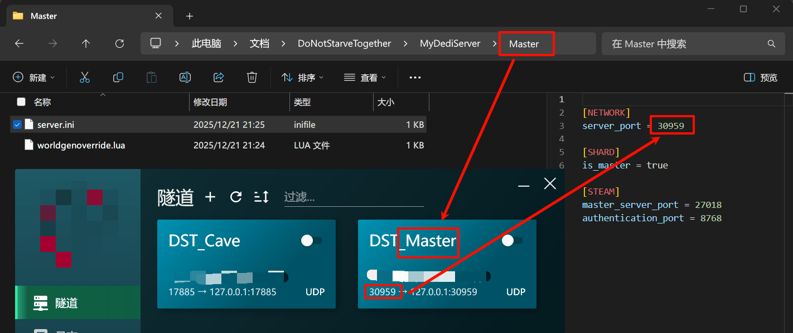
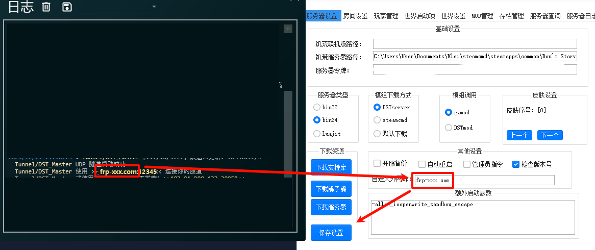
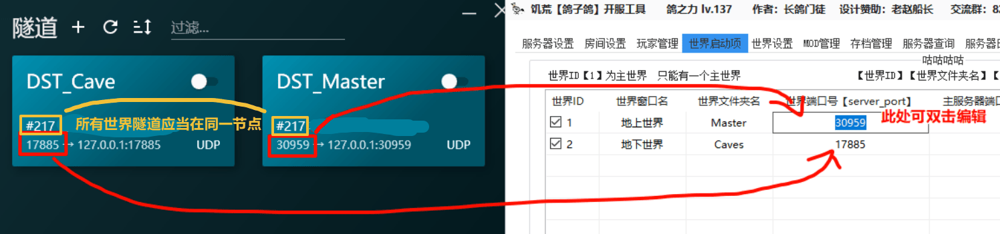

# 饥荒联机版 (Don't Starve Together) 联机补充说明

:::warning
饥荒联机版 (Don't Starve Together，或简称 DST) 事实上是一个独立的续作，  
下面文档中可能将此游戏称为饥荒，但请注意此游戏与原版饥荒 (Don't Starve) 并不是同一个游戏，需要单独购买。
:::

本指南关注帮助您配置独立服务器 (Dedicated Server) 的联机操作，相较于在游戏内直接点击开服 (Integrated Server) 有以下优势：

- 更高的可配置性，我们的穿透依赖于此操作
- 独立运行，因此在您不运行游戏时其他人仍可加入

如果您还没有创建 DST 服务器，您大概也不希望在这里看长篇大段的怪内容，  
您可以在网络平台或 Steam 社区中搜索详细教程来完成创建和您的自定义服务器操作。

如 [官方配置说明（英文）](https://forums.kleientertainment.com/forums/topic/64212-dedicated-server-quick-setup-guide-windows/) 或这个 [配置详解](https://steamcommunity.com/sharedfiles/filedetails/?id=1616647350)，或使用社区制作的开服器。

如果您已经跟随任意互联网教程启动一个可加入的服务器，下面是帮助您配置隧道的说明：

饥荒的特色是世界可能存在多层（如通常的地上世界与洞穴世界），这些多层的世界实际上是多个独立的服务器：  
因此您需要为每层世界创建并启动一个隧道，所有世界的隧道 **应当在同一个节点**。

对于每个世界，您需要进行的操作如下：

  1. 进入您的隧道管理页面，创建一个 UDP 隧道，本地端口选择 `和远程一致`，远程端口留空以随机生成，建议您将隧道名或备注设为这个世界的名字，以免混淆
  2. 配置这个隧道的本地端口到这个世界的配置文件中，具体操作因您的管理方式而异
  3. 继续为下一个世界 **在同一个节点** 创建隧道并修改配置，直到所有世界都配置完成

在联机时，请保证所有隧道都已开启。

接下来是因管理方式而异的具体说明：

::::: tabs

@tab 原版管理（SteamCMD） {#raw}

1. 找到服务器目录

  在 文件资源管理器 的地址栏中输入 `%USERPROFILE%\Documents\DoNotStarveTogether`，并按回车键进入 DST 的总目录。

  对于您创建的每个服务器，在这里都应当看到一个目录（如果您使用官方配置文件，默认叫做 `MyDediServer`），可以通过修改时间或其他信息找到您希望穿透的那一个。

  

1. 创建隧道

  在这个目录中，您将可以看到数个文件夹（如普通的双层世界可以看到两个 地上`Master` 地穴`Cave`），每个文件夹代表一个世界，您需要遵循上面的操作为每个世界创建一个隧道：

  1. 进入您的隧道管理页面，创建一个 UDP 隧道，本地端口选择 `和远程一致`，远程端口留空以随机生成，建议您将隧道名或备注设为这个世界的名字，以免混淆
  1. 打开这个世界文件夹中的 `server.ini` 文件，将 `server_port =` 后面的数字改为刚刚创建隧道的端口
  1. 继续为下一个世界 **在同一个节点** 创建隧道并修改配置，直到所有世界都配置完成
  
  下图所示行为即是在设置 地上世界（Master） 的隧道配置，请注意应为每一个世界设置：
  

在联机时，请保证所有隧道都已开启。

对于通常的用户来说，您可能希望联机时连入地上世界，  
在连接时记下地上世界隧道对应的链接信息（形如 `使用 >>frp-xxx.com:11221<< 来连接到您的隧道`，请再三确认前面的隧道名是地上世界的隧道），  
其中冒号前的部分（形如 `frp-xxx.com`）为服务器地址（称为 *域名*，使用时与 IP 等价，请在连接时尽可能使用域名），冒号后的部分为端口，  
在游戏中使用 `c_connect("服务器域名", 端口)` 来连接到您的地上世界即可。

@tab 开服器（鸽子鸽） {#gu-server}

:::warning
此软件有较严重的报毒问题。  
我们在此包含与此软件相关的说明，单纯因为其相对流行，不构成任何对此软件的推荐或背书，也不代表我们认为此软件是绝对可信任的。

我们建议您在运行任何可能不信任的软件时，均应使用 VM 或沙箱进行基本的隔离。
:::

对于鸽子鸽开服器，您应当将隧道的地址设置到手动公网 IP 中，以便于使用自动生成的指令：

同时您应当对应上面的操作创建隧道，然后在 “世界启动项” 中配置这些端口**并保存**，**然后重启软件以生效**：

**在联机时，请保证所有隧道都已开启**，然后使用快捷外网连接指令正常连接即可。
