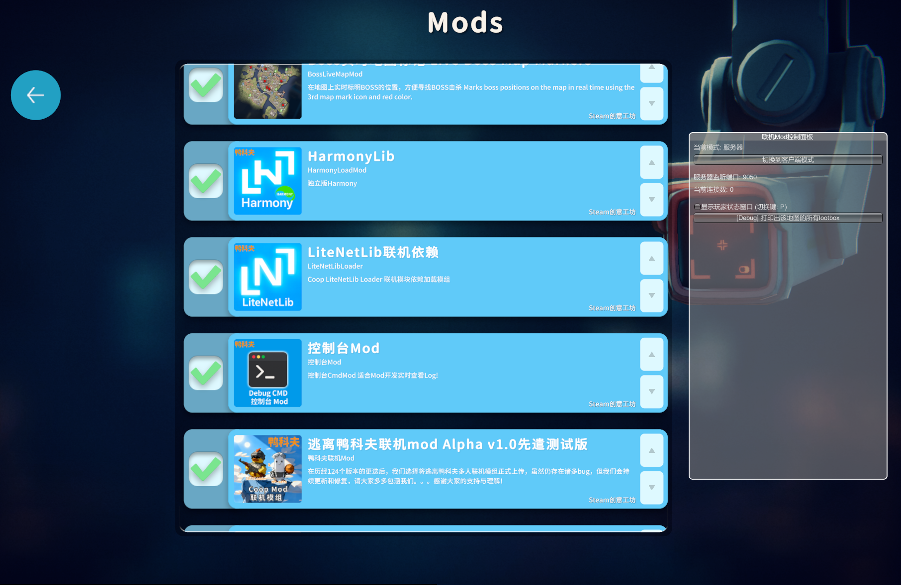
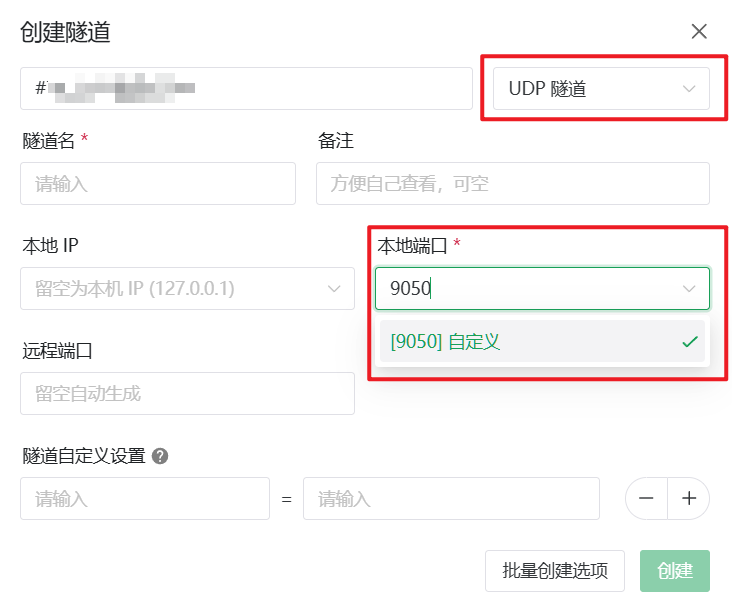
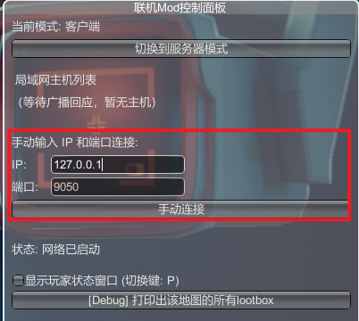

# 逃离鸭科夫 (Escape From Duckov) 联机指南

## 安装 MOD

目前逃离鸭科夫的联机主要通过 [创意工坊中的MOD](https://steamcommunity.com/sharedfiles/filedetails/?id=3591341282) 来实现，因此需要安装此 MOD 才能联机。

:::warning 特别注意
请注意，该 MOD 目前尚不稳定，且与其他 MOD 可能存在冲突，推荐您新开一个存档进行联机。
:::

在 Steam创意工坊中搜索 `联机` 即可找到该 MOD。

订阅时，请务必点击订阅  `所有按钮`  ，以确保所有依赖均已包含。

## 启动游戏（房主） #{start-host}

在安装所有您需要的 MOD 后，启动游戏。

打开游戏后点击 `Mods` ，如下图所示，调整 MOD 顺序并依次勾选。

然后您会看到一个  `联机Mod控制面板` ，默认为客户端模式。

请先进入存档后，再点击 `切换到服务器模式` ，以开启服务器。

随后您可按下键盘上的 `Home` 键，将该面板隐藏（可能会与其他 MOD 快捷键冲突）。

进入存档后，请确保您位于地堡中，再让同伴连接。

## 设置隧道 {#create-tunnel}

该 MOD 的联机端口为 `9050/udp`，因此您需要创建一个 **本地端口** 为 `9050` 的 **UDP** 隧道

设置后打开此隧道，打开启动器的 `日志` 标签页，您将看到形似下面的日志，框中 `>> <<` 中间的内容即为连接方式。

## 加入游戏（其他玩家） {#join-game}

:::warning
客户端同样必须安装 [MOD](https://steamcommunity.com/sharedfiles/filedetails/?id=3591341282)，否则无法加入游戏。

某些 MOD 可能同样需要同步，某些 MOD 可能导致联机不稳定，如果您遇到问题，请尝试关闭其他 MOD。
:::

在安装所需 MOD 后，启动游戏即可。

打开游戏后点击 `Mods` ，如下图所示，调整 MOD 顺序并依次勾选。

然后您会看到一个  `联机Mod控制面板` ，默认为客户端模式。请进入一个存档中，再继续下面的操作。

在 `IP输入框` 中填入 连接方式 中冒号前的部分，在 `端口输入框` 中填入 连接方式 中冒号后的部分。

例如：连接方式为：`frp-xxx.com:11451` 或 `19.19.8.10:11451`

则您需要在 `IP输入框` 中填入 `frp-xxx.com` 或 `19.19.8.10` ，在 `端口输入框` 中填入 `11451` 。

输入完成后点击手动连接即可。

随后您可按下键盘上的 `Home` 键，将该面板隐藏（可能会与其他 MOD 快捷键冲突）。

