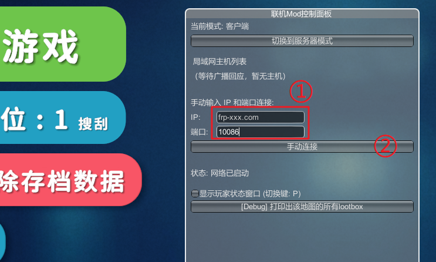

# 逃离鸭科夫 (Escape From Duckov) 联机指南

:::warning 联机 Mod 已知问题列表

列表更新于 **2025.10.22**，对应版本 **Alpha v1.1**

- 进入地图时会卡顿一段时间，稍后会自行恢复正常
- 进入观战模式后游戏会非常卡顿
- 启用联机 Mod 后可能无法正常通过新手教程
- 加入联机的玩家无法正常统计任务进度（如击杀任务等）

作者随时可能修复这些问题，敬请留意 Mod 更新日志。欢迎发起 [Pull Request](https://github.com/natfrp/wiki/edit/master/app/duckov.md) 修订此列表。

联机 MOD 目前尚处于早期测试阶段，且与其他 MOD 可能存在冲突，推荐您新开一个存档进行联机。

:::

## 安装联机 MOD {#install-mod}

目前逃离鸭科夫的联机主要通过 [创意工坊中的 MOD](https://steamcommunity.com/sharedfiles/filedetails/?id=3591341282) 来实现。

MOD 只需要安装一次，房主和加入的玩家均需安装该 MOD 才能进行联机。

1. 在 Steam创意工坊中搜索 `联机` 即可找到该 MOD，您也可以点击上面的链接直接前往下载页点击订阅：

   

1. 弹出 **额外的必须物品** 窗口时，务必点击 `订阅所有` 按钮，以确保所有依赖 MOD 都被正确下载：

   

1. 所有 MOD 下载完成后，启动游戏，点击 `Mods` 按钮：

   

1. 点击右边的上下箭头，将 MOD 顺序调整为下图所示状态，然后从上到下依次打勾。

   如果您还安装了其他 MOD，请确保图示的四个 MOD 位于最上方，并且顺序和图中保持一致。

   

1. 如果一切正常，您应该会看到 `联机Mod控制面板` 出现在屏幕上：

   

## 启动服务器（房主） {#start-host}

1. 进入存档后，打开 `联机Mod控制面板`，点击最上面的 `切换到服务器模式` 以开启服务器：

   

1. 按下键盘上的 `Home` 键，可以开关该面板（可能会与其他 MOD 快捷键冲突）

1. **请确保您位于地堡中**，再让同伴连接，否则可能出现预期外的问题

### 创建并启动隧道 {#create-tunnel}

在房主的电脑上安装 SakuraFrp 启动器，创建一条 `UDP` 隧道（只需创建一次，后续直接开启即可）：

- 隧道名称：自己取一个容易识别的名字
- 隧道类型：`UDP`
- 本地 IP：留空不填
- 本地端口：在下拉列表中选择 `逃离鸭科夫 / Escape from Duckov (9050)`

除非您非常清楚自己在做什么，否则其他设置务必保持默认。

开启隧道，如果一切正常，点击 **日志** 标签可以看到类似下方的输出：

```log
UDP 隧道启动成功
使用 >>frp-xxx.com:10086<< 连接你的隧道
或使用 IP 地址连接: >>114.51.4.191:10086<<
2024/02/31 11:11:12 [I] [233/10/qwqw] [wdn**666.MyDuckov] 隧道启动成功
```

日志中黄色高亮的 `frp-xxx.com:10086` 或 `114.51.4.191:10086` 就是连接本机游戏的 **连接方式**，点击复制。

## 加入游戏（其他玩家） {#join-game}

:::warning
客户端同样需要完成 [安装联机 MOD](#install-mod) 中的步骤才能进行联机

某些 MOD 可能同样需要同步，某些 MOD 可能导致联机不稳定，如果您遇到问题，请尝试关闭其他 MOD
:::

1. 联机前请先进入一个存档，**在地堡内** 打开 `联机Mod控制面板`，MOD 默认为客户端模式，无需切换
1. 在 `IP` 输入框填入 **连接方式** 中冒号前的部分，在 `端口` 输入框填入 **连接方式** 中冒号后的部分。  
   例如连接方式为 `frp-xxx.com:10086`，则在 `IP` 处填入 `frp-xxx.com`，在 `端口` 处填入 `10086` ：

   

1. 输入完成后，点击 `手动连接` 即可
1. 连接成功后按下键盘上的 `Home` 键，可以隐藏该面板（可能会与其他 MOD 快捷键冲突）
