# 戴森球计划 联机

## 安装 MOD

目前戴森球计划的联机主要通过 MOD: [Nebula](https://github.com/NebulaModTeam/nebula) 来实现，因此需要安装此 MOD 才能联机。

### 方案一：使用 MOD 商店和管理器

如果您并不熟悉电脑操作/希望安装较多的 MOD/希望省心，我们推荐您使用这一方案，  
使用图形化管理器有助于您保持 MOD 更新与快速管理 MOD。

此处以 [r2modman](https://thunderstore.io/c/dyson-sphere-program/p/ebkr/r2modman/) 为例，这是一款为 [Thunderstore](https://thunderstore.io/) 设计的 MOD 管理器。

如果您已经在使用 `r2modman`，您可以直接 [安装 Nebula](https://thunderstore.io/c/dyson-sphere-program/p/nebula/NebulaMultiplayerMod/)。  
如果您已经有 Nebula 安装，您可以直接跳转到 [设置隧道](#setup-tunnel)。

#### 安装

进入 [r2modman 的发布页](https://thunderstore.io/c/dyson-sphere-program/p/ebkr/r2modman/)，点击 `Manual Download` 按钮，  
您将会得到一个名为 `ebkr-r2modman-x.x.xx.zip` 的压缩包，解压运行其中的 `r2modman-Setup-x.x.xx.exe` 即可安装 R2modman。

#### 设置 r2modman

打开安装后的 `r2modman` 程序，其主界面用于选择要被启动 MOD 的游戏，界面上部为一搜索框。在其中输入 `Dyson` 后即可筛选出 戴森球计划。

选中筛选出的戴森球计划封面，出现的 `Select Game` 按钮即为选择此游戏启动。（您也可以点击右上角的星号置顶此游戏，或点击 `Set as default` 让 `r2modman` 此后每次启动时自动启动为此游戏）

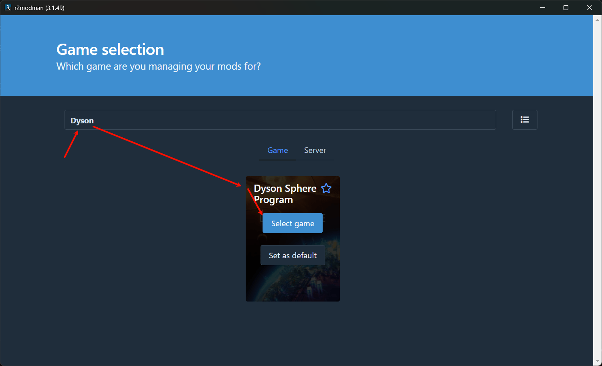

选择您的游戏购买平台，对于大部分人来说应当是 Steam：

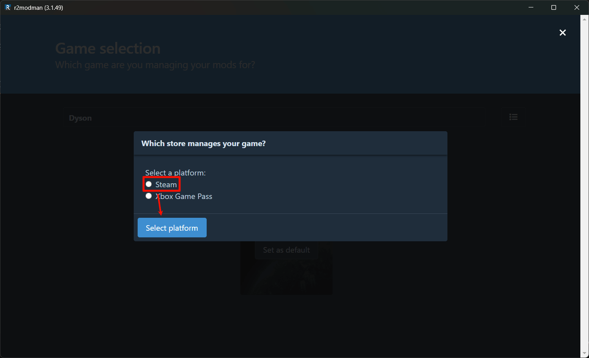

接下来的界面为选择 `profile`（配置档），此功能允许您把不同的 MOD 搭配存成不同的预设，方便您按需快速切换 MOD 包。  
如果您没有多预设需求，直接点击 `Select Profile` 即可，此时我们使用 `Default`（默认） 配置档运行。

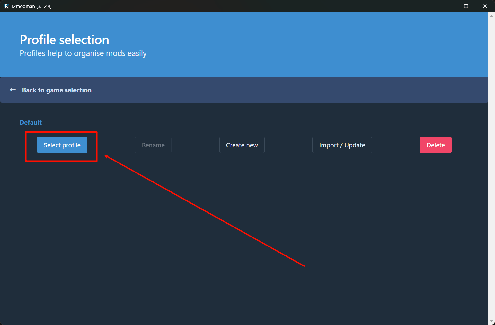

#### 安装 Nebula

在 `r2modman` 的游戏界面中，点击 Online 切换到在线安装 MOD：

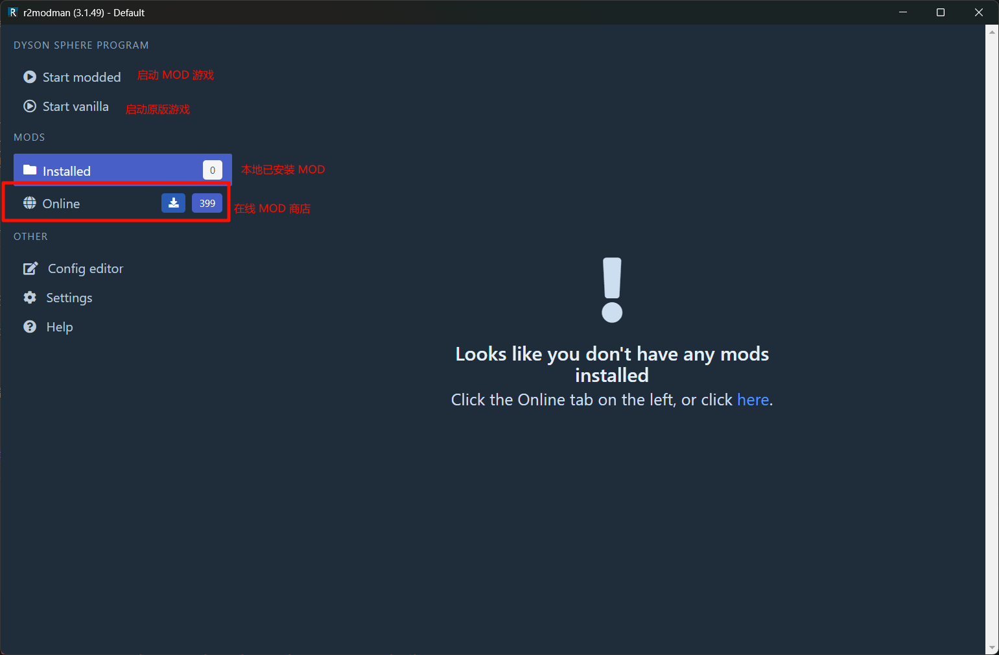

在搜索框中输入 `Nebula`，点击搜索按钮，选择 `NebulaMultiplayerMod`，点击 `Download` 即可安装：

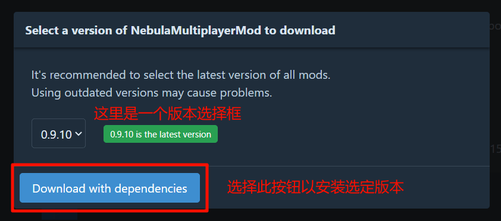

有时您可能需要一些联机的辅助 MOD 来使得联机模式与您安装的其他 MOD 相处更加和谐，如前面截图中出现了的 `NebulaCompatibilityAssist`，此类 MOD 就留待读者探索了。

### 方案二：手动安装

如果您希望不使用 MOD 管理器，或者您正在游玩开心版游戏，您可以选择手动安装 MOD。

1. 下载 [BepInEx](https://thunderstore.io/c/dyson-sphere-program/p/xiaoye97/BepInEx/) 或者从 GitHub 下载 [BepInEx](https://github.com/BepInEx/BepInEx/releases/latest) 的最新版本。
1. 将下载到的压缩文件解压到游戏目录下，启动游戏，如果加载正常，此时您将在游戏目录下看到一个 `BepInEx` 文件夹。
1. 下载 [Nebula](https://thunderstore.io/c/dyson-sphere-program/p/nebula/NebulaMultiplayerMod/) 或者从 GitHub 下载 [Nebula](https://github.com/NebulaModTeam/nebula/releases/latest) 的最新版本。
1. 将下载到的压缩文件解压到游戏目录下的 `BepInEx/plugins` 文件夹中，启动游戏。

## 启动游戏（房主）

在安装所有您需要的 MOD 后，点击 r2modman 右上角的 `start modded` （或者直接正常启动游戏，如果您是使用手动安装）即可启动游戏。

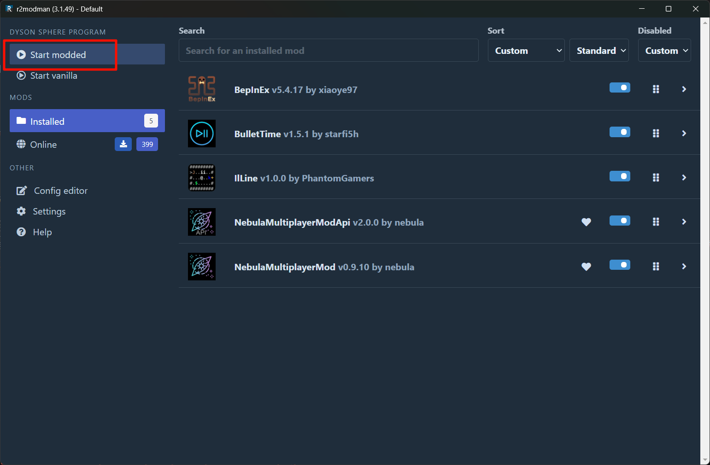

如果您同笔者一样 Steam 结构较为混乱，r2modman 无法自动识别到游戏将出现下面的错误：

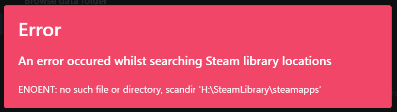

您可以手动选择游戏的安装目录添加游戏：

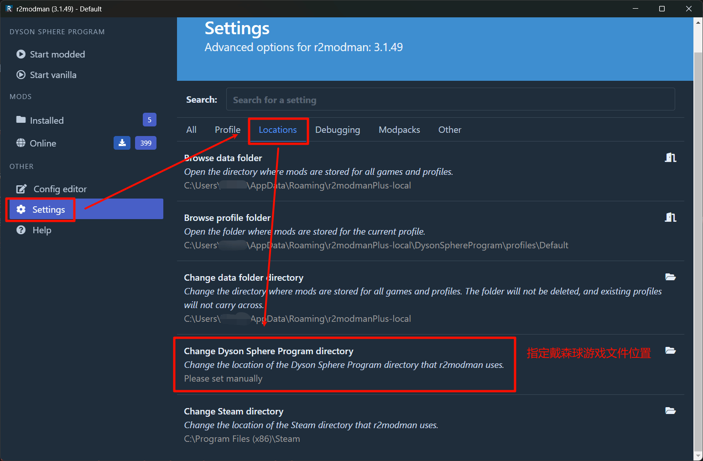

打开游戏后通过 `Multiplayer` 菜单新建游戏（或加载）即可：

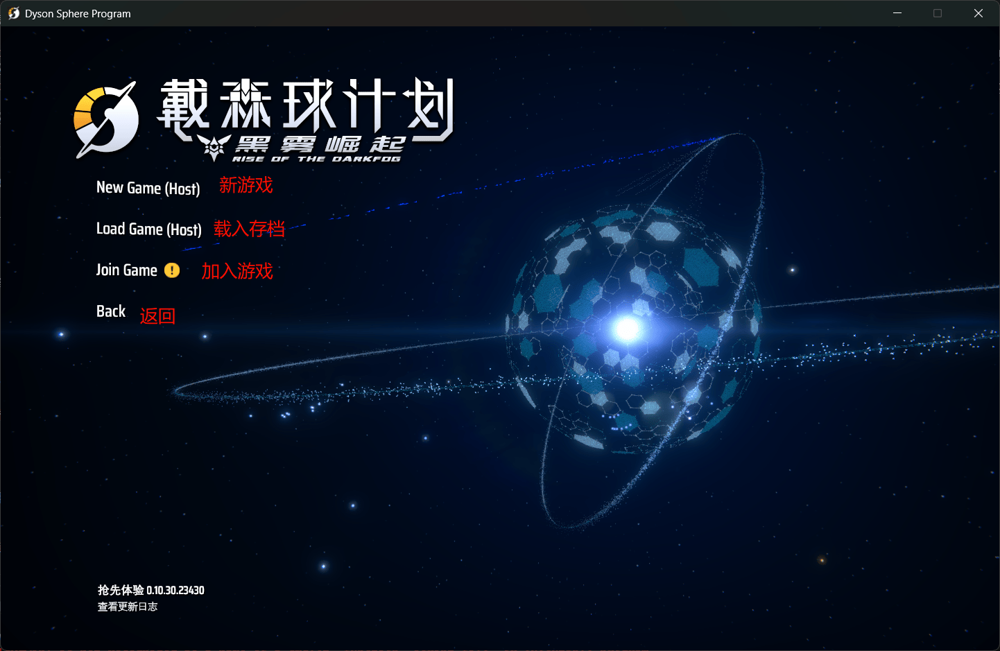

进入游戏后，使用 `左Alt+波浪线/反引号键` 组合键即可打开控制台（即位于 数字1 左边的键），您可以在这里的聊天框中键入一些指令，下面提供一些常用指令：

- `/who` 查看在线玩家列表及他们所在位置
- `/n player 玩家名或者玩家列表中的ID` 导航到某个玩家
- `/h` 列出所有指令
- `/h 指令名` 查看某个指令的详细用法

## 设置隧道 {#setup-tunnel}

Nebula 的联机端口为 `8469/tcp`，因此您需要创建一个 **本地端口** 为 `8469` 的 **TCP** 隧道，并必须 **启用 自动HTTPS**（如果您不懂的话，设置为 `auto` 即可）：

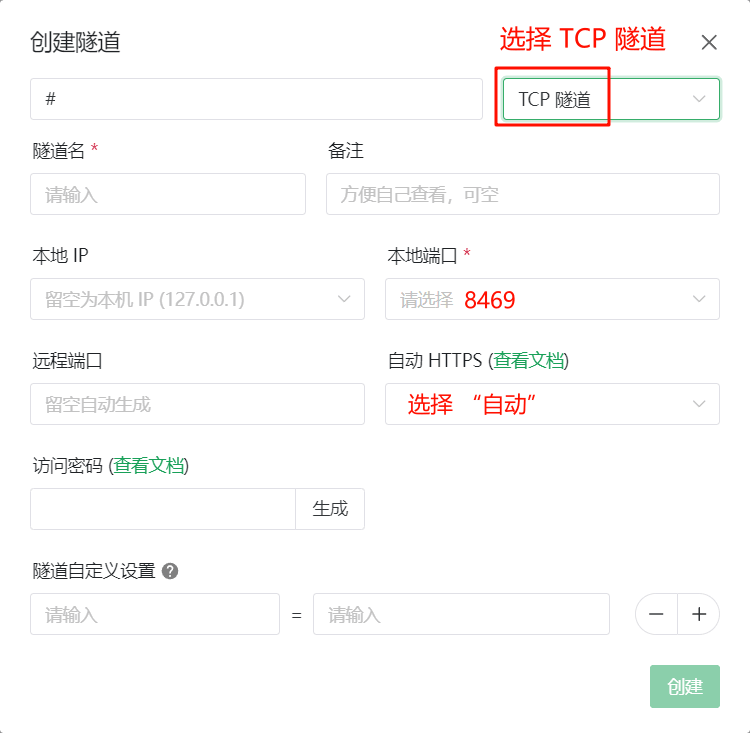

:::warning 特别注意
请注意，不启用 自动HTTPS 的隧道将无法正常连接 Nebula 服务器，此项目在 Nebula 隧道中**必须启用**。
:::

设置后打开此隧道，打开启动器的 `日志` 标签页，您将看到形似下面的日志，框中 `>> <<` 中间的内容即为连接方式。

请在将这个连接方式告诉您的朋友前，在前面加上 `wss://`，不要有空格。

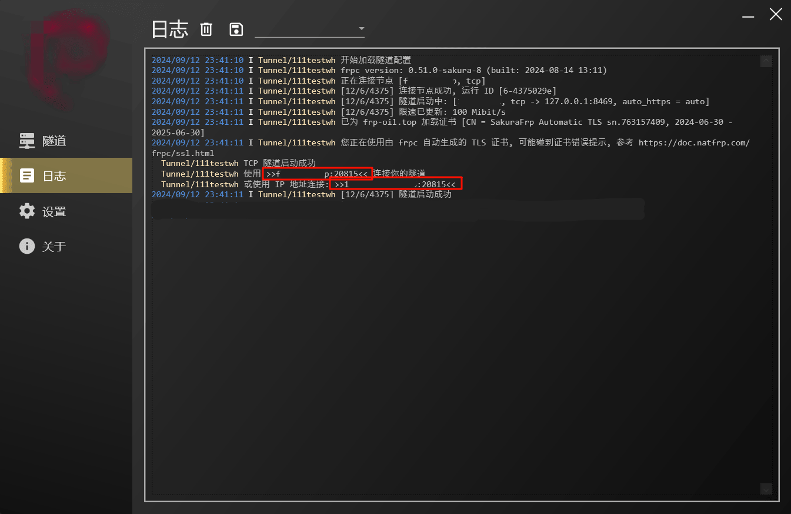

## 加入游戏（其他玩家） {#join-game}

:::warning
客户端同样必须安装 Nebula MOD，否则无法加入游戏。

某些 MOD 可能同样需要同步，某些 MOD 可能导致联机不稳定，如果您遇到问题，请尝试关闭其他 MOD。
:::

在安装所需 MOD 后，使用与房主相同的方式启动游戏即可。

在房主启动游戏后，您可以通过在 `Multiplayer` 菜单中点击 `Join Game`，

输入房主发来的连接方式（请确保前面有 `wss://` 且中间无空格，如果不符请进行修改），点击最底部的 `Join Game` 即可加入。

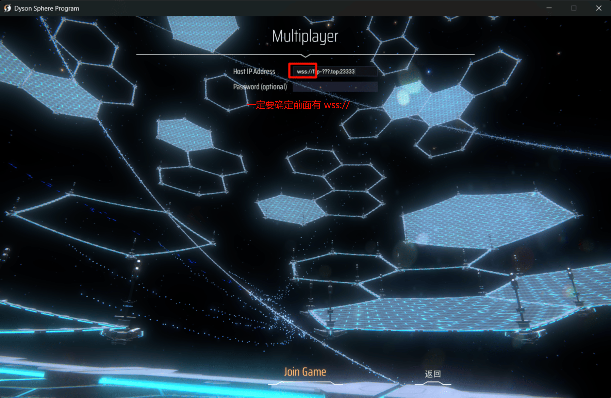
