# 飞牛 (fnOS) 私有云穿透指南

本文档将指导您通过 Docker 配置启动器，并将飞牛私有云面板穿透到外网。

本文档使用 fnOS v0.8.11 公测版系统进行演示，部分按钮位置在其他版本中可能有所不同，请在相关界面附近查找。

## 配置 Docker 环境 {#install-container-station}

飞牛 NAS 系统默认已安装 Docker，在桌面点击 **Docker** 图标即可，首次使用时需要配置存储空间用于存放数据：

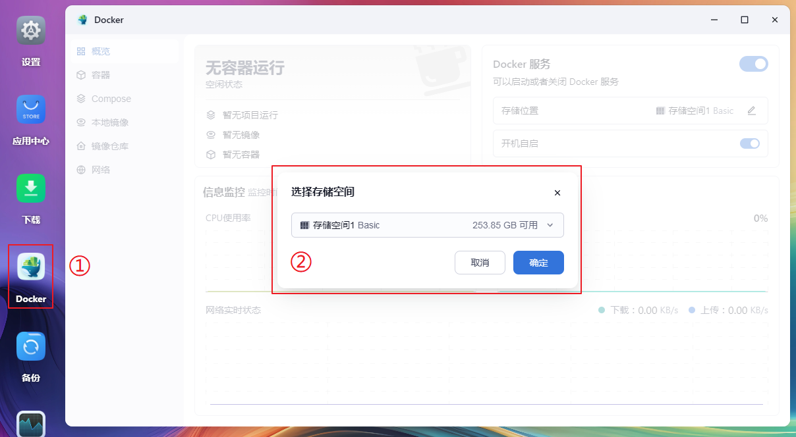

根据官方说明，如果您已安装过带有 Docker 标志的应用，修改存储空间位置可能造成其他问题，因此请尽可能避免配置后再次修改。

## 创建启动器容器 {#create-launcher-container}

启动器容器只需配置一次即可，一个容器可以开启多条隧道，无需重复配置。

1. 在 Docker 应用中转到 `本地镜像` 页面，点击 `添加镜像 > 添加下载链接`：

   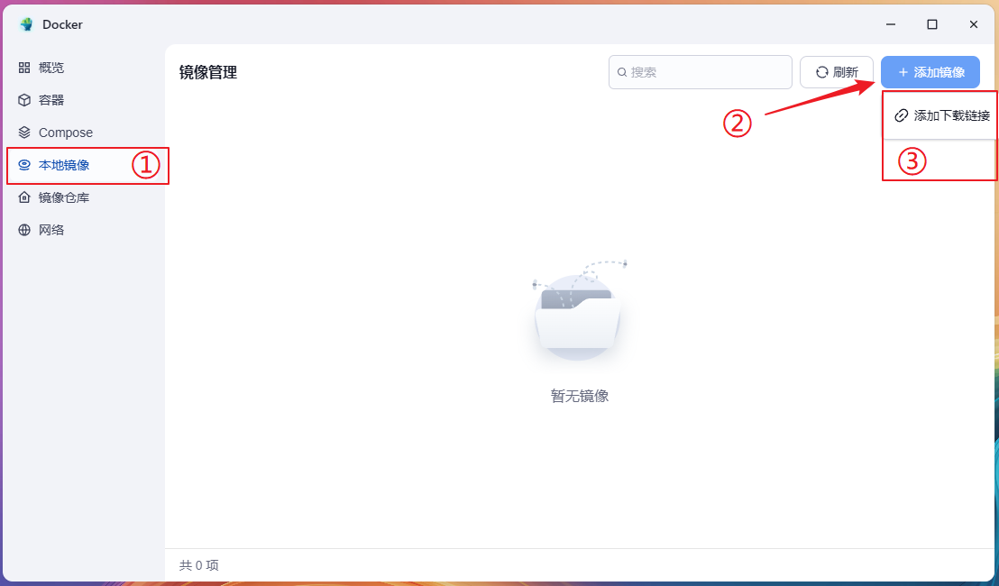

1. 在 `镜像` 处输入 `natfrp.com/launcher`，然后点击 `确定`：

   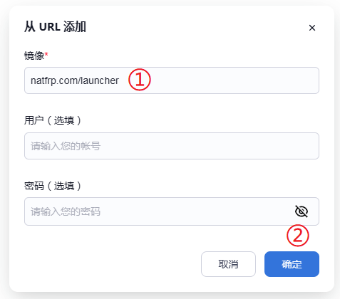

1. 点击镜像右侧的启动按钮，输入镜像名并勾选开机自启复选框，然后点击 `下一步`：

   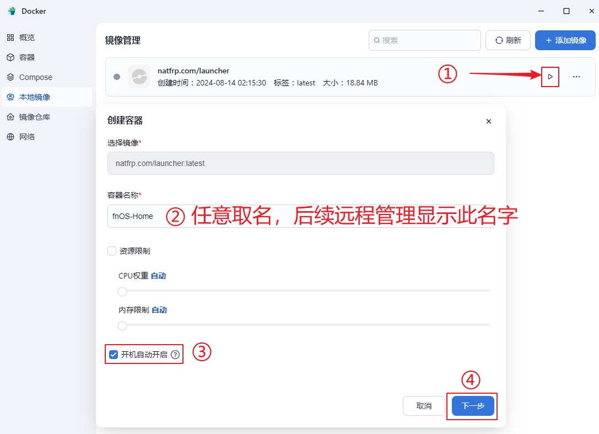

1. 为了避免配置文件丢失，在 `存储位置` 配置处点击 `添加路径`，在任意位置创建一个文件夹并选中：

   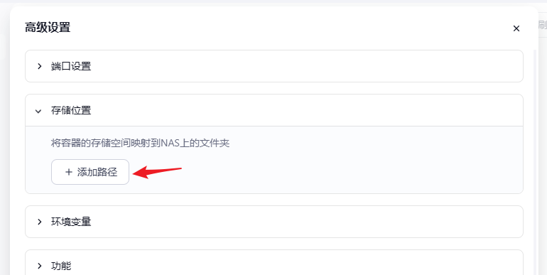

   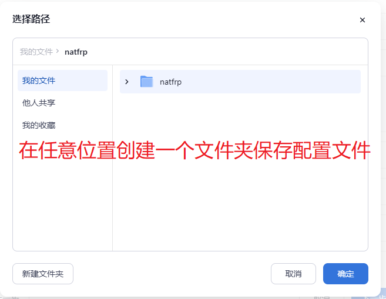

1. 在刚才选中的路径右边输入 `/run` 并确认访问权限为 `读写`：

   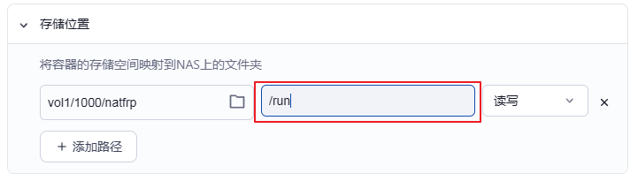

1. 在 `环境变量` 配置处如图所示填写访问密钥（在 SakuraFrp 管理面板获取）并设置远程管理密码（8 字符以上）：

   

1. 在 `网络` 配置处如图所示选中 `host` 网络，然后点击 `下一步`：

   ::: tip
   Web UI 默认运行在 7102 端口，如果发生冲突，请在创建完成后参考 [用户手册](/launcher/manual.md#config-webui) 修改端口或关闭 Web UI
   :::

   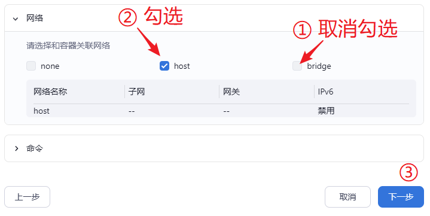

1. 容器创建成功后，点击右侧的三个点并选择 `运行日志`：

   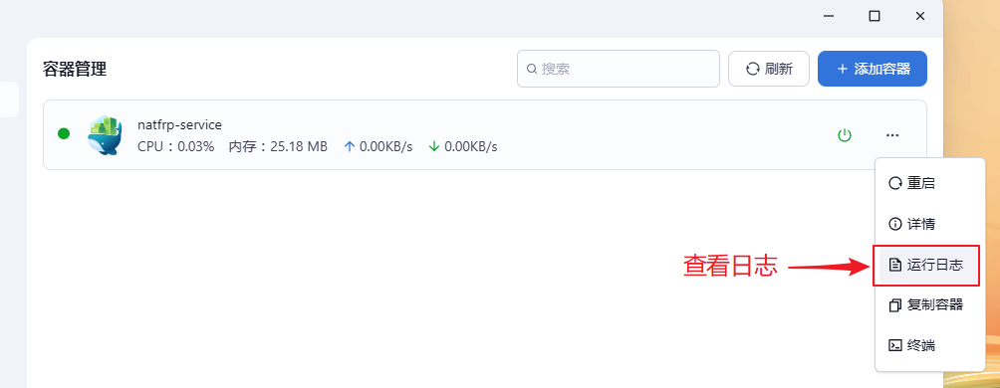

1. 检查日志，确认看到登录成功和远程管理连接成功的提示，然后就可以通过远程管理连接到启动器了：

   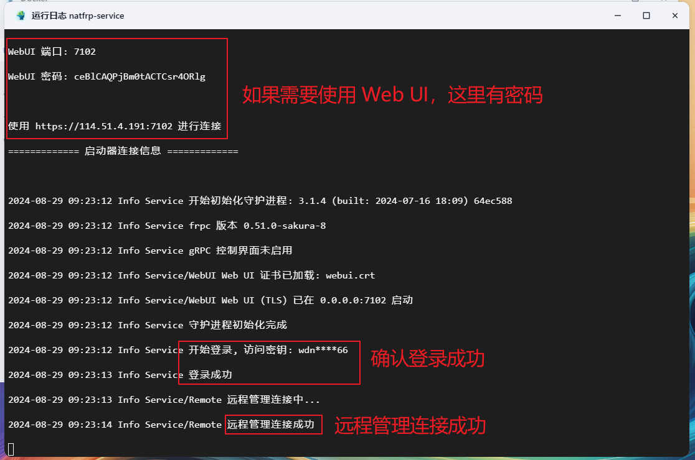

   如果需要使用 Web UI 在本地连接，日志上方会输出对应的连接信息和密码。

## 创建隧道 {#create-tunnel}

前往 SakuraFrp 管理面板，创建一条本地 IP 为 `localhost` 的 **TCP 隧道**：

- 如果您希望使用飞牛系统内置的证书，将本地端口设置为 `8001`
- 如果您希望使用自动 HTTPS 功能，将本地端口设置为 `8000` 并将 `自动 HTTPS` 设置为 `自动`  
  这种配置下您可以同时启用 [子域绑定](/bestpractice/domain-bind.md) 功能来避免证书错误提示，或是在刚才创建的目录中 [配置证书文件](/frpc/ssl.md)

两种方法各有优劣，您可以根据自己的需求进行选择。如果您没有自己的域名也没有证书，推荐使用第二种方法。

## 启动隧道 {#start-tunnel}

1. 打开 [远程管理](https://www.natfrp.com/remote/v2)，连接到刚才创建的容器：

   

1. 点击右边的刷新按钮，然后双击刚才创建的隧道，或将其拖到上方启动：

   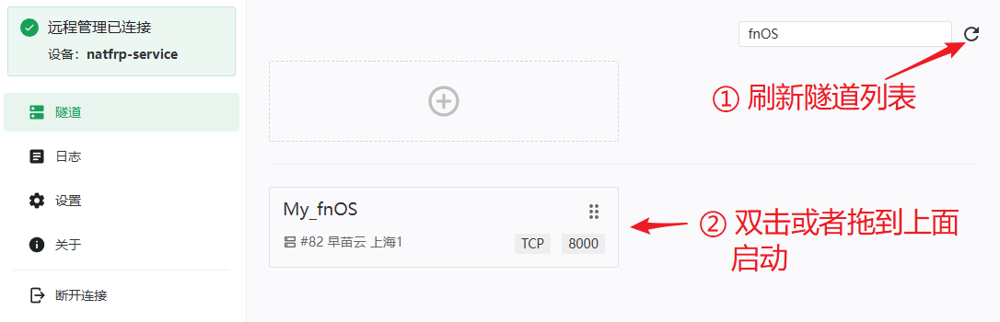

1. 启动成功后右上角会弹出连接方式，您也可以前往 `日志` 页面查看连接方式：

   

1. 使用 `https://` 加上日志中显示的连接方式即可远程访问您的 QNAP NAS：

   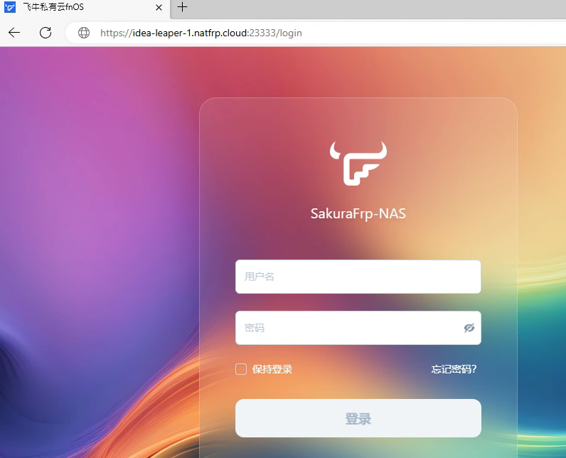

## 更新启动器 {#update-launcher-container}

目前飞牛 NAS 尚不支持直接拉取新镜像并重新创建容器，您需要先手动停止容器、删除容器和镜像，然后重新按照 [创建启动器容器](#create-launcher-container) 的步骤进行配置。

停止容器后 **隧道会断开连接**，因此请通过其他方式连接 NAS 后再进行更新，以免 NAS 失联。

配置时只要选择之前创建的存储路径，访问密钥、远程管理密码会被保留，无需配置 `环境变量` 部分；自动启动的隧道列表和证书 (如果有) 也会被保留，无需重复配置。

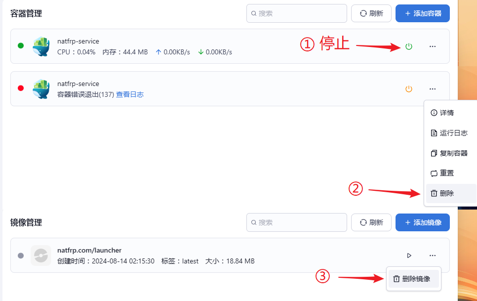
