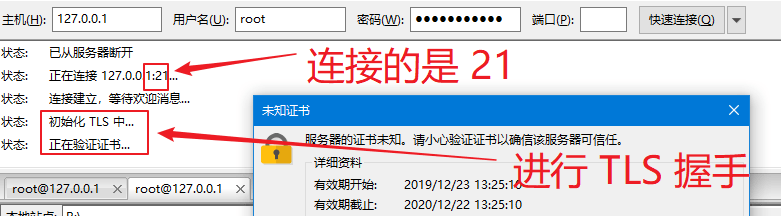
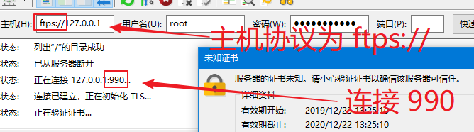
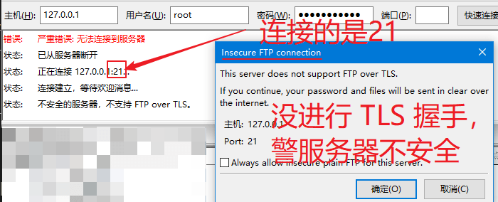
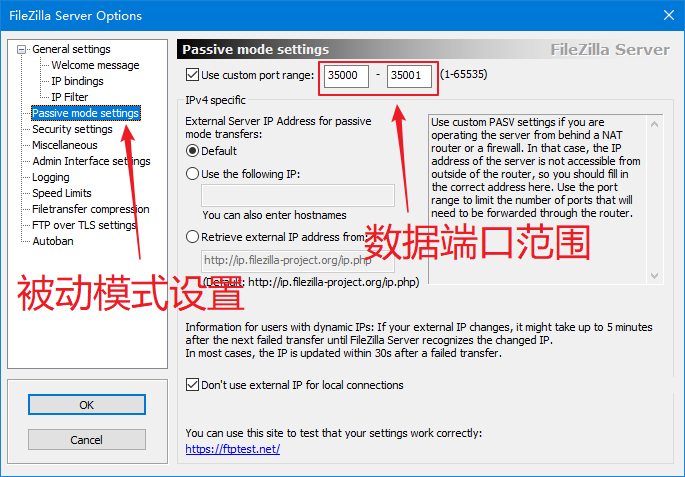
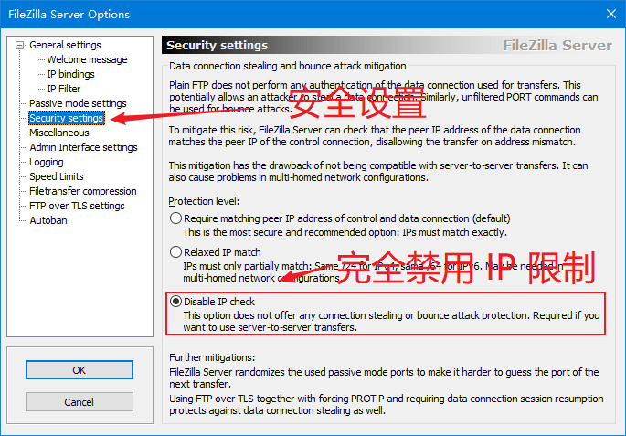
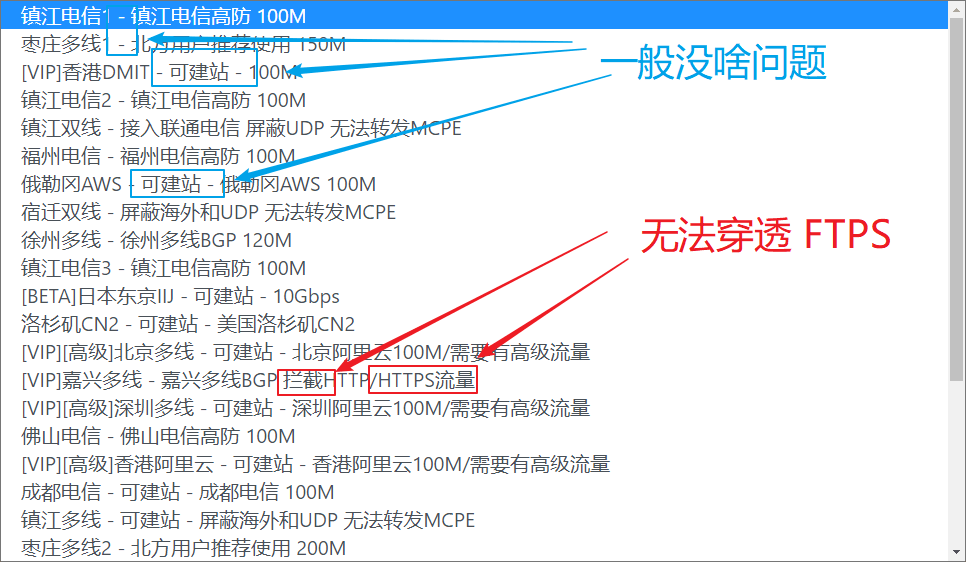
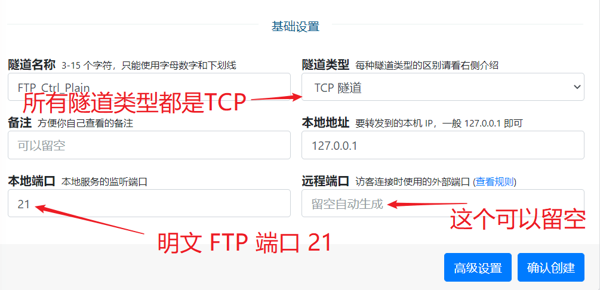
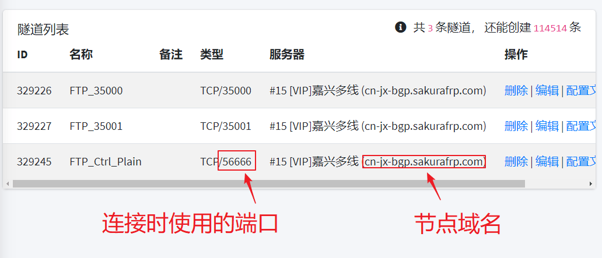
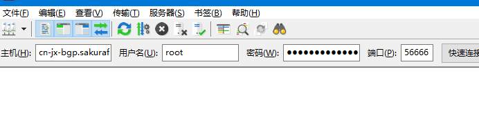

# FTP(S) 协议穿透指南

::: warning
我们推荐不使用 frp 穿透 FTP(S) 协议，此教程仅供参考，碰到问题请自己查找解决方法。如果没有特殊需求，请使用 [SFTP](sftp) 而不是 FTP。
:::

::: tip
FTP(S) 协议需要一个隧道进行控制，同时还需要另外一个或者多个隧道传输数据，所以您需要建立很多个隧道。除此之外，本文只涉及 **被动模式 (Passive)** 的穿透。
:::

## 默认端口

+ FTP: 21
+ FTPS(显式): 21
+ FTPS(隐式): 990
+ SFTP: 您来错地方了, 这篇教程和 SFTP 没关系

## 确认目标服务

::: tip
由于 FTP 客户端和服务器种类繁多，此处无法一一列举，本文均以 FileZilla 为例
:::

下面三个示例中，穿透的目标 IP 都是 127.0.0.1，不解释。

进行穿透前请先确认要穿透到的服务能被正常访问到，用 FTP 客户端访问一下您的服务，您可能会碰到多种情况:

### FTPS(显式)

满足下图两个条件为 `FTPS(显式)` 连接, 需要穿透的端口一般为 `21` 和 _数据端口_

### FTPS(隐式)

满足下图两个条件为 `FTPS(隐式)` 连接, 需要穿透的端口一般为 `990` 和 _数据端口_

### FTP

::: danger 安全警告
穿透明文 FTP 协议是不安全的，我们不推荐这么做
:::

满足下图两个条件为 `FTP` 连接, 需要穿透的端口一般为 `21` 和 _数据端口_

## 配置数据端口

::: tip
服务器上可能很难找到连续的多个端口，并且隧道数量是有限制的，所以数据端口一般保留一到两个就足够使用了。
:::

现在我们需要配置 FTP 服务器来保留一组端口用来传输数据，为了节约隧道数量，下图中我只配置了两个数据端口 `35000` 和 `35001`。

注意这里选择的两个端口不一定是最终结果，如果这两个端口中 **任意一个** 被占用，我们就不得不回过头来改这个设置。

## 配置安全策略

部分 FTP 服务器会限制数据端口的连接，这时我们就需要配置这个安全策略来确保客户端可以正常传输数据。以 FileZilla Server 为例:

## 选择穿透节点

::: warning
明文 FTP 协议通常不会被屏蔽，部分屏蔽 HTTPS 的节点可能无法正常使用 FTPS
:::

请参考下图选择合适的节点

## 创建隧道

回忆一下刚才要穿透的几个端口，在本示例中我选择穿透 **3. FTP** 的 `21` 端口以及两个 **数据端口** `35000` 和 `35001`。

::: tip
这就意味着连接服务器时我必须采用和 **3. FTP** 中完全一样的连接方式，不能随意增加 `ftps://` 或者写其他端口
:::

先创建控制连接的隧道，此时无需填写远程端口:

然后依次创建两个数据端口的隧道

::: tip
如果发现远程端口不可用则必须回到 [修改服务端配置](#修改服务端配置) 并重新创建数据端口，直到您可以成功创建所有数据端口为止
:::

## 启动隧道

现在到您的机器上启动刚才创建的 **所有** 隧道 (不包括因为远程端口不可用而被放弃那些数据隧道，那些隧道可以直接删掉) 并尝试连接。

连接时我们填写节点域名以及 **控制连接** 对应的远程端口:

按下图填写到 FTP 客户端中即可:

