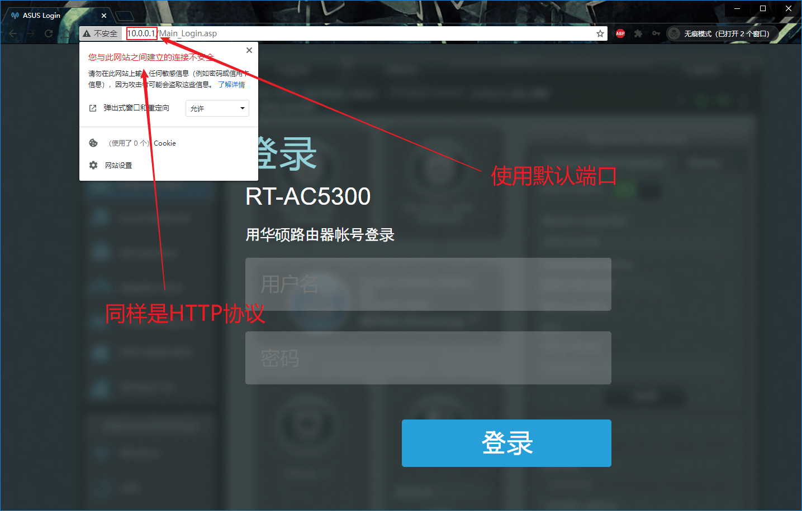
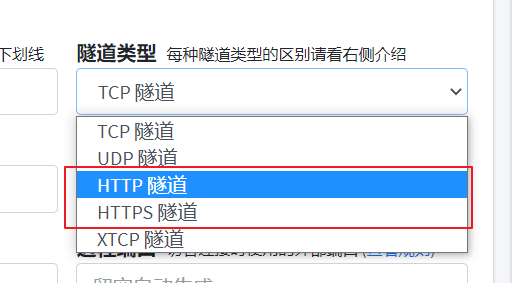
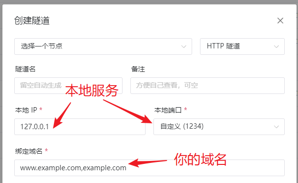
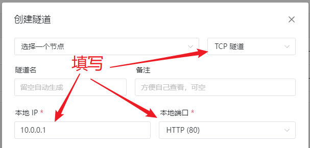
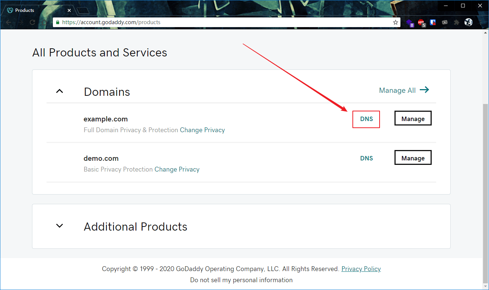
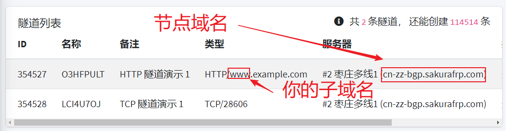
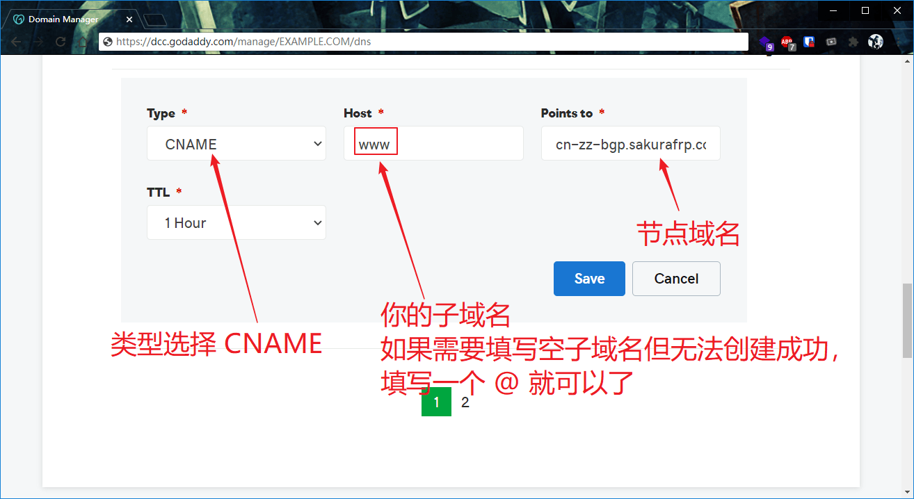

# HTTP(S) 协议穿透指南

## 默认端口
+ HTTP: 80
+ HTTPS: 443

## 额外端口

特别的，对于 HTTP 和 HTTPS 隧道，我们提供以下备用端口可供访问，以适配您使用的 CDN 服务：
+ HTTP: 8080，8880
+ HTTPS: 8443

## 确认目标服务

进行穿透前请先确认要穿透到的服务能被正常访问到，用浏览器访问一下您的服务，参考下图找到您的目标 IP 和端口:

上图 (示例1) 中，我们要穿透的 IP 是 `127.0.0.1`, 端口是 `1234`, 协议是 `HTTP`。让我们再看一个路由器管理页面的例子:

上图 (示例2) 中，我们要穿透的 IP 是 `10.0.0.1`, 端口是 `80`, 协议依然是 `HTTP`。

## 选择隧道类型

!> 因为节点地理位置与其他因素，不同的节点可能有不同的限制，请您参考节点名中的信息和 [这篇帮助](/faq/realname#实名认证到底可以做什么)

Sakura Frp 提供两种类型的隧道供您穿透 HTTP(S) 服务:
+ TCP 隧道
+ HTTP(S) 隧道

它们的区别在于:
+ TCP 隧道访问时使用 `http://www.example.com:12345` 这种 URL 形式, **需要** 带端口号, **不需要** 有自己的域名
+ HTTP(S) 隧道访问时使用 `http://www.example.com` 这种 URL 形式, **不需要** 带端口号, **需要** 有自己的域名

并且我们有一些限制:
+ 使用 TCP 隧道时, 如果您穿透的是 HTTP 协议, 必须 **使用海外节点**。HTTPS 协议不受影响。
+ 使用 HTTP(S) 隧道时, 必须完成实名认证。如果使用国内节点进行穿透，必须使用有备案的域名。

## 选择穿透节点

参考下表选择一个穿透节点，请随时留意备案和实名认证、访问认证的限制 **(点击展开)**

| 节点             | 隧道类型        | 实名认证 | 备案     | 访问认证 |
| ---------------- | --------------- | :------: | :------: | :------: |
| 枣庄多线         | TCP             | 需要     | 需要     | 强制启用 |
| 海外             | TCP 或 HTTP(S)  | 部分需要 | 不需要   | 不需要   |
| 绍兴、台州、嘉兴 | (完全不能穿透)  |          |          |          |
| 成都电信         | TCP 或 HTTP(S)  | 需要     | 需要     | 不需要   |
| 河南电信         | TCP 或 HTTPS    | 需要     | 需要     | 不需要   |

## 创建隧道

回忆一下刚才我们获取到的穿透 IP、协议和端口，让我们创建开始穿透隧道

### HTTP(S) 隧道

创建 HTTP(S) 隧道时，务必在隧道类型处选择和协议匹配的类型，否则无法穿透成功。隧道类型里没有 HTTP(S) 选项则说明节点不支持，请更换节点。

完成选择后，填写刚才获取到的目标服务信息，然后填写您自己的域名。此处填写的是 **示例1** 中的信息

### TCP 隧道

TCP 隧道相对简单，选择隧道类型为 TCP 后直接填写 IP 地址和端口即可，协议暂时不用管。此处填写的是 **示例2** 中的信息

## 设置解析

?> HTTP(S) 隧道必须设置解析，TCP 隧道可以设置也可以直接用节点 IP 或节点域名进行访问

首先登录您的域名注册商，找到修改 DNS 解析的地方。此处以 Godaddy 为例，由于各个注册商的用户界面差异较大，我们无法一一列举。如果实在是找不到可以打电话问 **注册商** 客服或者上网搜索。

!> <strong style="color: red">绑定域名必须和您解析到的域名完全一致</strong>

然后到隧道列表找到节点域名，并确认您的子域名。这里子域名就是 `www`，如果您直接使用根域名 `example.com`，子域名当作是空的就行。

接下来就可以设置解析了，参考图中填写，各个注册商的用户界面不同，但设置解析需要填写的东西基本上都是这几样。

## 启动隧道

现在到您的机器上启动隧道，如果一切正常您的服务就可以在外网被访问到了。

在本示例中，我们访问的是:
+ `http://www.example.com` (HTTP 隧道, 示例1)
+ `http://cn-zz-bgp.sakurafrp.com:28606` (TCP 隧道, 示例2)
+ `http://www.example.com:28606` (TCP 隧道, 示例2)
