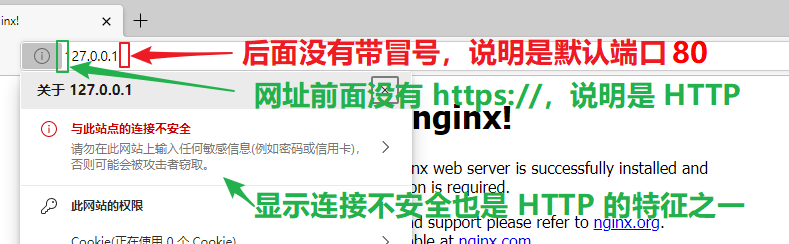
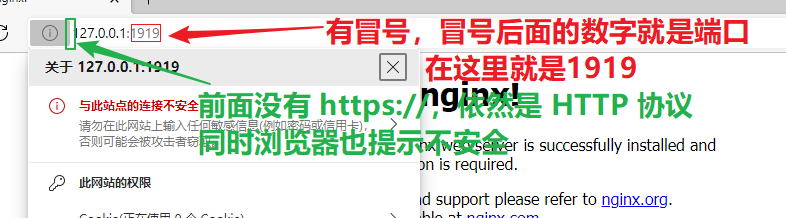
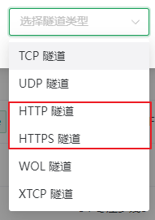
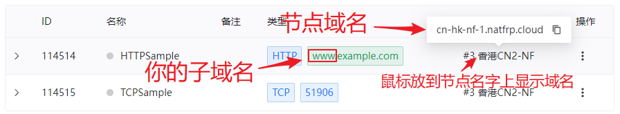
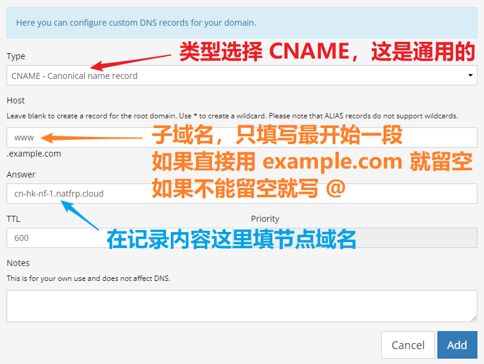

# Web 应用穿透指南

::: tip 常见的适用场景：

- 穿透博客（WordPress、Hugo、Ghost、Typecho）等个人网站
- 穿透 NAS（常见 NAS 系统有独立教程，见左边栏）、Emby、Vaultwarden 等自建应用
- 微信、支付宝等平台的小程序线上调试

这篇文档只涉及 **配置内网穿透** 的部分，您需要有一个 **已经搭好**、**在内网可以访问** 的应用才能进行穿透
:::

<app-info :time="10" :difficulty="2.5" :access="[
    { proto: 'HTTP', local: '80', remote: '80, 8080 (备用), 8880 (备用)', method: 'http://example.com' },
    { proto: 'HTTPS', local: '443', remote: '443, 8443 (备用)', method: 'https://example.com' },
    { proto: 'TCP', local: '80 / 443', method: 'http(s)://example.com:12345' },
]" />

## 查看本地 IP、本地端口和协议 {#gather-information}

首先用浏览器在 **内网** 访问一下您已搭建的服务，然后查看地址栏。访问时显示的网址多半是这样的:

```http
# 如果没有自定义端口：
http://<本地 IP>/xxxx/yyyy

# 如果有自定义端口：
http://<本地 IP>:<本地端口>/xxxx
```

让我们举几个例子：

```http
# 协议: HTTP, 本地 IP: 127.0.0.1, 本地端口: 80 (HTTP 默认端口)
http://127.0.0.1/xxyyzz/

# 协议: HTTPS, 本地 IP: 11.22.33.44, 本地端口: 443 (HTTPS 默认端口)
https://11.22.33.44/natfrp

# 协议: HTTP, 本地 IP: 10.0.1.5, 本地端口: 8080 (冒号后面的数字)
http://10.0.1.5:8080/watch?v=dQw4w9WgXcQ

# 协议: HTTPS, 本地 IP: some-lan-fqdn, 本地端口: 1111 (冒号后面的数字)
https://some-lan-fqdn:1111/foo/bar
```

从上述示例中可以看出：

- **协议** 就是 URL 最开头第一个冒号前面的部分，通常只能是 **http** 或者 **https**
- **本地 IP** 就是两个斜杠开始 ～ 冒号（或者紧跟着的一个斜杠）结束的一串字符
- **本地端口** 在有冒号的情况下就是冒号后面的数字，否则就是协议对应的默认端口

如果不确定，您可以对照下面的示例进行进一步确认，下面的示例中 **本地 IP** 都是 `127.0.0.1`：

::: tabs

@tab HTTP 协议

下面是一个采用默认端口的 HTTP 服务器的例子：



下面是一个采用自定义端口 **1919** 的 HTTP 服务器的例子：



@tab HTTPS 协议

下面是一个采用默认端口的 HTTPS 服务器的例子，由于采用了自签证书会显示不安全：


下面是一个采用自定义端口 **810** 的 HTTPS 服务器的例子：


:::

## 选择隧道类型 {#choose-tunnel-type}

请注意区分 **隧道类型** 和 **协议** 之间的区别，二者分别对应的是 **隧道** 和 **本地服务** 的不同属性。

Sakura Frp 提供三种 **隧道类型** 供您穿透 Web 应用：

| 隧道类型 | 支持的协议 | 带端口访问 | 用自己的域名 | 访问形式 |
| :---: | :---: | :---: | :---: | --- |
| `TCP` | HTTP / HTTPS | **必须** | 可选<br>也可以用 [子域绑定](/bestpractice/domain-bind.md) | `http://xxx.natfrp.cloud:12345`<br>`https://xxx.natfrp.cloud:12345` |
| `HTTP` | HTTP | 不需要 | **必须** | `http://my.example.com` |
| `HTTPS` | HTTPS | 不需要 | **必须** |`https://my.example.com` |

习惯上，我们把 `HTTP` 和 `HTTPS` 两种 **隧道类型** 统称为 `HTTP(S) 隧道`。

这里有一些额外的限制：

- 使用 `TCP` 隧道时，如果您穿透的 **协议** 是 HTTP，**必须使用非内地节点**。HTTPS **协议** 不受影响
- 使用 `HTTP(S)` 隧道时，如果使用内地节点进行穿透，必须使用 **有备案** 的域名  
- 部分节点可能有特殊的建站限制，请留意选择节点时显示的备注中是否有相关说明

## 选择穿透节点 {#choose-node}

参考下表选择一个穿透节点，请随时留意备案和实名认证、访问认证的限制。

管理面板中能建立 `HTTP(S)` 隧道的节点会有绿色的 **建站** 表识，通常情况下所有节点都可以建立 TCP 隧道。

| 节点 | 隧道类型 | 实名认证 | ICP 备案 | 访问认证 |
| --- | --- | :---: | :---: | :---: |
| 内地 | `HTTP(S)` | **必须** | **必须** | 不需要 |
| 内地 | `TCP` | **必须** | 不需要 | 不需要 |
| 其他 | `HTTP(S)` | **必须** | 不需要 | 不需要 |
| 其他 | `TCP` | **必须** | 不需要 | 不需要 |

## 创建隧道 {#create-tunnel}

:::: tabs

@tab HTTP(S) 隧道

::: tip 单条隧道可以绑定多个域名
每条隧道最大支持 3 个绑定域名，不支持泛域名；有多个域名时请使用 **英文半角逗号** 将域名隔开
:::

::: tip 同时建立 HTTP 和 HTTPS 隧道时，请确保两个隧道在同一个节点上，否则有一个隧道会无法访问
您也可以只创建 `HTTPS` 隧道并打开 `创建 HTTP 重定向` 开关并设置为合适的重定向代码，  
用户访问 `http://` 时会被自动重定向到 `https://`，无需再创建 HTTP 隧道，有助于节省隧道数占用
:::

创建 `HTTP(S)` 隧道时，必须选择和 **协议** 一致的 **隧道类型**，否则无法穿透成功。

如果隧道类型里没有 `HTTP(S)` 选项则说明 **节点不支持建站**，请更换节点：



完成选择后，填写刚才获取到的本地服务信息，然后在 **绑定域名** 处填写您自己的域名：


@tab TCP 隧道

::: tip 协议为 HTTP 时，请选择非内地节点
如果本地服务不支持 HTTPS 协议，您也可以打开 [自动 HTTPS](/frpc/auto-https.md) 开关让 frpc 将其转换为 HTTPS 协议
:::

使用 `TCP` 隧道穿透相对简单，选择 **隧道类型** 为 **TCP** 后直接填写 IP 地址和端口即可：


::::

## 设置解析 {#setup-dns}

::: tip 什么情况下需要设置解析？
`HTTP(S)` 类型的隧道必须设置解析，`TCP` 类型的隧道可以设置解析也可以直接用 **节点 IP** 或 **节点域名** 访问
:::

到 [隧道列表](https://www.natfrp.com/tunnel/) 可以找到节点域名，隧道启动时也会输出。对于 `HTTP(S)` 隧道，也可以在此处确认您设置的子域名。

下图的示例中，节点域名是 `cn-hk-nf-1.natfrp.cloud`，第一条隧道的子域名是 `www`：



::: tip 绑定域名必须和您设置解析的域名完全一致
请注意区分 **www\.example.com** 和 **example.com**，这是不同的两个域名（前者有 `www` 子域，后者没有）  
如果您直接使用根域名进行解析 (比如 **example.com**)，子域名留空即可，如果提示不允许留空就填一个 `@` 符号
:::

下方列出了部分域名注册商设置解析的方式，如果不会操作可以直接咨询 **域名注册商客服**。

:::: tabs

@tab 阿里云

请参考 [阿里云官方文档](https://help.aliyun.com/zh/dns/add-a-dns-record#h2-cname-2) 中 **CNAME 记录 > 设置方法** 直接进行添加。

@tab 腾讯云

请参考 [腾讯云官方文档](https://cloud.tencent.com/document/product/302/3450) 直接进行添加。

@tab Porkbun

1. 登录 Porkbun 管理面板，点击要修改域名的 `DNS` 链接：

   

1. 接下来就可以设置解析了，参考图中填写。虽然各个注册商的界面不同，设置解析要填的东西基本就是这几样：

   

::::

## 启动隧道 {#start-tunnel}

现在到您的内网设备上启动隧道，如果一切正常，服务就可以在外网被访问到了。

在本教程的示例中，我们可以访问的是：

- `http://www.example.com` (HTTP 隧道, 示例中的 HTTPSample)
- `http://cn-hk-nf-1.natfrp.cloud:51906` (TCP 隧道, 示例中的 TCPSample)
- `http://www.example.com:51906` (TCP 隧道, 示例中的 TCPSample, 通过自己的域名进行解析)
