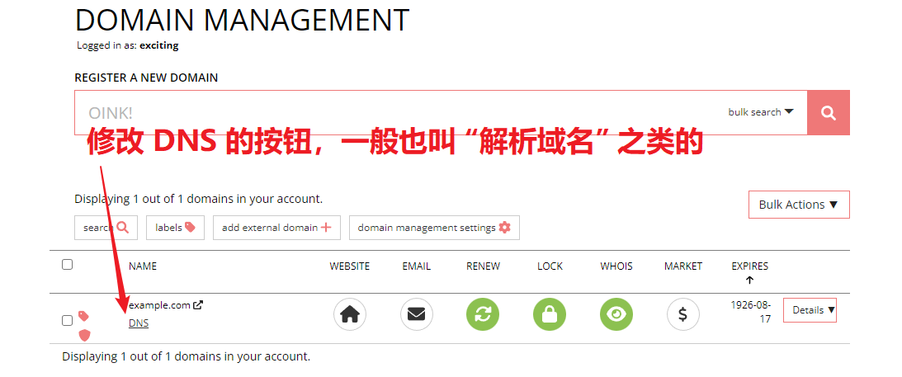

# HTTP(S) 协议穿透指南

::: tip
这篇文档只涉及 **发布网站** 的教程，您需要有一个 **已经搭好**、**在内网可以访问** 的网站才能进行穿透  
常见的适用场景有发布博客或个人网站、穿透路由器管理页面、微信小程序调试等
:::

<app-info :time="10" :difficulty="2.5" :access="[
    { proto: 'HTTP', local: '80', remote: '80, 8080 (备用), 8880 (备用)', method: 'http://example.com' },
    { proto: 'HTTPS', local: '443', remote: '443, 8443 (备用)', method: 'https://example.com' },
    { proto: 'TCP', local: '80 / 443', method: 'http(s)://example.com:12345' },
]" />

## 查看本地 IP、本地端口和协议 {#gather-information}

首先用浏览器在内网访问一下您的服务，然后查看地址栏。访问时显示的网址多半是这样的:

```http
# 如果没有自定义端口：
http://<本地 IP>/xxxx/yyyy

# 如果有自定义端口：
http://<本地 IP>:<本地端口>/xxxx
```

让我们举几个例子：

```http
# 本地 IP: 127.0.0.1
http://127.0.0.1/xxyyzz/

# 本地 IP: 10.0.1.5
http://10.0.1.5:8080/watch?v=dQw4w9WgXcQ
```

显然，**本地 IP** 就是两个斜杠开始 ～ 冒号（或者紧跟着的一个斜杠）结束的这一串东西。

至于 **本地端口** 和 **协议** 请对照下面的例子来找，在下面的例子中 **本地 IP** 都是 `127.0.0.1`：

::: tabs

@tab HTTP 协议

下面是一个采用默认端口的 HTTP 服务器的例子：


下面是一个采用自定义端口 **1919** 的 HTTP 服务器的例子：


@tab HTTPS 协议

下面是一个采用默认端口的 HTTPS 服务器的例子，由于采用了自签证书会显示不安全：


下面是一个采用自定义端口 **810** 的 HTTPS 服务器的例子：


:::

## 选择隧道类型 {#choose-tunnel-type}

::: tip
不同的节点可能有不同的建站限制，请留意选择节点时显示的信息和 [建站条件](/faq/site-inaccessible.md#site-requirement) 来选择隧道类型
:::

我们把 **HTTP** 和 **HTTPS** 两种隧道类型统称为 **HTTP(S)** 隧道。请注意区分 **隧道类型** 和 **协议** 之间的区别。

Sakura Frp 提供三种 **隧道类型** 供您穿透 HTTP(S) 服务：

| 隧道类型 | 支持的协议 | 带端口访问 | 用自己的域名 | 访问形式 |
| :---: | :---: | :---: | :---: | --- |
| **TCP** | HTTP / HTTPS | **必须** | 可选 | `http://xxx.natfrp.cloud:12345`<br>`https://xxx.natfrp.cloud:12345` |
| **HTTP** | HTTP | 不需要 | **必须** | `http://my.example.com` |
| **HTTPS** | HTTPS | 不需要 | **必须** |`https://my.example.com` |

这里有一些额外的限制：

- 使用 **TCP** 隧道时，如果您穿透的 **协议** 是 HTTP，**必须使用海外节点**。HTTPS **协议** 不受影响
- 使用 **HTTP(S)** 隧道时，必须完成 **实名认证**。如果使用国内节点进行穿透，必须使用 **有备案** 的域名

## 选择穿透节点 {#choose-node}

参考下表选择一个穿透节点，请随时留意备案和实名认证、访问认证的限制。

管理面板中能建立 HTTP(S) 隧道的节点会有绿色的 **建站** 表识。如果下表信息与面板上显示的不符，以面板显示为准。

| 节点 | 隧道类型 | 实名认证 | 备案 | 访问认证 |
| --- | --- | :---: | :---: | :---: |
| 海外 | TCP 或 HTTP(S) | 部分需要 | 不需要 | 不需要 |
| 枣庄、温州、常州、广州、辽宁、济南、南宁 | TCP | 需要 | 需要 | 不需要 |
| 绍兴 | (完全不能穿透) | | | |
| 成都、十堰、武汉 | TCP 或 HTTP(S) | 需要 | 需要 | 不需要 |
| 河南电信 | TCP 或 HTTPS | 需要 | 需要 | 不需要 |

## 创建隧道 {#create-tunnel}

:::: tabs

@tab HTTP(S) 隧道

创建 HTTP(S) 隧道时，必须选择和 **协议** 一致的 **隧道类型**，否则无法穿透成功。

如果隧道类型里没有 HTTP(S) 选项则说明 **节点不支持建站**，请更换节点。


完成选择后，填写刚才获取到的本地服务信息，然后在 **绑定域名** 处填写您自己的域名。

::: tip
每条隧道最大支持 3 个绑定域名，不支持泛域名；使用多个域名时使用英文半角逗号将域名隔开。
:::


@tab TCP 隧道

使用 TCP 隧道穿透相对简单，选择 **隧道类型** 为 **TCP** 后直接填写 IP 地址和端口即可，协议暂时不用管。


::::

## 设置解析 {#setup-dns}

::: warning
**HTTP(S) 类型** 的隧道必须设置解析，**TCP 类型** 的隧道可以设置解析也可以直接用 **节点 IP** 或 **节点域名** 访问
:::

1. 首先登录您的域名注册商，找到您的域名对应的修改 DNS 解析按钮，此处以 Porkbun 为例。

   由于各个注册商的用户界面差异较大，我们无法一一列举。如果实在是找不到可以直接问 **注册商** 客服或者上网搜索。

   

1. 然后到隧道列表找到节点域名，并确认您的子域名。这里子域名就是 `www`，如果您直接使用根域名 `example.com`，子域名当作是空的就行。

   ::: warning
   绑定域名必须和您解析到的域名完全一致，**www.example.com** 和 **example.com** 是不同的，请注意区分  
   如果您直接使用根域名进行解析 (比如 **example.com**)，子域名留空即可，不能留空就填一个 `@` 符号
   :::

   

1. 接下来就可以设置解析了，参考图中填写。虽然各个注册商的界面不同，设置解析要填的东西基本就是这几样：

   

## 启动隧道 {#start-tunnel}

现在到您的机器上启动隧道，如果一切正常您的服务就可以在外网被访问到了。

在本教程的示例中，我们可以访问的是：

- `http://www.example.com` (HTTP 隧道, 隧道 ID 为 114514 的示例)
- `http://cn-zz-bgp.sakurafrp.com:28606` (TCP 隧道, 隧道 ID 为 114515 的示例)
- `http://www.example.com:28606` (TCP 隧道, 隧道 ID 为 114515 的示例)
