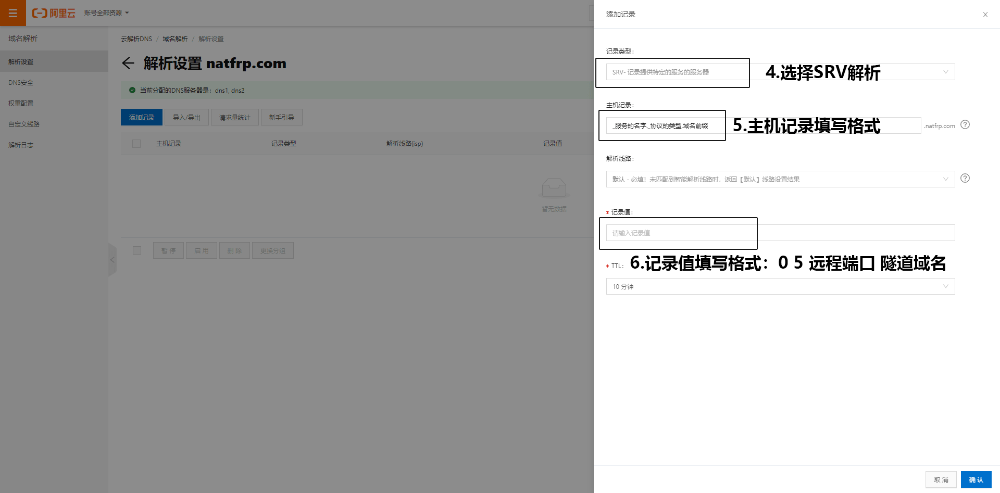

# 我的世界(Minecraft) 局域网联机穿透指南

!> SakuraFrp 不提供 Minecraft 服务器相关帮助  
如果您有不懂的问题建议到 [MCBBS 你问我答板块](https://www.mcbbs.net/forum-multiqanda-1.html ':target=_blank') 提问

## Java 版局域网联机 :id=java

Minecraft 局域网联机穿透通常需要安装 Mod 辅助，下面是装与不装的区别:

- 不装辅助 Mod: 适用于同类型账号之间的联机 (如正版和正版、盗版和盗版、外置和外置) 
- 安装辅助 Mod (推荐): 适用于不同类型账号之间的联机

### 0x01 不装辅助 Mod :id=java-no-mod

进入要联机的存档，按下键盘上的 **ESC** 键，在出现的界面里找到 `对局域网开放` 之类的按钮并且点击进入，对 **其他玩家** 进行设置，然后点击 `创造一个局域网世界`

在聊天框里会提示 `本地游戏已在端口 xxxxx 上开启` ，这个 **五位数的端口号** 对应的是 **创建隧道** 里的 **本地端口**

?> 这个 **五位数的端口号** 为并不固定，如果您想获取一个固定的端口号，就需要 **安装辅助 Mod**


上图中，我们获取到的端口号为 `61259`

### 0x02 安装辅助 Mod

!> 通过辅助 Mod 关闭正版验证 **可能** 会改变玩家的 UUID 导致 **背包内物品丢失**，请关闭正版验证前 **备份存档**

请根据您的游戏版本展开下面的选项查看，下面提到的 Mod 都必须在 **联网** 条件下安装:

<details>
<summary><b style="font-size: 20px">游戏版本: 1.12.X ~ 1.16.X</b></summary>

!> 1.16.2 版由于 Forge 的原因可能会 **引发崩溃**，端口 **不能冲突**，否则也会崩溃

 - Mod 名称: LanServerProperties  
 - Mod 功能:
  1. 固定端口
  2. 开关正版验证
 - 下载链接: [Github](https://github.com/rikka0w0/LanServerProperties) | [Curseforge](https://www.curseforge.com/minecraft/mc-mods/lan-server-properties/files/all)  
   _这两个网站的服务器都位于 **国外**，所以访问/下载的速度 **可能** 会较慢，请耐心等待或自行寻找国内镜像_

#### 使用方法

1. 安装 Mod 并进入游戏，打开您要联机的 **存档**
2. 按下键盘上的 **ESC** 键，在出现的界面里找到 `对局域网开放` 之类的按钮并且点击进入
3. 对 **其他玩家** 进行设置，同时安装此 Mod 后 **设置局域网世界** 界面后会增加下列选项，请按需配置:
   - 在线模式: 开/关  
     `关闭可以让非正版玩家和您联机`
   - 监听端口: 25565  
     `可以固定端口，监听端口对应的就是创建隧道里的本地端口`
4. 点击 `创造一个局域网世界`，在聊天框里会提示 `本地游戏已在端口 xxxxx 上开启`，这个 **五位数的端口号** 就会变成您设置的 **监听端口**


</details>
<br>
<details>
<summary><b style="font-size: 20px">游戏版本: 1.7.X ~ 1.12.X</b></summary>

 - Mod 名称: Server.Properties for LAN
 - Mod 功能:
  1. 玩家挂机多久后踢出
  2. 服务器资源包
  3. 固定端口
  4. 最大视距
  5. 是否开启正版验证
  6. 是否生成生物，最大玩家数
  7. 玩家之间是否可以造成伤害
  8. 是否开启白名单
  9. 是否生成村民
  10. 最大建筑高度
  11. Motd设置
 - 下载链接: [Curseforge](https://www.curseforge.com/minecraft/mc-mods/server-properties-for-lan/files/all)
   _该网站的服务器位于 **国外**，所以访问/下载的速度 **可能** 会较慢，请耐心等待或自行寻找国内镜像_

#### 使用方法

1. 安装 Mod 并进入游戏，打开您要联机的 **存档** (必须要先打开一次存档才会生成 `server.properties` 文件)
2. 打开 **存档文件夹** 里的 `server.properties` 文件进行编辑，下面有对各个选项的翻译

   ?> **ESC** - **选项** - **资源包** - **打开资源包文件夹**  
   **返回上一级** - **打开saves文件夹** - **找到您要联机的存档的名字并双击进入**  
   里面会有个叫 `server.properties` 的文件，**右键** 通过 **记事本**打开  
   建议使用 [Visual Studio Code](https://code.visualstudio.com/) 或者 [Sublime Text 3](http://www.sublimetext.com/) 等专业文字编辑器

   
3. 编辑完成后重新打开地图即可刷新配置

   !> `server.properties` 文件编辑完以后下一次使用 **这个存档** 联机就不用再次编辑了  
   如果 **换了个存档** 联机，就需要 **重新编辑** 或者复制之前的配置过来
4. 现在请参考 [0x01 不装辅助 Mod](#java-no-mod) 一节开启局域网联机

#### server.properties 配置文件翻译如下: 

```properties
player-idle-timeout=<Int>
# 玩家挂机多久后踢出
# 0为禁止该功能

resource-pack=
# 服务器资源包 (没有请留空) 

port=<Int>
# 端口，对应Frp设置中的本地端口
# 0为随机

max-view-distance=<Int>
# 最大视距
# 0为不限制

online-mode=<Boolean>
# 是否开启正版验证
# "true"(是)为开启, "false"(否)为关闭
# 如果要和非正版玩家，请关闭

spawn-animals=<Boolean>
# 是否生成生物
# "true"(是)为开启, "false"(否)为关闭

pvp=<Boolean>
# 玩家之间是否可以造成伤害
# "true"(是)为开启, "false"(否)为关闭

max-players=<Int>
# 最大玩家数

white-list=<Boolean>
# 是否开启白名单
# "true"(是)为开启, "false"(否)为关闭

spawn-npcs=<Boolean>
# 是否生成村民
# "true"(是)为开启, "false"(否)为关闭

max-build-height=<Int>
# 最大建筑高度
# 不能超过256

resource-pack-sha1=
# 资源包哈希算法 (没有请留空) 

motd=
# Motd设置
# 默认会生成一个，可以自己设置
```

</details>

### 0x03 创建隧道

当您获取到了 **本地端口** 后，您即可开始 **创建隧道** 了，详细设置如下图

!> 如果您的服务器经常被 [DOS 攻击](https://zh.wikipedia.org/wiki/拒绝服务攻击)，请使用高防节点 (如枣庄)


## 设置 SRV 解析 :id=srv

鉴于有很多用户都不会用百度查询如何进行 **SRV解析**，所有就有了这个文档

本文档会教您如何在下列域名服务商的面板中为 **Minecraft Java版** 配置 **SRV解析**

 - [阿里云](#srv-aliyun)
 - [Cloudflare](#srv-cloudflare) 

如果您有 **其他厂商** 的域名，并且会在对应面板中进行 **SRV解析**，欢迎提交 [Pull Request](https://github.com/natfrp/wiki/pulls ':target=_blank') 帮助我们完善该文档

要进行 **SRV解析**，您就必须要有一个域名，本文档不会推荐您使用哪个厂商的域名，如果您 **不会花钱** 的话，那我们也没办法了

### 阿里云 :id=srv-aliyun

点击 [这里](https://dc.console.aliyun.com/next/index#/domain/list/all-domain ':target=_blank') 进入 **阿里云** 的 **域名列表**，如果您 **没有登录**，请登录

找到您想要进行 **SRV解析的域名**，点击 **最后一栏** 操作中的解析


点击 **添加记录**


按下表进行填写，然后点击 **确认** 即可

| 字段 | 填写内容 |
| --- | --- |
| 记录类型 | SRV |
| 主机记录 | `_minecraft._tcp.xx` (后面的 `xx` 可以自定义，也可以直接把 `.xx` 去掉只写 `_minecraft._tcp`) |
| 记录值 | `0 5 远程端口 隧道域名**` (例: `0 5 xxxxx cn-xx-xxx.sakurafrp.com`) |



保存完毕后需要 **等待** 10 分钟 (按照您的 **TTL** 来决定，一般为 10 分钟) 

 - **假设** 您的域名为: natfrp.com，您的 **xx** 设置为 `test`，那么使用 `test.natfrp.com` 即可连接到您的服务器
 - **假设** 您的域名为: natfrp.com，您把 **.xx** 去掉了，那么使用 `natfrp.com` 即可连接到您的服务器

### Cloudflare :id=srv-cloudflare

点击 [这里](https://dash.cloudflare.com/ ':target=_blank') 进入 **Cloudflare** 的 **域名列表**，如果您 **没有登录**，请登录

找到您想要进行**SRV解析**的域名并且**点击它**


然后点击最顶上的**第三个** DNS

点击**添加记录**


按下表进行填写，然后点击 **保存** 即可

| 字段 | 填写内容 |
| --- | --- |
| 类型 | SRV |
| 名称 | 自定义，或者填写 `@` |
| 服务 | _minecraft |
| 协议 | TCP |
| 优先级 | 0 |
| 权重 | 5 |
| 端口 | 远程端口 (例: `12345`) |
| 目标 | 隧道域名 (例: `cn-xx-xxx.sakurafrp.com`) |


保存完毕后需要 **等待** 10 分钟 (按照您的 **TTL** 来决定，一般为 10 分钟) 

 - 假设您的域名为: natfrp.com，您的 **名称** 设置为 `test`，那么使用 `test.natfrp.com` 即可连接到您的服务器
 - 假设您的域名为: natfrp.com，您的 **名称** 设置为 `@`，那么使用 `natfrp.com` 即可连接到您的服务器

# Minecraft 基岩版简易开服指南 :id=bedrock
>此教程仅仅是一个简单的入门教程，如果遇到了一些问题，请自行去[mcbbs](https://mcbbs.com/)中寻找答案或者提问  
>此文不建议毫无经验的小白阅读   
>此指南针对的是**基岩版**用户，如果你是**JAVA版**用户，请转到[JAVA联机教程](#Java版局域网联机指南)


目前基岩版服务器有两种核心可用，分别是：
* BDS-bedrock dedicated server
* NUKKIT-Nukkit BE

其中，BDS是微软官方发行，与**安卓版**，**win10版**，**iOS版**的基岩版使用同一核心，适合原版生存。但闭源，生态太小。

NUKKIT核心则是基于java版开发的一款核心，开源，生态优于BDS但由于功能缺失不适合于原版生存，但适合搭建小游戏服务器。

## BDS on Windows
### 0x01 前置工作
* 1.一个可用的sakura launcher或者frpc
* 2.最新版本的BDS-Windows核心，[传送门](https://www.minecraft.net/en-us/download/server/bedrock/)
* 3.一台装载着**Win10 1703**或**Win server 2016**或更高版本的操作系统的电脑(官方文档建议)
* 4.电脑配置不低于2核，1Gb RAM(官方文档建议)

### 0x02 开服配置
解压BDS压缩包后，我们能在根目录下看到配置文件"server.properties"
可以通过更改值来做到初始化世界的目的

#### 配置文件内的翻译：
    server-name=Dedicated
    Server
    # 用作服务器名称
    # 允许值 : 任何字符串
    
    gamemode=survival
    # 为新玩家设置游戏模式。
    # 允许值 : "survival"(生存), "creative"(创造), 或 "adventure"(冒险)
    
    difficulty=easy
    # 设定世界的难度。
    # 允许值 : "peaceful"(和平), "easy"(简单), "normal"(普通), 或 "hard"(困难)
    
    allow-cheats=false
    # 如果设置为"true"，则可以使用类似命令的作弊手段。
    # 允许值 : "true"(是) 或 "false"(否)
    
    max-players=10
    # 服务端上可以同时在线的最大玩家数。
    # 允许值 : 任意正整数
    
    online-mode=true
    # 如果设置为"true"，则必须对所有连接的玩家进行Xbox Live身份验证。
    # 无论此设置如何，连接到远程（非本地）服务端的客户端将始终需要Xbox Live身份验证。
    # 如果服务端接受来自互联网的连接，则强烈建议启用联机模式。
    # 允许值 : "true"(是) 或 "false"(否)
    
    white-list=false
    # 如果为"true"，则必须在"whitelist.json"文件中列出所有连接的玩家。
    # 允许值 : "true"(是) 或 "false"(否)
    
    server-port=19132
    # 服务端应监听哪个IPv4端口。
    # 允许值 : 1-65535闭区间内的整数 [1, 65535]
    
    server-portv6=19133
    # 服务端应监听哪个IPv6端口。
    # 允许值 : 1-65535闭区间内的整数 [1, 65535]
    
    view-distance=32
    # 允许的最大视距（以方块数为单位）。
    # 允许值 : 任意正整数
    
    tick-distance=4
    # 停止加载区块的距离
    # 允许值 : 4-12闭区间内的整数 [4, 12]
    
    player-idle-timeout=30
    # 挂机玩家被踢出的时间
    # 允许值 : 任意非负整数
    
    max-threads=8
    # 服务端使用的最大线程数，如果设置为0，服务端会尽可能多地使用所有线程。
    # 允许值 : 任意非负整数
    
    level-name=Bedrock level
    # 世界名称以及文件夹名
    # 允许值 : 任何字符串
    
    level-seed=
    # 为世界定义一个种子
    # 允许值 : 任何字符串
    
    default-player-permission-level=member
    # 新玩家的游戏模式
    # 允许值 : "visitor"(游客), "member"(会员), "operator"(管理员)
    
    texturepack-required=false
    # 强制客户端加载服务端资源包
    # 允许值 : "true"(是) 或 "false"(否)
    
    content-log-file-enabled=false
    # 启用将会使错误内容记录到日志文件中
    # 允许值 : "true"(是) 或 "false"(否)
    
    compression-threshold=1
    # 要压缩的原始网络有效负载的最小大小
    # 允许值 : 0-65535
    
    server-authoritative-movement=true
    # 启用服务端权威性移动。 如果为"true"，则服务端将在以下位置重设本地用户输入
    # 客户端的位置与服务端的位置不匹配时，发送服务端更正位置并向下发送至客户端更正。
    # 仅当正确的玩家移动设置为true时，才会进行更正。
    
    player-movement-score-threshold=20
    # 报告异常行为之前所需的数据不一致的数量。
    # 在 server-authoritative-movement 选项为"false"时失效
    
    player-movement-distance-threshold=0.3
    # 在检测到异常行为之前，服务端与客户端数值之差。
    # 在 server-authoritative-movement 选项为"false"时失效
    
    player-movement-duration-threshold-in-ms=500
    # 服务端和客户端位置的时间长度可能不同步 (在 server-authoritative-movement 选项为"false"时失效)
    # 在异常移动计数增加之前。 此值以毫秒为单位定义。
    # 在 server-authoritative-movement 选项为"false"时失效
    
    correct-player-movement=false
    # 如果为"true"，则移动值超过阈值，客户端的玩家位置将被校正为服务端玩家的位置。
    # 允许值 : "true"(是) 或 "false"(否)

其中：数据压缩如果阈值过低，压缩会占用CPU，而开太高会导致流量消耗过快，请自行权衡

#### 未列出但可配置的项目：
    level-type=
    # 世界的类型
    # 可用值：DEFAULT，LEGACY，FLAT（无限，有限，超平坦）
    
    world-type=
    # 是否开启教育版，实验性玩法
    # 可用值：未知

#### 隧道配置：
| 协议        | 本地端口(默认)    |  远程端口     |
| --------    | -----:        | :----:       |
| UDP         | 19132          |   无要求    |

### 0x03 其他注意事项
如果您想同时在一台电脑上运行服务端和客户端，并且想通过客户端直接连接本地的话，可能会碰上点麻烦：

某些Windows版本默认不允许UWP应用形成127回环
#### 解决方案：
    CheckNetIsolation.exe LoopbackExempt –a –p=S-1-15-2-1958404141-86561845-1752920682-3514627264-368642714-62675701-733520436
    # 以管理员权限打开Windows powershell并复制进去执行，随后重启电脑


## BDS on Linux
### 0x01 前置工作
* 1.一个可用的frpc
* 2.最新版本的BDS-Linux核心，[传送门](https://www.minecraft.net/en-us/download/server/bedrock/)
* 3.一台装载着**Ubuntu 18**或更高版本的操作系统的电脑(官方文档建议)
* 4.电脑配置不低于2核，1Gb RAM(官方文档建议)

### 0x02 开服配置
**同Windows 不再复读**

### 0x03 其他注意事项
无，Linux比Windows省心114514倍

## NUKKIT on Linux
(NUKKIT for Bedrock目前只有Linux)
### 0x01 前置工作
* 1.一个可用的frpc
* 2.最新版本的NUKKIT bedrock核心(自己找去)
* 3.一台拥有java环境的linux主机

### 0x02 开服配置
配置文件方面同BDS

关于java安装：
* 如果你是Ubuntu/Debian系用户，请点此[传送门](https://www.baidu.com/s?ie=UTF-8&wd=apt%E5%AE%89%E8%A3%85java)寻找您版本对应的教程
* 如果您是RHEL系用户，输入以下指令即可
    sudo yum -y install java

如果您追求更好的拓展(这也是NUKKIT核心的初衷之一)

请到对应的开源平台上自行寻找

### 其他注意事项
* 1.目前NUKKIT Bedrock BUG较多，请及时更新
* 2.支持开源社区！

## BDS核心进阶教程
### 白名单模式
!>如果您不想让外来人进入您的服务器，这个机制不失为一个优质选项
其中，你可以在"server.properties"中启用白名单(white-list=true)，但同时必须开启正版验证(online-mode=true)
#### 管理方式：
可以直接在服务端控制台用如下指令编辑白名单
 * whitelist add "Example Name" # 根据昵称添加白名单
 * whitelist remove "Example Name" # 根据昵称移除白名单
 * whitelist list # 打印whitelist.json内容
而你也可以在whitelist.json里直接进行编辑：
    [{ "ignoresPlayerLimit": false,  # 是否无视玩家上线(即使服务器满员该玩家也可进入) "name": "MyPlayer"},{"ignoresPlayerLimit": false,"name": "AnotherPlayer","xuid": "123456789" #其中xuid和昵称有一个就可以，该玩家第一次登入的时候会自动补全}]
* （不要打我，官方就没有缩进）
### 玩家管理
管理您服务器里的op，如果op想在游戏内使用指令，则必须开启允许作弊(allow-cheat=true)

可以通过以下指令编辑权限
 * op "example players" # 添加权限
 * deop "example players" # 剥夺权限

如果您看某人不顺眼，可以直接通过以下指令踢掉他
 * kick "example players"

如果您想关闭服务器，可以通过以下指令来软关服
  * stop

### 游戏参数修改
在根目录下会有一个行为包目录"behavior_packs"，可以通过修改这个文件来达成修改游戏数据的目的

其中有多个小文件，名称上带有"experience"或者"developing"的是实验性行为包，如果没有开启实验性玩法的话不用修改这个文件夹里的。

### 材质包
此项用处多多，可以增加情趣，也可以防止作弊性材质包(比如矿透，无限夜视)
>由于基岩版与JAVA版不同，材质包的对应关系是具体到某个世界的，所以光把材质包丢到"resource_packs"文件夹是不行的！
解决方案：
* 1.用客户端随便创建一个世界，创建时勾选想用的材质包
* 2.进入后退出存档，找到MC数据文件夹，找到这个世界服文件夹
* 3.找到以下两个文件
world_resource_pack_history.json world_resource_pack.json
* 4.将其拷贝到服务端根目录下worlds/"Bedrock level"/即可
* 5.如果要所有人强制使用材质包，则把强制使用材质给打开(texturepack-required=true)
