# 我的世界(Minecraft) 局域网联机穿透指南

!> SakuraFrp 不提供 Minecraft 服务器相关帮助，文档主要由热心网友提供  
如果您有不懂的问题建议到 [MCBBS 你问我答板块](https://www.mcbbs.net/forum-multiqanda-1.html ':target=_blank') 提问

## 基岩版或 Geyser 联机和开服 :id=bedrock

请参阅 [Minecraft 基岩版开服指南](/offtopic/mc-bedrock-server) | [Geyser 互通开服指南](/offtopic/mc-geyser) 以开启服务器

## Java 版局域网联机 :id=java

Minecraft 局域网联机穿透通常需要安装 Mod 辅助，下面是装与不装的区别:

- 不装辅助 Mod: 适用于同类型账号之间的联机 (如正版和正版、盗版和盗版、外置和外置) 
- 安装辅助 Mod (推荐): 适用于不同类型账号之间的联机

### 不装辅助 Mod :id=java-no-mod

进入要联机的存档，按下键盘上的 **ESC** 键，在出现的界面里找到 `对局域网开放` 之类的按钮并且点击进入，对 **其他玩家** 进行设置，然后点击 `创造一个局域网世界`

在聊天框里会提示 `本地游戏已在端口 xxxxx 上开启` ，这个 **五位数的端口号** 对应的是 **创建隧道** 里的 **本地端口**

?> 这个 **五位数的端口号** 为并不固定，如果您想获取一个固定的端口号，就需要 **安装辅助 Mod**

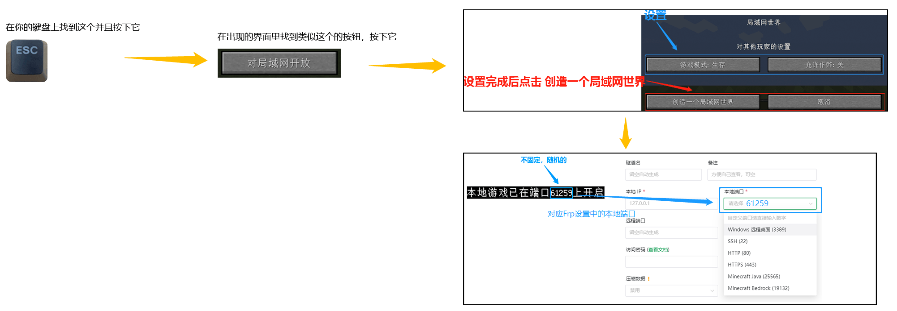

上图中，我们获取到的端口号为 `61259`

### 安装辅助 Mod

!> 通过辅助 Mod 关闭正版验证 **可能** 会改变玩家的 UUID 导致 **背包内物品丢失**，请关闭正版验证前 **备份存档**

请根据您的游戏版本展开下面的选项查看，下面提到的 Mod 都必须在 **联网** 条件下安装:

<details>
<summary><b style="font-size: 20px">游戏版本: 1.12.X ~ 1.19</b></summary>

!> 1.16.2 版由于 Forge 的原因可能会 **引发崩溃**，端口 **不能冲突**，否则也会崩溃

+ Mod 名称: LanServerProperties  
+ Mod 功能:
  1. 固定端口
  2. 开关正版验证
+ 下载链接: [Github](https://github.com/rikka0w0/LanServerProperties) | [Curseforge](https://www.curseforge.com/minecraft/mc-mods/lan-server-properties/files/all)  
_这两个网站的服务器都位于 **国外**，所以访问/下载的速度 **可能** 会较慢，请耐心等待或自行寻找国内镜像_

#### 使用方法

1. 安装 Mod 并进入游戏，打开您要联机的 **存档**
2. 按下键盘上的 **ESC** 键，在出现的界面里找到 `对局域网开放` 之类的按钮并且点击进入
3. 对 **其他玩家** 进行设置，同时安装此 Mod 后 **设置局域网世界** 界面后会增加下列选项，请按需配置:
   - 在线模式: 开/关  
     `关闭可以让非正版玩家和您联机`
   - 监听端口: 25565  
     `可以固定端口，监听端口对应的就是创建隧道里的本地端口`
4. 点击 `创造一个局域网世界`，在聊天框里会提示 `本地游戏已在端口 xxxxx 上开启`，这个 **五位数的端口号** 就会变成您设置的 **监听端口**

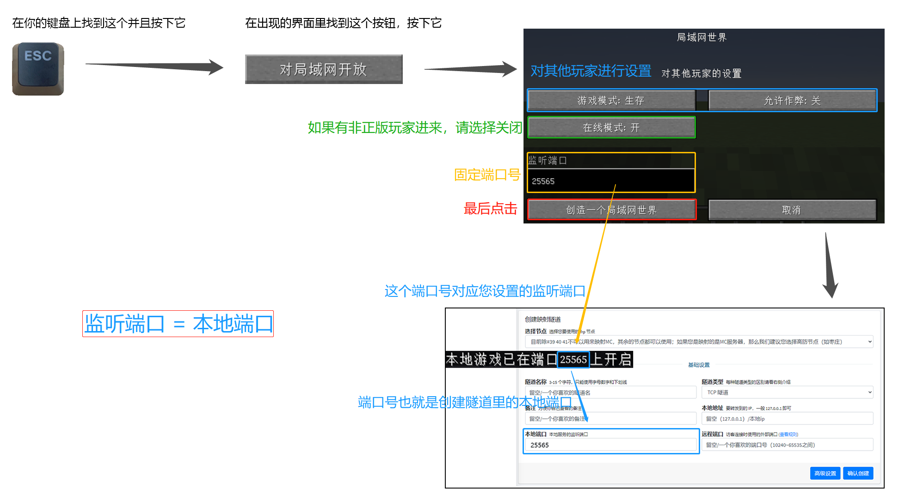

</details>
<br>
<details>
<summary><b style="font-size: 20px">游戏版本: 1.7.X ~ 1.12.X</b></summary>

+ Mod 名称: Server.Properties for LAN
+ Mod 功能:
  1. 玩家挂机多久后踢出
  2. 服务器资源包
  3. 固定端口
  4. 最大视距
  5. 是否开启正版验证
  6. 是否生成生物，最大玩家数
  7. 玩家之间是否可以造成伤害
  8. 是否开启白名单
  9. 是否生成村民
  10. 最大建筑高度
  11. Motd设置
+ 下载链接: [MineBBS](https://www.minebbs.com/resources/4335/)  

#### 使用方法

1. 安装 Mod 并进入游戏，打开您要联机的 **存档** (必须要先打开一次存档才会生成 `server.properties` 文件)
2. 打开 **存档文件夹** 里的 `server.properties` 文件进行编辑，下面有对各个选项的翻译

   ?> **ESC** - **选项** - **资源包** - **打开资源包文件夹**  
   **返回上一级** - **打开saves文件夹** - **找到您要联机的存档的名字并双击进入**  
   里面有一个 `server.properties` 文件，请使用文本编辑器软件打开。
   建议使用 [Visual Studio Code](https://code.visualstudio.com/) 或者 [Sublime Text 3](http://www.sublimetext.com/) 等专业文字编辑器

   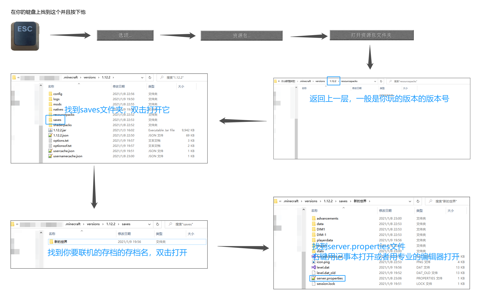
3. 编辑完成后重新打开地图即可刷新配置

   !> `server.properties` 文件编辑完以后下一次使用 **这个存档** 联机就不用再次编辑了  
   如果 **换了个存档** 联机，就需要 **重新编辑** 或者复制之前的配置过来
4. 现在请参考 [不装辅助 Mod](#java-no-mod) 一节开启局域网联机

#### server.properties 配置文件翻译如下: 

```properties
player-idle-timeout=<Int>
# 玩家挂机多久后踢出
# 0为禁止该功能

resource-pack=
# 服务器资源包 (没有请留空) 

port=<Int>
# 端口，对应Frp设置中的本地端口
# 0为随机

max-view-distance=<Int>
# 最大视距
# 0为不限制

online-mode=<Boolean>
# 是否开启正版验证
# "true"(是)为开启, "false"(否)为关闭
# 如果要和非正版玩家，请关闭

spawn-animals=<Boolean>
# 是否生成生物
# "true"(是)为开启, "false"(否)为关闭

pvp=<Boolean>
# 玩家之间是否可以造成伤害
# "true"(是)为开启, "false"(否)为关闭

max-players=<Int>
# 最大玩家数

white-list=<Boolean>
# 是否开启白名单
# "true"(是)为开启, "false"(否)为关闭

spawn-npcs=<Boolean>
# 是否生成村民
# "true"(是)为开启, "false"(否)为关闭

max-build-height=<Int>
# 最大建筑高度
# 不能超过256

resource-pack-sha1=
# 资源包哈希算法 (没有请留空) 

motd=
# Motd设置
# 默认会生成一个，可以自己设置
```

</details>

### 创建隧道

当您获取到了 **本地端口** 后，您即可开始 **创建隧道** 了，详细设置如下图

!> 如果您的服务器经常被 [DOS 攻击](https://zh.wikipedia.org/wiki/拒绝服务攻击)，请使用高防节点 (如枣庄)

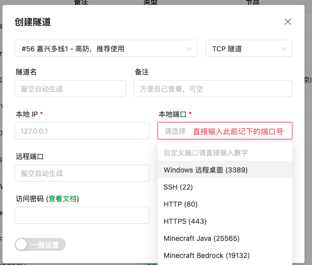

## 设置 SRV 解析 :id=srv

?> 设置 **SRV 解析** 只是为了美观，**并非必须**。设置后，在游戏中添加服务器时， **无需填写端口号**。

鉴于有很多用户都不会用百度查询如何进行 **SRV 解析**，所有就有了这个文档。

本文档会教您如何在下列域名服务商的面板中为 **Minecraft Java 版** 配置 **SRV 解析**。

+ [阿里云](#srv-aliyun)
+ [腾讯云 DNSPod](#srv-tencent)
+ [Cloudflare](#srv-cloudflare)

如果您有 **其他厂商** 的域名，并且会在对应面板中进行 **SRV 解析**，欢迎提交 [Pull Request](https://github.com/natfrp/wiki/pulls ':target=_blank') 帮助我们完善该文档

要进行 **SRV 解析**，您就必须要有一个域名，本文档不会推荐您使用哪个厂商的域名，如果您 **不会花钱** 的话，那我们也没办法了

!> 配置 SRV 记录后使用 `ping` 命令是无法测试连通性的，但是在游戏中填上就可以正常使用  
除此之外，只有 Minecraft Java 版支持解析 SRV 记录，基岩版并不支持此特性

### 阿里云 :id=srv-aliyun

点击 [这里](https://dc.console.aliyun.com/next/index#/domain/list/all-domain ':target=_blank') 进入 **阿里云** 的 **域名列表**，如果您 **没有登录**，请登录

找到您想要进行 **SRV 解析的域名**，点击 **最后一栏** 操作中的解析

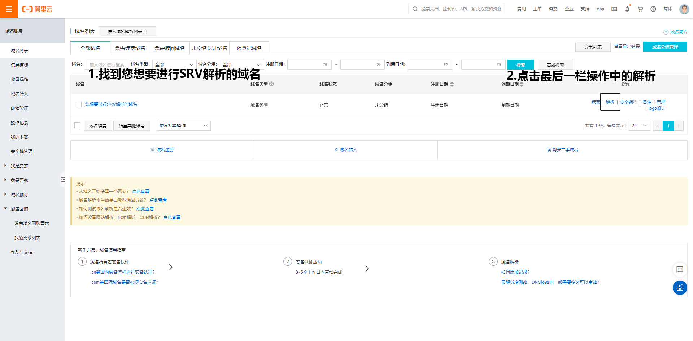

点击 **添加记录**

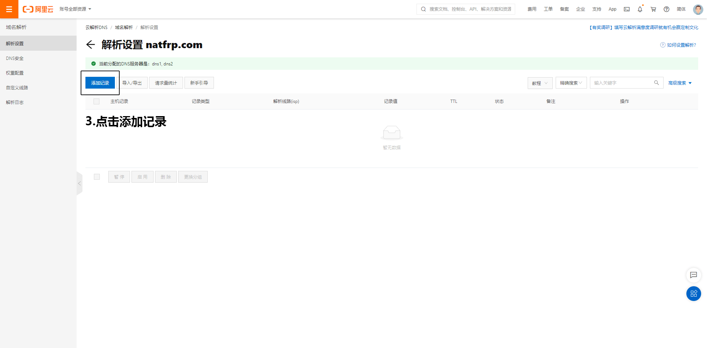

按下表进行填写，然后点击 **确认** 即可

| 字段     | 填写内容                | 说明                                       |
| -------- | ----------------------- | ------------------------------------------ |
| 主机记录 | `_minecraft._tcp.xx`    | `xx` 可以自定义，亦可去除 `.xx`。          |
| 记录类型 | SRV                     |                                            |
| 记录值   | `0 5 远程端口 节点域名` | 例: `0 5 12345 idea-leaper-1.natfrp.cloud` |

保存完毕后需要 **等待** 10 分钟来让解析生效 (按照您设置的 **TTL** 来决定，一般为 10 分钟) 。

+ **假设** 您的域名为: example.com，您的 **`.xx`** 设置为 `.sub`，那么在游戏中添加服务器时，使用 `sub.example.com` 地址即可连接。
+ **假设** 您的域名为: example.com，您把 **`.xx`** 去掉了，那么在游戏中添加服务器时，使用 `example.com` 即可连接。

### 腾讯云 DNSPod :id=srv-tencent

> 腾讯云解析正在长期引导用户前往 DNSPod 控制台设置解析，故这里使用 **DNSPod 控制台** 作演示。腾讯云解析与之基本一致。

点击 [这里](https://console.dnspod.cn/dns/list) 进入 **DNSPod** 的解析列表，如果您没有登录，请先登录。

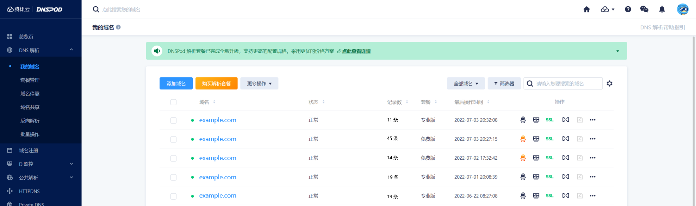

找到您要解析的域名，直接点击域名名称，以进入解析配置页面。

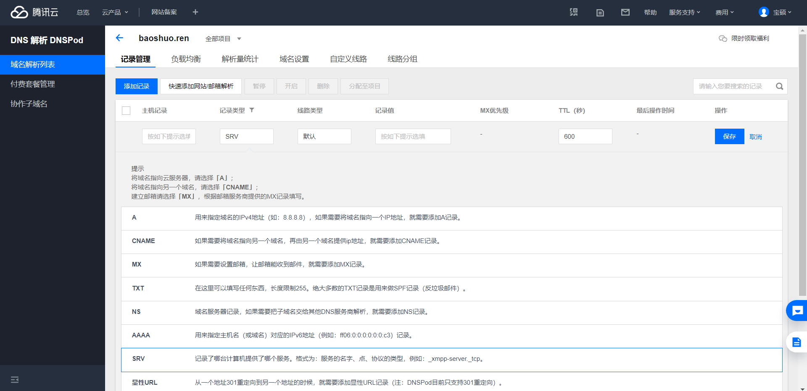

点击左上方的 “添加记录” ，然后按下表进行填写，完毕后点击 **确认** 即可。

| 字段     | 填写内容                | 说明                                       |
| -------- | ----------------------- | ------------------------------------------ |
| 主机记录 | `_minecraft._tcp.xx`    | `xx` 可以自定义，亦可去除 `.xx`。          |
| 记录类型 | SRV                     |                                            |
| 记录值   | `0 5 远程端口 节点域名` | 例: `0 5 12345 idea-leaper-1.natfrp.cloud` |

保存完毕后需要 **等待** 10 分钟来让解析生效 (按照您设置的 **TTL** 来决定，一般为 10 分钟) 。

+ **假设** 您的域名为: example.com，您的 **`.xx`** 设置为 `.sub`，那么在游戏中添加服务器时，使用 `sub.example.com` 地址即可连接。
+ **假设** 您的域名为: example.com，您把 **`.xx`** 去掉了，那么在游戏中添加服务器时，使用 `example.com` 即可连接。

### Cloudflare :id=srv-cloudflare

点击 [这里](https://dash.cloudflare.com/ ':target=_blank') 进入 **Cloudflare** 的 **域名列表**，如果您 **没有登录**，请登录

找到您想要进行 **SRV 解析** 的域名，**点击它**


然后点击最顶上的 **第三个** DNS

点击 **添加记录**

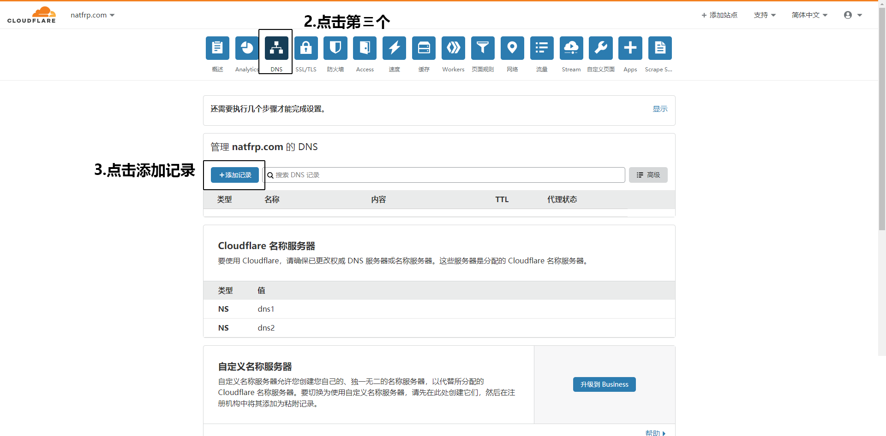

按下表进行填写，然后点击 **保存** 即可

| 字段   | 填写内容   | 说明                             |
| ------ | ---------- | -------------------------------- |
| 类型   | SRV        |                                  |
| 名称   | 自定义     | 亦可填写 `@`                     |
| 服务   | _minecraft |                                  |
| 协议   | TCP        |                                  |
| 优先级 | 0          |                                  |
| 权重   | 5          |                                  |
| 端口   | 远程端口   | 例: `12345`                      |
| 目标   | 隧道域名   | 例: `idea-leaper-1.natfrp.cloud` |

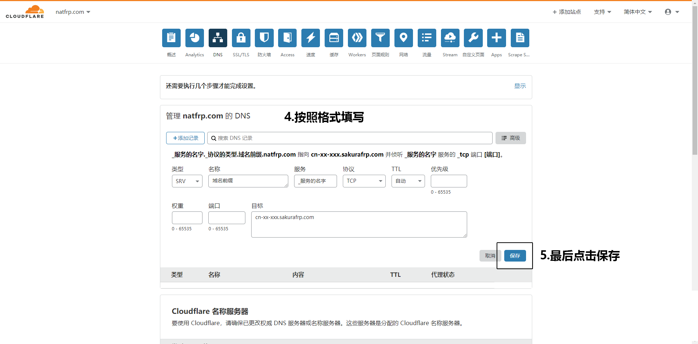

保存完毕后需要 **等待** 10 分钟来让解析生效 (按照您设置的 **TTL** 来决定，一般为 10 分钟) 。

+ **假设** 您的域名为: example.com，您的 **名称** 设置为 `sub`，那么在游戏中添加服务器时，使用 `sub.example.com` 地址即可连接。
+ **假设** 您的域名为: example.com，您的 **名称** 设置为 `@`，那么在游戏中添加服务器时，使用 `example.com` 即可连接。

## 无法进服解决方法 :id=java-inaccessible

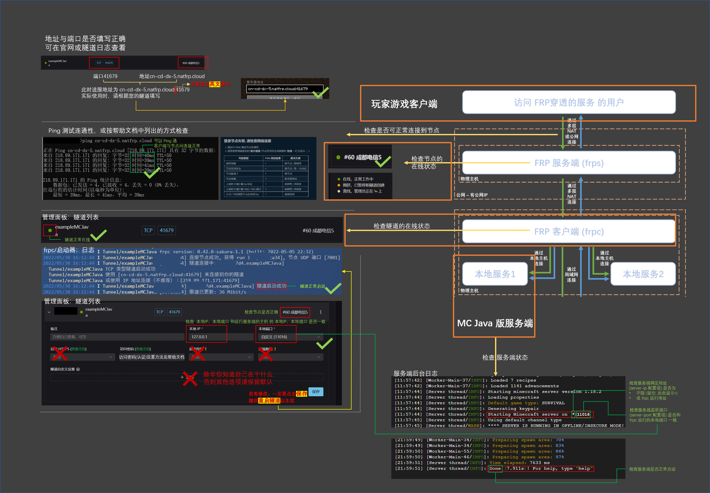
