# 我的世界(Minecraft) 局域网联机穿透指南

::: warning 非官方文档
SakuraFrp 不提供 Minecraft 服务器相关帮助，本文档主要由社区用户提供内容
:::

## 常见问题 {#faq}

::: details 我还是进不去服务器 / 用不了 / 进服时报 XXX 错误怎么办


:::

::: details 第一次开服能用，怎么现在就不行了 / 报错 “请检查本地服务是否可访问”


:::

::: details 联机成功后游戏看起来卡顿或延迟极高

#### 可能原因

1.服务器/主机性能不佳导致处理缓慢  
检查 [调试屏幕](https://zh.minecraft.wiki/w/%E8%B0%83%E8%AF%95%E5%B1%8F%E5%B9%95) 页面的 `ms ticks` 项目是否有超过50ms，如果有即为主机性能不足或模组过多等原因。  
注：当您不是主机时可能无法看到这一项，请使用其他方法查看 tps 或 mspt 等服务器性能指标。

2.节点超载或节点到主机的网络的连接质量不佳  
尝试检查 [节点状态](https://www.natfrp.com/tunnel/nodes) 页面并更换节点，如果全部节点都卡顿基本可以排除此问题。

3.你的整合包对联机的兼容性不佳  
尝试使用 [服务端](#java-server) 替代局域网联机。

4.宽带上传速度不足  
请自行使用各类测速网站检查你的带宽上传极限值为多高，一般情况下原版的正常游戏需要每人至少 1Mbps 平均带宽，2Mbps 峰值带宽。并且在添加有模组或数据包的情况下这个需求可能会成倍增长。

#### 如果你需要他人帮助

可以到 [sakura交流群、论坛](/index.md#community) 提问，提问时请尽量提供穿透节点、网络环境、游戏是否为整合包等信息，并注意隐私。

:::

## 基岩版或 Geyser 联机和开服 {#bedrock}

请参阅 [Minecraft 基岩版开服指南](/offtopic/mc-bedrock-server.md) | [Geyser 互通开服指南](/offtopic/mc-geyser.md) 以开启服务器。

## Java 版局域网联机 {#java}

::: warning
我们并不推荐您在长期游玩时使用 Minecraft 局域网联机 功能，  
使用 [独立服务端](#java-server) 可以为您提供更多的功能和更好的性能。

局域网联机并不能为您带来比开服更高的性能，其本质与开服无异，甚至可能 **优化更糟**。
:::

Minecraft 局域网联机穿透通常需要安装 Mod 辅助，  
关于是否需要辅助 Mod，下面给您一些简单的条件参考：

- 没有登录 皮肤站 或 正版账号，则需辅助 Mod
- 有玩家使用离线登录（直接在启动器内设置用户名），则需辅助 Mod
- 有玩家登录不同皮肤站的账号，则需辅助 Mod
- 所有人都是正版账号，不需辅助 Mod
- 所有人都登录皮肤站的账号，不需辅助 Mod

在需要辅助 Mod 时不使用，会出现 `登录失败: 无效会话 (请尝试重启游戏及启动器)` 问题。

### 不装辅助 Mod 的步骤 {#java-no-mod}

::: tip
如果您的小伙伴都是正版战士 / 皮肤站用户，您可以在不需要辅助 Mod 的情况下开始。
否则，请参考 [安装辅助 Mod 的步骤](#java-mod)
:::

进入要联机的世界，按下键盘上的 **ESC** 键，在出现的界面里找到 `对局域网开放` 之类的按钮并且点击进入，对 **其他玩家** 进行设置，然后点击 `创造一个局域网世界`。

在聊天框里会提示 `本地游戏已在端口 xxxxx 上开启` ，表示游戏内置服务端已经启动在这个端口上，这就是我们的本地端口。


例如上图中，我们可以看到的端口号为 `61259`，请记下端口号备用。

确定内置服务端已经启动后，我们就可以开始 [创建隧道](/app/mc.md#create-tunnel) 了。

### 安装辅助 Mod 的步骤 {#java-mod}

::: warning
通过辅助 Mod 关闭正版验证 **可能** 会改变玩家的 UUID 导致 **背包内物品和玩家数据丢失**，请在操作前 **备份存档**  
辅助 Mod 互相 **不兼容**，请勿 **重复** 添加联机模组  
请务必 **严格按照** 辅助 Mod 中的使用方法操作，**尤其是正版验证选项**
:::

请根据您的游戏版本点击下面之一的 Mod 展开详细说明，下面提到的 Mod 都必须在 **联网** 条件下安装:

某些整合包已经有联机 Mod，这可以通过您在游戏内尝试打开 `对局域网开放` 功能时是否有 `在线模式` 的配置来判断。  
如果有，请对号入座找到对应的 Mod 打开详细说明。

:::: details LAN World Plug-n-Play 适用游戏版本: Forge: 1.15.2 ~ 1.21, Fabric&Quilt: 1.15.2 ~ 1.21, NeoForge: 1.20.2 ~ 1.21

- Mod 名称: LAN World Plug-n-Play (mcwifipnp)  
- Mod 部分功能:
  1. 固定端口
  2. 开关在线模式 (Online-mode)
  3. 更多对其他人的自定义功能
  4. 通过uPnP功能进行联机
- 下载链接: [mcmod](https://www.mcmod.cn/download/4498.html) | [modrinth](https://modrinth.com/mod/mcwifipnp/versions) | [Curseforge](https://www.curseforge.com/minecraft/mc-mods/mcwifipnp/files)

#### 使用方法

1. 安装 Mod 并进入游戏，打开您要联机的世界
2. 按下键盘上的 **ESC** 键，在出现的界面里找到 `对局域网开放` 之类的按钮并且点击进入
3. 安装此 Mod 后 **设置局域网世界** 界面会增加下列选项，请按需配置:
   - 端口号: *随机五位数*
     `在此框内输入端口号可固定端口`
   - 允许玩家数: 10
     `允许的最大在线玩家数`
   - 服务器信息: A Minecraft LAN World
     `即为 MOTD 。对应其他人在多人游戏列表里看到的服务器介绍`
   - **在线模式: 开/关**
     `关闭可以让离线账号玩家或其他账号和您联机`
   此模组的其他功能请在游戏内将鼠标指针指向按钮获得详细提示。

::: tip
这个模组在使用的时候会在聊天栏提示 “端口映射失败，请使用内网映射软件” “获取IP成功：内网IPv4” 等其他模组自带功能的运行状态，如果您没有公网IP的话请 **忽略** 这些提示。  
您的客机需要连接的IP会输出在启动器或frpc的日志中。
:::

1. 点击 `创建局域网世界`，在聊天栏中会提示 `本地游戏已在端口 xxxxx 上开启`，表示游戏内置服务端已经启动，这个五位数的端口号会固定为您在上面输入框中设置的端口号。对应您在创建隧道时的本地端口选项。

::::

:::: details LanServerProperties 适用游戏版本: Forge: 1.12.X ~ 1.20.4 1.21, fabric: 1.16.1 ~ 1.20.4 1.21, NeoForge: 1.21

::: tip
此模组有部分版本可能会有不兼容问题，详情参考 [mcmod](https://www.mcmod.cn/class/2754.html) 模组页面下方的注意列表。  
此 Mod 在游戏版本 1.16.5 + 高版本 Java 运行时会[出现问题](https://github.com/rikka0w0/LanServerProperties/issues/15)，如果您需要在 1.16.5 上运行，请使用 Java 8/11 或使用上面的 mcwifipnp 模组。
:::

- Mod 名称: LanServerProperties  
- Mod 部分功能:
  1. 固定端口
  2. 开关正版验证
- 下载链接: [mcmod](https://www.mcmod.cn/download/2754.html) | [Github](https://github.com/rikka0w0/LanServerProperties/releases) | [Curseforge](https://www.curseforge.com/minecraft/mc-mods/lan-server-properties/files)

#### 使用方法

1. 安装 Mod 并进入游戏，打开您要联机的 **存档**
2. 按下键盘上的 **ESC** 键，在出现的界面里找到 `对局域网开放` 之类的按钮并且点击进入
3. 对 **其他玩家** 进行设置，同时安装此 Mod 后 **设置局域网世界** 界面后会增加下列选项，请按需配置:
   - **在线模式: 开/关**  
     `关闭可以让离线账号玩家或其他账号和您联机`
   - 监听端口: 25565  
     `可以设置固定端口`
4. 点击 `创造一个局域网世界`，在聊天框里会提示 `本地游戏已在端口 xxxxx 上开启`，表示游戏内置服务端已经启动，这个五位数的端口号会固定为您在上面输入框中设置的端口号。对应您在创建隧道时的本地端口选项。


::: tip
在部分版本可能需要客户端也添加此模组才能加入主机。
:::

::::

:::: details Server.Properties for LAN 适用游戏版本: Forge: 1.7.2 ~ 1.21

- Mod 名称: Server.Properties for LAN
- Mod 功能:
  1. 玩家挂机一段时间后踢出
  2. 服务器所需资源包
  3. 固定端口
  4. 最大视距
  5. 是否开启正版验证
  6. 是否生成生物，最大玩家数
  7. 玩家之间是否可以造成伤害
  8. 是否开启白名单
  9. 是否生成村民
  10. 最大建筑高度
  11. Motd设置
- 下载链接 (1.7.2 ~ 1.12.2): [CurseForge](https://www.curseforge.com/minecraft/mc-mods/server-properties-for-lan/files/all) | [MC百科](https://www.mcmod.cn/download/1158.html)
- 下载连接 (1.13 ~ 1.20.6): [Github](https://github.com/shuen4/MinecraftForge-Mods-ServerPropertiesLAN/releases/latest)

#### 使用方法

1. 安装 Mod 并进入游戏，打开您要联机的 **存档** (必须要先打开一次存档才会生成 `server.properties` 文件)
2. 打开 **存档文件夹** 里的 `server.properties` 文件进行编辑，下面有对各个选项的翻译

   ::: tip
   **ESC** - **选项** - **资源包** - **打开资源包文件夹**  
   **返回上一级** - **打开saves文件夹** - **找到您要联机的存档的名字并双击进入**  
   里面有一个 `server.properties` 文件，请使用文本编辑器软件打开。  
   建议使用 [Visual Studio Code](https://code.visualstudio.com/) 或者 [Sublime Text 3](http://www.sublimetext.com/) 等专业文字编辑器
   :::

   

3. 编辑完成后重新打开地图即可刷新配置

   ::: tip
   `server.properties` 文件编辑完以后下一次使用 **这个存档** 联机就不用再次编辑了  
   如果 **换了个存档** 联机，就需要 **重新编辑** 或者复制之前的配置过来  
   您也可以编辑 config 文件夹（与 save 文件夹同级）中的 serverGlobalConfig.properties 文件，里面的参数会影响 **以后新建的存档**
   :::

4. 现在请参考 [不装辅助 Mod](#java-no-mod) 一节开启局域网联机

#### server.properties 配置文件部分选项翻译如下

  ::: tip
  [Minecraft Wiki](https://zh.minecraft.wiki/w/Server.properties#Java%E7%89%88_3) 中有对所有配置文件选项更详细的翻译
  :::

```properties
player-idle-timeout=<Int>
# 玩家挂机多久后踢出
# 0为禁止该功能

resource-pack=
# 服务器资源包 (没有请留空) 

port=<Int>
# 服务器端口
# 0为随机

max-view-distance=<Int>
# 最大视距
# 0为不限制

online-mode=<Boolean>
# 是否开启正版验证
# "true"(真)为开启, "false"(假)为关闭
# 如果要和非正版玩家，请关闭

spawn-animals=<Boolean>
# 是否生成生物
# "true"(真)为开启, "false"(假)为关闭

pvp=<Boolean>
# 玩家之间是否可以造成伤害
# "true"(真)为开启, "false"(假)为关闭

max-players=<Int>
# 最大玩家数

white-list=<Boolean>
# 是否开启白名单
# "true"(是)为开启, "false"(否)为关闭

spawn-npcs=<Boolean>
# 是否生成村民
# "true"(是)为开启, "false"(否)为关闭

max-build-height=<Int>
# 最大建筑高度
# 不能超过游戏限制 (低版本为256)

resource-pack-sha1=
# 资源包哈希 (没有请留空) 

motd=
# Motd设置
# 默认会生成一个，可以自己设置
```

::::

### 创建隧道 {#create-tunnel}

当您确定游戏内置服务端已经正常启动后，您就可以开始 **创建隧道** 了

隧道配置如下：

- 隧道名称：填上您对此隧道的命名
- 隧道类型：`TCP 隧道`
- 本地 IP：`127.0.0.1`
- 本地端口：填写游戏中显示的 `本地游戏已在端口 xxxxx 上开启` 中的端口，或更新客户端并设置为 `Minecraft (25565)` 开启自动探测

如果并非受到了可靠的指导，其他设置请务必保持默认。

### (可选) 启用子域绑定 {#subdomain-srv}

::: tip
启用子域绑定可以让您的连接方式从 `frp-xxx.top:xxxxx` 变成 `mc.u12345.nyat.app`。
:::

1. 根据 [子域绑定获取方法](/bestpractice/domain-bind.md#acquire) 获取一个属于您的子域名。
2. 在 [绑定到隧道](/bestpractice/domain-bind.html#srv-for-apps) 时，选择您刚刚创建的 MC 隧道。
3. 启动时的日志框中即可看到 `隧道已绑定 SRV 域名, 可通过 [mc.example.nyat.app] 进行连接` 的字样。

### 启用并连接 {#start-tunnel}

在您开游戏房间的同一台电脑上启动隧道即可，打开日志页面即可看到连接信息说明。

如果您打开了局域网世界，您应当可以看到 `发现 Minecraft 局域网游戏, 本地 IP/端口 已经设置` 表示我们已经识别到游戏。

如果没有正确识别到的话，将出现 `连接映射目标 [127.0.0.1:25565] 失败` 的错误，请尝试重启映射客户端或手动将本地端口设置为游戏中显示的端口。

::: warning
客机输入地址时，请再三确认您的输入法为英文输入法或正处于英文输入模式。中文的句号、冒号等符号是无法被游戏识别的。  
如果采用复制的方式防止地址出错，请注意地址外面如果存在括号 \[\] 是不需要复制的。请复制 **括号内** 的内容给客机连接。
:::

::: tip
设置完后开启隧道，日志中会出现一行 “使用 \[frp-xxx.top:xxxxx\] 来连接到你的隧道” 的提示，客机使用这个连接: "frp-xxx.top:xxxxx" 来加入游戏。

如果您可以看到 `隧道已绑定 SRV 域名, 可通过 [mc.example.nyat.app] 进行连接`，则您也可以通过输入 `mc.example.nyat.app` 加入游戏。
:::

## Java 版服务器部署 {#java-server}

::: warning
按照教程进行以下下载、安装、运行服务器操作代表您已经同意 [Minecraft 最终用户许可协议 (“EULA”)](https://www.minecraft.net/zh-hans/eula) 以及 [Microsoft 隐私声明](https://go.microsoft.com/fwlink/?LinkId=521839)
:::

此段落希望为在 Windows 下部署 Java 版 Minecraft 的服务端的用户提供一些信息。

因为 Java 版服务端内容丰富包罗万象，一篇短短的内容不可能覆盖所有信息，这里仅为您提供一些操作参考。

如果您游玩整合包，那么大概率您可以在网上搜索到与其相关的服务端整合包，直接下载即可。

### 安装对应版本的 Java {#install-java}

对于不同的系统，安装 Java 环境的方法不尽相同。  
对于 Windows 系统，您可以直接使用双击安装包的方式安装。

不同版本的游戏对 Java 的版本需求也不同，见下：

框图中的 Java 版本可点击，将带您下载我们比较推荐的 Adoptium 版本 Java 环境，**点击其中的 `.msi` 按钮 即可下载安装包**。

```flow
st=>start: 选定客户端版本
cond1=>condition: 小于 1.8？|approved
cond2=>condition: 小于 1.17？|approved
cond3=>condition: 小于 1.20.5？|approved
unknown=>operation: 未知版本|invalid
Java 8=>operation: Java 8|future:>https://adoptium.net/zh-CN/temurin/releases/?os=windows&arch=x64&package=jre&version=8
Java 17=>operation: Java 17|rejected:>https://adoptium.net/zh-CN/temurin/releases/?os=windows&arch=x64&package=jre&version=17
Java 21=>operation: Java 21|current:>https://adoptium.net/zh-CN/temurin/releases/?os=windows&arch=x64&package=jre&version=21

st->cond1
cond1(yes@小于, bottom)->unknown
cond1(no@大于, right)->cond2
cond2(yes@小于, bottom)->Java 8
cond2(no@大于, right)->cond3
cond3(yes@小于, bottom)->Java 17
cond3(no@大于, right)->Java 21
```

::: tip
部分 Java 安装包在默认安装过程中并不会更改 `JAVA_HOME` 变量，为了方便操作，请在安装您需要的 Java 环境时勾选上相关选项，例如：  
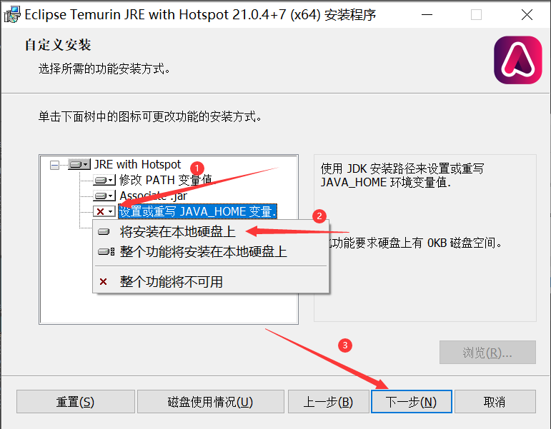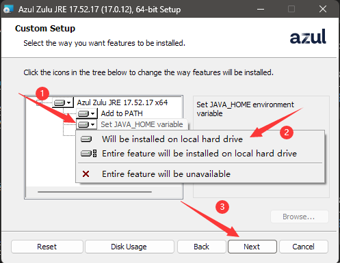
:::

下面为您另提供一些常用版本的 Windows 安装包下载链接，这些版本的主要区别是出品公司，请根据你的信任选择：

#### Adoptium

由 Eclipse 开源基金会创建、阿里巴巴、华为、IBM 等参与的 Java 环境项目。

| Java 8 | Java 17 | Java 21 |
| --- | --- | --- |
| [下载链接](https://adoptium.net/zh-CN/temurin/releases/?os=windows&arch=x64&package=jre&version=8)<br>点击 `.msi` 下载 | [下载链接](https://adoptium.net/zh-CN/temurin/releases/?os=windows&arch=x64&package=jre&version=17)<br>点击 `.msi` 下载 | [下载链接](https://adoptium.net/zh-CN/temurin/releases/?os=windows&arch=x64&package=jre&version=21)<br>点击 `.msi` 下载 |

#### Zulu

由知名 Java 开发企业 Azul 制作的 Java 环境安装包。

| Java 8 | Java 17 | Java 21 |
| --- | --- | --- |
| [下载链接](https://www.azul.com/downloads/?version=java-8-lts&os=windows&architecture=x86-64-bit&package=jre#zulu)<br>点击 `Download` - `.msi` 下载 | [下载链接](https://www.azul.com/downloads/?version=java-17-lts&os=windows&architecture=x86-64-bit&package=jre#zulu)<br>点击 `Download` - `.msi` 下载 | [下载链接](https://www.azul.com/downloads/?version=java-21-lts&os=windows&architecture=x86-64-bit&package=jre#zulu)<br>点击 `Download` - `.msi` 下载 |

#### Microsoft Build of OpenJDK

由微软制作的 Java 环境安装包。

| Java 8 | Java 17 | Java 21 |
| --- | --- | --- |
| 不提供 | [下载链接](https://learn.microsoft.com/zh-cn/java/openjdk/download#openjdk-17)<br>选择 `Windows X64 msi` 下载 | [下载链接](https://learn.microsoft.com/zh-cn/java/openjdk/download#openjdk-21)<br>选择 `Windows X64 msi` 下载 |

#### Dragonwell

由阿里巴巴维护的 Java 环境。不提供一键安装包，有意尝试请下载解压后配置 Java 路径。

| Java 8 | Java 17 | Java 21 |
| --- | --- | --- |
| [官网](https://dragonwell-jdk.io/)<br>不提供安装包 | [官网](https://dragonwell-jdk.io/)<br>不提供安装包 | [官网](https://dragonwell-jdk.io/)<br>不提供安装包 |

### 准备服务端核心 {#prepar-core}

::: warning
按照教程进行以下下载、安装、运行服务器操作代表您已经同意 [Minecraft 最终用户许可协议 (“EULA”)](https://www.minecraft.net/zh-hans/eula) 以及 [Microsoft 隐私声明](https://go.microsoft.com/fwlink/?LinkId=521839)
:::

::: tip
由于服务端核心数量和分支极多，此处仅列出部分核心
:::

请先确认您需要的服务器核心类型：

#### 原生 (Vanilla) 核心

由 Mojang 提供的官方服务器核心

具有以下特性：

- 支持所有的原版特性，包括 `0tick` 等特殊的游戏特性
- 支持以数据包扩展游戏内容
- 不支持任意类型的第三方插件或模组

下载方式：

您可以在 [Minecraft 官网](https://www.minecraft.net/zh-hans/download/server) 点击 `minecraft_server.xx.xx.jar` 下载到最新 [正式版](https://zh.minecraft.wiki/w/Java%E7%89%88%E7%89%88%E6%9C%AC%E8%AE%B0%E5%BD%95#%E6%AD%A3%E5%BC%8F%E7%89%88) 服务端 jar 文件。

您可以在 [MCVersions](https://mcversions.net/)、[FastMirror](https://www.fastmirror.net/#/download/Vanilla?coreVersion=release) 等镜像站下载到其他版本的服务端 jar 文件。

#### 插件 (Plugin) 类核心

具有以下特性：

- 支持以数据包和服务端插件的形式扩展游戏内容
- 不支持任意类型的模组

其中，插件类核心还具体分为：

[CraftBukkit](https://bukkit.org/)

- 支持通过 BukkitAPI 运行的插件
- 性能无任何改进

[Spigot](https://www.spigotmc.org/)

- 支持通过 BukkitAPI 或 SpigotAPI 运行的插件
- 包含一些优化，性能较佳

::: tip
由于 CraftBukkit 和 Spigot 安装（构建）方法较为复杂，此处仅做介绍，不教学使用方法
:::

[Paper](https://papermc.io/)

- 支持大部分通过 BukkitAPI、SpigotAPI、PaperAPI 运行的插件
- 包含更多优化，性能更佳
- 修复了一些原版特性，包括 `0tick` 和部分刷物品刷方块的修复

您可以在 Paper 官网的 [Build Explorer](https://papermc.io/downloads/all) 下载 Paper 核心

您也可以在 [Fastmirror](https://www.fastmirror.net/#/download/Paper) 镜像站下载 Paper 核心

#### 模组 (Mod) 类核心

具有以下特性：

- 支持以数据包和模组的形式扩展游戏内容
- 不支持任意类型的插件

其中，模组类核心还具体分为：

[MinecraftForge](https://minecraftforge.net/)

- 历史悠久的模组框架，也被称作 `forge`
- 支持通过 MinecraftForgeAPI 运行的模组

您可以通过 [MinecraftForge 官网](https://files.minecraftforge.net/net/minecraftforge/forge/) 点击 `installer` 再点击右上角 `skip` 下载安装器

::: tip
MinecraftForge 官网的下载链接可能需要通过 adfoc 广告页面，请注意辨别页面真假，且有可能无法加载
:::

您也可以通过 [Fastmirror](https://www.fastmirror.net/#/download/Forge) 镜像站下载安装器

[NeoForge](https://neoforged.net/)

- 新兴模组框架
- 支持通过 NeoForgeAPI 运行的模组

您可以通过 [NeoForged Project Listing](https://projects.neoforged.net/neoforged/neoforge) 页面下载对应安装器

[Fabric](https://fabricmc.net/)

- 新兴模组框架
- 支持通过 Fabric Loader、FabricAPI 方式加载的模组

您可以通过 [Fabric 官网](https://fabricmc.net/use/installer/) 点击 `Download For Windows` 下载安装器

#### 混合类核心

::: tip
由于混合核心的复杂性，此处仅做介绍，不做下载安装教学
:::

具有以下特性：

- 支持以数据包、插件和模组的形式扩展游戏内容
- 由于其复杂性，对模组和插件的兼容都会有一定损失

其中，混合类核心还具体分为：

[Arclight](https://github.com/IzzelAliz/Arclight)

- 支持 MinecraftForge/NeoForge/Fabric (其一) + spigotAPI 的兼容方式

[Mohist](https://mohistmc.com/)

- 支持 MinecraftForge/Fabric (其一) + spigotAPI 的兼容方式

[CatServer](https://catmc.org/)

- 支持 MinecraftForge + spigotAPI 的兼容方式

### 安装核心 {#install-core}

不同核心有不同的安装方法。此处仅介绍部分核心的安装方式

::: tip
在开始之前，推荐您新建一个独立文件夹（并在安装的时候选择您新建的文件夹）供服务器使用。服务器运行过程中会生成大量文件，如果您在自己的工作或桌面文件夹启动服务器可能会造成一定混乱
:::

:::: tabs
@tab 官方服务器核心

原生核心无需安装，**请勿双击打开**，下载好后请查看文档下一节

@tab Paper

Paper 核心可以在启动过程中完成安装，**请勿双击打开**，直接参考以下文档完成启动过程

@tab MinecraftForge/NeoForge

MinecraftForge 和 NeoForge 的安装方法和安装界面较为相似，当您正确安装 java 环境后，双击启动安装器，可选择的选项如下：

<div class="natfrp-side-by-side"><div>

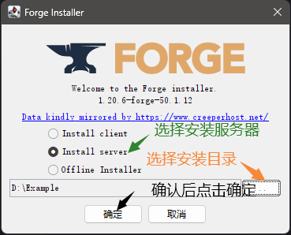

</div><div>

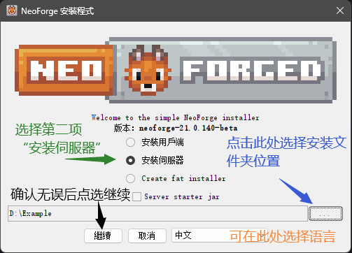

</div></div>

::: tip
由于网络环境不同，点击安装后可能需要一定时间下载依赖库和相关文件，请耐心等待
:::

当正确安装完成后，您可以看到如下界面：

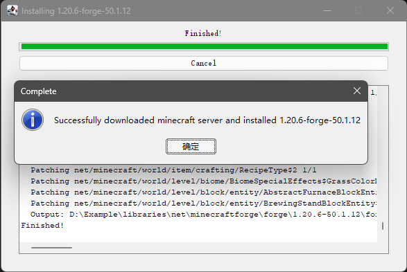

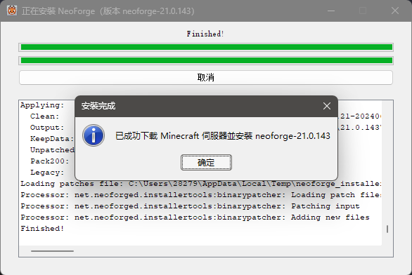

::: tip
如果显示 `build failed` 或者其他失败图标，请尝试多试几次，或在 [sakura交流群](/index.md#community) 中的水群提问，官方群不受理此类问题
:::

@tab Fabric

当您正确安装 java 环境后，双击启动安装器，可选选项如下：

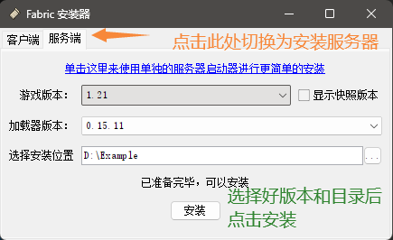

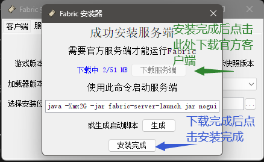

::::

### 运行服务端 {#run_server}

在此教程中，我们仅教给您基础的使用批处理脚本启动服务器的方式，如您使用面板或者开服软件启动，请自行寻找相关文档。

#### 前提要求

在继续教学之前，您需要启用文件扩展名以方便您更改文件类型。请选择适合您的系统的教程：

:::: tabs

@tab Windows 11

如图所示，勾选上 `文件扩展名` 选项

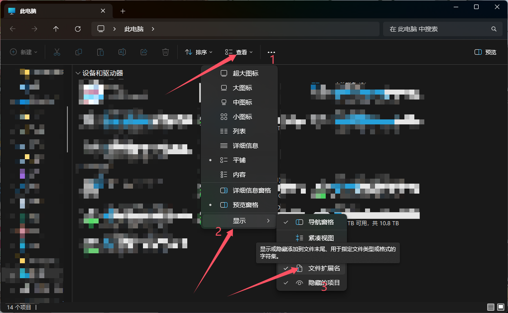

@tab Windows 10

如图所示，勾选上 `文件扩展名` 选项

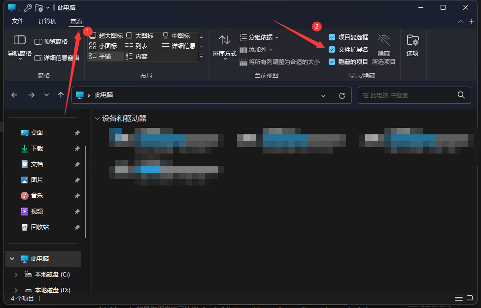

::::

#### 确认 Java 环境版本

首先，我们需要确认您电脑上的 Java 环境已经正确安装并且可以正常使用。

您可以通过按 Win+R 按键唤出一个 `运行` 窗口，在窗口中输入 `cmd` 并点击确认或回车，即可唤出命令提示符窗口。

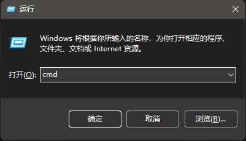

在这个黑色的命令提示符窗口中，输入 `java -version` 并回车就会输出当前的默认 Java 环境版本。

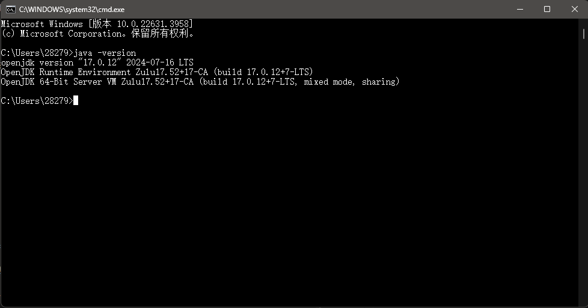

在这张图中，输出结果为：

``` txt
openjdk version "17.0.12" 2024-07-16 LTS
OpenJDK Runtime Environment Zulu17.52+17-CA (build 17.0.12+7-LTS)
OpenJDK 64-Bit Server VM Zulu17.52+17-CA (build 17.0.12+7-LTS, mixed mode, sharing)
```

在此，我们仅需要注意第一行：被双引号包起来的 `17.0.12` 代表目前默认 Java 版本为 Java17。您需要确保显示的 Java 版本为您 [需要的版本](#install-java) 。

另外需要注意的是，Java8 的版本号可能会显示为 `1.8.*` 或 `1.8.0_*` 格式。

#### 编写启动变量

::: tip
本节内容为了容易理解简化了很多内容，语言表示可能并不严谨
:::

在此之前，希望您能清楚您系统中 `物理运行内存` 的大小。如果您不知道，请尝试寻求他人的帮助或询问电脑厂商客服。

对于启动服务器的需求而言，我们需要的有以下变量：

`Xmx` 和 `Xms` 。其中，`Xmx` 指定了服务器能占用您电脑上的最大内存数量，而 `Xms` 则指定了服务器占用内存的最小量。由于 Java GC 的复杂性和各种原因，在此您只需要理解一件事：将 `Xmx` 和 `Xms` 设为相同可以提高性能。

如何设置这个参数取决于您启动游戏后还有多少内存。一般情况下，如果您有 16G 的运行内存，启动游戏后还剩 6G ，那么可以将服务器占用内存设为 4G 。此时，您的启动变量看起来像这样：

`-Xmx4G -Xms4G`

另外，我们需要一个额外的 `jar` 参数告诉 Java 我们想要启动的文件为 jar 打包的文件。加上这个参数之后您的启动变量看起来像这样：

`-Xmx4G -Xms4G -jar`

::: warning
请注意，此处的内存参数 **并不是** 越大越好！如果您设置的参数超出了您可用的剩余内存，则服务器会在请求更多内存时 **立刻崩溃** ！
:::

#### 编写启动脚本

根据不同的服务器核心，下一步您需要进行的操作有所不同。请根据您所使用的服务器核心选择教程：

:::: tabs

@tab 官方原生核心

官方核心下载后默认文件名为 `server.jar` 。将其移动到您准备用来开服的文件内，并新建一个文本文件。

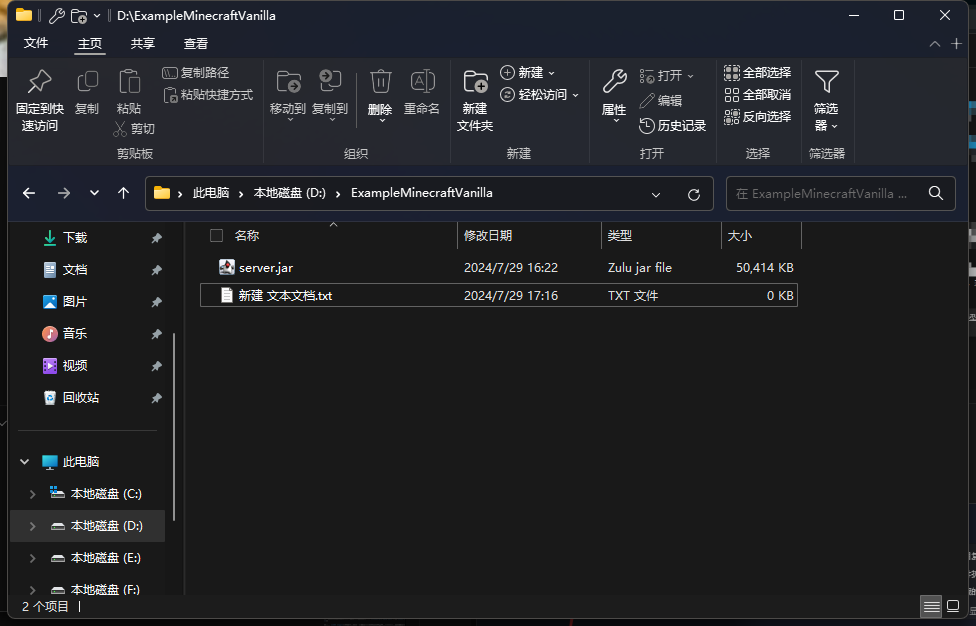

打开您新建的文本文件，在其中写入以下内容

``` bat
java "您在上一节获得的启动变量" "服务器核心文件名称"  
@pause
```

例如，您在上一节编写了 `-Xmx4G -Xms4G -jar` 的启动变量，且您没有更改下载的服务器核心名称，则文件中应该写入以下内容：

``` bat
java -Xmx4G -Xms4G -jar server.jar
@pause
```

保存文件，将文件名 `新建 文本文档.txt` 改为 `启动服务器.bat` ，观察文件类型是否更改为批处理文件。

@tab MinecraftForge

对于 MinecraftForge ，安装器已经在安装时生成了启动脚本和对应的文件。刚刚安装完成的目录看起来应该如下：

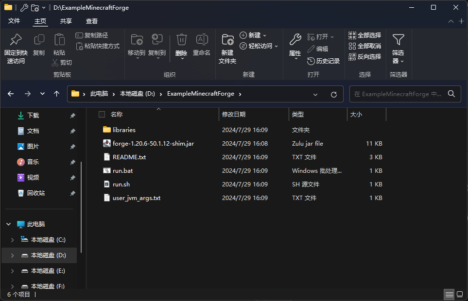

您只需将您获得的启动变量 **去掉`-jar`选项** 之后覆盖掉 `user_jvm_args.txt` 文件的最后一行。例如：

``` txt
# Note: Not all server panels support this file. You may need to set these options in the panel itself.

# Xmx and Xms set the maximum and minimum RAM usage, respectively.
# They can take any number, followed by an M (for megabyte) or a G (for gigabyte).
# For example, to set the maximum to 3GB: -Xmx3G
# To set the minimum to 2.5GB: -Xms2500M

# A good default for a modded server is 4GB. Do not allocate excessive amounts of RAM as too much may cause lag or crashes.
# Uncomment the next line to set it. To uncomment, remove the # at the beginning of the line.
-Xmx4G -Xms4G
```

保存之后，文件夹内的 `run.bat` 文件即为您的启动脚本。

@tab NeoForge

类似于 MinecraftForge ，对于 NeoForge ，安装器已经在安装时生成了启动脚本和对应的文件。

您只需将您获得的启动变量 **去掉`-jar`选项** 之后覆盖掉 `user_jvm_args.txt` 文件的最后一行。例如：

``` txt
# Xmx and Xms set the maximum and minimum RAM usage, respectively.
# They can take any number, followed by an M or a G.
# M means Megabyte, G means Gigabyte.
# For example, to set the maximum to 3GB: -Xmx3G
# To set the minimum to 2.5GB: -Xms2500M

# A good default for a modded server is 4GB.
# Uncomment the next line to set it.
-Xmx4G -Xms4G
```

保存之后，文件夹内的 `run.bat` 文件即为您的启动脚本。

@tab Fabric

FabricLoader 安装器会在文件夹内生成一个启动用 jar 文件 `fabric-server-launch.jar` ，如果您按照我们的教程在退出安装器前点击了下载服务器文件，那么您应该同时看到 `server.jar` 在同一个文件夹内。  
如果您看到的是 `server.jar.tmp` ，则说明您在安装器还没下载完成时就退出了安装器，请重新回到安装器再次安装。

在您安装的文件夹内新建一个文本文件，文件夹内应该看起来像这样：

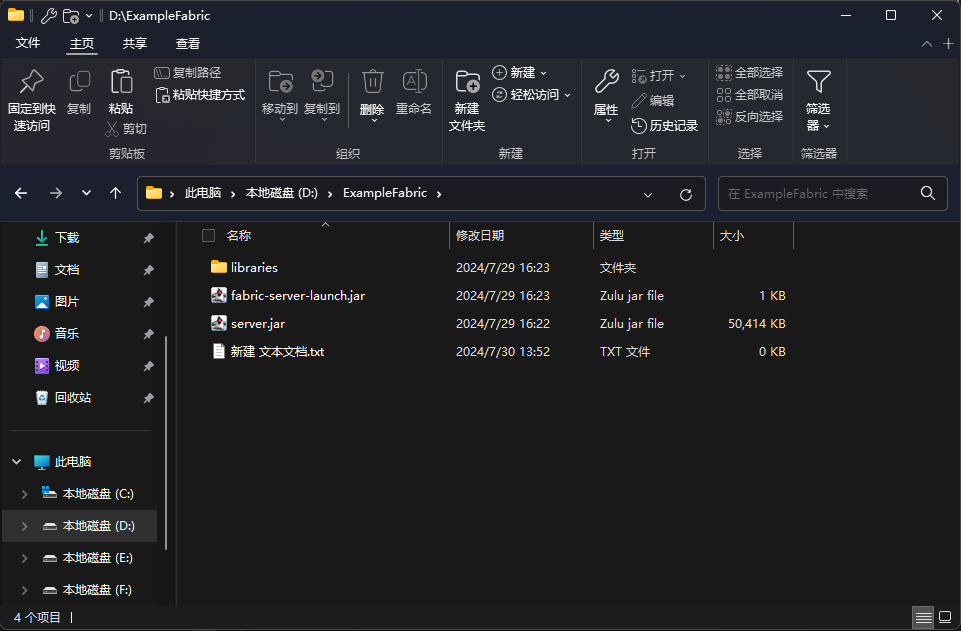

打开您新建的文本文件，在其中写入以下内容

``` bat
java "您在上一节获得的启动变量" "服务器核心文件名称"  
@pause
```

例如，您在上一节编写了 `-Xmx4G -Xms4G -jar` 的启动变量，且您没有更改下载的服务器核心名称，则文件中应该写入以下内容：

``` bat
java -Xmx4G -Xms4G -jar fabric-server-launch.jar
@pause
```

保存文件，将文件名 `新建 文本文档.txt` 改为 `启动服务器.bat` ，观察文件类型是否更改为批处理文件。

@tab Paper

Paper 的核心下载好后默认以 `paper-游戏版本号-Paper版本号` 的形式命名，如 `paper-1.21-119.jar` 代表您下载的是适用于 Minecraft 1.21 的 Paper 核心，版本号 119 。

在您打算运行服务器的文件夹内新建一个文本文件，文件夹内应该看起来像这样：

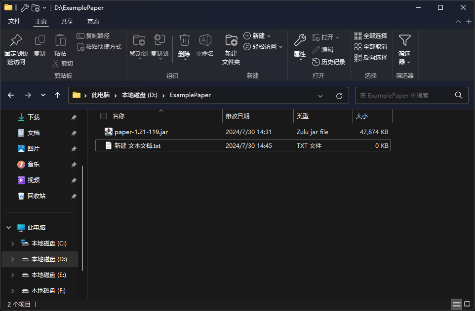

打开您新建的文本文件，在其中写入以下内容

``` bat
java "您在上一节获得的启动变量" "服务器核心文件名称"  
@pause
```

例如，您在上一节编写了 `-Xmx4G -Xms4G -jar` 的启动变量，且 Paper 服务器核心名称为 `paper-1.21-119.jar` ，则文件中应该写入以下内容：

``` bat
java -Xmx4G -Xms4G -jar paper-1.21-119.jar
@pause
```

保存文件，将文件名 `新建 文本文档.txt` 改为 `启动服务器.bat` ，观察文件类型是否更改为批处理文件。

::::

#### 最终用户许可协议

::: warning
按照教程进行以下修改文件操作代表您已经同意 [Minecraft 最终用户许可协议 (“EULA”)](https://www.minecraft.net/zh-hans/eula) 以及 [Microsoft 隐私声明](https://go.microsoft.com/fwlink/?LinkId=521839)
:::

运行一次您的启动脚本 `启动服务器.bat` 或者 `run.bat` ，在一段时间后窗口最后一行即会显示

``` log
[**:**:** INFO]: You need to agree to the EULA in order to run the server. Go to eula.txt for more info.
请按任意键继续. . .
```

此时，您需要通过修改 eula 文件的形式来表示您同意 [Minecraft 最终用户许可协议 (“EULA”)](https://www.minecraft.net/zh-hans/eula) 以继续运行服务器。

按下任意按键即可关闭服务器窗口。查看服务器文件夹，您会发现目录下多了一个 `eula.txt` 文件，打开它，将其最后一行的 `eula=false` 改为 `eula=true` ，保存。

#### 修改配置

按需调整服务器配置文件，例如 [server.properties](https://zh.minecraft.wiki/w/Server.properties)。

将您下载或所需要的模组、插件放到服务器对应目录中。一般来说， `plugins` 文件夹存放插件， `mods` 文件夹存放模组。

如果您打算重置这个服务器的存档和玩家数据，但是不打算更改服务器配置，您可以选择删除文件夹内的 `world` 文件夹以及所有 `world` 开头的文件夹。

此时再次打开启动脚本，服务器即开始启动。当您看到窗口输出最后一行出现 `>` 标记时，说明服务器已经 **部分** 载入完毕，您可以直接对窗口输入命令。

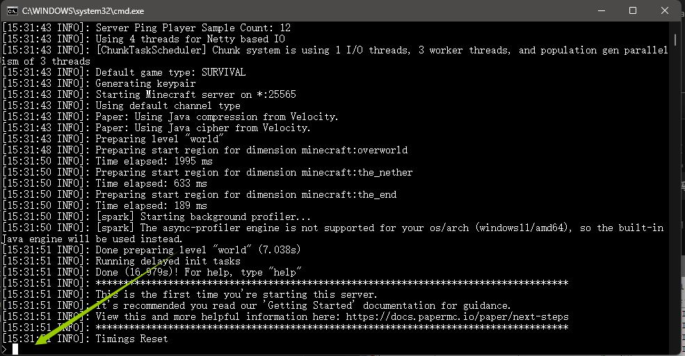

启动完成后，服务器会输出 `Done (**.***s)! For help, type "help"` 的一行日志，看到这行日志说明您的服务器已经全部载入完毕，可以进入游玩了。

启动完成后，您可能会看到两个窗口，一个黑色 `命令提示符` 窗口，一个白色 `Minecraft server` 窗口。需要注意的是：两个窗口都是服务器，关闭 **任意一个** 都会停止服务器的运行。

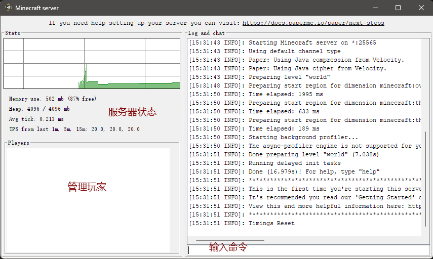

没有这个窗口也是正常的，部分服务器核心为了防止混乱去除了此窗口。

如果您想关闭服务器，请在任意窗口中输入 `stop` 命令并回车发送，服务器就会开始关闭并保存存档数据。当您看到 `请按任意键继续. . .` 的提示，按任意键即可关闭服务器窗口。

#### 配置内网穿透

请参考 [创建隧道](#create-tunnel) 一节。

### 注意事项 {#server-tips}

如果您无意间在服务器运行的黑色窗口 `命令提示符` 上点击了，命令提示符窗口将会进入选中状态。在此状态下，服务器将会冻结且无法运行。命令提示符的标题将会增加一个 `选择` 在最前方。

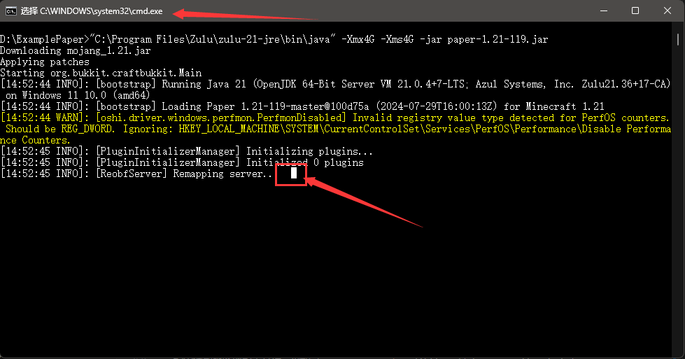

如果您不小心选中了文本，右键即可取消此状态。

::: tip
右键同时还会将您剪切板的内容黏贴到服务器命令行中，请注意确认相关操作不会影响您服务器的安全。
:::

您可以通过以下设置防止此事件的发生：

点击命令提示符窗口左上角的图标，选择属性

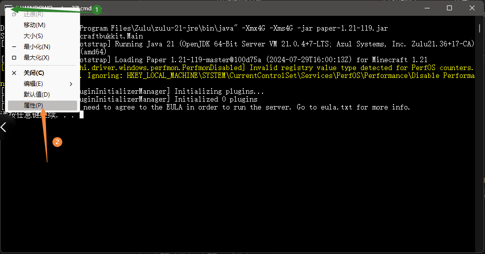

取消掉 `快速编辑模式` 的勾选

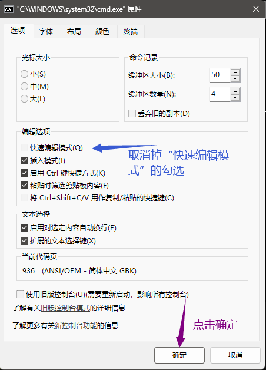

## 设置 SRV 解析 {#srv}

::: tip
设置 SRV 解析 只是为了美观，**并非必须**。设置后，在游戏中添加服务器时，无需填写端口号  
配置 SRV 记录后使用 `ping` 命令是 **无法测试** 连通性的，但是在游戏中填上就可以正常使用  
需要留意的是，**只有 Minecraft Java 版支持解析 SRV 记录**，基岩版并不支持此特性
:::

这一节文档会教您如何在部分域名注册商的面板中为 **Minecraft Java 版** 配置 **SRV 解析**。

要进行 **SRV 解析**，您就必须要有一个域名，本文档不会推荐您使用哪个注册商的域名，请自己选择。

如果您正在使用文档未覆盖到的注册商，并且会在对应面板中进行 **SRV 解析**，欢迎点击页面底部的编辑按钮帮助我们完善该文档。

:::: tabs

@tab SakuraFrp 子域绑定

您可以参阅 [子域绑定说明](/bestpractice/domain-bind.md) 为您的 MC 服务获取一个形如 `*.u123456.nyat.app` 的域名。

@tab 阿里云

点击 [这里](https://dc.console.aliyun.com/next/index#/domain/list/all-domain) 进入 **阿里云** 的 **域名列表**，如果您 **没有登录**，请登录

找到您想要进行 **SRV 解析的域名**，点击 **最后一栏** 操作中的解析


点击 **添加记录**


按下表进行填写，然后点击 **确认** 即可

| 字段     | 填写内容                | 说明                                       |
| -------- | ----------------------- | ------------------------------------------ |
| 主机记录 | `_minecraft._tcp.xx`    | `xx` 可以自定义，亦可去除 `.xx`。          |
| 记录类型 | SRV                     |                                            |
| 记录值   | `0 5 远程端口 节点域名` | 例: `0 5 12345 idea-leaper-1.natfrp.cloud` |

保存完毕后需要 **等待** 10 分钟来让解析生效 (按照您设置的 **TTL** 来决定，一般为 10 分钟) 。

- **假设** 您的域名为: example.com，您的 **`.xx`** 设置为 `.sub`，那么在游戏中添加服务器时，使用 `sub.example.com` 地址即可连接。
- **假设** 您的域名为: example.com，您把 **`.xx`** 去掉了，那么在游戏中添加服务器时，使用 `example.com` 即可连接。

@tab 腾讯云 / DNSPod

> 腾讯云解析正在长期引导用户前往 DNSPod 控制台设置解析，故这里使用 **DNSPod 控制台** 作演示。腾讯云解析与之基本一致。

点击 [这里](https://console.dnspod.cn/dns/list) 进入 **DNSPod** 的解析列表，如果您没有登录，请先登录。


找到您要解析的域名，直接点击域名名称，以进入解析配置页面。


点击左上方的 “添加记录” ，然后按下表进行填写，完毕后点击 **确认** 即可。

| 字段     | 填写内容                | 说明                                       |
| -------- | ----------------------- | ------------------------------------------ |
| 主机记录 | `_minecraft._tcp.xx`    | `xx` 可以自定义，亦可去除 `.xx`。          |
| 记录类型 | SRV                     |                                            |
| 记录值   | `0 5 远程端口 节点域名` | 例: `0 5 12345 idea-leaper-1.natfrp.cloud` |

保存完毕后需要 **等待** 10 分钟来让解析生效 (按照您设置的 **TTL** 来决定，一般为 10 分钟) 。

- **假设** 您的域名为: example.com，您的 **`.xx`** 设置为 `.sub`，那么在游戏中添加服务器时，使用 `sub.example.com` 地址即可连接。
- **假设** 您的域名为: example.com，您把 **`.xx`** 去掉了，那么在游戏中添加服务器时，使用 `example.com` 即可连接。

@tab Cloudflare

点击 [这里](https://dash.cloudflare.com/) 进入 **Cloudflare** 的 **域名列表**，如果您 **没有登录**，请登录

找到您想要进行 **SRV 解析** 的域名，**点击它**


然后点击最顶上的 **第三个** DNS

点击 **添加记录**


按下表进行填写，然后点击 **保存** 即可

| 字段   | 填写内容   | 说明                             |
| ------ | ---------- | -------------------------------- |
| 类型   | SRV        |                                  |
| 名称   | 自定义     | 亦可填写 `@`                     |
| 服务   | _minecraft |                                  |
| 协议   | TCP        |                                  |
| 优先级 | 0          |                                  |
| 权重   | 5          |                                  |
| 端口   | 远程端口   | 例: `12345`                      |
| 目标   | 隧道域名   | 例: `idea-leaper-1.natfrp.cloud` |


保存完毕后需要 **等待** 10 分钟来让解析生效 (按照您设置的 **TTL** 来决定，一般为 10 分钟) 。

- **假设** 您的域名为: example.com，您的 **名称** 设置为 `sub`，那么在游戏中添加服务器时，使用 `sub.example.com` 地址即可连接。
- **假设** 您的域名为: example.com，您的 **名称** 设置为 `@`，那么在游戏中添加服务器时，使用 `example.com` 即可连接。

::::
