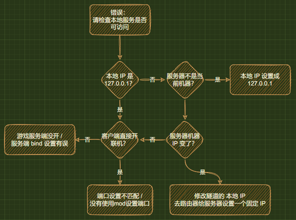
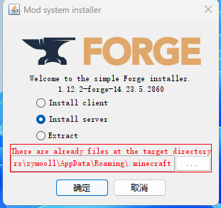

# 我的世界(Minecraft) 局域网联机穿透指南

::: warning 非官方文档
SakuraFrp 不提供 Minecraft 服务器相关帮助，本文档主要由社区用户维护  
如果您有相关问题建议到 [MCBBS 你问我答板块](https://www.mcbbs.net/forum-multiqanda-1.html) 提问
:::

## 常见问题 {#faq}

::: details 我还是进不去服务器 / 用不了 / 进服时报 XXX 错误怎么办


:::

::: details 第一次开服能用，怎么现在就不行了 / 报错 “请检查本地服务是否可访问”



:::

## 基岩版或 Geyser 联机和开服 {#bedrock}

请参阅 [Minecraft 基岩版开服指南](/offtopic/mc-bedrock-server.md) | [Geyser 互通开服指南](/offtopic/mc-geyser.md) 以开启服务器

## Java 版局域网联机 {#java}

Minecraft 局域网联机穿透通常需要安装 Mod 辅助，下面是装与不装的区别:

- 不装辅助 Mod: 适用于同类型已验证账号之间的联机 (如正版和正版、外置和外置)
- 安装辅助 Mod (推荐): 适用于离线账号或不同类型账号之间的联机，如不安装，则会出现 “无效会话” 问题

### 不装辅助 Mod {#java-no-mod}

进入要联机的存档，按下键盘上的 **ESC** 键，在出现的界面里找到 `对局域网开放` 之类的按钮并且点击进入，对 **其他玩家** 进行设置，然后点击 `创造一个局域网世界`

在聊天框里会提示 `本地游戏已在端口 xxxxx 上开启` ，这个 **五位数的端口号** 对应的是 **创建隧道** 里的 **本地端口**

::: tip
这个 **五位数的端口号** 并不固定，如果您想获取一个固定的端口号，就需要 **安装辅助 Mod**  
在 1.20.1+ 版本的游戏中，您可以在局域网联机界面输入端口号来让游戏在特定端口上开放。
:::


上图中，我们获取到的端口号为 `61259`

成功获取到端口号后，我们就可以开始 [创建隧道](/app/mc.html#%E5%88%9B%E5%BB%BA%E9%9A%A7%E9%81%93) 了。

### 安装辅助 Mod {#java-mod}

::: warning
通过辅助 Mod 关闭正版验证 **可能** 会改变玩家的 UUID 导致 **背包内物品和玩家数据丢失**，请关闭正版验证前 **备份存档**  
所有辅助 Mod 都 **不能** 互相兼容，请勿 **重复** 添加联机模组
请务必 **严格按照** 辅助 Mod 中的使用方法操作，**尤其是正版验证选项**
:::

请根据您的游戏版本展开下面的选项查看，下面提到的 Mod 都必须在 **联网** 条件下安装:

:::: details 游戏版本: Forge: 1.15.2 ~ 1.20.2, Fabric: 1.15.2 ~ 1.20.2, Quilt: 1.15.2 ~ 1.20.1

- Mod 名称: LAN World Plug-n-Play (mcwifipnp)  
- Mod 部分功能:
  1. 固定端口
  2. 开关正版验证
  3. 更多对其他人的自定义功能
  4. 通过uPnP功能进行联机
- 下载链接: [mcmod](https://www.mcmod.cn/download/4498.html) | [modrinth](https://modrinth.com/mod/mcwifipnp/versions) | [Curseforge](https://www.curseforge.com/minecraft/mc-mods/mcwifipnp/files) 

#### 使用方法

1. 安装 Mod 并进入游戏，打开您要联机的 **存档**
2. 按下键盘上的 **ESC** 键，在出现的界面里找到 `对局域网开放` 之类的按钮并且点击进入
3. 对 **其他玩家** 进行设置，同时安装此 Mod 后 **设置局域网世界** 界面后会增加下列选项，请按需配置:
   - 端口号: *随机五位数*
     `在此框内输入端口号即可固定端口，此端口对应的就是创建隧道里的本地端口`
   - 允许玩家数: 10
     `允许的最大在线玩家数`
   - 服务器信息: A Minecraft LAN World
     `即为 MOTD 。对应其他人在多人游戏列表里看到的服务器介绍`
   - **正版验证: 开/关**
     `关闭可以让离线账号玩家或其他账号和您联机`
   此模组的其他功能请在游戏内将鼠标指针指向按钮获得详细提示。

::: tip
这个模组在使用的时候会在聊天栏提示 “端口映射失败，请使用内网映射软件” “获取IP成功：内网IPv4” 等其他功能的运行状态，如果您没有公网IP的话请 **忽略** 这些提示。  
您的客机需要连接的IP会输出在启动器或frpc的日志中。
:::

4. 点击 `创建局域网世界`，在聊天栏中会提示 `本地游戏已在端口 xxxxx 上开启`，这个五位数的端口号就会固定为您设置的端口号。对应您在创建隧道时的本地端口选项。

::::

:::: details 游戏版本: Forge: 1.12.X ~ 1.20.2, fabric: 1.16.1 ~ 1.20.2

::: tip
此模组有部分版本可能会有不兼容问题，详情参考 [mcmod](https://www.mcmod.cn/class/2754.html) 模组页面下方的注意列表。
:::

> 此 Mod 在游戏版本 1.16.5 + 高版本 Java 运行时会[出现问题](https://github.com/rikka0w0/LanServerProperties/issues/15)，如果您需要 1.16.5，请使用 Java 8/11

- Mod 名称: LanServerProperties  
- Mod 部分功能:
  1. 固定端口
  2. 开关正版验证
- 下载链接: [mcmod](https://www.mcmod.cn/download/2754.html) | [Github](https://github.com/rikka0w0/LanServerProperties) | [Curseforge](https://www.curseforge.com/minecraft/mc-mods/lan-server-properties/files) 

#### 使用方法

1. 安装 Mod 并进入游戏，打开您要联机的 **存档**
2. 按下键盘上的 **ESC** 键，在出现的界面里找到 `对局域网开放` 之类的按钮并且点击进入
3. 对 **其他玩家** 进行设置，同时安装此 Mod 后 **设置局域网世界** 界面后会增加下列选项，请按需配置:
   - **在线模式: 开/关**  
     `关闭可以让离线账号玩家或其他账号和您联机`
   - 监听端口: 25565  
     `可以固定端口，监听端口对应的就是创建隧道里的本地端口`
4. 点击 `创造一个局域网世界`，在聊天框里会提示 `本地游戏已在端口 xxxxx 上开启`，这个 **五位数的端口号** 就会变成您设置的 **监听端口**


::: tip
在部分版本可能需要客户端也添加此模组才能加入利用此模组进行联机的主机。
:::

::::

:::: details 游戏版本: Forge: 1.7.X ~ 1.12.X, 1.13 ~ 1.20.X

- Mod 名称: Server.Properties for LAN
- Mod 功能:
  1. 玩家挂机多久后踢出
  2. 服务器资源包
  3. 固定端口
  4. 最大视距
  5. 是否开启正版验证
  6. 是否生成生物，最大玩家数
  7. 玩家之间是否可以造成伤害
  8. 是否开启白名单
  9. 是否生成村民
  10. 最大建筑高度
  11. Motd设置
- 下载链接 (1.7.X ~ 1.12.X): [CurseForge](https://www.curseforge.com/minecraft/mc-mods/server-properties-for-lan/files/all) | [MC百科](https://www.mcmod.cn/download/1158.html)
- 下载连接 (1.13 ~ 1.20.X): [Github](https://github.com/shuen4/MinecraftForge-Mods-ServerPropertiesLAN/releases/latest)
- 下载链接 (全版本，搬运有延迟，无法访问以上网站再考虑): [MeteorMC](https://meteormc.cn/threads/53/)

#### 使用方法

1. 安装 Mod 并进入游戏，打开您要联机的 **存档** (必须要先打开一次存档才会生成 `server.properties` 文件)
2. 打开 **存档文件夹** 里的 `server.properties` 文件进行编辑，下面有对各个选项的翻译

   ::: tip
   **ESC** - **选项** - **资源包** - **打开资源包文件夹**  
   **返回上一级** - **打开saves文件夹** - **找到您要联机的存档的名字并双击进入**  
   里面有一个 `server.properties` 文件，请使用文本编辑器软件打开。  
   建议使用 [Visual Studio Code](https://code.visualstudio.com/) 或者 [Sublime Text 3](http://www.sublimetext.com/) 等专业文字编辑器
   :::

   

3. 编辑完成后重新打开地图即可刷新配置

   ::: tip
   `server.properties` 文件编辑完以后下一次使用 **这个存档** 联机就不用再次编辑了  
   如果 **换了个存档** 联机，就需要 **重新编辑** 或者复制之前的配置过来  
   您也可以编辑 config 文件夹（与 save 文件夹同级）中的 serverGlobalConfig.properties 文件，里面的参数会影响 **以后新建的存档**
   :::

4. 现在请参考 [不装辅助 Mod](#java-no-mod) 一节开启局域网联机

#### server.properties 配置文件部分选项翻译如下

  ::: tip
  [Minecraft Wiki](https://zh.minecraft.wiki/w/Server.properties#Java%E7%89%88_3) 中有对所有配置文件选项更详细的翻译
  :::

```properties
player-idle-timeout=<Int>
# 玩家挂机多久后踢出
# 0为禁止该功能

resource-pack=
# 服务器资源包 (没有请留空) 

port=<Int>
# 端口，对应Frp设置中的本地端口
# 0为随机

max-view-distance=<Int>
# 最大视距
# 0为不限制

online-mode=<Boolean>
# 是否开启正版验证
# "true"(真)为开启, "false"(假)为关闭
# 如果要和非正版玩家，请关闭

spawn-animals=<Boolean>
# 是否生成生物
# "true"(真)为开启, "false"(假)为关闭

pvp=<Boolean>
# 玩家之间是否可以造成伤害
# "true"(真)为开启, "false"(假)为关闭

max-players=<Int>
# 最大玩家数

white-list=<Boolean>
# 是否开启白名单
# "true"(是)为开启, "false"(否)为关闭

spawn-npcs=<Boolean>
# 是否生成村民
# "true"(是)为开启, "false"(否)为关闭

max-build-height=<Int>
# 最大建筑高度
# 不能超过游戏限制 (低版本为256)

resource-pack-sha1=
# 资源包哈希 (没有请留空) 

motd=
# Motd设置
# 默认会生成一个，可以自己设置
```

::::

### 创建隧道

当您获取到了 **本地端口** 后，您就可以开始 **创建隧道** 了

隧道配置如下：
  - 隧道名称：填上您对此隧道的命名
  - 隧道类型：`TCP 隧道`
  - 本地 IP：`127.0.0.1`
  - 本地端口：您在以上章节获取的本地端口号

如非必要，其他设置保持默认。

::: tip
设置完后开启隧道，日志中会出现一行 “使用 \[frp-xxx.top:xxxxx\] 来连接到你的隧道” 的提示，客机使用这个连接 (frp-xxx.top:xxxxx) 来加入游戏。
:::

## Java 版服务器 {#java_server}

::: tip
这里指的 Java 版服务器是指 Java 版 Minecraft 的 Server 版本（例如 Bukkit Spigot 等），这里不是你能在启动器中下到的版本！

如果服务器需要无人值守，可能需要设置一些开机自启项。
:::

### 使用方法

#### 0x01: 安装好对应版本的 Java

推荐按照下述表格安装。

| 服务端 | 推荐的 Java 版本 | 建议的下载地址 |
| :---: | :---: | :---: |
| 1.17 前的 Forge 服务端</br>或 1.12 前的其他服务端  | Java 8 | [Java 官网](https://www.java.com/zh-CN/download/) |
| 其他服务端 | Java 21 | [微软构建的 Openjdk21](https://learn.microsoft.com/zh-cn/java/openjdk/download) |

按照安装指引安装 Java。

::: tip
如果你的服务器需要切换 Java 版本，尝试指定运行使用的 Java 可执行文件（即不使用环境变量，改用绝对路径指定）。
:::

#### 0x02: 初始化服务端

请首先务必确认好你需要开的服务器类型（纯净服，插件服，Mod 服）。

##### 0x02-1: 纯净服

你可以前往 [MCVersions](https://mcversions.net/) 或者 MCBBS 找到官方的服务端。

此类服务器无特殊初始化过程，可以直接跳转至下一步。

##### 0x02-2: 插件服

比较常用的插件服务端有 Spigot，Bukkit 等，具体区别请自行 Baidu，在此不做赘述。

前往对应官网下载插件服的服务端。

此类服务器无特殊初始化过程，可以直接跳转至下一步。

##### 0x02-3: Forge Mod 服

前往 [Forge 官网](https://files.minecraftforge.net/net/minecraftforge/forge/) 下载对应版本的 Forge 服务端。

运行下载下来的 Forge 服务端，你会看到如下界面：



选择第二项 `Install Server`，下方 `...` 点击后选择你开服的工作目录。

等待安装完成。

##### 0x02-4: Fabric Mod 服

前往 [Fabric 官网](https://fabricmc.net/use/server/) 下载对应版本的 Fabric 服务端。

在**开服的工作目录**下运行下载下来的 Fabric 服务端。

不出意外的话，资源文件将会被自动下载好。

#### 0x03: 编写批处理文件

::: tip
在 Windows 下文件扩展名为 .bat，Linux 下是 .sh
:::

内容可以参照如下：

```bat
java -Xms2G -Xmx8G -server -jar ./XXX.jar nogui
```

其中 `-Xmx -Xms` 分别代表最大分配内存和初始分配内存，请按需调整。`./XXX.jar` 这里是相对路径表示的，这就要求该批处理文件同服务端处在同一目录下。如果不了解相对目录表示的话，建议使用绝对目录表示（即从根目录开始表示路径，例如 `C:\\MC\\server.jar`）

注意：Mod 服务器的 `-Xmx` 项建议设置不小于 4G。

#### 0x04: 同意 EULA 协议

运行一次批处理文件，此时你会发现程序立即退出，工作目录下多了一些文件，这里我们找到 `eula.txt`，在仔细阅读 Minecraft 的 EULA 文档（见 `eula.txt` 的最顶端）后，将其中的 `false` 字样改为 `true`。

::: tip
EULA 即 Minecraft 的用户许可协议，您在修改后即表示签署了该协议。
此认同行为表示认可 Mojang 附条件地授权您使用 Minecraft 服务端，如：
- 不得在服务器内容中包括违法、赌博、色情、暴力等。
- 利用 Minecraft 来从事营利性活动。
- 允许其他人以不公平或不合理的方式访问 Minecraft。

（详见 [Mincraft EULA](https://www.minecraft.net/zh-hans/eula)）
:::

#### 0x05: 最后的收尾工作

按需调整服务器配置文件，例如 `server.properties` 中的 `server-port`（默认为 25565）。

插件服和 Mod 服现在应该添加需要的插件及 Mod（见服务器工作目录下的 `./plugins` 和 `./mods`）。

再次运行批处理文件，第一次启动需要生成世界，可能较慢。

#### 0x06: 配置内网穿透

创建隧道（参见 [创建隧道](/app/mc.html#%E5%88%9B%E5%BB%BA%E9%9A%A7%E9%81%93)）。

一般来说这里的本地端口填写的就是你在 `server.properties` 中填写的 `server-port`。

愉快的开始联机吧 :)

## 设置 SRV 解析 {#srv}

::: tip
设置 SRV 解析 只是为了美观，**并非必须**。设置后，在游戏中添加服务器时，无需填写端口号  
配置 SRV 记录后使用 `ping` 命令是 **无法测试** 连通性的，但是在游戏中填上就可以正常使用  
需要留意的是，**只有 Minecraft Java 版支持解析 SRV 记录**，基岩版并不支持此特性
:::

这一节文档会教您如何在部分域名注册商的面板中为 **Minecraft Java 版** 配置 **SRV 解析**。

要进行 **SRV 解析**，您就必须要有一个域名，本文档不会推荐您使用哪个注册商的域名，请自己选择。

如果您正在使用文档未覆盖到的注册商，并且会在对应面板中进行 **SRV 解析**，欢迎点击页面底部的编辑按钮帮助我们完善该文档。

:::: tabs

@tab 阿里云

点击 [这里](https://dc.console.aliyun.com/next/index#/domain/list/all-domain) 进入 **阿里云** 的 **域名列表**，如果您 **没有登录**，请登录

找到您想要进行 **SRV 解析的域名**，点击 **最后一栏** 操作中的解析


点击 **添加记录**


按下表进行填写，然后点击 **确认** 即可

| 字段     | 填写内容                | 说明                                       |
| -------- | ----------------------- | ------------------------------------------ |
| 主机记录 | `_minecraft._tcp.xx`    | `xx` 可以自定义，亦可去除 `.xx`。          |
| 记录类型 | SRV                     |                                            |
| 记录值   | `0 5 远程端口 节点域名` | 例: `0 5 12345 idea-leaper-1.natfrp.cloud` |

保存完毕后需要 **等待** 10 分钟来让解析生效 (按照您设置的 **TTL** 来决定，一般为 10 分钟) 。

- **假设** 您的域名为: example.com，您的 **`.xx`** 设置为 `.sub`，那么在游戏中添加服务器时，使用 `sub.example.com` 地址即可连接。
- **假设** 您的域名为: example.com，您把 **`.xx`** 去掉了，那么在游戏中添加服务器时，使用 `example.com` 即可连接。

@tab 腾讯云 / DNSPod

> 腾讯云解析正在长期引导用户前往 DNSPod 控制台设置解析，故这里使用 **DNSPod 控制台** 作演示。腾讯云解析与之基本一致。

点击 [这里](https://console.dnspod.cn/dns/list) 进入 **DNSPod** 的解析列表，如果您没有登录，请先登录。


找到您要解析的域名，直接点击域名名称，以进入解析配置页面。


点击左上方的 “添加记录” ，然后按下表进行填写，完毕后点击 **确认** 即可。

| 字段     | 填写内容                | 说明                                       |
| -------- | ----------------------- | ------------------------------------------ |
| 主机记录 | `_minecraft._tcp.xx`    | `xx` 可以自定义，亦可去除 `.xx`。          |
| 记录类型 | SRV                     |                                            |
| 记录值   | `0 5 远程端口 节点域名` | 例: `0 5 12345 idea-leaper-1.natfrp.cloud` |

保存完毕后需要 **等待** 10 分钟来让解析生效 (按照您设置的 **TTL** 来决定，一般为 10 分钟) 。

- **假设** 您的域名为: example.com，您的 **`.xx`** 设置为 `.sub`，那么在游戏中添加服务器时，使用 `sub.example.com` 地址即可连接。
- **假设** 您的域名为: example.com，您把 **`.xx`** 去掉了，那么在游戏中添加服务器时，使用 `example.com` 即可连接。

@tab Cloudflare

点击 [这里](https://dash.cloudflare.com/) 进入 **Cloudflare** 的 **域名列表**，如果您 **没有登录**，请登录

找到您想要进行 **SRV 解析** 的域名，**点击它**


然后点击最顶上的 **第三个** DNS

点击 **添加记录**


按下表进行填写，然后点击 **保存** 即可

| 字段   | 填写内容   | 说明                             |
| ------ | ---------- | -------------------------------- |
| 类型   | SRV        |                                  |
| 名称   | 自定义     | 亦可填写 `@`                     |
| 服务   | _minecraft |                                  |
| 协议   | TCP        |                                  |
| 优先级 | 0          |                                  |
| 权重   | 5          |                                  |
| 端口   | 远程端口   | 例: `12345`                      |
| 目标   | 隧道域名   | 例: `idea-leaper-1.natfrp.cloud` |


保存完毕后需要 **等待** 10 分钟来让解析生效 (按照您设置的 **TTL** 来决定，一般为 10 分钟) 。

- **假设** 您的域名为: example.com，您的 **名称** 设置为 `sub`，那么在游戏中添加服务器时，使用 `sub.example.com` 地址即可连接。
- **假设** 您的域名为: example.com，您的 **名称** 设置为 `@`，那么在游戏中添加服务器时，使用 `example.com` 即可连接。

::::
