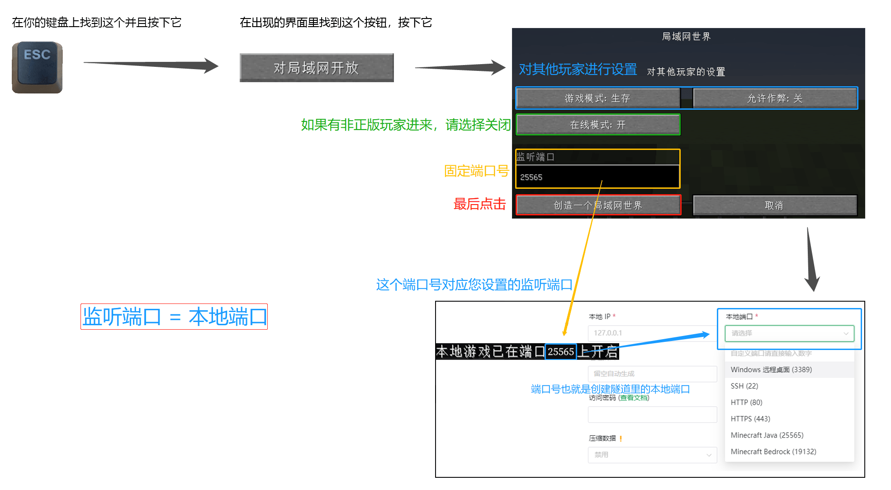

# 我的世界(Minecraft) 局域网联机穿透指南

::: warning 非官方文档
本文档主要由社区用户提供内容和维护，内容覆盖面较广，但可能仍未能覆盖到您的使用情况，请酌情参考。
:::

## 常见问题 {#faq}

::: details 我还是进不去服务器 / 用不了 / 进服时报 XXX 错误怎么办


:::

### 日志提示 “请检查本地服务是否可访问” {#connect-to-local-service-error}

1. Sakurafrp 与游戏房主的客户端或服务器处在同一设备?  
    如果是，请确定您的本地 IP 设为 `127.0.0.1` 。

2. 检查该日志是否出现在您 **未开启** 局域网或服务器时  
    例如：日志中提示

    ``` log
    2024/08/21 22:42:21 E Tunnel/XXX [XXX/XXX/XXX] 连接映射目标 [127.0.0.1:25565] 失败, 请检查本地服务是否可访问: dial tcp 127.0.0.1:25565: connectex: No connection could be made because the target machine actively refused it.
    ```

    如果在 `2024/08/21 22:42:21` 的时候您 **没有** 开启局域网，或者服务器尚未启动完毕，那么 **这一行** 日志您可以忽略掉，问题并不出在这里。

3. 开启局域网后依旧出现此报错  
    开启局域网后检查日志中是否有 `发现 Minecraft 局域网游戏, 本地 IP/端口 已经设置为: 127.0.0.1:XXX` 一行，如果没有请先尝试更新启动器。  
    如更新后还未出现此提示，可能是您使用的整合包或模组导致异常，您可以手动将本地端口设置为游戏提示的端口，  
    也可以尝试到 [sakura交流群、论坛](/index.md#community) 提问，提问时请尽量提供穿透节点、网络环境、游戏是否为整合包等信息，并注意隐私。

### 联机成功后游戏看起来卡顿或延迟极高 {#look-like-lag}

#### 可能原因

1. 服务器/主机性能不佳导致处理缓慢  
    检查 [调试屏幕](https://zh.minecraft.wiki/w/%E8%B0%83%E8%AF%95%E5%B1%8F%E5%B9%95) 页面的 `ms ticks` 项目是否有超过50ms，如果有即为主机性能不足或模组过多等原因。  
    注：当您不是主机时可能无法看到这一项，请使用其他方法查看 tps 或 mspt 等服务器性能指标。

2. 节点超载或节点到主机的网络的连接质量不佳  
    尝试检查 [节点状态](https://www.natfrp.com/tunnel/nodes) 页面并更换节点，如果全部节点都卡顿基本可以排除此问题。

3. 你的整合包对联机的兼容性不佳  
    尝试使用 [服务端](/offtopic/mc-java-server.md) 替代局域网联机。

4. 宽带上传速度不足  
    请自行使用各类测速网站检查你的带宽上传极限值为多高，一般情况下原版的正常游戏需要每人至少 1Mbps 平均带宽，2Mbps 峰值带宽。并且在添加有模组或数据包的情况下这个需求可能会成倍增长。

#### 如果你需要他人帮助

可以到 [sakura交流群、论坛](/index.md#community) 提问，提问时请尽量提供穿透节点、网络环境、游戏是否为整合包等信息，并注意隐私。

## 通过服务器联机 {#server}

对于基岩版用户，您可以参阅下列教程开启服务器并通过服务器进行联机：

- [基岩版开服指南](/offtopic/mc-bedrock-server.md)
- [Geyser 互通开服指南](/offtopic/mc-geyser.md)

对于 Java 版用户，您可以参阅下列教程开启 Java 版服务器：

- [Java 版开服指南](/offtopic/mc-java-server.md)

或者，您可以继续阅读下面的 Java 版局域网联机教程。

## Java 版局域网联机 {#java-lan}

::: warning
我们并不推荐您在长期游玩时使用 Minecraft 局域网联机 功能，  
使用 [独立服务端](/offtopic/mc-java-server.md) 可以为您提供更多的功能和更好的性能。

局域网联机并不能为您带来比开服更高的性能，其本质与开服无异，甚至可能 **优化更糟**。
:::

Minecraft 局域网联机穿透通常需要安装 Mod 辅助，  
关于是否需要辅助 Mod，下面给您一些简单的条件参考：

- 没有登录 皮肤站 或 正版账号，则需辅助 Mod
- 有玩家使用离线登录（直接在启动器内设置用户名），则需辅助 Mod
- 有玩家登录不同皮肤站的账号，则需辅助 Mod
- 所有人都是正版账号，不需辅助 Mod
- 所有人都登录皮肤站的账号，不需辅助 Mod

在需要辅助 Mod 时不使用，会出现 `登录失败: 无效会话 (请尝试重启游戏及启动器)` 问题。

### 不装辅助 Mod 的步骤 {#java-no-mod}

::: tip
如果您的小伙伴都是正版战士 / 皮肤站用户，您可以在不需要辅助 Mod 的情况下开始。
否则，请参考 [安装辅助 Mod 的步骤](#java-mod)
:::

进入要联机的世界，按下键盘上的 **ESC** 键，在出现的界面里找到 `对局域网开放` 之类的按钮并且点击进入，对 **其他玩家** 进行设置，然后点击 `创造一个局域网世界`。

在聊天框里会提示 `本地游戏已在端口 xxxxx 上开启` ，表示游戏内置服务端已经启动在这个端口上，这就是我们的本地端口。


例如上图中，我们可以看到的端口号为 `61259`，请记下端口号备用。

确定内置服务端已经启动后，我们就可以开始 [创建隧道](/app/mc.md#create-tunnel) 了。

### 安装辅助 Mod 的步骤 {#java-mod}

::: warning
通过辅助 Mod 关闭正版验证 **可能** 会改变玩家的 UUID 导致 **背包内物品和玩家数据丢失**，请在操作前 **备份存档**  
辅助 Mod 互相 **不兼容**，请勿 **重复** 添加联机模组  
请务必 **严格按照** 辅助 Mod 中的使用方法操作，**尤其是正版验证选项**
:::

请根据您的游戏版本点击下面之一的 Mod 展开详细说明，下面提到的 Mod 都必须在 **联网** 条件下安装:

某些整合包已经有联机 Mod，这可以通过您在游戏内尝试打开 `对局域网开放` 功能时是否有 `在线模式` 的配置来判断。  
如果有，请对号入座找到对应的 Mod 打开详细说明。

:::: details LAN World Plug-n-Play 适用游戏版本: Forge: 1.15.2 ~ 1.21.1, Fabric&Quilt: 1.15.2 ~ 1.21.1, NeoForge: 1.20.2 ~ 1.21.1

::: tip
这个模组在使用的时候会在聊天栏提示 “端口映射失败，请使用内网映射软件” “获取IP成功：内网IPv4” 等其他模组自带功能的运行状态，如果您没有公网IP的话请 **忽略** 这些提示。  
您的客机需要连接的IP会输出在启动器或frpc的日志中。
:::

- Mod 名称: LAN World Plug-n-Play (mcwifipnp)  
- Mod 部分功能:
  1. 固定端口
  2. 开关在线模式 (Online-mode)
  3. 更多对其他人的自定义功能
  4. 通过uPnP功能进行联机
- 下载链接: [mcmod](https://www.mcmod.cn/download/4498.html) | [modrinth](https://modrinth.com/mod/mcwifipnp/versions) | [Curseforge](https://www.curseforge.com/minecraft/mc-mods/mcwifipnp/files)

#### 使用方法

1. 安装 Mod 并进入游戏，打开您要联机的世界
2. 按下键盘上的 **ESC** 键，在出现的界面里找到 `对局域网开放` 之类的按钮并且点击进入
3. 安装此 Mod 后 **设置局域网世界** 界面会增加下列选项，请按需配置:
   - 端口号: *随机五位数*
     `在此框内输入端口号可固定端口`
   - 允许玩家数: 10
     `允许的最大在线玩家数`
   - 服务器信息: A Minecraft LAN World
     `即为 MOTD 。对应其他人在多人游戏列表里看到的服务器介绍`
   - **在线模式: 开/关**
     `关闭可以让离线账号玩家或其他账号和您联机`
   此模组的其他功能请在游戏内将鼠标指针指向按钮获得详细提示。
4. 点击 `创建局域网世界`，在聊天栏中会提示 `本地游戏已在端口 xxxxx 上开启`，表示游戏内置服务端已经启动，这个五位数的端口号会固定为您在上面输入框中设置的端口号。对应您在创建隧道时的本地端口选项。

::::

:::: details LanServerProperties 适用游戏版本: Forge: 1.12.X ~ 1.20.4 1.21, fabric: 1.16.1 ~ 1.20.4 1.21, NeoForge: 1.21

::: tip
此模组有部分版本可能会有不兼容问题，详情参考 [mcmod](https://www.mcmod.cn/class/2754.html) 模组页面下方的注意列表。  
此 Mod 在游戏版本 1.16.5 + 高版本 Java 运行时会[出现问题](https://github.com/rikka0w0/LanServerProperties/issues/15)，如果您需要在 1.16.5 上运行，请使用 Java 8/11 或使用上面的 mcwifipnp 模组。
:::

- Mod 名称: LanServerProperties  
- Mod 部分功能:
  1. 固定端口
  2. 开关正版验证
- 下载链接: [mcmod](https://www.mcmod.cn/download/2754.html) | [Github](https://github.com/rikka0w0/LanServerProperties/releases) | [Curseforge](https://www.curseforge.com/minecraft/mc-mods/lan-server-properties/files)

#### 使用方法

1. 安装 Mod 并进入游戏，打开您要联机的 **存档**
2. 按下键盘上的 **ESC** 键，在出现的界面里找到 `对局域网开放` 之类的按钮并且点击进入
3. 对 **其他玩家** 进行设置，同时安装此 Mod 后 **设置局域网世界** 界面后会增加下列选项，请按需配置:
   - **在线模式: 开/关**  
     `关闭可以让离线账号玩家或其他账号和您联机`
   - 监听端口: 25565  
     `可以设置固定端口`
4. 点击 `创造一个局域网世界`，在聊天框里会提示 `本地游戏已在端口 xxxxx 上开启`，表示游戏内置服务端已经启动，这个五位数的端口号会固定为您在上面输入框中设置的端口号。对应您在创建隧道时的本地端口选项。



::: tip
在部分版本可能需要客户端也添加此模组才能加入主机。
:::

::::

:::: details Server.Properties for LAN 适用游戏版本: Forge: 1.7.2 ~ 1.21

- Mod 名称: Server.Properties for LAN
- Mod 功能:
  1. 玩家挂机一段时间后踢出
  2. 服务器所需资源包
  3. 固定端口
  4. 最大视距
  5. 是否开启正版验证
  6. 是否生成生物，最大玩家数
  7. 玩家之间是否可以造成伤害
  8. 是否开启白名单
  9. 是否生成村民
  10. 最大建筑高度
  11. Motd设置
- 下载链接 (1.7.2 ~ 1.12.2): [CurseForge](https://www.curseforge.com/minecraft/mc-mods/server-properties-for-lan/files/all) | [MC百科](https://www.mcmod.cn/download/1158.html)
- 下载连接 (1.13 ~ 1.21): [Github](https://github.com/shuen4/MinecraftForge-Mods-ServerPropertiesLAN/releases/latest)

#### 使用方法

1. 安装 Mod 并进入游戏，打开您要联机的 **存档** (必须要先打开一次存档才会生成 `server.properties` 文件)
2. 打开 **存档文件夹** 里的 `server.properties` 文件进行编辑，下面有对各个选项的翻译

   ::: tip
   **ESC** - **选项** - **资源包** - **打开资源包文件夹**  
   **返回上一级** - **打开saves文件夹** - **找到您要联机的存档的名字并双击进入**  
   里面有一个 `server.properties` 文件，请使用文本编辑器软件打开。  
   建议使用 [Visual Studio Code](https://code.visualstudio.com/) 或者 [Sublime Text 3](http://www.sublimetext.com/) 等专业文字编辑器
   :::

   

3. 编辑完成后重新打开地图即可刷新配置

   ::: tip
   `server.properties` 文件编辑完以后下一次使用 **这个存档** 联机就不用再次编辑了  
   如果 **换了个存档** 联机，就需要 **重新编辑** 或者复制之前的配置过来  
   您也可以编辑 config 文件夹（与 save 文件夹同级）中的 serverGlobalConfig.properties 文件，里面的参数会影响 **以后新建的存档**
   :::

4. 现在请参考 [不装辅助 Mod](#java-no-mod) 一节开启局域网联机

#### server.properties 配置文件部分选项翻译如下

  ::: tip
  [Minecraft Wiki](https://zh.minecraft.wiki/w/Server.properties#Java%E7%89%88_3) 中有对所有配置文件选项更详细的翻译
  :::

```properties
player-idle-timeout=<Int>
# 玩家挂机多久后踢出
# 0为禁止该功能

resource-pack=
# 服务器资源包 (没有请留空) 

port=<Int>
# 服务器端口
# 0为随机

max-view-distance=<Int>
# 最大视距
# 0为不限制

online-mode=<Boolean>
# 是否开启正版验证
# "true"(真)为开启, "false"(假)为关闭
# 如果要和非正版玩家，请关闭

spawn-animals=<Boolean>
# 是否生成生物
# "true"(真)为开启, "false"(假)为关闭

pvp=<Boolean>
# 玩家之间是否可以造成伤害
# "true"(真)为开启, "false"(假)为关闭

max-players=<Int>
# 最大玩家数

white-list=<Boolean>
# 是否开启白名单
# "true"(是)为开启, "false"(否)为关闭

spawn-npcs=<Boolean>
# 是否生成村民
# "true"(是)为开启, "false"(否)为关闭

max-build-height=<Int>
# 最大建筑高度
# 不能超过游戏限制 (低版本为256)

resource-pack-sha1=
# 资源包哈希 (没有请留空) 

motd=
# Motd设置
# 默认会生成一个，可以自己设置
```

::::

### 创建隧道 {#create-tunnel}

当您确定游戏内置服务端已经正常启动后，您就可以开始 **创建隧道** 了

隧道配置如下：

- 隧道名称：填上您对此隧道的命名
- 隧道类型：`TCP 隧道`
- 本地 IP：`127.0.0.1`
- 本地端口：填写游戏中显示的 `本地游戏已在端口 xxxxx 上开启` 中的端口，或更新客户端并设置为 `Minecraft (25565)` 开启自动探测

如果并非受到了可靠的指导，其他设置请务必保持默认。

### (可选) 启用子域绑定 {#subdomain-srv}

::: tip
启用子域绑定可以让您的连接方式从 `frp-xxx.top:xxxxx` 变成 `mc.u12345.nyat.app`。
:::

1. 根据 [子域绑定获取方法](/bestpractice/domain-bind.md#acquire) 获取一个属于您的子域名。
2. 在 [绑定到隧道](/bestpractice/domain-bind.html#srv-for-apps) 时，选择您刚刚创建的 MC 隧道。
3. 启动时的日志框中即可看到 `隧道已绑定 SRV 域名, 可通过 [mc.example.nyat.app] 进行连接` 的字样。

### 启用隧道并连接 {#start-tunnel}

在您开游戏房间的同一台电脑上启动隧道即可，打开日志页面即可看到连接信息说明。

如果您打开了局域网世界，您应当可以看到 `发现 Minecraft 局域网游戏, 本地 IP/端口 已经设置` 表示我们已经识别到游戏。

如果没有正确识别到的话，将出现 `连接映射目标 [127.0.0.1:25565] 失败` 的错误，请尝试参考 [常见错误解答](#connect-to-local-service-error) 解决此问题。

::: warning
客机输入地址时，请再三确认您的输入法为英文输入法或正处于英文输入模式。中文的句号、冒号等符号是无法被游戏识别的。  
如果采用复制的方式防止地址出错，请注意地址外面如果存在括号 \[\] 是不需要复制的。请复制 **括号内** 的内容给客机连接。
:::

::: tip
设置完后开启隧道，日志中会出现一行 “使用 \[frp-xxx.top:xxxxx\] 来连接到你的隧道” 的提示，客机使用这个连接: "frp-xxx.top:xxxxx" 来加入游戏。

如果您可以看到 `隧道已绑定 SRV 域名, 可通过 [mc.example.nyat.app] 进行连接`，则您也可以通过输入 `mc.example.nyat.app` 加入游戏。
:::

## 设置 SRV 解析 {#srv}

::: tip
设置 SRV 解析 只是为了美观，**并非必须**。设置后，在游戏中添加服务器时，无需填写端口号  
配置 SRV 记录后使用 `ping` 命令是 **无法测试** 连通性的，但是在游戏中填上就可以正常使用  
需要留意的是，**只有 Minecraft Java 版支持解析 SRV 记录**，基岩版并不支持此特性
:::

这一节文档会教您如何在部分域名注册商的面板中为 **Minecraft Java 版** 配置 **SRV 解析**。

要进行 **SRV 解析**，您就必须要有一个域名，本文档不会推荐您使用哪个注册商的域名，请自己选择。

如果您正在使用文档未覆盖到的注册商，并且会在对应面板中进行 **SRV 解析**，欢迎点击页面底部的编辑按钮帮助我们完善该文档。

:::: tabs

@tab SakuraFrp 子域绑定

您可以参阅 [子域绑定说明](/bestpractice/domain-bind.md) 为您的 MC 服务获取一个形如 `*.u123456.nyat.app` 的域名。

@tab 阿里云

点击 [这里](https://dc.console.aliyun.com/next/index#/domain/list/all-domain) 进入 **阿里云** 的 **域名列表**，如果您 **没有登录**，请登录

找到您想要进行 **SRV 解析的域名**，点击 **最后一栏** 操作中的解析


点击 **添加记录**


按下表进行填写，然后点击 **确认** 即可

| 字段     | 填写内容                | 说明                                       |
| -------- | ----------------------- | ------------------------------------------ |
| 主机记录 | `_minecraft._tcp.xx`    | `xx` 可以自定义，亦可去除 `.xx`。          |
| 记录类型 | SRV                     |                                            |
| 记录值   | `0 5 远程端口 节点域名` | 例: `0 5 12345 idea-leaper-1.natfrp.cloud` |

保存完毕后需要 **等待** 10 分钟来让解析生效 (按照您设置的 **TTL** 来决定，一般为 10 分钟) 。

- **假设** 您的域名为: example.com，您的 **`.xx`** 设置为 `.sub`，那么在游戏中添加服务器时，使用 `sub.example.com` 地址即可连接。
- **假设** 您的域名为: example.com，您把 **`.xx`** 去掉了，那么在游戏中添加服务器时，使用 `example.com` 即可连接。

@tab 腾讯云 / DNSPod

> 腾讯云解析正在长期引导用户前往 DNSPod 控制台设置解析，故这里使用 **DNSPod 控制台** 作演示。腾讯云解析与之基本一致。

点击 [这里](https://console.dnspod.cn/dns/list) 进入 **DNSPod** 的解析列表，如果您没有登录，请先登录。


找到您要解析的域名，直接点击域名名称，以进入解析配置页面。


点击左上方的 “添加记录” ，然后按下表进行填写，完毕后点击 **确认** 即可。

| 字段     | 填写内容                | 说明                                       |
| -------- | ----------------------- | ------------------------------------------ |
| 主机记录 | `_minecraft._tcp.xx`    | `xx` 可以自定义，亦可去除 `.xx`。          |
| 记录类型 | SRV                     |                                            |
| 记录值   | `0 5 远程端口 节点域名` | 例: `0 5 12345 idea-leaper-1.natfrp.cloud` |

保存完毕后需要 **等待** 10 分钟来让解析生效 (按照您设置的 **TTL** 来决定，一般为 10 分钟) 。

- **假设** 您的域名为: example.com，您的 **`.xx`** 设置为 `.sub`，那么在游戏中添加服务器时，使用 `sub.example.com` 地址即可连接。
- **假设** 您的域名为: example.com，您把 **`.xx`** 去掉了，那么在游戏中添加服务器时，使用 `example.com` 即可连接。

@tab Cloudflare

点击 [这里](https://dash.cloudflare.com/) 进入 **Cloudflare** 的 **域名列表**，如果您 **没有登录**，请登录

找到您想要进行 **SRV 解析** 的域名，**点击它**


然后点击最顶上的 **第三个** DNS

点击 **添加记录**


按下表进行填写，然后点击 **保存** 即可

| 字段   | 填写内容   | 说明                             |
| ------ | ---------- | -------------------------------- |
| 类型   | SRV        |                                  |
| 名称   | 自定义     | 亦可填写 `@`                     |
| 服务   | _minecraft |                                  |
| 协议   | TCP        |                                  |
| 优先级 | 0          |                                  |
| 权重   | 5          |                                  |
| 端口   | 远程端口   | 例: `12345`                      |
| 目标   | 隧道域名   | 例: `idea-leaper-1.natfrp.cloud` |


保存完毕后需要 **等待** 10 分钟来让解析生效 (按照您设置的 **TTL** 来决定，一般为 10 分钟) 。

- **假设** 您的域名为: example.com，您的 **名称** 设置为 `sub`，那么在游戏中添加服务器时，使用 `sub.example.com` 地址即可连接。
- **假设** 您的域名为: example.com，您的 **名称** 设置为 `@`，那么在游戏中添加服务器时，使用 `example.com` 即可连接。

::::
