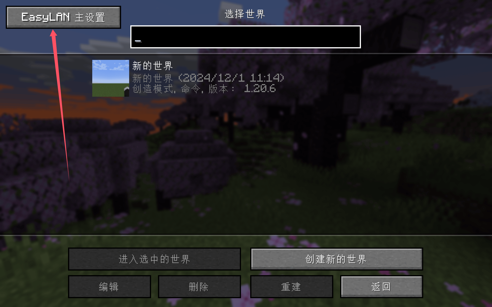
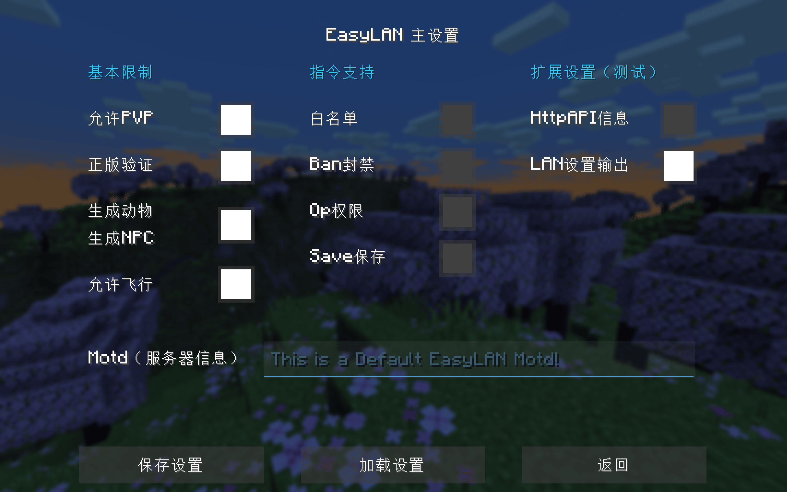

# Minecraft局域网联机穿透指南

?> 本指南针对的是**Java版**的用户，如果您是**PE版**的用户，那么您可能**不适合**使用以下指南

目前Minecraft局域网联机穿透有两种方案，即 **不装指定的Mod** 和 **要装指定的Mod**

- 不装指定的Mod：适用于同类型账号之间的联机（如正版和正版，盗版和盗版，外置和外置）
- 要装指定的Mod：适用于不同类型账号之间的联机

## 0x01 不装指定的Mod

进入要联机的存档，按下键盘上的**ESC**键，在出现的界面里找到`对局域网开放`之类的按钮并且点击进入，对**其他玩家**进行设置，然后点击`创造一个局域网世界`

在聊天框里会提示`本地游戏已在端口xxxxx上开启`，这个**五位数的端口号**对应的是**创建隧道**里的**本地端口**

?> 这个**五位数的端口号**为并不固定，如果您想固定，那么需要安装**指定的Mod**

上图中，我们获取的端口号为`61259`

## 0x02 要装指定的Mod

### 游戏版本：1.16.X - 1.12.X

名称：LanServerProperties

功能：

1. 固定端口
2. 开关正版验证
#### 下载/注意事项

?> **LanServerProperties** 需要在**联网**情况下安装

下载链接：[Github](https://github.com/rikka0w0/LanServerProperties)   [Curseforge](https://www.curseforge.com/minecraft/mc-mods/lan-server-properties/files/all) 

这两个网站的服务器都在**国外**，所以访问/下载的速度**可能**会较慢，可以选择考虑使用**魔法**下载，我们并没有**版权**转载到国内的服务器为您加快下载速度，请见谅

!> 1.16.2版由于Forge的原因可能会**引发崩溃**  
端口**不能冲突**，不然会崩端  
关闭正版验证**可能**会改变玩家的UUID导致**背包内物品丢失**，请关闭正版验证前**备份**您的存档

#### 使用方法

下载完**MOD**后丢到**mods**文件夹

进入游戏，打开您要联机的**存档**，按下键盘上的**ESC**键，在出现的界面里找到`对局域网开放`之类的按钮并且点击进入，对**其他玩家**进行设置，用时设置是否开启**在线模式**和**监听端口**

然后点击`创造一个局域网世界`，在聊天框里会提示`本地游戏已在端口xxxxx上开启`，这个**五位数的端口号**就会变成您设置的**监听端口**

?> 进入**设置局域网世界**界面后会增加：  
在线模式：开/关  
**`关闭可以让非正版玩家和您联机`**  
监听端口：25565  
**`可以固定端口，监听端口对应的就是创建隧道里的本地端口`**

### 游戏版本：1.12.X - 1.7.X

名称：Server.Properties for LAN

功能：

1. 玩家挂机多久后踢出

2. 服务器资源包

3. 固定端口

4. 最大视距

5. 是否开启正版验证

6. 是否生成生物，最大玩家数

7. 玩家之间是否可以造成伤害

8. 是否开启白名单

9. 是否生成村民

10. 最大建筑高度

11. Motd设置

#### 下载/注意事项

?> **Server.Properties for LAN** 需要在**联网**情况下安装

下载链接：[Curseforge](https://www.curseforge.com/minecraft/mc-mods/server-properties-for-lan/files/all)

这个网站的服务器都在**国外**，所以访问/下载的速度**可能**会较慢，可以选择考虑使用**魔法**下载，我们并没有**版权**转载到国内的服务器为您加快下载速度，请见谅

!> 关闭正版验证**可能**会改变玩家的UUID导致**背包内物品丢失**，请关闭正版验证前**备份**您的存档

#### 使用方法

下载完**MOD**后丢到**mods**文件夹
打开游戏，进入您想要的联机的**存档**（必须要先打开一次，才会生成`server.properties`文件）
打开**存档文件夹**里的`server.properties`文件

?> 打开方式：  
**ESC** - **选项** - **资源包** - **打开资源包文件夹**  
**返回上一级** - **打开saves文件夹** - **找到您要联机的存档的名字并双击进入**  
里面会有个叫`server.properties`的文件，**右键**通过**记事本**打开  
建议使用[Notepad++](https://notepad-plus-plus.org/)或者[Sublime Text 3](http://www.sublimetext.com/)等专业文字编辑器

配置文件翻译如下图：

请根据您的需求进行设置，设置完成后请重新打开地图即可刷新配置

然后按下键盘上的**ESC**键，在出现的界面里找到`对局域网开放`之类的按钮并且点击进入，对**其他玩家**进行设置，然后直接点击`创造一个局域网世界`即可

在聊天框里会提示`本地游戏已在端口xxxxx上开启`，这个**五位数的端口号**就会变成您设置的**端口(port)**

!> `server.properties`文件配置完以后下一次使用**这个存档**联机就不用再次配置了，但是如果**换了个存档**联机，就需要**重新配置**或者复制之前的配置过来

## 0x03 创建隧道

当您获取到了**本地端口**后，您即可开始**创建隧道**了，详细设置如下图

?> #39 40 41这三个节点**只可以**用来映射**WEB服务**，所以**不可**用来映射MC  
**如果您的是用来映射MC服务器的话，那么我们十分建议您使用高防节点（如枣庄）（基友服除外）**

如果您不会使用frpc客户端，建议查看 [用户手册](/frpc/manual) 中的 **普通用户** 一节学习 frpc 的基本使用方法