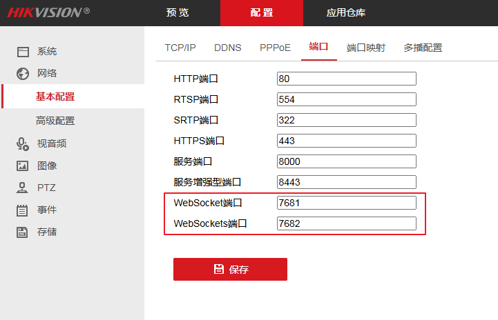
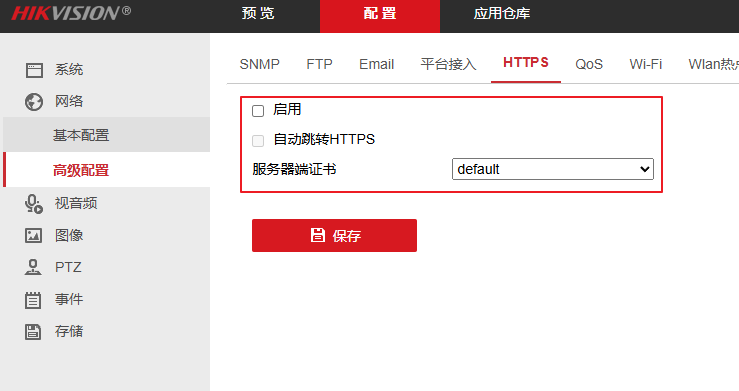
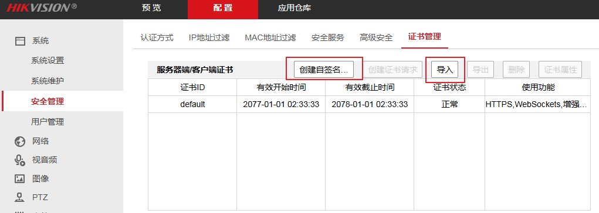
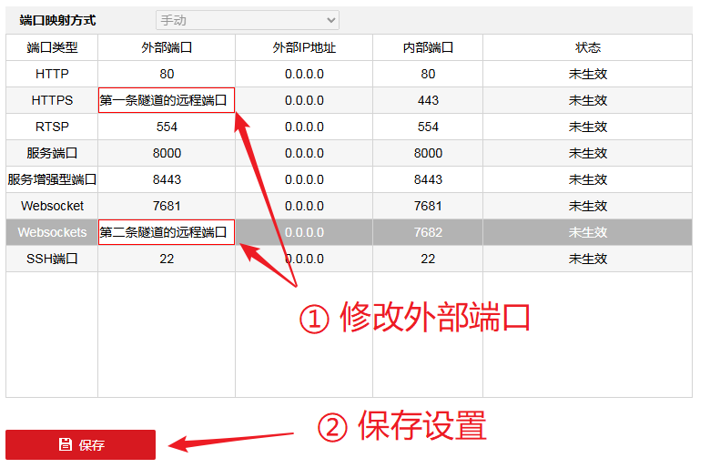
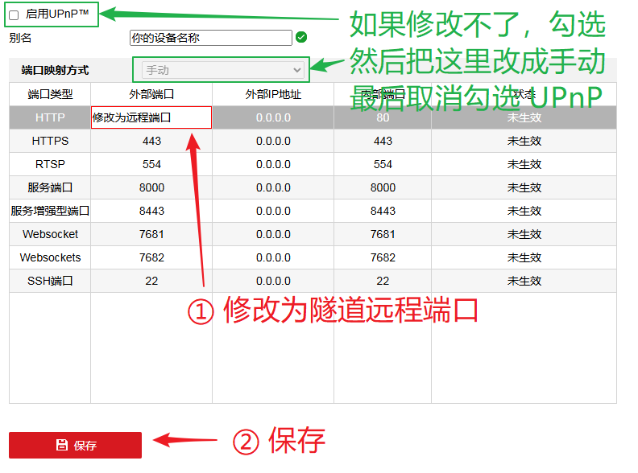

# 其他应用穿透注意事项

本文档中列出了部分应用穿透时的注意事项。欢迎提交 PR 添加条目或将本页面中的条目转化为一篇完整的文档。

- [海康威视 (Hikvision) 摄像头 / 录像机](./misc.md#hikvision)

## 海康威视 (Hikvision) 摄像头 / 录像机 {#hikvision}

| 服务 | 默认端口 | 协议 | 备注 |
| :---: | :---: | :---: | --- |
| 管理面板 | 80 | HTTP | 浏览器管理页面 |
| 管理面板 (HTTPS) | 443 | HTTPS | 浏览器管理页面, 需先配置证书 |
| RTSP | 554 | TCP | 绝大多数设备都支持, 需通过专用客户端连接 |
| SRTP | 322 | TCP | 请查看 `网络 > 基本配置 > 端口` 页面确认是否支持, 需通过专用客户端连接 |
| 服务端口 | 8000 | TCP | 用于录像机连接摄像头, 远程访问时无需穿透 |
| 服务增强型端口 | 8443 | TCP | 用于录像机连接摄像头, 远程访问时无需穿透 |

对于海康威视的设备，穿透管理页面后可能会碰到预览画面无法加载的问题。

海康设备的预览主要有两种类型：安装 / 不安装插件（LocalServiceComponents）的预览。

::: tabs

@tab 无插件预览穿透（推荐）

无插件预览穿透需要两条 TCP 隧道，但可以在中国内地节点使用。

如果您的摄像机支持无插件预览功能（在 `网络 > 基本配置 > 端口` 中可以找到 WebSocket / WebSockets 端口，且不需要安装插件就能直接看到预览画面），则推荐使用此穿透方式：

首先，前往 `网络 > 高级配置 > HTTPS` 启用 HTTPS：

部分设备的证书可能需要到 `系统 > 安全管理` 中进行配置，如果没有证书，创建自签名证书即可：

注意如果使用子域绑定功能，配置 SSL 证书时请到管理面板下载证书然后导入设备，**不要** 使用自动 HTTPS 功能，否则会导致预览无法加载。

然后，创建第一条隧道用于访问管理面板：

| 选项 | 配置 |
| :---: | :---: |
| 隧道类型 | `TCP` |
| 本地 IP | 摄像头 / 录像机设备的 IP |
| 本地端口 | `443`（HTTPS 端口） |
| 访问密码 | 自己设置一个密码 |

然后，创建第二条隧道用于预览功能：

| 选项 | 配置 |
| :---: | :---: |
| 穿透节点 | **和第一条隧道保持一致** |
| 隧道类型 | `TCP` |
| 本地 IP | 摄像头 / 录像机设备的 IP |
| 本地端口 | `7682`（Websockets 端口） |
| 访问密码 | **不要填写，否则需要单独进行认证才能看到预览画面** |

然后，前往 `网络 > 基本设置 > 端口映射` 页面，先勾选 `启用 UPnP` 选择框，把下面的 `端口映射方式` 改为 `手动`，然后再取消勾选 `启用 UPnP` 选择框，这样下面的远程端口就可以修改了：

将 `HTTPS` 和 `Websockets` 类型的 **外部端口** 分别修改为两条隧道的 **远程端口**，然后保存：

最后启动两条隧道并通过浏览器打开 **第一条隧道** 的地址（请使用 `https://`），出现证书错误时可以点击忽略，应该就可以正常看到预览画面了。

@tab 插件预览穿透

如果您的设备不支持无插件预览（需要安装 LocalServiceComponents），则只能在 **非内地节点** 进行穿透。

该穿透只需要一条 TCP 或 HTTP 隧道，但是使用明文 HTTP 协议。

在 **非内地节点** 上创建一条隧道并启动，然后使用浏览器直接访问即可：

| 选项 | 配置 |
| :---: | :---: |
| 隧道类型 | `TCP` 或 `HTTP` (如果您有自己的域名) |
| 本地 IP | 摄像头 / 录像机设备的 IP |
| 本地端口 | `80`（HTTP 端口） |

通常情况下无需进行额外配置就可以预览了。如果仍然提示预览失败，可以尝试前往 `网络 > 基本设置 > 端口映射` 页面并将 `HTTP` 类型的 **外部端口** 修改为隧道的 **远程端口**，然后保存重试。

为了您的设备安全，使用 TCP 隧道时强烈建议配置访问认证（认证时需要使用 `https://` 进行访问，认证完再使用 `http://` 打开管理面板）。使用 HTTP 隧道时可以配置 `HTTP 用户名` 和 `HTTP 密码` 选项加强安全性。

:::
