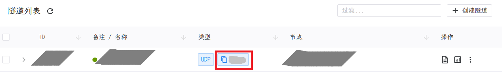

# 其他游戏联机说明

本页由下面两部分组成：

- [一些游戏说明碎片](#tips)
- [通用策略](#general)

通常来说，您应该先查看 [一些游戏说明碎片](#tips) 部分并查找其中是否有您需要的游戏的说明，  
如果没有，查看 [通用策略](#general) 部分以获取一些尝试的思路。

## 一些游戏说明碎片 {#tips}

此处收录一些我们暂时没有充足时间精力扩展为完整教程的联机说明或 Tips，希望能给您提供一些帮助。

如果存在问题或者您希望补充，欢迎提交 PR。

### 起源引擎游戏

我们有一个由社区贡献的 [起源引擎游戏服务器穿透指南](/offtopic/source) 供您参考。

### 幸福工厂 (Satisfactory)

:::warning 服务器在您退出后无法连接的问题
目前幸福工厂服务端存在 Bug，如果隧道本地 IP 指定为 `127.0.0.1` 或留空，同时您是服务器 Admin 账户，您退出游戏后服务器会部分停止工作。

为了避免这个问题，您可以尝试将隧道本地 IP 指定为您的局域网 IP 地址，或者使用一个非 Admin 账户登录游戏。

在本机游玩时，您也应当注意此问题，不要使用 `127.0.0.1` 连接服务器。
:::

幸福工厂独立服务器在同一端口数字上使用 TCP/UDP，因此：

  1. 依据 [双栈端口](#tcp-udp) 中的策略**创建两个隧道**
  1. 编辑游戏服务器启动参数，加入或更改 `-Port=上面的端口`
  1. 保证两个隧道都打开

在 1.1 更新后，幸福工厂现在需要第三个隧道，因此您将需要：（仅当您游玩 1.1 可能及以上版本时需要）

  1. 创建一个 **TCP** 隧道，本地端口选择 `8888`，远程端口留空以随机生成即可
  1. 继续编辑游戏服务器启动参数，加入或更改 `-ExternalReliablePort=新隧道的远程端口`
  1. 保证三个隧道都打开

综上所述，您需要在独立服务器启动选项中加入的内容是：

`-Port=隧道1和2（数字完全相同的两个隧道）的端口 -ExternalReliablePort=第三个隧道（本地端口写着8888的）的远程端口`

### 夜族崛起 (V Rising)

夜族崛起使用 **UDP** 协议，所以我们需要配置一个 UDP 隧道：

1. 创建一个 **UDP** 隧道，本地端口选择 **和远程一致**，远程端口留空以随机生成即可；创建完成后，记录端口，端口号可以在下图红色框框内的位置找到，**请使用自己的端口号**
  
1. 在游戏目录的找到 `VRising-Server` 目录，进入后寻找启动脚本：如果你是 Windows 系统，寻找 `.bat` 结尾的文件，如果是 Linux，则寻找 `.sh` 结尾的文件
1. **复制** 你找到的启动脚本，**重命名复制的文件** 为 `start-my-server.bat`（linux 则重命名为 `start-my-server.sh`）
1. 编辑刚刚复制且重命名的脚本（点击鼠标 **右键**，单击编辑选项），观察文件内容中是否包含 `-gamePort` 字符
   - 如果有，请将 `-gamePort` 后面的数字，改为第一步中的端口号
   - 如果没有，请在执行程序的行末尾 **打一个空格**，然后添加 `-gamePort 上面的端口`（注意前面要有空格，空格可多不可少）
1. 例如：假设上面的端口为 `28888`，则文件内容应修改为：

  ```bat
  ...#此处省略一堆内容
  VRisingServer.exe ...#此处省略一堆内容 -gamePort 28888 
    ^-- 执行服务端，修改此行               ^-- 新增加或修改的参数
  ```

### 僵尸毁灭工程 (Project Zomboid)

僵尸毁灭工程的开发人员的大脑分外聪慧，因此我们需要两个 UDP 隧道：

  1. 创建一个 UDP 隧道，记为隧道 A（请设定一个明确的隧道名防止搞混），本地端口选择 `和远程一致`，远程端口留空以随机生成
  1. **在同一个节点** 再创建一个 UDP 隧道，记为隧道 B，本地端口继续选择 `和远程一致`，远程端口继续留空以随机生成
  1. 记下两个隧道的远程端口，下面我们以 端口 A 和 端口 B 代表
  
打开您的服务端配置文件：`%USERPROFILE%\Zomboid\Server\servertest.ini` 或者说叫 `C:\Users\你的用户名\Zomboid\Server\servertest.ini`，  
在这里我们需要修改两行：

- 找到 `DefaultPort=`， 后面通常是 `16261`，修改为端口 A
- 找到 `UDPPort=`， 后面通常是 `16262`，修改为端口 B

在联机时请保证两个隧道都已开启，游戏内服务器端口输入端口 A。

### 饥荒联机版 (Don't Starve Together)

饥荒的特色是世界可能存在多层，这些多层的世界实际上是多个独立的服务器：因此您需要为每层世界创建并启动一个隧道。

首先进入您的饥荒服务器目录（通常您可以在 `%USERPROFILE%\Documents\DoNotStarveTogether` 中找到，默认可能以 `cluster_` 开头），  
在这个目录中，您将可以看到数个文件夹（如普通的双层世界可以看到两个 森林`Master` 地穴`Cave`），每个文件夹代表一个世界，您需要为每个世界创建一个隧道：

  1. 进入您的隧道管理页面，创建一个 UDP 隧道，本地端口选择 `和远程一致`，远程端口留空以随机生成，建议您将隧道名或备注设为这个世界的名字，以免混淆
  1. 打开一个世界文件夹中的 `server.ini` 文件，将 `server_port =` 后面的数字改为刚刚创建隧道的端口
  1. 继续为下一个世界创建隧道并修改文件，直到所有世界都配置完成

在联机时，请保证所有隧道都已开启。

对于通常的用户来说，您可能希望初始时连入森林世界（即主世界），
在连接时记下主世界隧道对应的链接信息（形如 `使用 >>frp-xxx.com:11221<< 来连接到您的隧道`，请再三确认前面的隧道名是主世界的隧道，否则您可能连接到其他世界中），  
其中冒号前的部分（形如 `frp-xxx.com`）为服务器地址（称为 *域名*，使用时与 IP 等价，请在连接时尽可能使用域名），冒号后的部分为端口，  
在游戏中使用 `c_connect("服务器域名", 端口)` 来连接到您的主世界即可。

### 七日杀 (7 Days to Die) {#7dtd}

七日杀在同一端口上使用 TCP **和** UDP，因此您需要：

  1. 开始创建一个 UDP 隧道，本地端口选择 `26900`，远程端口留空以随机生成即可  
    （本地端口通常应该设置为 `26900`，如您自行设置了服务端端口，则设置为您自己的）
  1. 在点击创建按钮前，点击创建按钮左边的 `批量创建选项`，选中 `创建同端口 TCP 隧道`，然后点击创建按钮
  1. 保证批量创建的两个隧道都打开

我们注意到，某些情况下、七日杀联机中可能存在需要使用两个额外隧道的情况（共计需四个，请确认自己的隧道配额足够），如您遇到反复排查联机仍无法正常连接的情况，请参考下面的方法操作：

  1. 开始创建一个 **UDP** 隧道，本地端口选择 `26900`，远程端口留空以随机生成  
     （本地端口通常应该设置为 `26900`，如您自行设置了服务端端口，则设置为您自己的）
  1. 在点击创建按钮前，点击创建按钮左边的 `批量创建选项`，选中：  
    `创建同端口 TCP 隧道` 、  
    `创建 远程端口+1 UDP 隧道`（有时不需要，如需节省隧道可以尝试删除此隧道）、  
    `创建 远程端口+2 UDP 隧道`，  
    然后点击创建按钮  
    （最终结果应当看到四个隧道：_TCP、_UDP、_UDP_1、_UDP_2）
  1. 保证四个隧道都打开

### 灵魂面甲 (Soulmask)

灵魂面甲使用 **UDP** 协议，因此我们需要配置一个 UDP 隧道：

  1. 创建一个 **UDP** 隧道，本地端口输入并选择 8777，远程端口留空以随机生成即可
  1. 启动灵魂面甲独立服务器，启动隧道
  1. 找到日志中的地址（形如`使用 >>frp-xxx.com:11221<< 来连接到您的隧道`），点击在箭头中间的部分复制连接地址，  
     其中冒号前的部分（形如 `frp-xxx.com`）为服务器 IP（称为 *域名*，此处使用时与 IP 等价），冒号后的部分为端口。
  1. 在游戏中点击 `直接连接到服务器` 并输入上面的信息来连接到您的隧道即可。

## 通用策略 {#general}

如果文档内容没有覆盖您需要的游戏的话，您可以参考我们为您准备的通用策略自行尝试。

对于大量游戏来说，官方提供用于联机的独立服务器程序 (Dedicated Server) ，  
您需要搜索、下载并运行它，游戏服务器通常会有一个或多个端口，这些端口也就是我们穿透的对象。

如果您尚不清楚您所使用游戏服务器的端口，您可以通过搜索引擎获取相关信息，或使用启动器点击创建隧道，并点击本地端口右侧的 `选择本地进程` 按钮看到所有进程及端口，在其中搜索即可。

在您确定服务器端口后，一个常规的决策思路通常如下（项目可点击跳转）：

```flow
st=>start: 开始判断
cond1=>operation: 服务器只有一个 TCP 端口?|approved:>#single-tcp
cond2=>operation: 服务器只有一个 UDP 端口?|approved:>#single-udp
cond3=>operation: 服务器有一个 TCP 端口和一个 UDP 端口?|approved:>#tcp-udp
unknown=>operation: 都不是|invalid:>#other

st(right)->cond1
cond1(bottom)->cond2
cond2(bottom)->cond3
cond3(right)->unknown
```

### 单 TCP {#single-tcp}

如果游戏只有一个 TCP 端口，您可以创建一个 TCP 隧道，本地端口指定为相应端口，远程端口留空以随机生成。

### 单 UDP {#single-udp}

如果游戏只有一个 UDP 端口，您可以创建一个 UDP 隧道。

如果您知道如何修改游戏服务器的启动参数，您可以尝试修改以将游戏端口指定为您创建的隧道的端口的话，  
为了更好的兼容性，我们建议您使用 `和远程一致` 的本地端口，远程端口留空以随机生成即可。  
然后将游戏端口修改为上面隧道生成的端口。

如果您不知道如何修改，您可以尝试创建一个 UDP 隧道，本地端口指定为相应端口，远程端口留空以随机生成。  
我们无法保证此时游戏一定可以工作。

### 双栈端口 {#tcp-udp}

这种情况下我们需要分类讨论，对于有的游戏可能实际上只有一个端口负责承载游戏流量，因此您应当或可以考虑先依次尝试：

- [尝试单 TCP 配置并测试能否正常使用](#single-tcp)
- [尝试单 UDP 配置并测试能否正常使用](#single-udp)

如果测试可行的话，您可以如此使用，并省一条隧道。

如果不可行的话，请查看 TCP 和 UDP 两个端口的数字是否相同：

:::tabs

@tab 相同

游戏可能要求同一端口的 TCP/UDP 连接同时可用，所以我们需要配置两条隧道：

  1. 准备创建一个 TCP 隧道，本地端口选择 `和远程一致`，远程端口留空以随机生成即可
  1. 在点击创建按钮前，点击创建按钮左边的 `批量创建选项`，选中 `创建同端口 UDP 隧道`，然后点击创建按钮
  1. 配置服务端将游戏的端口 (`port`) 修改为您创建隧道的端口
  1. 在联机时，您应当保证两个隧道都打开

@tab 不同

请参考 [其他情况](#other)

:::

### 其他情况 {#other}

我们也不知道，您可能需要交叉手指并进行猜谜。或查询游戏官方文档，找到真正承载游戏数据的端口。
