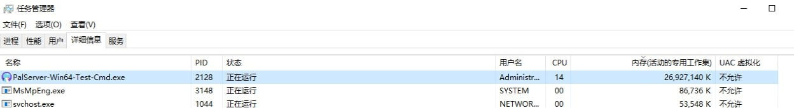
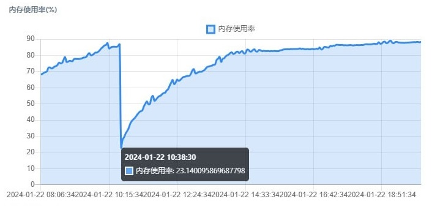
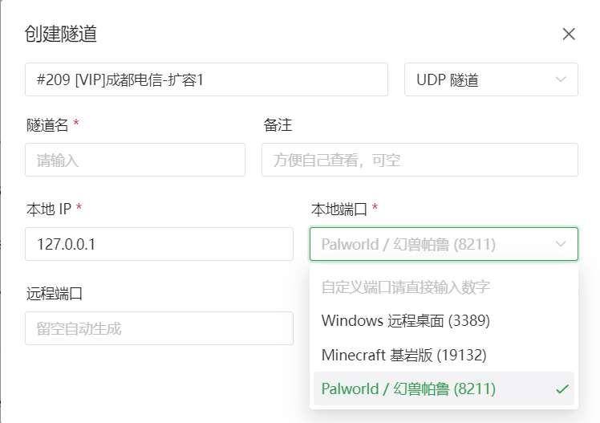
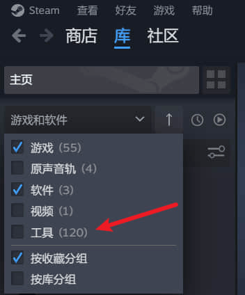
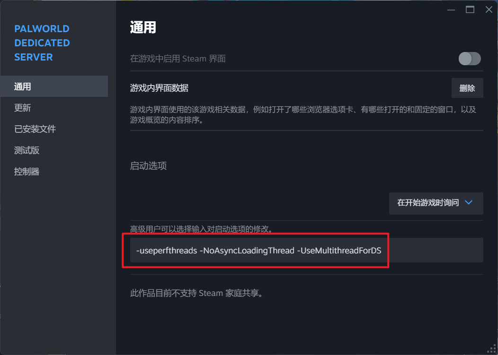
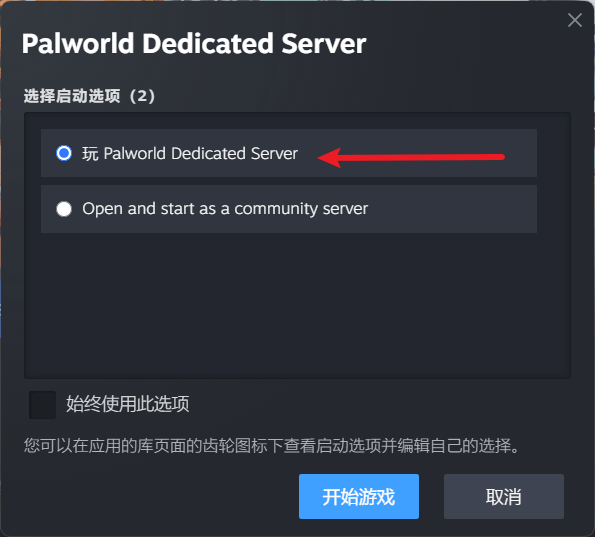
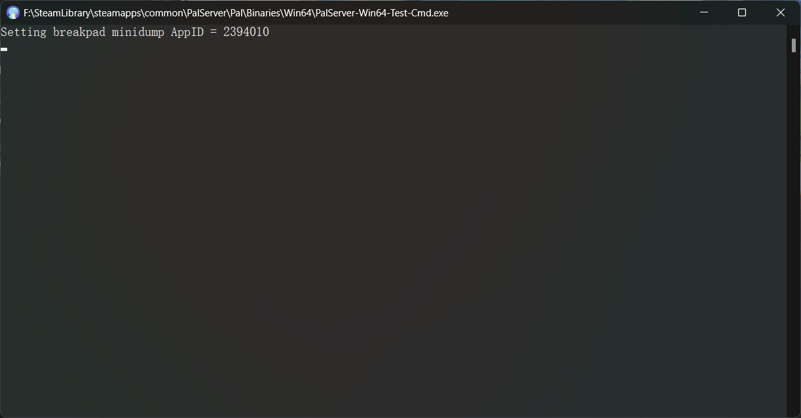
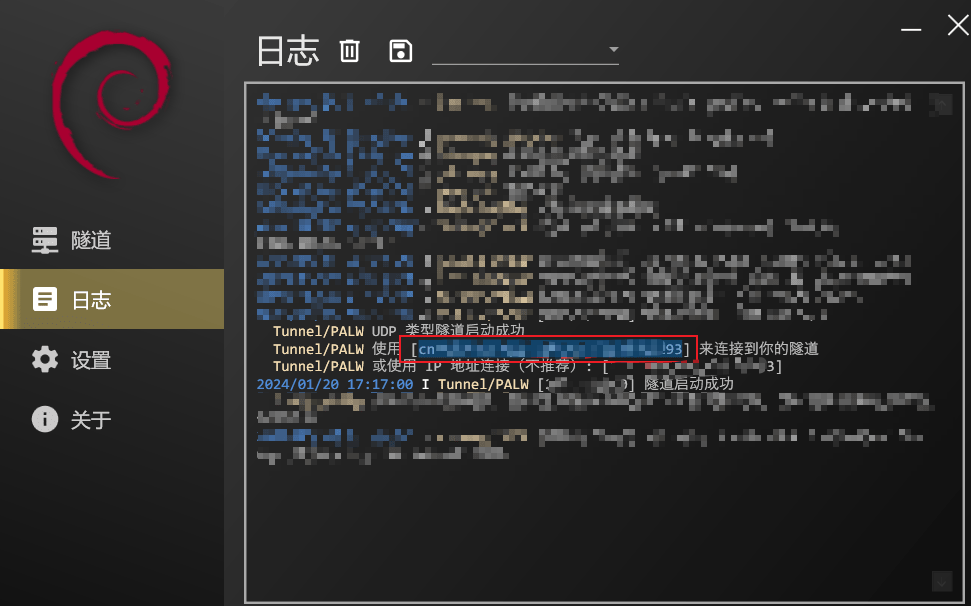
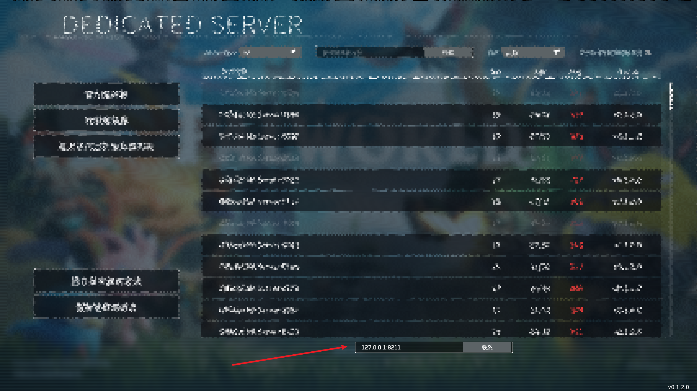
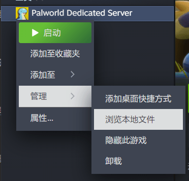

# Palworld / 幻兽帕鲁 独立服务器联机

::: tip
本文基于相对较简单的 Steam 启动法启动游戏服务器，  
如果您希望在不安装 Steam 的情况下启动游戏服务器，  请参考 [Palworld 官方文档](https://tech.palworldgame.com/dedicated-server-guide) 使用 SteamCMD 启动。
:::

::: warning 配置警告
Palworld 独立服务器内存配置要求较高，请确保在启动游戏后仍能保证足够的内存资源用于开服。

根据我们目前的经验，为了满足同时多人开服和流畅游玩，您可能需要接近下面的配置：

| 配置要求 | 说明 |
| -- | -- |
| CPU | i7-4770K 以上<br>官方最低要求的 i5-3570K 在多人游玩时可能会有明显卡顿 |
| 内存 | **空闲内存** 16G 以上<br>根据官方说明，32 GB **空闲内存** 可以更好地保障服务器稳定性 |
:::

## 常见问题 {#faq}

### 游戏显示的 LOSS 高、丢包、闪回、走路被拉回去怎么办 {#faq-high-loss}

Palworld 显示 “丢包” 主要有下面几种情况：

#### 第一，游戏服务器负载过高

根据我们近几天收到的反馈和调查结果，绝大多数 “丢包” 实际上是由于服务器负载过高，**尤其是内存不足**。

Palworld 服务器目前 **不会主动卸载区块**，内存占用只会一路爬升。尤其是 **人多**、**跑图** 的情况下占用尤为离谱。

根据我们的经验，一个 8 人的服务器在没有跑图、正常游玩的情况下可以在 4 小时内吃满 32 GB 的内存：





更糟糕的是，Palworld 服务器在性能不足时 **不会像 Minecraft 那样输出警告信息**，只会默默的丢包，并且在客户端会体现为走路走不动、被拉回等情况。

因此，如果您在游玩时遇到了丢包，**请务必先检查服务器的内存和 CPU 使用情况**，并及时重启服务器。

::: warning
根据我们的开服经验，碰到 “闪回”、“建造不了”、“走路被拉回去” 等等症状，都是服务器内存爆了造成的

简单的说就是服务器内存不足时把状态回滚了，并且 **成功的** 把这个状态 **发送到客户端**，造成本地状态被回滚

也就是说，**网络侧是没有问题的**，服务器还能正常把状态同步回客户端，只是没有能力处理客户端的状态更新
:::

::: tip
单个服务器的最大内存占用可以达到 70~80 GB 左右。如果您的服务器没有超过 80 GB 的空闲内存，请务必关注内存和 CPU 使用情况并在必要的时候重启

如果您的 SSD **性能** 和 **空闲空间** 足够，可以 **打开 Windows 的分页文件功能** 并配置一个巨大的分页文件  
Windows 会自动将未使用的内存换入分页来减少实际的物理内存占用，该方法可以 **有效减小内存压力**
:::

#### 第二，节点负载过高

在晚高峰时段，节点负载过高会造成丢包，请检查 [节点状态](https://www.natfrp.com/tunnel/nodes) 页面显示的节点负载。

- 如果节点负载直接无法显示，说明节点负载高到甚至无法稳定的维持 TCP 连接，请更换其他节点。
- 如果节点负载没有超过 60%，基本上可以排除节点负载问题。
- 部分节点（尤其是枣庄多线）由于机房超售严重，在晚高峰无法达到峰值性能，达到 70% ~ 80% 的负载可能已经是节点的极限

请在空闲时段（上午 6 ~ 11 点）使用同样的节点进行测试，如果可以流畅的进行游玩则说明您碰到的丢包是节点负载过高造成的。

节点负载过高的问题很容易解决，更换负载较低的节点即可。我们已经在尽量扩容了，但晚高峰时段可能无法保障免费用户的体验，敬请谅解。

#### 第三，网络问题

如果上述情况都不符合，可能说明您碰到了网络问题。

请更换 **其他机房** 的节点进行测试，我们 **不推荐** 使用启动器的延迟测试功能，请 **到管理面板创建隧道**。

Palworld 对延迟并不敏感，  
如果您希望使用启动器测试，显示的延迟在 100ms 内，游戏内显示延迟在 180ms 以内都可以 **流畅** 进行游玩。  
卡顿通常都是其他因素造成的。

### 进服转圈圈很久，但是进服的人可以游玩 {#faq-inf-loading}

很不幸，因为 Palworld 的悲伤优化，在开始连接后会立即发送 10000 余 UDP 报文，  
您的路由器、运营商掌握的光猫、运营商、以及网络链路上的其他设备都可能会认为这看起来是 **网络攻击** 并将其拦截。

即使不拦截，使用某些配置的运营商也会对这种流量实施交通管制（QoS），使得流量能到，但是非常缓慢。

通常这个情况更常发生在诸如**网吧等特殊场所**，或者当您和您的帕鲁搭子**处在同一个地区和运营商**的情况下。

我们向您推荐尝试下面的解决方案：

#### 如果您们中有一个人能进服，另一个人进不了服

在 **不同节点** 创建多条隧道，然后确保各自全程使用 **不同** 的连接信息登录。

#### 如果所有人都在转圈

请尝试令**所有人**有计划地错峰登录：当前一人登录后，令后一人开始尝试。

同时也可以在 **不同节点** 创建多条隧道，相应地避开流量管制的影响。

## 创建隧道 {#create-tunnel}

### 选择节点

请在创建隧道前到 [节点状态](https://www.natfrp.com/tunnel/nodes) 页面选择一个较低负载的服务器。

服务器选择时不需要过于关心服务器的地理位置，  
只要您距离服务器的赛博距离并不太远（如中国内地到其他地区，东北地区到华南地区），一个异地的服务器并不会明显影响您的游戏体验。

### 创建隧道

在 [隧道列表](https://www.natfrp.com/tunnel/) 中点击右上角创建隧道按钮，然后选择您此前选定的服务器：


请确保对应服务器上有 `UDP` 标识（即图中红框部分）。

选择隧道类型为 `UDP 隧道`，拟定一个隧道名（隧道名与使用无关），  
本地 IP 中输入 **您连接本地服务器时使用的 IP**（如果您的服务器与穿透客户端运行在同一台电脑上，输入 `127.0.0.1`），  
本地端口处选择幻兽帕鲁，创建即可：



### (可选) 启动多个隧道

在下面的情况下，您可以考虑重复上面的步骤，启动 **在不同的节点** 多个隧道用于备份或改善体验：

- 您希望使用的节点负载较高
- 您的玩伴位于不同的地区

在连接时使用不同服务器的地址即可。

## 启动服务端

### 找到并配置 Palworld Dedicated Server

在 Steam 的 “库” 中，选中展示 `工具` 类：



找到 `Palworld Dedicated Server`，右键选择属性：


在下图所示红框的文本框中输入下面的参数（此参数可以优化服务器多核性能，来自 [官方文档](https://tech.palworldgame.com/dedicated-server-guide#settings)）：

```
-useperfthreads -NoAsyncLoadingThread -UseMultithreadForDS
```



### 启动服务器

只需要像启动游戏一般启动 `Palworld Dedicated Server` 即可。

请注意在启动时选择 `Dedicated Server` 项，而不是 `Community Server`：



请务必确认，联机游玩时这个启动后弹出的黑框框始终存在，这表示您的服务器一直在开启：



### 启动隧道

[安装并登录启动器](/launcher/usage.html)后，在 SakuraFrp 启动器中找到您先前创建的隧道，启用即可。  
（如果找不到请点击刷新按钮）

您将在 “日志” 页中看到用于连接的信息，复制图中选中（不含两侧的`[]`）的部分即为连接信息：



如果您启动了多条隧道，则需要在此处复制多个连接信息。

## 连接服务器游玩 {#join-server}

打开游戏后，选择 `加入多人游戏 （专用服务器）` 项目：


在屏幕下方的文本框中，**删除其中原有的内容**，粘贴上面复制的连接信息，点击 “联系” 即可连接：



如果您启动了多条隧道，请根据需要和体验选择一条输入。

## 修改服务器配置 {#tweak-server-config}

在 Steam 中找到 `Palworld Dedicated Server`，右键打开本地文件：



在此文件夹中，打开 `DefaultPalWorldSettings.ini` ，其内容为配置样板。

依次打开 `Pal/Saved/Config/WindowsServer/PalWorldSettings.ini` 即为当前世界配置，复制上面的样板粘贴进入后修改此文件即可。

配置项目由逗号分隔，即逗号后面为新的一项配置，配置名和配置内容之间用等号连接。

我们非常建议您启用服务器密码功能，即找到 `ServerPassword=""`，在引号之间输入您设定的密码，玩家加入时将需要使用密码。

具体配置项您可以参考 [官方文档](https://tech.palworldgame.com/optimize-game-balance)，这里提供一些常用项目：

::: tip
倍率类项目可以为小数，即 `1.000000` `0.500000` 此类。  
是否类项目应为 `True`(是) 或 `False`(否)
:::

| 配置名 | 说明 |
| -- | -- |
| DeathPenalty | 死亡掉落：<br>`None`: 不掉落<br>`Item`: 只掉落物品<br>`ItemAndEquipment`: 掉落物品和装备<br>`All`: 掉落物品、装备和身上的帕鲁 |
| DayTimeSpeedRate | 白天时间流速倍率 |
| NightTimeSpeedRate | 夜晚时间流速倍率 |
| ExpRate | 经验获取倍率 |
| PalStaminaDecreaceRate | 帕鲁耐力消耗速度倍率 |
| CollectionDropRate | 收集物掉落倍率 |
| WorkSpeedRate | 工作速度倍率 |
| bEnableAimAssistKeyboard | 是否开启辅助瞄准 |
| bEnableFastTravel | 是否开启传送 |
