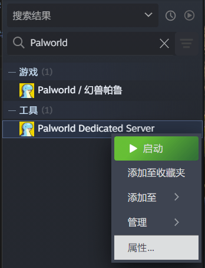

# Palworld / 幻兽帕鲁 独立服务器联机

::: tip
本文基于相对较简单的 Steam 启动法启动游戏服务器，  
如果您希望在不安装 Steam 的情况下启动游戏服务器，  请参考 [Palworld 官方文档](https://tech.palworldgame.com/dedicated-server-guide) 使用 SteamCMD 启动。
:::

::: warning 配置警告
Palworld 独立服务器内存配置要求较高，请确保在启动游戏后仍能保证足够的内存资源用于开服。  
通常来讲您的电脑需要至少 16 GB 内存，32 GB 内存可以更好地保障服务器稳定性。
:::

## 创建隧道

### 选择节点

请在创建隧道前到 [节点状态](https://www.natfrp.com/tunnel/nodes) 页面选择一个较低负载的服务器。

服务器选择时不需要过于关心服务器的地理位置，  
只要您距离服务器的赛博距离并不太远（如中国内地到其他地区，东北地区到华南地区），一个异地的服务器并不会明显影响您的游戏体验。

### 创建隧道

在 [隧道列表](https://www.natfrp.com/tunnel/) 中点击右上角创建隧道按钮，然后选择您此前选定的服务器：


请确保对应服务器上有 `UDP` 标识（即图中红框部分）。

选择隧道类型为 `UDP 隧道`，拟定一个隧道名（隧道名与使用无关），  
本地 IP 中输入 **您连接本地服务器时使用的 IP**（如果您的服务器与穿透客户端运行在同一台电脑上，输入 `127.0.0.1`），  
本地端口处选择幻兽帕鲁，创建即可：


### (可选) 启动多个隧道

在下面的情况下，您可以考虑重复上面的步骤，启动 **在不同的节点** 多个隧道用于备份或改善体验：

- 您希望使用的节点负载较高
- 您的玩伴位于不同的地区

在连接时使用不同服务器的地址即可。

## 启动服务端

### 找到并配置 Palworld Dedicated Server

在 Steam 的 “库” 中，选中展示 `工具` 类：


找到 `Palworld Dedicated Server`，右键选择属性：



在下图所示红框的文本框中输入下面的参数（此参数可以优化服务器多核性能，来自 [官方文档](https://tech.palworldgame.com/dedicated-server-guide#settings)）：

```
-useperfthreads -NoAsyncLoadingThread -UseMultithreadForDS
```


### 启动服务器

只需要像启动游戏一般启动 `Palworld Dedicated Server` 即可。

请注意在启动时选择 `Dedicated Server` 项，而不是 `Community Server`：


### 启动隧道

[安装并登录启动器](/launcher/usage.html)后，在 SakuraFrp 启动器中找到您先前创建的隧道，启用即可。  
（如果找不到请点击刷新按钮）

您将在 “日志” 页中看到用于连接的信息，复制图中选中（不含两侧的`[]`）的部分即为连接信息：


如果您启动了多条隧道，则需要在此处复制多个连接信息。

## 连接服务器游玩

打开游戏后，选择 `加入多人游戏 （专用服务器）` 项目：


在屏幕下方的文本框中，**删除其中原有的内容**，粘贴上面复制的连接信息，点击 “联系” 即可连接：


如果您启动了多条隧道，请根据需要和体验选择一条输入。

## 修改服务器配置

在 Steam 中找到 `Palworld Dedicated Server`，右键打开本地文件：


在此文件夹中，打开 `DefaultPalWorldSettings.ini` 作为配置样板。

依次打开 `Pal/Saved/Config/WindowsServer/PalWorldSettings.ini` 即为当前世界配置，复制上面的样板粘贴进入后修改即可。

配置项目由逗号分隔，即逗号后面为新的一项配置，配置名和配置内容之间用等号连接。

具体配置项您可以参考 [官方文档](https://tech.palworldgame.com/optimize-game-balance)，这里提供一些常用项目：

::: tip
倍率类项目可以为小数，即 `1.000000` `0.500000` 此类。  
是否类项目应为 `True`(是) 或 `False`(否)
:::

| 配置名 | 说明 |
| -- | -- |
| DeathPenalty | 死亡掉落：<br>`None`: 不掉落<br>`Item`: 只掉落物品<br>`ItemAndEquipment`: 掉落物品和装备<br>`All`: 掉落物品、装备和帕鲁 |
| DayTimeSpeedRate | 白天时间流速倍率 |
| NightTimeSpeedRate | 夜晚时间流速倍率 |
| ExpRate | 经验获取倍率 |
| PalStaminaDecreaceRate | 帕鲁耐力消耗速度倍率 |
| CollectionDropRate | 收集物掉落倍率 |
| WorkSpeedRate | 工作速度倍率 |
| bEnableAimAssistKeyboard | 是否开启辅助瞄准 |
| bEnableFastTravel | 是否开启传送 |
