# 威联通 (QNAP) NAS 穿透指南

本文档将指导您安装 Container Station 并通过 Docker 配置启动器，最后将 NAS 面板穿透到外网。

本文档使用 QTS 5.1.8 系统进行演示，部分按钮位置在其他版本中可能有所不同，请在相关界面附近查找。

## 安装 Container Station {#install-container-station}

在桌面点击 **App Center** 图标，搜索 `Container` 并安装 **Container Station**：

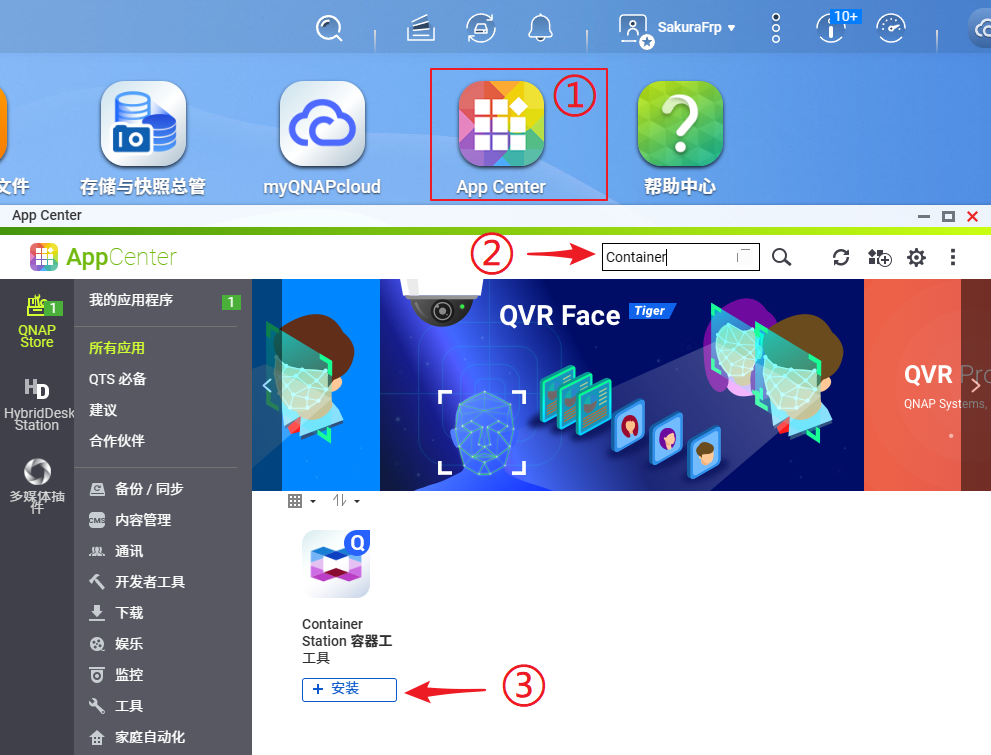

## 创建启动器容器 {#create-launcher-container}

启动器容器只需配置一次即可，一个容器可以开启多条隧道，无需重复配置。

1. 启动 **Container Station**，转到 `容器` 页面，点击 `创建`：

   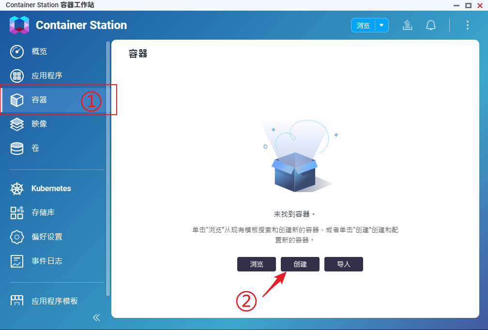

1. 在 `映像` 处输入 `natfrp.com/launcher`，勾选下方的强制拉取复选框，然后点击 `下一步`：

   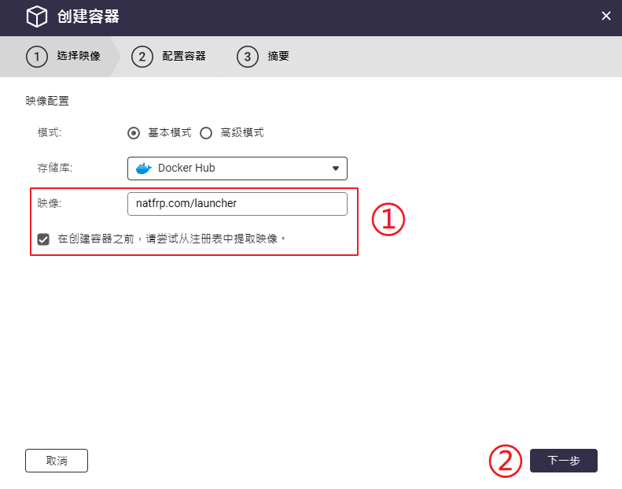

1. 点击 **网络配置** 旁边的齿轮，选择自定义网络模式，然后切换至 `Host` 模式：

   ::: tip
   Web UI 默认运行在 7102 端口，如果发生冲突，请在创建完成后参考 [用户手册](/launcher/manual.md#config-webui) 修改端口或关闭 Web UI
   :::

   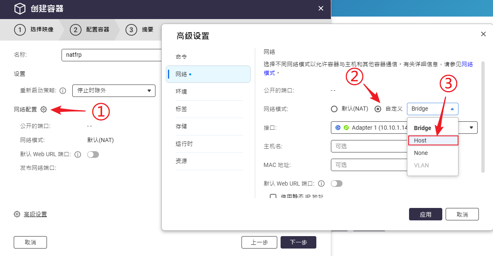

1. 切换到 **环境** 标签页，在 `NATFRP_REMOTE` 处设置一个远程管理密码（8 字符以上），在 `NATFRP_TOKEN` 处粘贴您的访问密钥（在 SakuraFrp 管理面板获取）：

   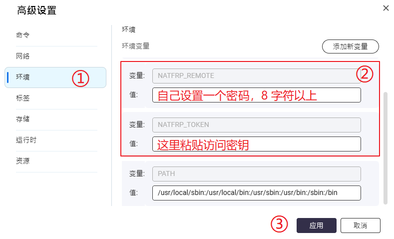

1. 为了避免配置文件丢失，切换到 **存储** 标签页，点击 `添加卷`，在 `卷` 处输入 `natfrp-config`，在 `容器` 处输入 `/run`：

   ::: tip 容器中的 /run 就是启动器工作目录
   如需手动修改工作目录内容（如配置 SSL 证书），请不要点添加卷，而是按下图绑定主机文件夹到 `/run`

   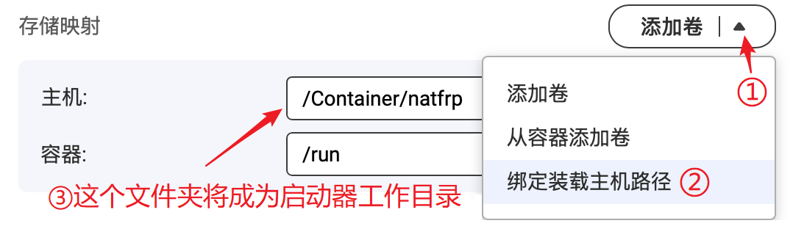
   :::

   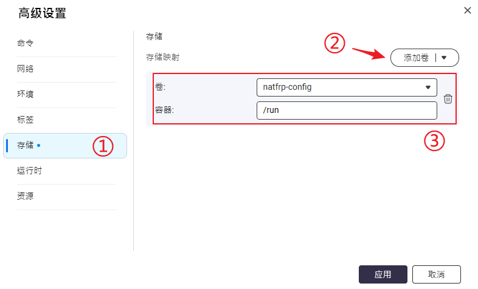

1. 配置完成后点击 `应用` 和 `下一步` 完成创建，然后稍等几秒钟检查容器日志输出，确认看到登录成功和远程管理连接成功的提示：

   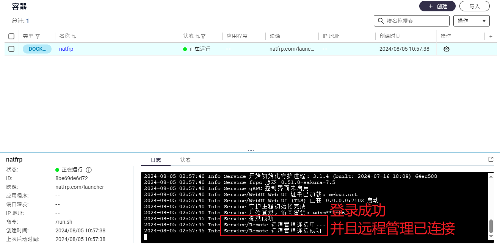

## 创建隧道 {#create-tunnel}

1. 启动 **控制台** 应用，在 `系统 > 常规设置 > 系统管理` 中勾选 `启用安全连接 (HTTPS)`，然后记下下面的 `端口号` 备用：

   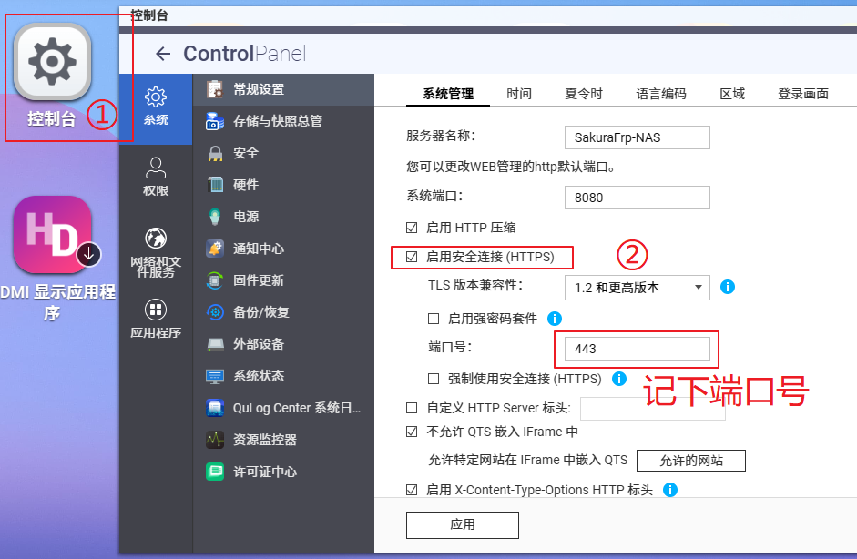

1. 前往 SakuraFrp 管理面板，创建一条本地 IP 为 `localhost`，本地端口为刚才记下的端口号的 **TCP 隧道**。

## 启动隧道 {#start-tunnel}

1. 打开 [远程管理](https://www.natfrp.com/remote/v2)，连接到刚才创建的容器：

   

1. 点击右边的刷新按钮，然后双击刚才创建的隧道，或将其拖到上方启动：

   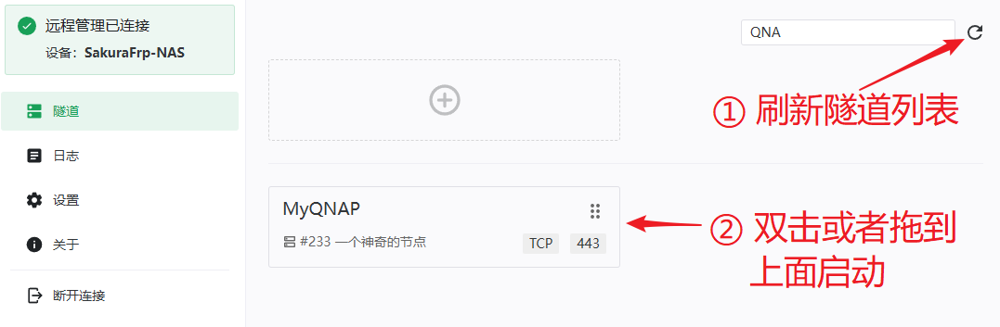

1. 启动成功后右上角会弹出连接方式，您也可以前往 `日志` 页面查看连接方式：

   

1. 使用 `https://` 加上日志中显示的连接方式即可远程访问您的 QNAP NAS：

   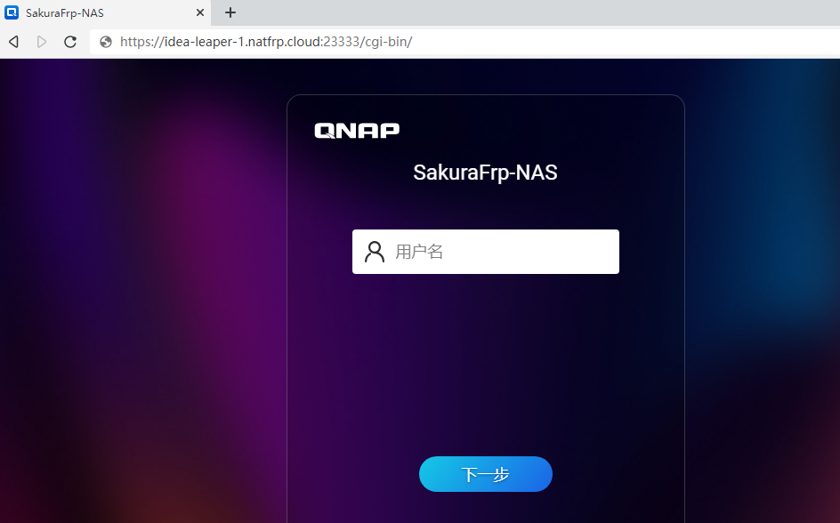

## 更新启动器 {#update-launcher-container}

虽然更新时发生意外的可能性很小，但我们仍然 **强烈建议** 您在有备用连接手段的情况下再进行更新，以免 NAS 失联。

更新启动器时，只需点击容器右侧的齿轮图标，选择 `直接重新创建`，勾选强制拉取复选框并点击 `是` 即可：

