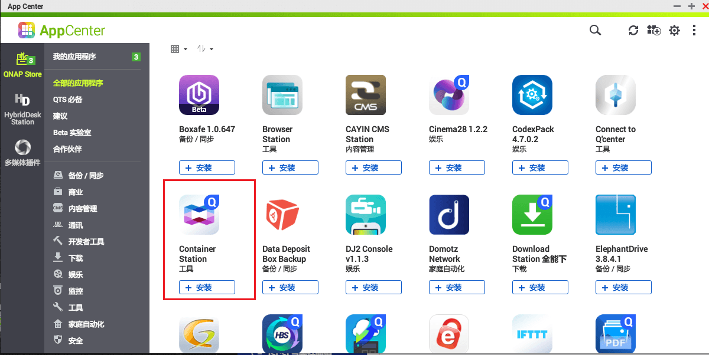
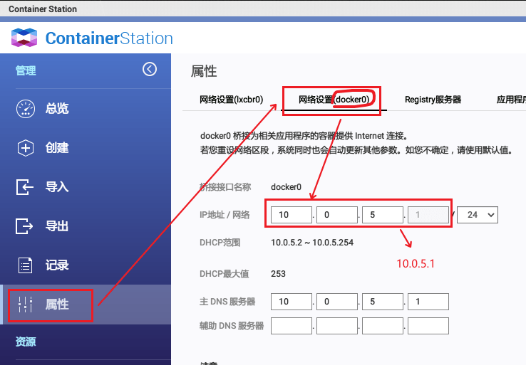
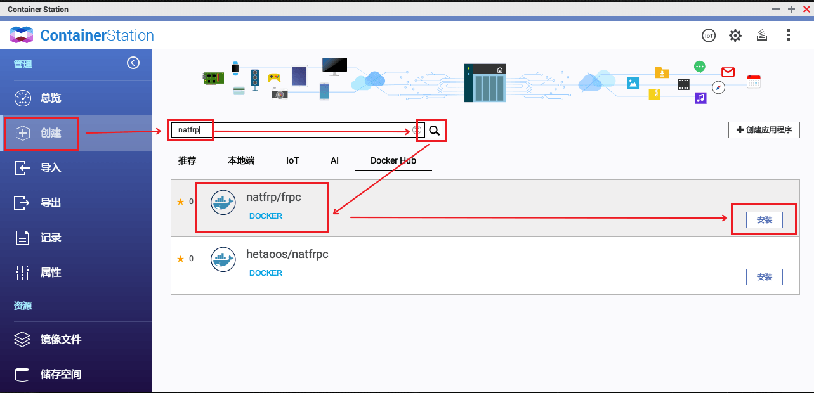
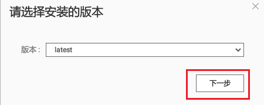
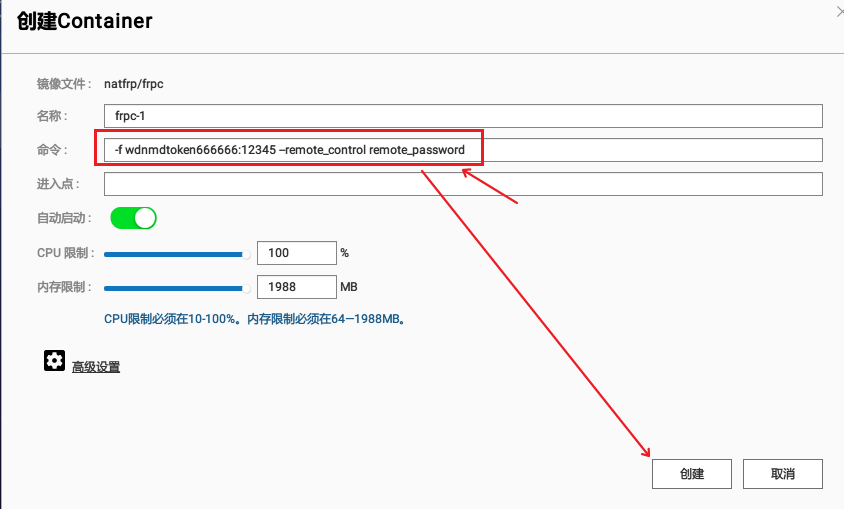
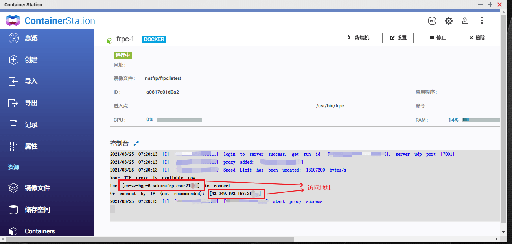
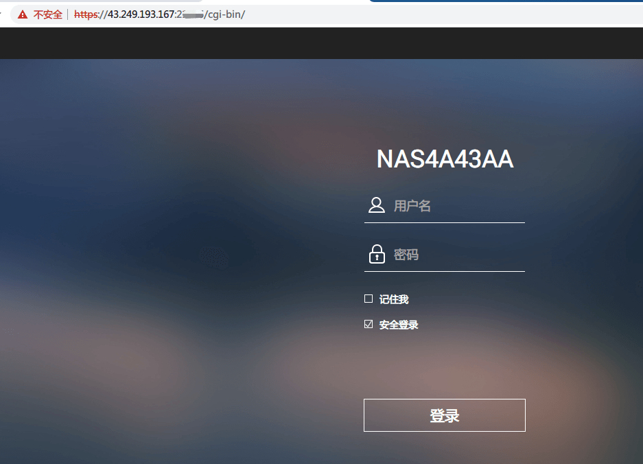

# 威联通(QNAP) NAS 穿透指南

因为本作者也不用 QNAP ，这篇指南只提供 Docker 部署法。

## 使用准备

使用准备部分如果看不懂可以类比 [DSM 的指南](synology)

### 配置面板

打开控制台，勾选 `使用安全连接(HTTPS)`，并记下下面的 端口号 备用：

在 `App Center` 中安装 `Container Station` 以使用 Docker：

在 `Container Station` 如下图读出 网关ip 备用：

### 创建隧道

使用上一步中记下的参数，如下图所示创建隧道备用：

### 设置Docker

首先我们在 `Container Station` 中找到并下载 natfrp/frpc 的 latest 标签：

然后设置启动参数：

请注意，此处「命令」栏中输入的是一个启动参数，如何写可以参考 [frpc 基本使用指南](/frpc/usage#running-frpc)

### 获取连接信息

打开 Docker Container 的详情信息就能看到连接信息了，报错也可以在这里看到：

到浏览器试一下：

请注意，因为我们穿透了 HTTPS 访问端口，所以在访问时需要在前面加 `https://`

### 更新软件版本

::: danger
请务必在有备用连接手段时升级，否则可能造成失联
:::

有时候，你会看到我们在 [状态频道](https://t.me/natfrp_status) 中看到新的客户端发布

但是 QNAP 的 Container Station 并不像它在 DSM 的兄弟那样升级便捷

您需要删除掉正在运行的 Container（容器），然后在 `镜像文件` 菜单中删除已有的 natfrp/frpc，最后跟随 [设置Docker](#设置docker) 开始重来一遍