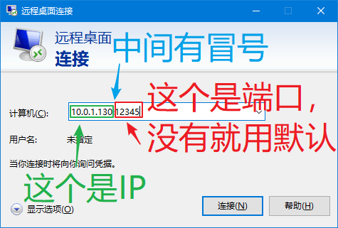
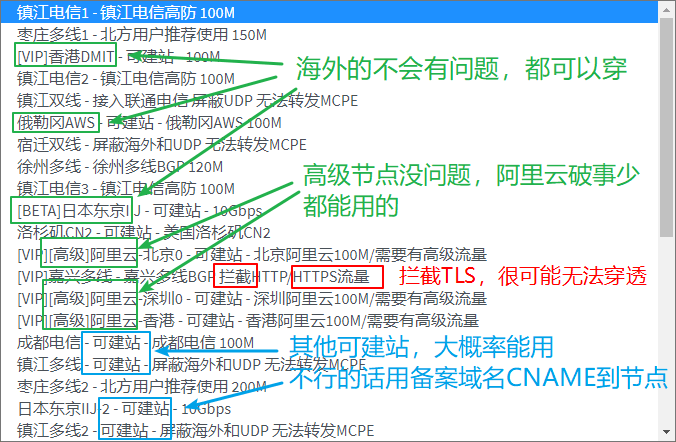
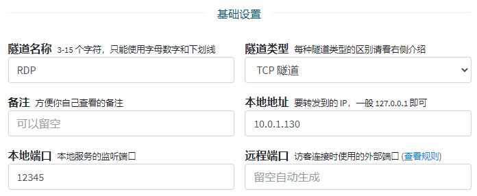
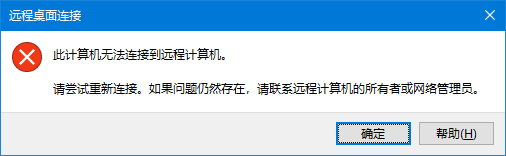

# 远程桌面(RDP) 穿透指南

## 默认端口

- RDP: 3389
- VNC: 您来错地方了, 这篇教程和 VNC 没关系

## 0x00 启用远程桌面

如果您还没有启用远程桌面的话，请遵循 [微软的说明](https://support.microsoft.com/zh-cn/windows/%E5%A6%82%E4%BD%95%E4%BD%BF%E7%94%A8%E8%BF%9C%E7%A8%8B%E6%A1%8C%E9%9D%A2-5fe128d5-8fb1-7a23-3b8a-41e636865e8c) 启用远程桌面，然后继续下面的步骤

## 0x01 确认目标服务

?> 如果是穿透到本地计算机 (运行 frpc 的电脑), 一般可以跳过这一节, 使用 IP 为 `127.0.0.1`, 端口为 `3389` 即可

进行穿透前请先确认要穿透到的服务能被正常访问到，用 `远程桌面连接` 在 **运行 frpc 的电脑上** 访问一下您的服务, 确保远程桌面可以正常连接后，参考下图找到您的目标 IP 和端口:

上图中，我们要穿透的 IP 是 `10.0.1.130`, 端口是 `12345`

## 0x02 选择穿透节点

 - **高级节点** 和 **海外节点** 一般不会出问题，不需要备案域名
 - 拦截 HTTPS 的节点基本上用不了
 - 其他可建站节点 **可能** 需要 **使用备案域名 CNAME 到节点** 才可以正常连接
 - 不在上述范围内的节点不一定能用也不一定连不上，请自行测试

参考下图选择一个穿透节点

## 0x03 创建隧道

选择隧道类型为 TCP 后直接填写刚才获取到的 IP 地址和端口即可

## 0x04 启动隧道

启动隧道，获取穿透后的连接方式并尝试连接。

通常情况下，使用红框中的域名即可正常连接，如无法连接可以尝试使用 IP 地址访问，如果仍然无法正常连接请尝试使用有备案的域名 CNAME 到红框中的域名并连接或更换节点。

如果连接时可以正常看到登录提示框但输入密码后出现下图的错误，**基本上可以确定是节点的问题**，请更换节点或自行寻找解决方案

