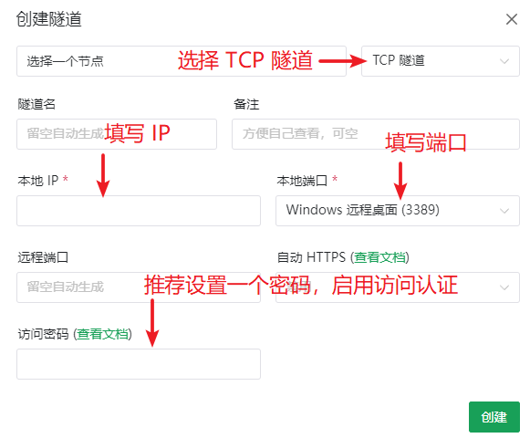

# 远程桌面 (RDP) 穿透指南

::: danger 安全警告
穿透远程桌面前 **必须** 阅读 [安全指南](/bestpractice/security.md)，确保您的系统已经 **安装了最新的补丁** 并且设置了 **强登录密码**  
进行内网穿透等于 **绕过所有防火墙** 将您的计算机直接暴露于公网中，您需要自行承担由此带来的风险  
为了保证安全，**强烈推荐** 打开 [访问认证](/bestpractice/frpc-auth.md) 功能并配置一个强访问密码
:::

<app-info :time="3" :difficulty="1.5" :access="[
    { proto: 'TCP', local: '3389', method: '系统自带远程桌面连接' },
    { proto: '(可选) UDP', local: '3389', method: '(用于优化连接)' },
]" />

## 视频教程 {#video}

::: tabs

@tab Windows 10


@tab Windows 7


:::

## 准备工作 {#preparation}

如果您还没有启用远程桌面的话，请先 [点击这里](ms-settings:remotedesktop) 打开设置，然后打开 **启用远程桌面** 开关。

为了保证您在系统启动后无需操作就能使用远程桌面连接电脑，在安装启动器时请勾选 `安装为系统服务` 项。如果启动器已经装好了，可以直接覆盖安装一次或参考 [系统服务](/launcher/usage.md#windows-service) 章节安装系统服务。

## 确认目标服务 {#target-service}

请先确认 **开启隧道的电脑** 和 **要远程连接的电脑** 是不是同一台：

::: tabs

@tab 是同一台电脑

1. 按 `Win+R` 打开运行窗口，输入 `cmd` 打开命令提示符

   

1. 复制下面的命令，在黑色空白区域按一下右键粘贴，然后按回车：

   ```cmd
   netstat -an|findstr :3389|findstr LISTENING
   ```

1. 检查输出内容，正常情况下应该会输出两行字：

   ```log
   TCP    0.0.0.0:3389           0.0.0.0:0              LISTENING
   TCP    [::]:3389              [::]:0                 LISTENING
   ```

1. 只要能找到 `0.0.0.0:3389` 这行字，则 **本地 IP** 使用 `127.0.0.1`，**本地端口** 使用`3389`

   在极少数情况下可能 **只有一行** `[::]:3389` 的输出，此时 **本地 IP** 使用 `::1`，**本地端口** 使用 `3389`

   请复制粘贴上面给出的 **本地 IP**，不要自己输入，避免输错。本地端口可以在下拉列表中直接选择。

@tab 不是同一台电脑

用 `远程桌面连接` 在 **开启隧道的电脑上** 访问一下 **要远程连接的电脑**。

确保远程桌面可以正常连接后，参考下图找到您的目标 IP 和端口：


在上图的例子中，我们要穿透的 **本地 IP** 是 `192.168.1.100`，**本地端口** 是 `3389`。

:::

## 创建隧道 {#create-tunnel}

选择 **隧道类型** 为 `TCP` 后直接填写刚才获取到的**本地 IP**和**本地端口** 即可。

**强烈推荐设置访问密码**，如需详细配置教程请参阅 [配置访问认证功能](/bestpractice/frpc-auth.md)。



## 启动隧道 {#start-tunnel}

启动隧道，通常情况下使用红框中的域名即可正常连接，如无法连接可以尝试使用 IP 地址连接。

如果都无法正常连接，请检查配置是否有错误、frpc是否有输出错误日志。

确认配置完全正确的话，可以尝试使用有备案的域名 CNAME 到红框中的域名并连接或更换节点。


## 连接优化

::: tip
启用 UDP **可能** 会提升远程桌面的连接质量，提升流畅度，只是 **可能**  
但是 **对于某些运营商，开启 UDP 反而会降低连接质量**，请根据您的测试结果决定要不要开这个额外的隧道
:::

- 只创建一个 TCP 隧道会使您在连接时被远程桌面连接程序歧视，看起来信号很差的样子：

  

- 比如，我们想优化这个隧道的远程桌面连接质量：

  

- 就需要建立一个 `节点` 相同、`远程端口` 相同 的 `UDP` 隧道：

  ::: tip
  如果相同远程端口的 UDP 隧道无法创建，说明这个节点上同一个端口号的 UDP 端口被其他人占用了  
  请删掉隧道，回到前面的 [创建隧道](#create-tunnel) 重新创建一个 TCP 隧道再试一次
  :::

  

- 然后确保在启动器中启动 **两个隧道**，两个都要启动成功：

  

- 此时再进行连接，RDP 程序可能就会显示信号很好了：

  

  但是使用体验不一定会提升很多，请以实际测试为准。

## 关于相对鼠标位置 {#relative-mouse}

通过 RDP 连接远程桌面时，客户端会向远程计算机发送鼠标的绝对位置并隐藏远程计算机的鼠标指针。

通常情况下这不会造成任何问题，但在部分依赖于相对鼠标位移的游戏（特别是 3D 游戏）中，这可能会导致视角无法正常转动。

您可以尝试使用第三方工具来解决这个问题，下方列出了若干可能的解决方案：

- <https://github.com/xyzlancehe/rdp_relative_mouse>
- <https://github.com/TKMAX777/RDPRelativeInput>

请注意，上述第三方工具并非由我们开发，建议您先检查源代码并自行编译后使用。此外，这些工具可能会触发游戏的反作弊机制，请在使用前自行评估相关风险。
