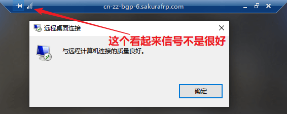

# 远程桌面(RDP) 穿透指南

!> 穿透远程桌面前务必阅读 [安全指南](/bestpractice/security)，确保您的系统已经 **安装了最新的补丁** 并且设置了 **强登录密码**  
进行内网穿透等于 **绕过所有防火墙** 将您的计算机直接暴露于公网中，您需要自行承担由此带来的风险

## 视频教程 :id=video

<!-- tabs:start -->

# **Windows 10**

[Windows 10 RDP 视频](_videos/rdp-win10.mp4 ':include :type=video')

# **Windows 7**

[Windows 7 RDP 视频](_videos/rdp-win7.mp4 ':include :type=video')

<!-- tabs:end -->

## 默认端口 :id=default-port

- RDP: 3389
- VNC: 您来错地方了，这篇教程和 VNC 没关系

## 前置需求 :id=requirements

如果您还没有启用远程桌面的话，请遵循 [微软的说明](https://support.microsoft.com/zh-cn/windows/%E5%A6%82%E4%BD%95%E4%BD%BF%E7%94%A8%E8%BF%9C%E7%A8%8B%E6%A1%8C%E9%9D%A2-5fe128d5-8fb1-7a23-3b8a-41e636865e8c ':target=_blank') 启用远程桌面，然后继续下面的步骤。

为了保证您在系统启动后无需操作就能使用远程桌面连接电脑，在安装启动器时请勾选 `安装为系统服务` 项。如果启动器已经装好了，可以直接覆盖安装一次或参考 [系统服务](/launcher/service) 一文安装系统服务。

## 确认目标服务 :id=target-service

?> 如果运行 frpc 的电脑和启用远程桌面的电脑是同一台，请跳过这一节并使用 `127.0.0.1` 作为本地 IP、`3389` 作为本地端口

进行穿透前请先确认要穿透到的服务能被正常访问到，用 `远程桌面连接` 在 **运行 frpc 的电脑上** 访问一下您的服务，确保远程桌面可以正常连接后，参考下图找到您的目标 IP 和端口:

上图中，我们要穿透的 IP 是 `192.168.1.100`，端口是 `3389`。

## 创建隧道 :id=create-tunnel

选择隧道类型为 `TCP` 后直接填写刚才获取到的 `IP` 和 `端口` 即可。

## 启动隧道 :id=start-tunnel

启动隧道，获取穿透后的连接方式并尝试连接。

通常情况下，使用红框中的域名即可正常连接，如无法连接可以尝试使用 IP 地址访问，如果仍然无法正常连接请尝试使用有备案的域名 CNAME 到红框中的域名并连接或更换节点。

## 连接优化

?> 启用 UDP *可能* 会提升远程桌面的连接质量，提升流畅度

只创建一个 TCP 隧道会使您在连接时被 RDP 程序鄙视，看起来信号很差的样子:

如果我们想优化这个隧道的远程桌面连接质量:

就需要建立一个 `节点` 相同、`远程端口` 相同 的 `UDP` 隧道 （如果相同远程端口的 UDP 隧道无法创建，请回到前面的 [创建隧道](#创建隧道) 重新创建一个 TCP 隧道再试）:

然后确保在启动器中启动 **两个隧道**:

!> **对于某些运营商，开启 UDP 反而会降低连接质量**，请根据您的测试结果决定要不要开这个额外的隧道

此时再进行连接，RDP 程序可能就会显示信号很好了:

