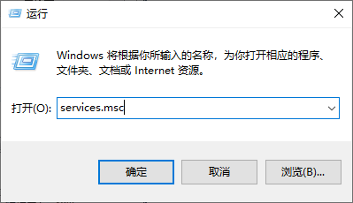

# SFTP 文件传输穿透指南

<app-info :time="15" :difficulty="3" :access="[
    { proto: 'TCP', local: '22', method: '各类 SFTP 客户端' },
]" />

SFTP 在 Linux 平台上使用体验较佳，能提供几乎无需配置的便捷性和全平台通用的兼容性，且与 Sakura Frp 此类端口数有限的端口映射服务相性良好。使用 SFTP 进行文件传输是我们最为推荐的方案之一。

Linux 用户所需要做的仅仅是将 SSH 服务打开（并确保 sftp-server 插件存在），然后穿透 SSH 服务的端口即可，下面的内容主要为 Windows 用户准备的。

::: danger 安全警告
下面的教程同时打开了 SSH 和 SFTP 服务，而且默认使用密码登录，这意味着任何人只要有您的密码都可以随意控制您的电脑  
为了保证安全，配置前 **必须** 阅读 [安全指南](/bestpractice/security.md)，此 SSH/SFTP 隧道 **必须** 打开 [访问认证](/bestpractice/frpc-auth.md) 功能并设置强访问密码
:::

为了教程的简洁和易于操作，我们于此省略了在配置中为此 SSH 服务加固的措施，如果您仍有余裕，请在互联网上查看相关文章进行配置。

## OpenSSH 服务器安装 {#install-openssh}

OpenSSH 是最常见的 SSH/SFTP 客户端/服务器软件。微软现为 Windows 7+ 的系统提供 OpenSSH 软件，Windows 10 1803+ 更可一键安装，使用和配置都相当简单。

:::: tabs

@tab Windows 10 1803+

1. 对于此类较新的系统，直接打开设置应用，然后打开 **应用** 页面：

   

1. 转到 **应用和功能** 页面，点击 **可选功能**：

   

1. 点击 **添加功能** 按钮：

   

1. 在搜索框中输入 `SSH`，勾选 **OpenSSH 服务器** 后点击 **安装** 即可：

   

@tab Windows 7+

::: tip
受国内不可控网络环境的影响，您的 GitHub 访问体验可能不稳定，建议找一个可靠的加速镜像进行下载  
下面的教程步骤部分源于 PowerShell/Win32-OpenSSH 项目中的[文档](https://github.com/PowerShell/Win32-OpenSSH/wiki/Install-Win32-OpenSSH)，如需更详细的配置指南或遇疑难杂症，请参考此文档
:::

对于此类稍老的系统，您需要在 [GitHub](https://github.com/PowerShell/Win32-OpenSSH/releases/latest) 手动下载安装包，通常下载其中的 `OpenSSH-Win32.zip` 即可。

1. 将下载好的 zip 解压到 `C:\Program Files\OpenSSH` 中：

   ::: warning
   在解压/复制过程中，您可能被要求管理员权限 (弹出 UAC 弹窗)，请同意  
   如果您希望拒绝，请将文件解压到其他目录，然后设置为仅允许管理员和 `SYSTEM` 账户访问
   :::

   

1. 启动一个有管理员权限的 **PowerShell** 或 **命令提示符**，请确认窗口标题中存在 `管理员` 字样：

   <div class="natfrp-side-by-side"><div>

   

   </div><div>

   

   </div></div>

1. 在此窗口中执行下面的命令（复制后使用右键点击其中可以粘贴）：

   ```batch
   cd "C:\Program Files\OpenSSH"
   powershell.exe -ExecutionPolicy Bypass -File install-sshd.ps1
   ```

1. 看到一堆绿色的字和成功提示后，OpenSSH 就安装完成了：

   

::::

## 启动 OpenSSH 服务 {#start-openssh}

安装程序会将服务端安装为 Windows 的「服务」，但是默认不会启用，您可以按需选择如何启用。

1. 首先同时按下 **Win+R** 组合键打开运行窗口，输入 `services.msc` 并按回车：

   

1. 找到 **「OpenSSH SSH Server」**，如果只需要启动一次或每次需要时手动启动，点击 **「启动此服务」** 即可，如需令其开机自启动，双击项目，更改启动类型至 **「自动」** 即可开机启动：

   

## 设置登录凭据 {#set-credential}

::: warning
Windows 登录无密码则无法登录，而不是 SFTP 也无密码。请在使用 SFTP 前给 Windows 设置一个强密码
:::

直接使用您 Windows 的登录账户名作为用户名，登录密码作为密码登录即可。

## 创建隧道 {#create-tunnel}

::: danger 安全警告
为了保证安全，启动隧道前 **必须** 阅读 [安全指南](/bestpractice/security.md)，此 SSH/SFTP 隧道 **必须** 打开 [访问认证](/bestpractice/frpc-auth.md) 功能并设置强访问密码
:::

创建一个 `TCP` 类型的隧道，**本地 IP** 写 `127.0.0.1`，**本地端口** 写 `22` 即可，记得填写 **访问密码**。
