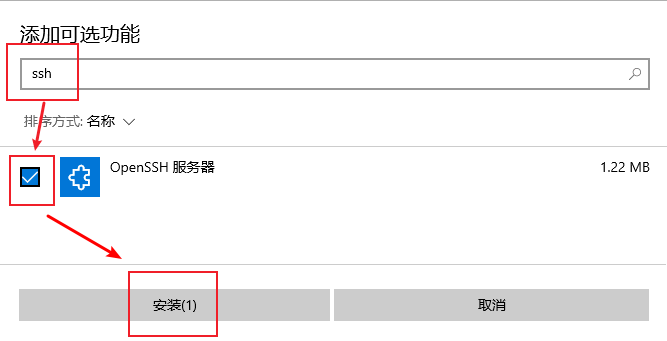

# SFTP 配置

> 使用 SFTP 进行文件传输是我们最为推荐的方案之一。

SFTP 在 Linux 平台上使用体验较佳，能提供几乎无需配置的便捷性和全平台通用的兼容性，且与 Sakura Frp 此类端口数有限的端口映射服务相性良好。
您所需要做的仅仅是将 SSH 服务打开，然后穿透 SSH 服务的端口即可，下面所有的内容主要为 Windows 用户准备。

但是 SFTP 在 Windows 上配置需要一点点只看文字教程的话会稍具复杂度的操作，所以我们提供此篇图文教程帮您作为普通用户重新发现配置的简单。

## 安全

下面的教程同时打开了 SSH 和 SFTP 服务，而且默认使用密码登录，这意味着任何人只要有您的密码都可以随意控制您的电脑。

为了教程的简洁和易于操作，我们于此省略了在配置中为此 SSH 服务加固的措施，如果您仍有余裕，请在互联网上查看相关文章进行配置。

::: danger 安全警告
为了保证安全，此 SSH/SFTP 隧道 **必须 打开「[访问认证](/bestpractice/security.md)」**，且配置后完整观看前述文档。
:::

## OpenSSH 服务器安装

OpenSSH 是最常见的 SSH/SFTP 客户端/服务器软件。微软现为 Windows 7+ 的系统提供 OpenSSH 软件，Windows 10 1803+ 更可一键安装，使用和配置都相当简单。

### Windows 10 1803+

对于此类较新的系统，可以直接从设置中打开「应用」-「可选功能」-「添加可选功能」，选中「OpenSSH 服务器」并点击安装来快速安装。




### Windows 7+

对于此类稍老的系统，您需要在 [GitHub](https://github.com/PowerShell/Win32-OpenSSH/releases/latest) 手动下载安装包。

> 对于国内不可控的网络环境，您对 GitHub 的访问可能不稳定，此时可以使用 [FastGit 提供的镜像服务](https://github.com/PowerShell/Win32-OpenSSH/releases/latest) 下载安装包。
> 下面的教程步骤部分源于 PowerShell/Win32-OpenSSH 项目中的[文档](https://github.com/PowerShell/Win32-OpenSSH/wiki/Install-Win32-OpenSSH)，如需更详细配置或遇疑难杂症，请参考此文档。

通常下载其中的 `OpenSSH-Win32.zip` 即可。

将其中的文件解压到 `C:\Program Files\OpenSSH` 中，
（在解压/复制过程中，您可能被要求管理员权限，请同意。如果您希望拒绝，请将文件解压到另一个不需要管理员权限的目录，然后设置为仅允许管理员和`SYSTEM`账户访问。）：


启动一个有管理员权限的 PowerShell 或 命令提示符，请确认窗口标题中存在 `管理员` 字样（如果您不希望使用管理员权限安装服务，请自行配置并跳过下面的教程）：


在此窗口中执行（复制后使用右键点击其中可以粘贴）：

```batch
cd "C:\Program Files\OpenSSH"
powershell.exe -ExecutionPolicy Bypass -File install-sshd.ps1
```


## 启动服务

安装程序会将服务端安装为 Windows 的「服务」，但是默认不会启用，您可以按需选择如何启用。

首先打开任务管理器（Win7/10 右键菜单栏，Win11 使用 Ctrl-Shift-Esc 组合键），
在「服务」tab 下，点击「服务」或「打开服务」按钮即可打开服务管理器：


找到「OpenSSH SSH Server」项，如果只需要启动一次或每次需要时手动启动，点击「启动此服务」即可，
如需令其开机自启动，双击项目，更改启动类型至「自动」即可开机启动：


## 登录凭据设置

### 密码登录

直接使用您 Windows 的登录账户名作为用户名，登录密码作为密码登录即可。

但请注意：Windows 登录无密码则无法登录，而不是 SFTP 也无密码。

## 穿透隧道设置

创建一个 `TCP` 隧道，映射目标为 `127.0.0.1`，端口 `22` 即可。

::: danger 安全警告
为了保证安全，此 SSH/SFTP 隧道 **必须 打开「[访问认证](/bestpractice/security.md)」**，且配置后完整观看前述文档。
:::

## 进阶用法（可选）

### 公钥登录

公钥登录更安全，但是配置麻烦，本教程不包含。

如需使用公钥登录，您应当是不需要此教程的极客。

### 快速手动启动

可以使用 `net start sshd` 启动服务，将其保存为批处理可以在需要时快速手动启动。

### 防火墙配置

如果需要在局域网内的其他设备上访问，您可能需要配置防火墙，使用：

```batch
netsh advfirewall firewall add rule name=sshd dir=in action=allow protocol=TCP localport=22
```

即可允许局域网上的设备访问。**但请做好安全措施。**
