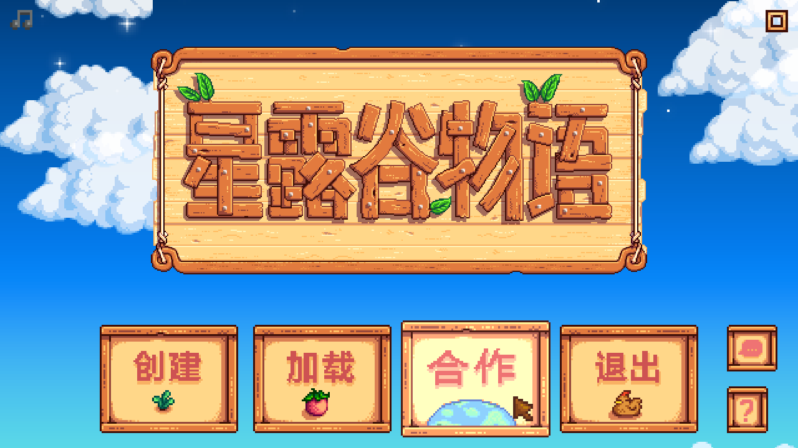
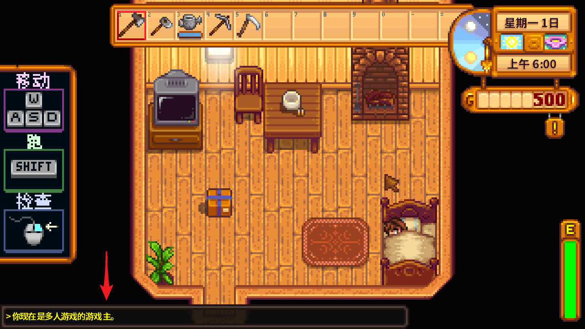
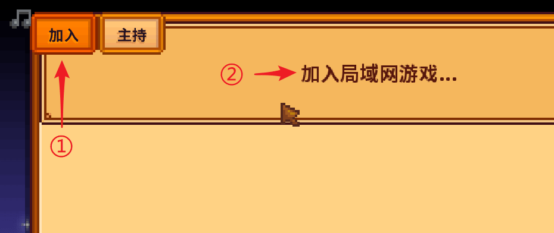
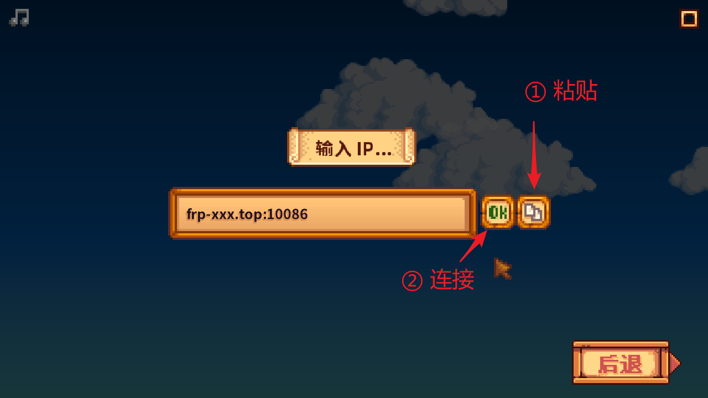
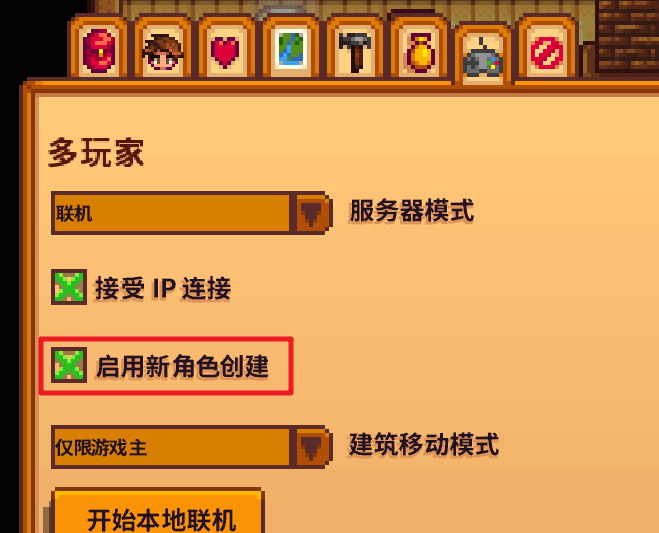
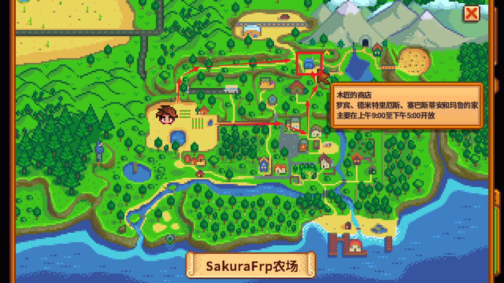
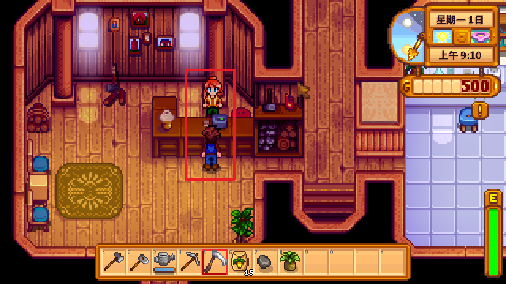
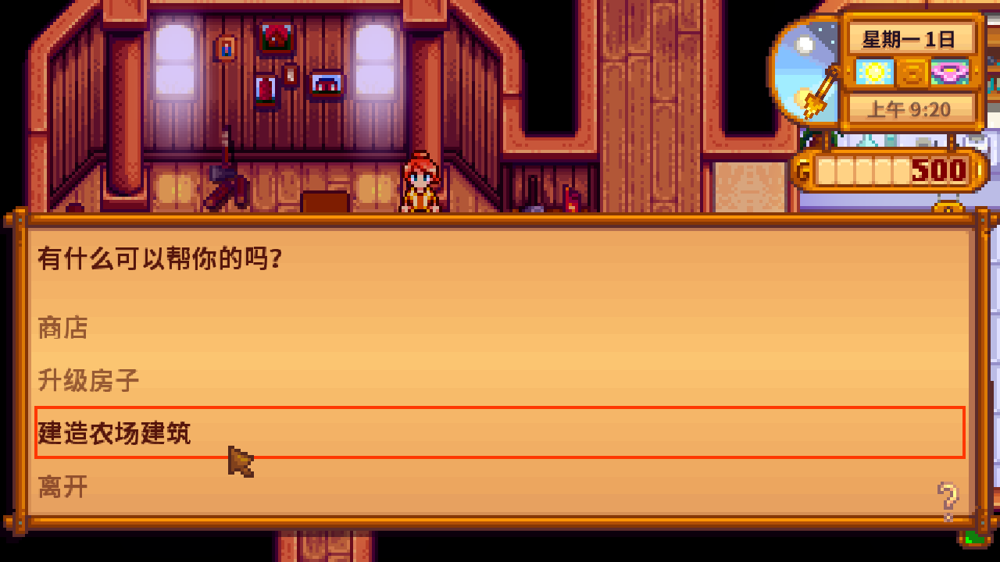
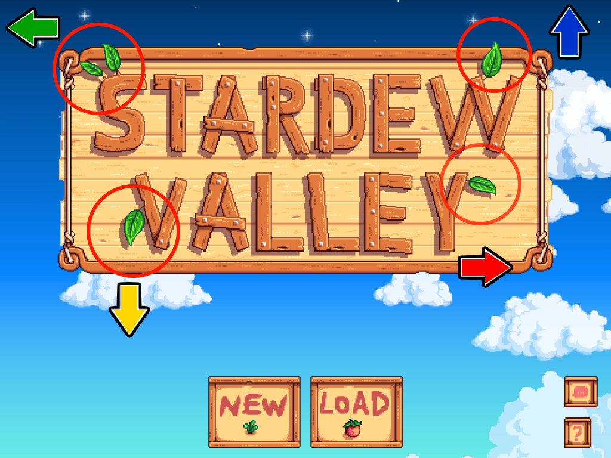

# 星露谷物语 (Stardew Valley) 联机指南

本文档将指导您创建星露谷物语的联机房间，并通过 frp 将其暴露到公网以供其他人连接。

::: tip 手机版星露谷物语自 1.6 版本后支持多人联机，
但是我们建议您不要使用手机开服（作为游戏主持/开房），手机后台策略和网络可能影响稳定性。  
**联机是跨平台的**，您完全可以使用电脑开服后在手机上加入游戏，这能大大提高稳定性。

如果需要手机进行联机游玩（无论是加入还是主持），请跳转到 [移动版游戏开启联机](#mobile-multiplayer) 一节。
:::

## 创建联机房间 {#host-room}

启动游戏，点击主菜单中的 `合作` 按钮：



::: tip
如果此处没有显示您的本地存档，请参考 [建造联机小屋](#build-cabin) 一节将本地存档转换为联机存档
:::

在左上角选择 `主持`，然后选择已有的存档或点击 `主持新农场...` 创建一个新存档：


进入游戏后，请确认左下角有 `你选择是多人游戏的游戏主` 的提示，这样联机房间就创建好了：



## 创建并启动隧道 {#create-tunnel}

在游戏主的电脑上安装 SakuraFrp，创建一条 `UDP` 隧道

- 隧道名称：自己取一个容易识别的名字
- 隧道类型：`UDP`
- 本地 IP：留空不填
- 本地端口：在下拉列表中选择 `Stardew Valley / 星露谷物语 (24642)`

除非您非常清楚自己在做什么，否则其他设置务必保持默认。

开启隧道，如果一切正常，在日志中会出现下方的输出：

```log
UDP 隧道启动成功
使用 >>frp-xxx.com:10086<< 连接你的隧道
或使用 IP 地址连接: >>114.51.4.191:10086<<
2024/02/31 11:11:12 [I] [233/10/qwqw] [wdn**666.MyStardewValley] 隧道启动成功
```

日志中的 `frp-xxx.com:10086` 或 `114.51.4.191:10086` 就是连接您的星露谷物语游戏的地址。

由于星露谷物语原版中没有密码保护功能，建议您在不联机时关闭隧道，以免游戏被其他人意外加入。

## 加入联机房间 {#join-room}

打开游戏，点击主菜单中的 `合作` 按钮，然后选择 `加入局域网游戏...`：



在弹出的界面中输入日志中显示的隧道连接地址，然后点击 `Ok` 就可以进入角色选择界面了：



如果点击创建角色后直接返回角色选择界面，请确认房主已启用新角色创建：



## 建造联机小屋 {#build-cabin}

在星露谷物语中，每个玩家加入时都需要一个联机小屋。建造联机小屋后，本地存档也可以用于联机游戏。

首先，在本地游戏中前往 **木匠的商店**：



与 **罗宾** 进行对话，然后选择 `建造农场建筑`：





找到 `联机小屋` 并进行建造，这里通常有三种风格可供选择，需要消耗 100 金币和若干其他材料：


建造完成后返回农场睡觉，然后在第二天退出游戏，再点击 `合作` 就可以选择这个本地存档了。

## 移动版游戏开启联机 {#mobile-multiplayer}

目前移动版星露谷物语的联机功能仍可能不稳定，因此作为测试版功能存在，  
您需要使用下面的秘籍来开启多人游戏功能。

首先，您应当点击右下角的语言列表，并将游戏切换到英文（`English`）语言。  
目前这个秘籍只能在英文版界面使用，在您开启之后即可切换回中文。

现在我们有英文版的游戏主界面，在这个界面中可以看到招牌上有四个叶子，  
在下面图中圈出并以 ↑ ↓ ← → 来表示这四个叶子，  
依次点击 ↑ ↑ ↓ ↓ ← → ← →，然后点击右下角的问号按钮，即可解锁多人模式。



关闭点击问号按钮弹出的菜单后，您会看到游戏主界面中多了一个多人游戏（`CO-OP`）按钮。

在开启完成后您可以在右下角的语言列表中切换回中文界面，多人游戏按钮会保留。
