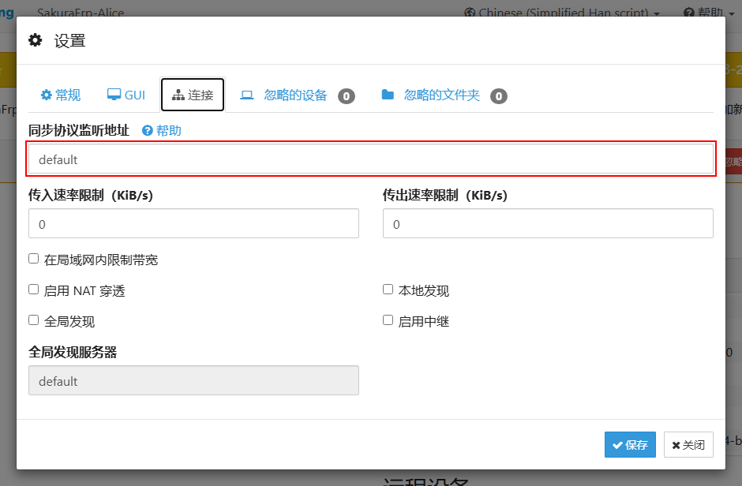
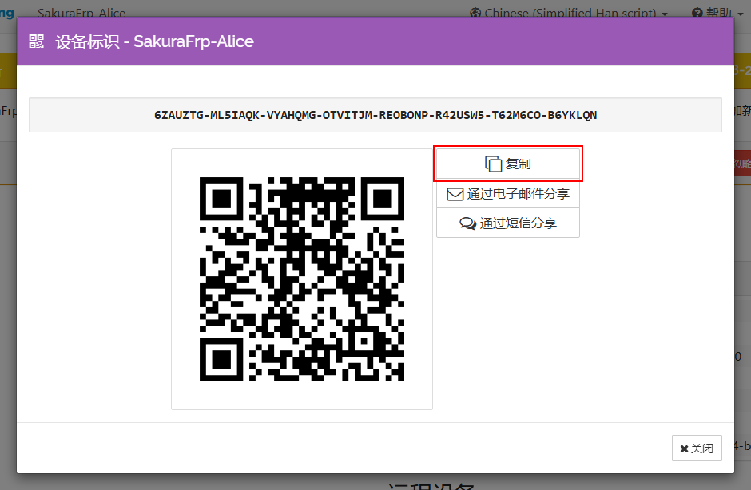
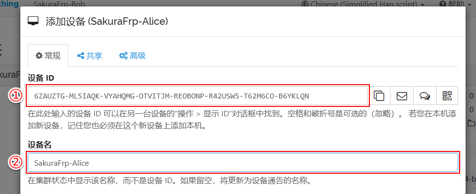
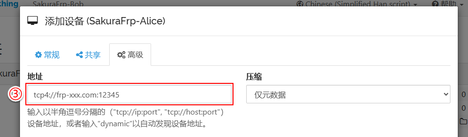
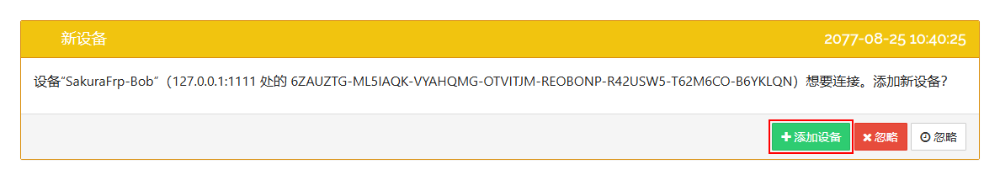
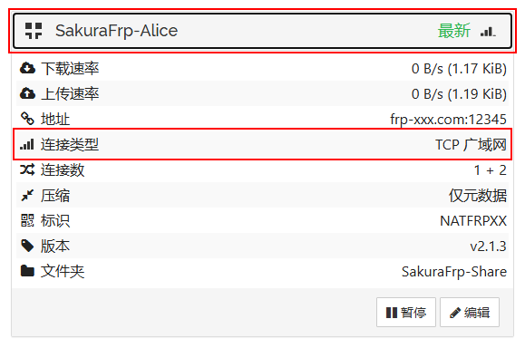

# Syncthing 文件同步穿透指南

<app-info :time="15" :difficulty="3" :access="[
    { proto: 'TCP', local: '22000', method: 'Syncthing 客户端' },
]" />

本文档将指导您把 Alice 的 Syncthing TCP 同步端口穿透到外网，然后让 Bob 使用隧道地址添加 Alice 并同步文件。

本文档使用 Windows 11 x64、Syncthing v2.1.3 中文界面进行演示，其他版本的按钮位置可能不同。

## 确认 Alice 同步端口 {#set-listen-address}

在 Alice 的 Syncthing WebUI 中打开 `操作 > 设置 > 连接`，查看 **同步协议监听地址**。



如果字段显示 `default`，TCP 同步端口就是 `22000`。如果显示自定义地址，请找到以 `tcp://`、`tcp4://` 或 `tcp6://` 开头的条目，记下末尾的端口号。下一步将这个端口填入隧道的 **本地端口**，无需修改监听地址。

::: tip
下文以 `default` 对应的 `22000/TCP` 为例。地址格式可参考 [Syncthing 配置文档](https://docs.syncthing.net/users/config.html) 和 [防火墙文档](https://docs.syncthing.net/users/firewall.html)。
:::

## 创建 TCP 隧道 {#create-tcp-tunnel}

前往 SakuraFrp [隧道列表](https://www.natfrp.com/tunnel/) 创建一条隧道：

- **隧道名称**：`Syncthing`
- **隧道类型**：`TCP`
- **本地 IP**：`127.0.0.1`
- **本地端口**：`22000`
- **远程端口**：随机分配

其他设置保持默认。创建完成后，在 Alice 所在电脑打开 SakuraFrp 启动器，刷新隧道列表并启动 `Syncthing`。

打开启动器的 **日志** 标签，确认看到 **TCP 隧道启动成功** 和连接方式：

```log
2077/08/25 09:29:49 I Tunnel/Syncthing [233/10/XXXX] 连接节点成功, 运行 ID [10-XXXXXXXX]
Tunnel/Syncthing TCP 隧道启动成功
Tunnel/Syncthing 使用 >>frp-xxx.com:12345<< 连接你的隧道
```

`frp-xxx.com:12345` 就是连接方式。冒号前的 `frp-xxx.com` 是节点域名，冒号后的 `12345` 是远程端口，请以您自己的日志为准。

## 在 Bob 添加 Alice {#add-device}

在 Alice 的 Syncthing WebUI 中打开 `操作 > 显示 ID`，点击 **复制**。



在 Bob 上点击 **添加远程设备**，填写：

1. 在图中 ① **设备 ID** 粘贴 Alice 的设备 ID
1. 在图中 ② **设备名** 填写 `SakuraFrp-Alice`



切换到 **高级** 标签页，将图中 ③ **地址** 的 `dynamic` 替换为 SakuraFrp 隧道地址。例如连接方式为 `frp-xxx.com:12345`，就填写：

```text
tcp4://frp-xxx.com:12345
```



切换到 **共享** 标签页，选择要同步的文件夹，然后点击 **保存**。

Bob 保存后会通过隧道向 Alice 发起连接。Alice 的 WebUI 出现 `SakuraFrp-Bob` 的设备请求后，点击 **添加设备**。



如果随后出现文件夹共享请求，也点击 **添加** 接受。

## 检查同步状态 {#verify-sync}

在 Bob 上展开 Alice 的设备卡片，确认：

- 设备状态为 **最新**
- **连接类型** 为 `TCP 广域网`（英文界面显示 `TCP WAN`）
- **地址** 显示 SakuraFrp 节点地址



分别在 Alice 和 Bob 的共享文件夹中创建一个非空文件。两个文件都出现在另一端，并且设备状态重新变为 **最新**，说明双向同步正常。

## 常见问题 {#troubleshooting}

### Alice 没有出现设备请求 {#no-device-request}

- 检查启动器日志是否显示 **TCP 隧道启动成功**
- 检查隧道的本地端口是否与 Alice 的 **同步协议监听地址** 一致
- 检查 Bob 填写的地址是否以 `tcp4://` 开头，并包含正确的节点域名和远程端口
- 如果启动器连接节点超时，检查系统代理是否允许 Launcher 和 frpc 连接该节点
- 检查系统防火墙是否允许 Syncthing 使用对应 TCP 端口，无需关闭系统整体防火墙

### 连接成功但没有文件 {#no-files}

确认 Alice 已接受 Bob 的设备请求和文件夹共享请求，并检查双方选择的文件夹 ID 是否相同。

### 是否要穿透 WebUI {#web-gui}

不需要。WebUI 默认使用 `8384/TCP`，属于管理界面，应保持仅本机可访问。设备间的同步流量仍由 Syncthing 使用 TLS 加密并通过设备身份认证，详情可参考 [Syncthing 安全原则](https://docs.syncthing.net/users/security.html)。
