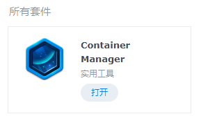
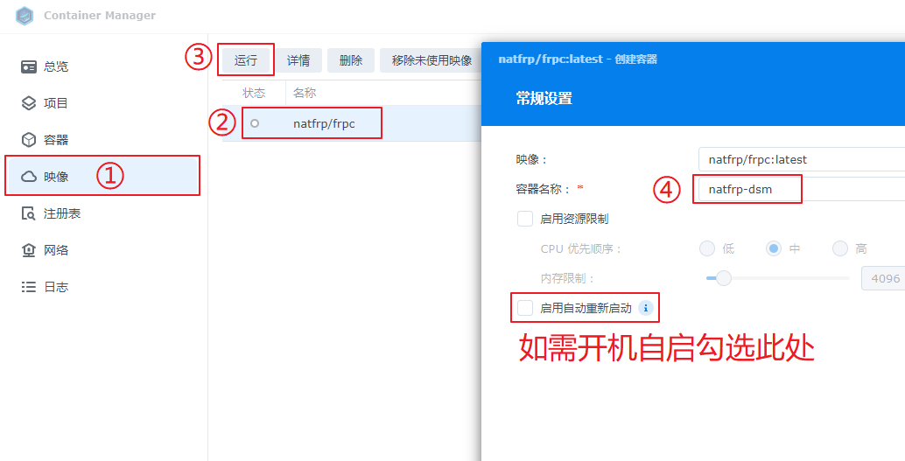
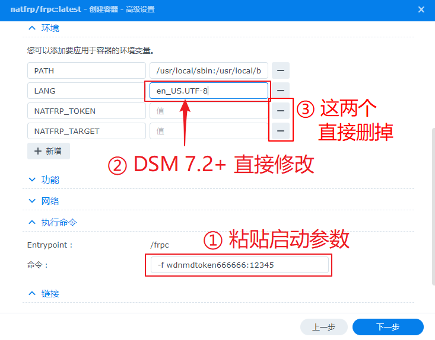
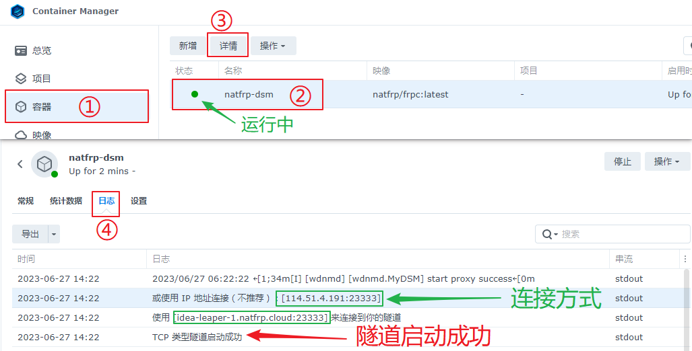

# 群晖 DSM 7 穿透指南 (frpc)

::: danger 该文档已过时
SakuraFrp 已提供启动器 SPK 软件包，推荐您参考 [此文档](/app/synology.md) 进行配置  
当前文档仅供参考，不再更新
:::

群晖 NAS 通常有两种配置方案，即 **「Docker 安装」** 和 **「直接安装」**，本篇教程同时包含这两种方案，以保证覆盖 Docker 激进人士、运维原教旨主义者和电子垃圾玩家。

如果您的群晖不是电子垃圾的话，我们建议您选择更优雅的 **「Docker 安装」**。否则，请选用 **「直接安装」**。

## 查看本地端口 {#local-port}

启动 **控制面板** 应用，转到 `系统 > 登录门户 > DSM > 网页服务 > DSM 端口 (HTTPS)`，记下这里的端口作为 **本地端口**。

如果您没有进行过修改，本地端口一般是 `5001`。请直接忽略上面的 (HTTP) 端口，这篇文档采用的是 HTTPS 协议。


## 安装 frpc 并启动隧道 {#install-frpc-and-start}

:::: tabs

@tab Docker 安装

::: warning
如果您的 NAS 采用 **ARM 架构**，DSM 系统可能不会提供 Docker 套件，这种情况下请选用 **「直接安装」**  
我们并不推荐您使用野生第三方措施强行安装 Docker，除非您有足够的技术储备来解决各种神奇问题
:::

### 安装 Docker 套件和镜像 {#docker-install-docker-image}

Docker 套件和镜像只要安装一次即可，无需重复操作。如需更新 frpc，请重新下载镜像并重置容器。

::: tip 关于 DSM 7.2+ 的说明
**Docker** 套件被改名为 **Container Manager**，不过配置和操作大同小异  


:::

1. 如果您的系统里没有 Docker 套件，请安装 Docker 套件：

   

1. 转到 **注册表** 页面，搜索 `natfrp`，选中 **natfrp/frpc** 并点击 **下载**：

   如果系统提示您选择标签，选择 `latest` 即可（通常这是默认选项）。

   

   ::: warning 2023 年最新情况
   如果您的 NAS 没有神奇的上网技巧的话，您在进行到这一步时应当会遇到 **注册表请求失败** 或类似错误，这是国内的网络新常态。

   要绕过此问题，您需要按照 [启用 SSH](#direct-enable-ssh) 中的方法连接到您的 NAS，然后执行下面的命令（期间需要输入密码，密码输入后没有回显）：

   ```bash
   sudo docker pull natfrp.com/frpc
   ```

   直到您看到回显：

   ```text
   Status: Downloaded newer image for natfrp.com/frpc:latest
   natfrp.com/frpc:latest
   ```

   接下来您可以进行 [创建隧道](#docker-create-tunnel) 了。
   :::

1. 稍等片刻，直到右上角出现 **已成功下载 Docker 镜像** 的通知，镜像就安装完成了：

   

### 创建隧道 {#docker-create-tunnel}

1. 打开 Docker 套件的 **网络** 页面，查看 `bridge` 网络的 **子网**，把 **最后一个** `0` 换成 `1` 作为 **本地 IP**。

   举个例子，子网 `172.17.0.0/16` 对应的 **本地 IP** 就是 `172.17.0.1`。

   

1. 前往 Sakura Frp 管理面板使用之前获取到的信息创建一条 **TCP 隧道**，红框部分为必填：

   

1. 在隧道列表中点击刚才创建的隧道右边三个点，选择 **配置文件** 并在弹出的对话框中复制隧道的 **启动参数**：

   

### 启动隧道 {#docker-start-tunnel}

1. 转到 **映像** 页面，选中刚才下载的 **natfrp/frpc:latest** 并点击 **启动**，输入一个自定义名称并点击 **高级设置**：

   ::: warning
   如果您在安装镜像时使用了上面的命令法，请寻找下方写着 `注册表: Aliyun Hub` 的项目。
   :::

   ::: tip
   如果您希望隧道开机自启，请勾选 **启用自动重新启动** 选项
   :::

   :::tabs

   @tab DMS 7.2+

   

   @tab DSM 7

   

   :::tabs

1. 转到 **环境** 标签，在 **命令** 处粘贴 **启动参数**，然后点击上面的 **新增** 按钮分别填写 `LANG` 和 `en_US.UTF-8`：

   ::: warning
   请全程复制粘贴，不要手动输入，否则多半会出错
   :::

   :::tabs

   @tab DMS 7.2+

   

   @tab DSM 7

   

   :::tabs

1. 创建完成后，隧道会自动启动。如果一切正常，您就可以在日志中找到连接方式了（当然，也可以在 Sakura Frp 管理面板查看）：

   :::tabs

   @tab DMS 7.2+

   

   @tab DSM 7

   

   :::tabs

1. 在连接方式前面加上 `https://`，然后您就可以使用此 URL 访问 DSM 管理面板了，例如：

   - `https://114.51.4.191:23333/`
   - `https://idea-leaper-1.natfrp.cloud:23333/`

   都可以访问 **本次教程中用作示例的** 这条隧道，请以实际日志输出为准，上面列出的网址 **只是示例**。

@tab 直接安装

::: warning 安全提示
直接安装 frpc 需要通过 SSH 连接到您的 NAS，建议在配置完成后关闭 SSH 功能
:::

### 创建隧道 {#direct-create-tunnel}

前往 Sakura Frp 管理面板创建一条 **TCP 隧道**，**本地IP** 留空使用默认值，**不要往里面填任何东西**：


### 启用 SSH 功能 {#direct-enable-ssh}

1. 启动 **控制面板** 应用，转到 `应用程序 > 终端机和 SNMP > 终端机`，启动 SSH 功能并记下这里的端口 (例如 `22`)：

   

1. 通过此处的 SSH 端口和您登录 DSM 管理面板的帐号密码连接到 SSH 终端，使用 `sudo -i` 命令提升到 root 权限，您可能需要再输入一次 DSM 管理面板的密码。

   ::: tip
   如果您需要一个 SSH 客户端，可以从这里下载：[PuTTY](https://www.chiark.greenend.org.uk/~sgtatham/putty/latest.html)
   :::

### 安装 frpc 并启动隧道 {#direct-start-tunnel}

DSM 7 已提供 Systemd 支持，因此直接安装流程会比之前的版本简单一些。

请先参考 [Linux 使用教程/安装 frpc](/frpc/usage.md#linux-install-frpc) 一节安装 frpc。

然后，参考 [这篇指南](/frpc/service/systemd.md) 配置 Systemd 服务、启动 frpc 即可，**Unit名称** 请使用之前创建的那条隧道的启动参数。

请注意，连接 DSM 隧道时需要在连接方式前面加上 `https://`，例如 `https://idea-leaper-1.natfrp.cloud:23333/`。

::::
