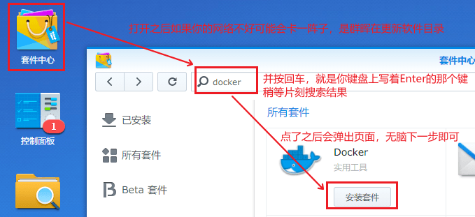
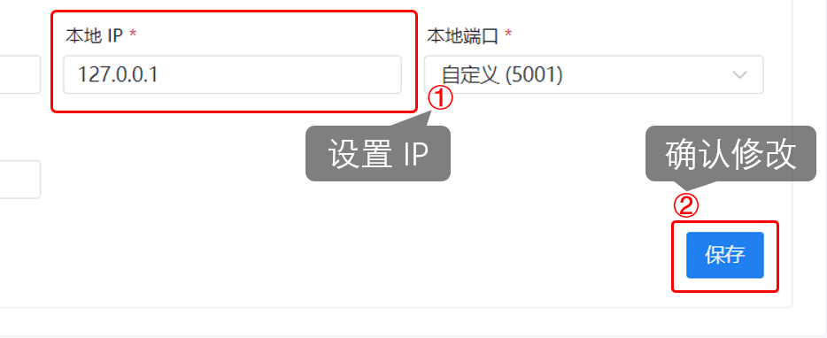
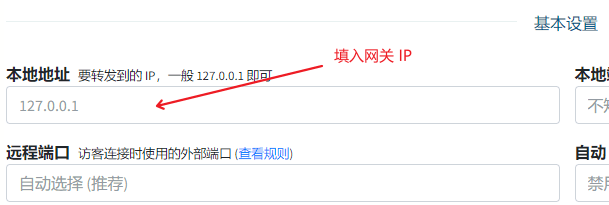
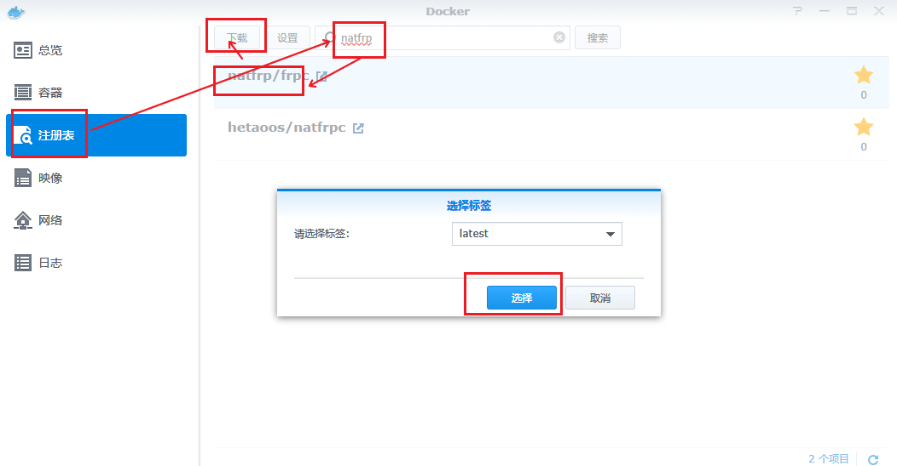
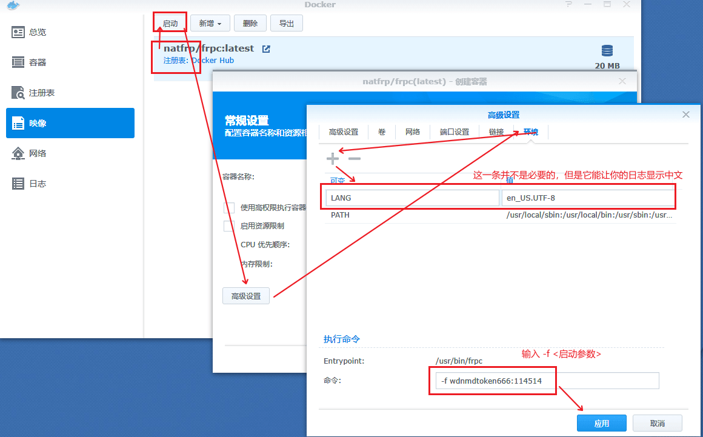
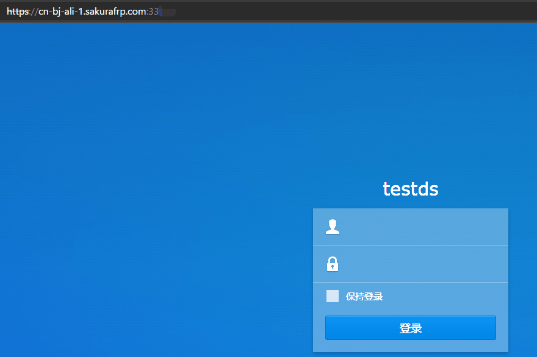
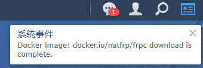

# 群晖(Synology) NAS 穿透指南

群晖 NAS 通常有两种配置方案，即 **直接在系统上安装** 和 **使用 Docker**，本篇教程同时包含这两种方案，以保证覆盖 Docker激进人士，运维原教旨主义者，和电子垃圾玩家

如果您的群晖不是电子垃圾的话，通常来讲适用更容易配置的 「Docker 安装」

但是对于 ARM 架构的 NAS 来说，DSM 系统并不提供 Docker UI，此时我们并不推荐您使用野生第三方措施强行安装 Docker，这样安装的 Docker 只能使用 host 网络，也没有易于配置的 UI，我们更加建议您「直接在系统上安装 frpc」

## 使用准备

### 配置 DSM 面板

?> 您也可以选择穿透 HTTP，但这可能会造成备案/机房屏蔽/ISP屏蔽等问题  
如果您选择穿透 HTTP，出现问题请自行解决

登录 DSM 面板，找到 `连接性->网络->DSM 设置->DSM 端口->HTTPS`，记下这里的端口，后面创建隧道时需要用到


如果您不使用 Docker 部署的话，找到 `应用程序->终端机和 SNMP`，确保 SSH 功能已启用并记下这里的 SSH 端口


### 创建隧道

!> 标有 **拦截 HTTPS** 的节点可能无法正常使用

选择隧道类型为 TCP，填写本地端口为 **0x01** 中记下的 HTTPS 端口，其他设置可以留空


## 使用 Docker 部署穿透服务

?> 本教程以 DSM 6 系统作为 GUI 操作举例，DSM 7 大同小异

ARM 架构的 DSM 系统目前不提供 Docker GUI，请 [直接在系统中部署穿透服务](#直接在系统中部署穿透服务)

如果没有 Docker 应用的，请参考下图安装 Docker



### 设置隧道

因为 docker 网络模型的原因，我们像从前一样把隧道的 本地IP 设置为 `127.0.0.1` 已经不再奏效，必须修改设置中的此项。

此处需要分情况讨论：
 - 当修改为 `host` 宿主网络模式时，只需要设置为上级网关分配给当前设备的 ip 即可（人话：设置为路由器给群晖的ip）
 - 当保持默认的 `bridge` 网桥模式时，我们需要设置为对应网桥的网关 ip 才能恰当的访问当前设备，因为该方案兼容性和安全性更高，**下面的教程默认采用此方案**

首先打开群晖的 Docker 应用，根据图上的方法算出我们需要的 ip，即 网关ip


在 隧道列表 中，编辑要用的隧道，设置 本地IP 为该 IP



或者在新建隧道时将其设置为 本地IP



这样隧道就准备完了

### 设置Docker

首先我们需要获取镜像，跟着图片操作即可：



获取到镜像后就可以启动一个「实例」，请注意，此处「命令」栏中输入的是一个启动参数，如何写可以参考 [Docker指南](/frpc/usage/docker)

!> 虽然图中只有 `-f` 部分，但我们非常建议您启用远程控制

设置好后应用，然后启动即可



### 获取连接信息

连接信息在 docker实例 的日志中，跟着图片打开它，你就能看到


打开浏览器，试一下



### 注意事项

群晖的编辑容器中有「启用自动重启启动」的选项，该选项默认关闭，建议打开它


### 如何更新

首先，再进行一次下载


接下来你应该看到右下角网络监控处的下载流量提升

等到右上角出现提示时即已经更新完成



接下来停止需要升级的容器，选中它点击 「操作 - 清除」，然后再启动时即升级到了最新版

## 直接在系统中部署穿透服务

### 安装 frpc

通过上面提到的 SSH 端口和 DSM 面板的账号、密码登入到 NAS，如果您不知道如何操作请自行百度

接下来，请参考 [Linux 使用教程](/frpc/usage/linux) 中的 **安装 frpc** 一节安装 frpc

注意这里需要采用 `sudo -s` 切换到 `root` 账户，不能使用 `su` 命令，提示输入密码时请输入 DSM 登录密码

### 配置服务文件

!> 配置服务文件 和 测试服务 部分的教程是为 DSM5/6 准备的，如果您在使用 DSM7，本部分操作您应当参考 [systemd 配置教程](/frpc/service/systemd)；别担心，我们更喜欢 systemd

执行下面的命令编辑配置文件

```bash
# vim /etc/init/frpc.conf
```

?> 如果您按照本文档进行配置并使用了下面的内容，frpc 会在系统启动时自启并在出错时自动重启，无需额外配置

直接写入下面的内容即可，注意把文件中的启动参数换成您的启动参数

```upstart
description "SakuraFrp synology frpc service"

author "FENGberd"

start on syno.network.ready
stop on runlevel [016]

respawn
respawn limit 0 5

exec /usr/local/bin/frpc -f <您的启动参数，如 wdnmdtoken666666:12345>
```

## 测试服务

执行下面的命令测试 frpc 是否能正常运行

```bash
# start frpc
# tail /var/log/upstart/frpc.log
```

如果您看到了图中的两个提示，则 frpc 已安装完毕并可以正常使用了


现在您可以通过 `https://<节点域名>:<远程端口>` 的方式访问 DSM 面板，也可以使用 `https://<日志中标出的连接方式>` 访问，推荐使用节点域名

在本示例中，我使用的是 `https://cn-bj-bgp.sakurafrp.com:39147`


