# 群晖(Synology) NAS 穿透指南

群晖 NAS 通常有两种配置方案，即 **「Docker 安装」** 和 **「直接安装」**，本篇教程同时包含这两种方案，以保证覆盖 Docker 激进人士、运维原教旨主义者和电子垃圾玩家。

如果您的群晖不是电子垃圾的话，我们建议您选择更优雅的 **「Docker 安装」**。否则，请选用 **「直接安装」**。

::: warning
如果您的 NAS 采用 ARM 架构，DSM 系统可能不会提供 Docker 套件。我们并不推荐您使用野生第三方措施强行安装 Docker，这样安装的 Docker 没有易于配置的 UI，也可能存在各类网络问题。这种情况下请选择 **「直接安装」**
:::

## 确认 DSM 版本

在进行穿透之前，请先确认您的 DSM 系统版本。本指南对应的是 **DSM 7** 系统，如果您使用的是 **DSM 6**，请查看 [这篇指南](/app/synology-dsm6)。

DSM 7 的登录界面是这样的：

DSM 6 的登录界面是这样的：

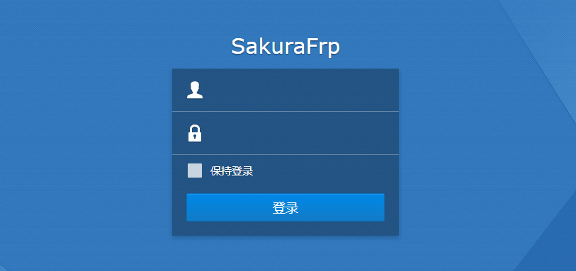

## 使用准备

启动 **控制面板** 应用，转到 `系统 > 登录门户 > DSM > 网页服务 > DSM 端口 (HTTPS)`，记下这里的端口作为 **本地端口**。

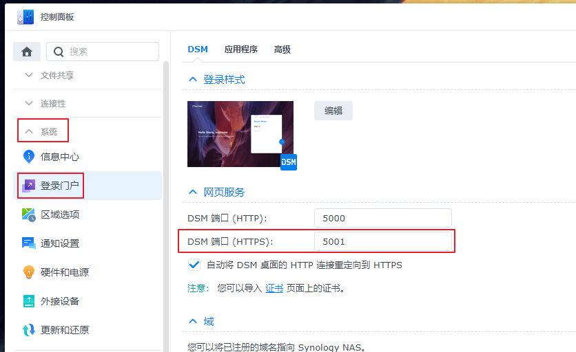

## Docker 安装

### 安装 Docker 套件和镜像

::: tip
Docker 套件和镜像只要安装一次即可，无需重复操作。如需更新 frpc，请删除原有镜像并重新下载一次
:::

如果您的系统里没有 Docker 套件，请安装 Docker 套件：

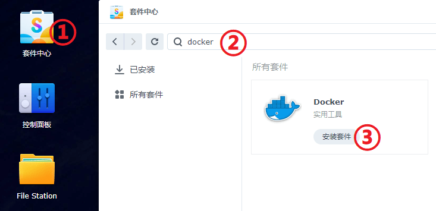

转到 **注册表** 页面，搜索 `natfrp`，选中 **natfrp/frpc** 并点击 **下载**：

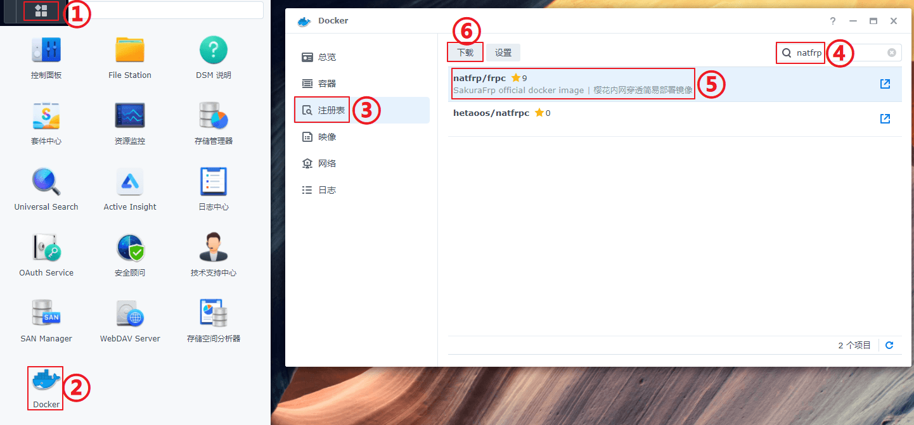

如果系统提示您选择标签，选择 `latest` 即可（通常这是默认选项）。

稍等片刻，直到右上角出现 **已成功下载 Docker 镜像** 的通知，镜像就安装完成了：

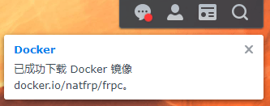

### 创建隧道

打开 Docker 套件，转到 **网络** 页面，查看 `bridge` 网络的 **子网** 地址，然后把 **最后一个** `0` 换成 `1` 作为 **本地IP**。

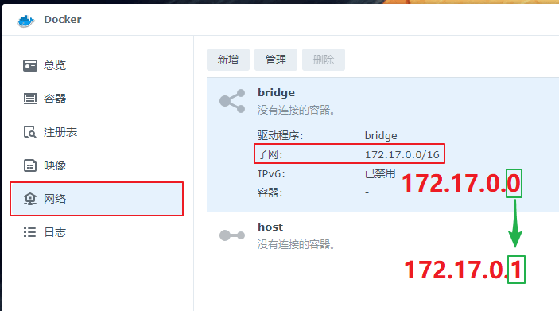

前往 Sakura Frp 管理面板使用之前获取到的信息创建一条 **TCP 隧道**：

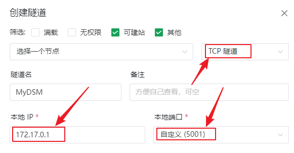

创建隧道后，在隧道列表中点击对应隧道右边的三个点，选择 **配置文件** 并在弹出的对话框中复制隧道的 **启动参数**：

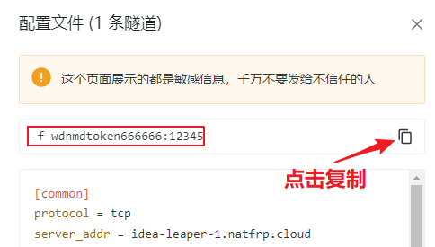

### 启动隧道

转到 **映像** 页面，选中刚才下载的 **natfrp/frpc:latest** 并点击 **启动**，输入一个自定义名称并点击 **高级设置**：

::: tip
如果您希望隧道开机自启，请勾选 **启用自动重新启动** 选项
:::

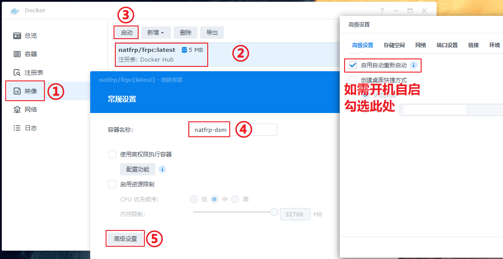

转到 **环境** 标签，在 **命令** 处粘贴 **启动参数**，然后点击上面的 **新增** 按钮分别填写 `LANG` 和 `en_US.UTF-8`：

::: warning
请全程复制粘贴，不要手动输入，不要手动输入，不要手动输入
:::

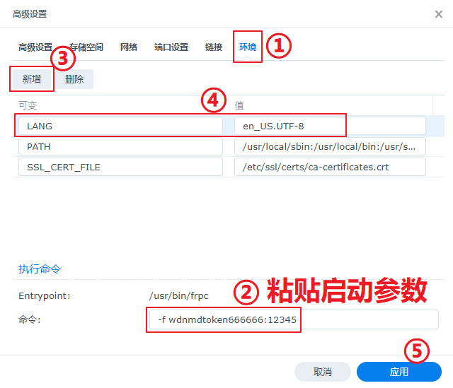

创建完成后，隧道会自动启动。如果一切正常，您就可以在日志中找到连接方式了（当然，也可以在 Sakura Frp 管理面板查看）：

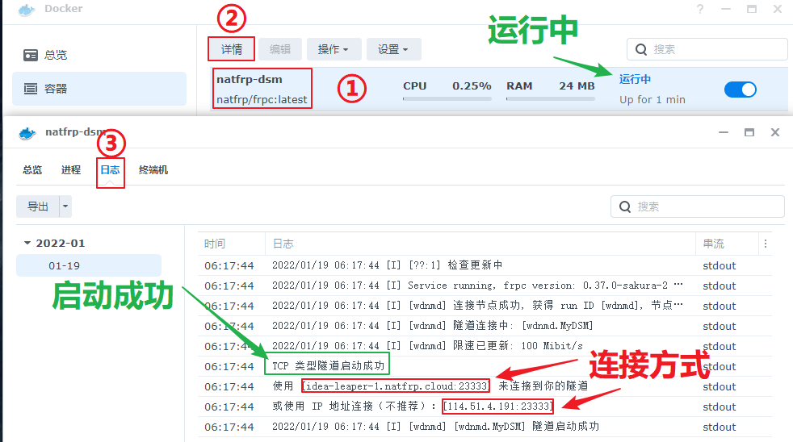

在连接方式前面加上 `https://`，然后您就可以使用此 URL 访问 DSM 管理面板了。

在这个例子中，我们使用 `https://idea-leaper-1.natfrp.cloud:23333/` 或者 `https://114.51.4.191:23333/` 即可访问。

## 直接安装

首先，前往 Sakura Frp 管理面板创建一条 **TCP 隧道**，**本地IP** 留空使用默认值：

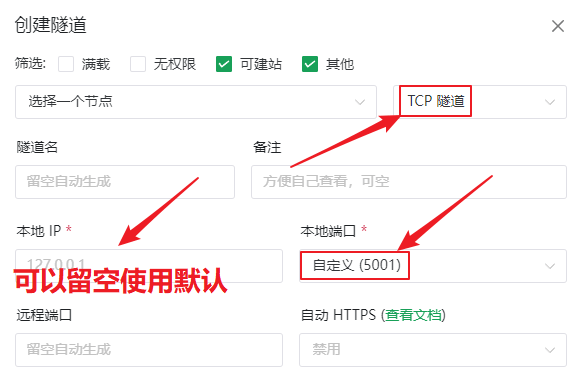

启动 **控制面板** 应用，转到 `应用程序 > 终端机和 SNMP > 终端机`，启动 SSH 功能并记下这里的端口。

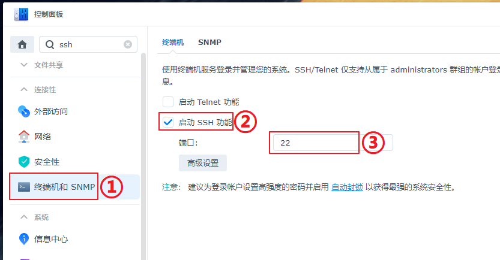

然后通过此处的 SSH 端口和您登录 DSM 管理面板的帐号密码连接到 SSH 终端，使用 `sudo -i` 命令提升到 root 权限，您可能需要再输入一次 DSM 管理面板的密码。

接下来请参考 [Linux 使用教程/安装 frpc](/frpc/usage#linux-install-frpc) 一节安装 frpc。

最后，参考 [这篇指南](/frpc/service/systemd) 配置 Systemd 服务即可。
