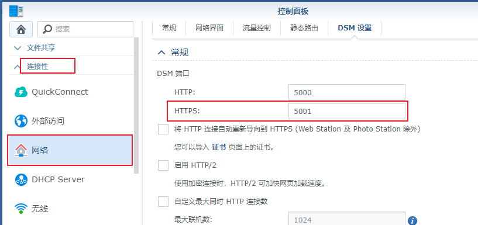
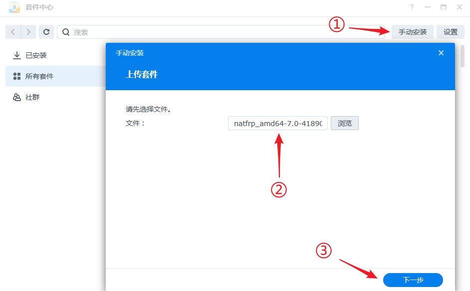
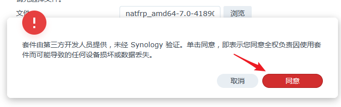
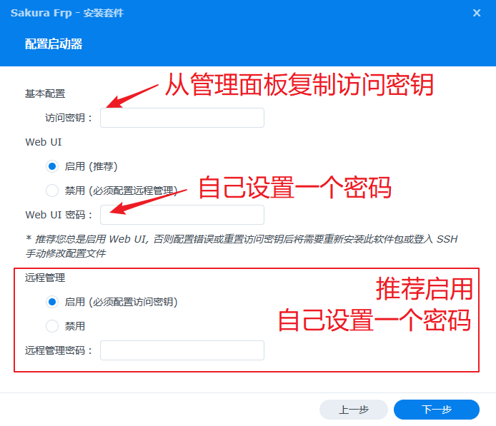
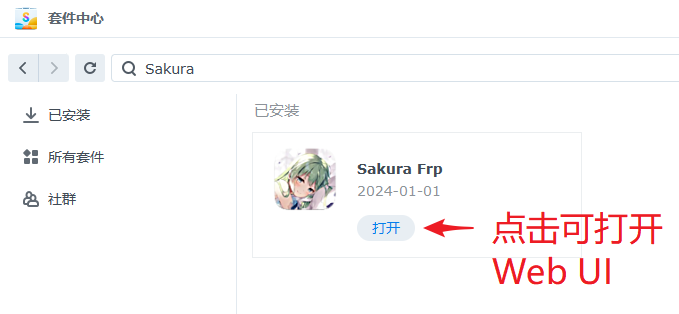

# 群晖 (Synology) NAS 穿透指南

本文档将指导您安装 SPK 软件包并通过启动器在 NAS 上启动隧道。

## 确认 DSM 版本与架构 {#check-dsm-version}

在进行穿透之前，请先对照下面的图片，根据登录界面的外观确认您的 DSM 系统版本。

::: tabs

@tab DSM 7 登录界面

@tab DSM 6 登录界面

:::

如果您还不清楚自己的 NAS 架构，请通过 SSH 登录 NAS 并执行 `uname -m` 命令，根据输出查表：

| 输出 | 架构 |
| --- | --- |
| `x86_64` | amd64 |
| `aarch64` | arm64 |
| `armv7l` | armv7 |

本文档以 DSM 7.2 系统进行演示。对于 DSM 6.X 系统，部分按钮的位置可能会有所不同，请自行确认。

## 查看本地端口并创建隧道 {#create-tunnel}

::: tip 关于 Synology Drive Server 的提示
此教程中查看的是 DSM 管理面板的端口，指向该端口的隧道只能通过浏览器和 **DS File** 应用访问  
如您需要通过 **Synology Drive Client** 进行数据同步，请创建指向 `6690` 端口的隧道并连接至该隧道地址
:::

:::: tabs

@tab DSM 7

启动 **控制面板** 应用，转到 `系统 > 登录门户 > DSM > 网页服务 > DSM 端口 (HTTPS)`，记下 **本地端口**。

如果您没有进行过修改，本地端口一般是 `5001`。请直接忽略上面的 (HTTP) 端口，这篇文档采用的是 HTTPS 协议。

@tab DSM 6

启动 **控制面板** 应用，找到 `连接性 > 网络 > DSM 设置 > DSM 端口 > HTTPS`，记下 **本地端口**。

如果您没有进行过修改，本地端口一般是 `5001`。请直接忽略上面的 HTTP 端口，这篇文档采用的是 HTTPS 协议。

::::

前往 [隧道列表](https://www.natfrp.com/tunnel/) 创建一条 **TCP 隧道**：

- **本地 IP** 填写 `127.0.0.1`
- **本地端口** 填写上面记下的本地端口
- 其他配置请 **保持默认**

## 安装启动器并启动隧道 {#install-launcher}

1. 前往 [Nyatwork CDN](https://nya.globalslb.net/natfrp/client/launcher-dsm/) 下载对应的 SPK 文件，文件命名方式为 `natfrp_<架构>-<系统版本>_<启动器版本>.spk`

   例： `natfrp_amd64-7.0-41890_3.0.7-1.spk` 表示适用于 DSM 7.X、AMD64 架构的启动器 v3.0.7

   例： `natfrp_arm64-6.0-7321_3.0.7-1.spk` 表示适用于 DSM 6.X、ARM64 架构的启动器 v3.0.7

1. 打开 DSM 套件中心，点击 `手动安装` 按钮，选择并上传下载好的 SPK 文件：

   ::: warning 注意
   如果系统提示软件包格式不正确或 SPK 文件无效，请再次检查您下载的架构与系统版本
   :::

   

1. 阅读弹出的安全警告，确认您可以接受相关风险后点击 `同意`：

   

1. 在 `访问密钥` 处粘贴您的访问密钥，然后自己设置一个 Web UI 密码 (要求 8 字符以上)

   推荐您启用远程管理功能，启用时请自己设置一个密码  (需要 8 字符以上)：

   

1. 安装完成后套件应该会自动启动，如果套件无法正常启动，请检查您的安装流程和配置

   ::: warning 注意
   强烈建议您启用 Web UI，以便在重置访问密钥时修改配置  
   若未启用 Web UI 或需要修改 Web UI 密码，请重新安装 SPK 或通过 SSH 修改配置文件
   :::

1. 套件启动后，您可以打开 [远程管理](https://www.natfrp.com/remote/v2) 管理启动器：

   

1. 如果您启用了 Web UI，也可点击运行中套件的 `打开` 按钮访问 Web UI：

   

### 启动隧道 {#start-tunnel}

无论是通过 Web UI 还是远程管理连接，您应该都能看到刚才创建的隧道，双击或将其拖到上方启动：

然后，前往 `日志` 页面查看日志。如果一切正常，您就可以在日志中找到连接方式了（当然，也可以在 Sakura Frp 管理面板查看）：

在连接方式前面加上 `https://`，然后您就可以使用此 URL 访问 DSM 管理面板了，例如：

- `https://114.51.4.191:23333/`
- `https://idea-leaper-1.natfrp.cloud:23333/`

都可以访问 **本次教程中用作示例的** 这条隧道，请以实际日志输出为准，上面列出的网址 **只是示例**。

### 直接使用 frpc {#use-frpc}

我们推荐在任何情况下都优先使用启动器，直接使用 frpc 会增加配置、管理难度并可能造成不必要的故障和资源浪费。

如果您出于某种原因想直接使用 frpc 启动隧道，请参考下述文档：

- [群晖 DSM 6 穿透指南 (frpc)](/app/synology-dsm6.md)
- [群晖 DSM 7 穿透指南 (frpc)](/app/synology-dsm7.md)
