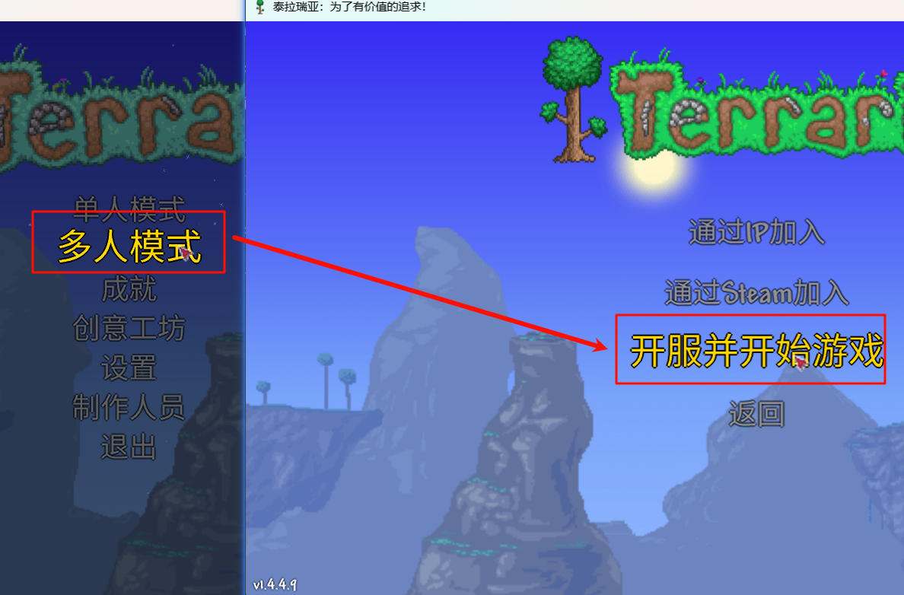
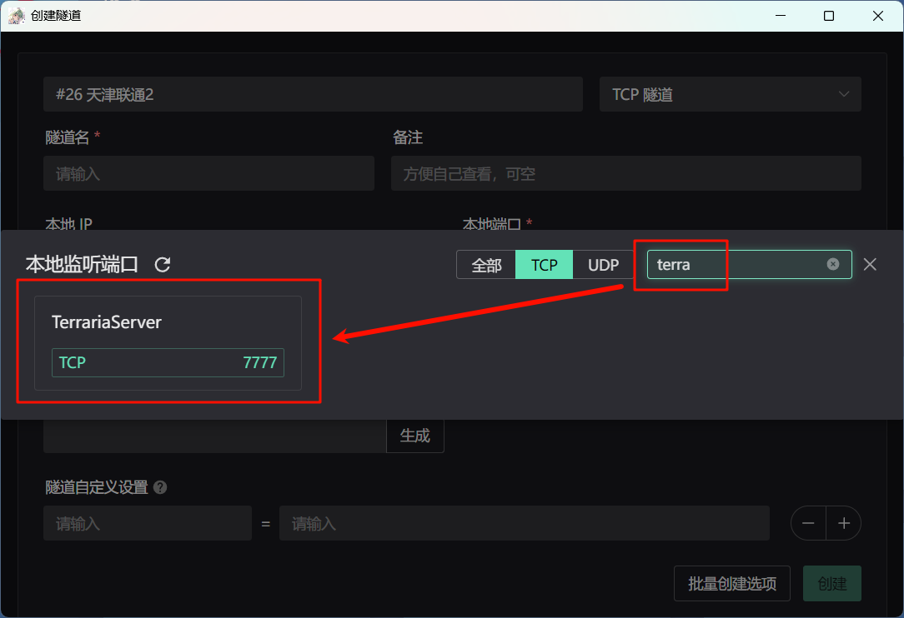
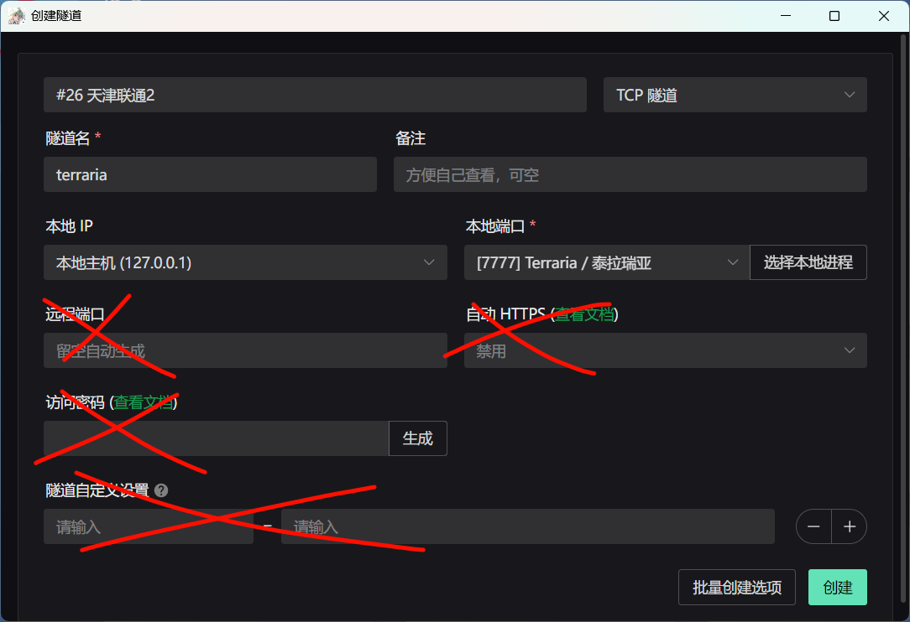
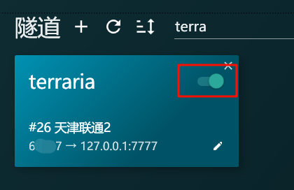
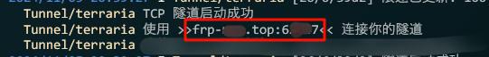
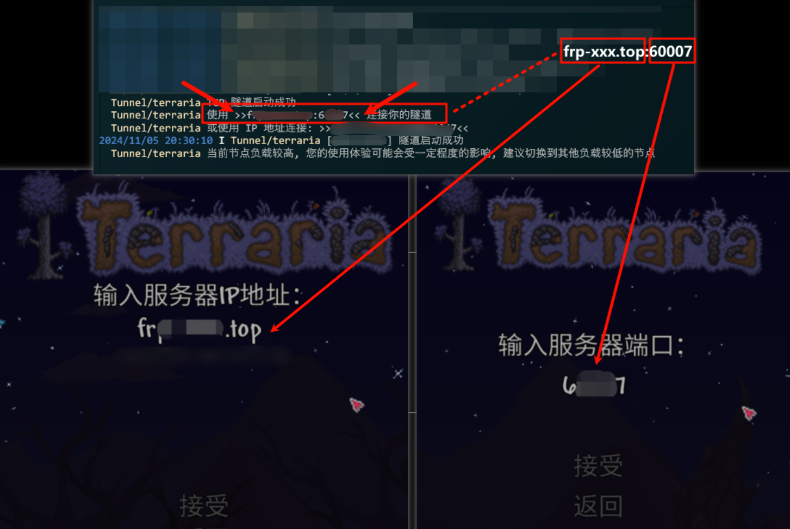

# 泰拉瑞亚 (Terraria) 联机穿透指南

泰拉瑞亚的联机穿透十分简单，但我们注意到有一些用户在使用时遇到了问题。

本指南希望通过提供一个标准的操作流程来帮助您避免这些简单的问题。

本指南旨在针对基础的泰拉瑞亚联机需求（即直接游戏内启动多人模式），使用 tModLoader 时的联机配置方法大同小异，您可以简单参考。

::: danger 在开始之前
通过与一些泰拉瑞亚玩家的交流，我们发现了一个常见问题：

如果您遇到了卡在 “正在发现服务器” / “正在连接 xxx:xxx” 或类似的界面来找解决方案，  
您应当是对网络的一切都感到非常迷惑，以至于把端口填进了IP。  
不要害怕，您可以转到 [连接游戏](#connect-game) 部分来快速得到正确的操作，或完整看完下面的文档。
:::

## 启动游戏多人模式

::: warning 重要提醒

通过与许多泰拉瑞亚玩家的交流，我们注意到下面的知识可能需要您的注意：

- **只有在开服后** 联机才能正常工作
- **只有在开服的游戏已经进入世界后** 联机才能正常工作
- **在开服的游戏关闭后** 或者 **隧道关闭时** 其他玩家将无法连接
- 每次需要联机时 **都需要开服**，也 **需要启动隧道**
- 在单人模式下 **即使打开隧道也无法联机**

:::

与您平时游玩通常使用单人模式不同，联机需要您使用 `多人模式` - `开服并开始游戏` 来开始游玩：

::: tip
为了您可以随时在需要时打开隧道即可联机，而不是需要每次都退出单人模式后进入多人模式，我们建议您平时就习惯使用多人模式游玩。
:::

## 配置穿透

在您确认已经打开游戏后，请打开 SakuraFrp 启动器，点击隧道界面的 `+` 按钮开始创建隧道。  
随意或根据就近原则选择一个节点，选择 `TCP 隧道` 类型。

点击本地端口旁边的 `选择本地进程` 按钮，您应当可以在列表中找到一个 `TerrariaServer`，且只应找到一个，且其端口应当为 `7777`，点击选择这个项目：

::: warning 请确保只有一个 TerrariaServer，且其端口为 7777
如果您找到多个 `TerrariaServer`，说明您有多个游戏服务端正在运行，请确认这是您想要的。  
如果您找到的 `TerrariaServer` 的端口不是 `7777`，您可能需要 **在每次联机前编辑隧道重新选择本地端口**。
:::

**不要设置其他内容**，点击创建隧道：

创建完成后，点击隧道右上角的开关，使其切换到 `开启` 状态即可启动隧道：

请在 SakuraFrp 启动器的 `日志` 页面中复制出隧道的连接信息，这个信息将会在您需要联机时使用（红框中的部分）：

## 连接游戏 {#connect-game}

当您的朋友需要加入您的游戏时，他们应当在游戏内选择 `多人模式` - `通过 IP 加入`。

此时应当已经收到您提供的连接信息，形如：`frp-xxx.top:11451`。  
连接信息以 `:` 分隔，前半部分当游戏提示 `输入服务器IP地址` 时输入，后半部分当 `输入服务器端口` 时输入：

## 再次使用

当您下次需要联机时，请切记 **打开游戏并启动多人模式**，然后打开 SakuraFrp 启动器，**确认隧道已经开启**，然后您的朋友就可以再次通过同样的连接信息加入您的游戏了。
