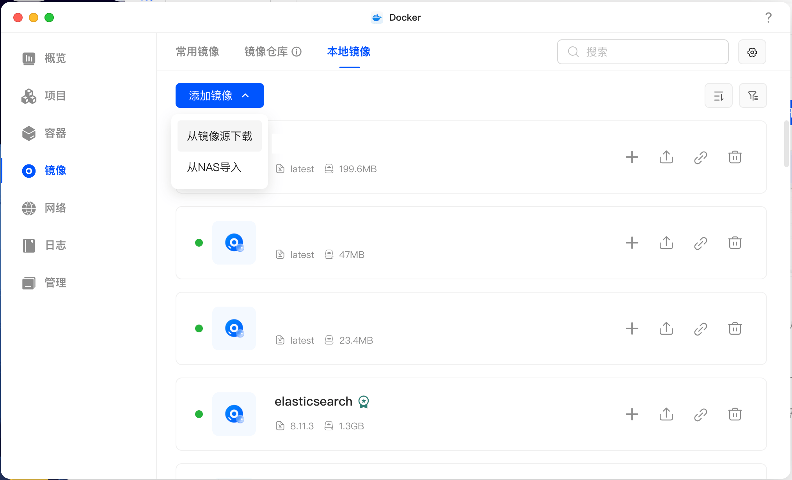
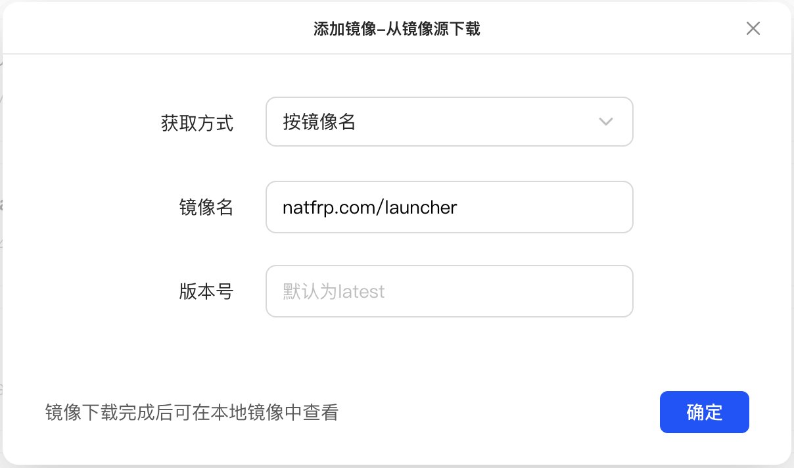
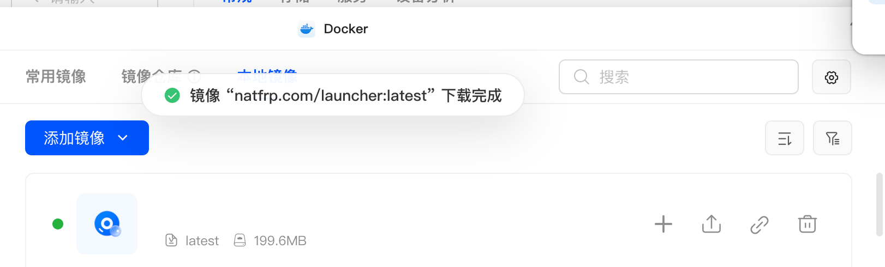
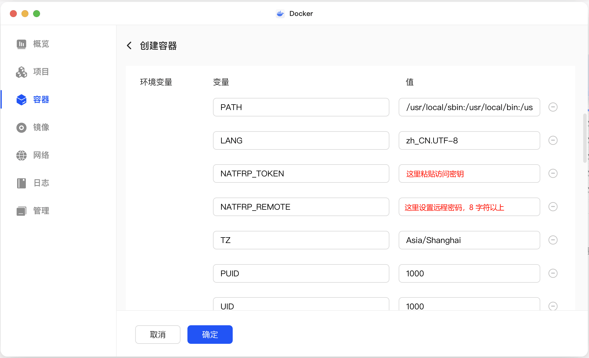
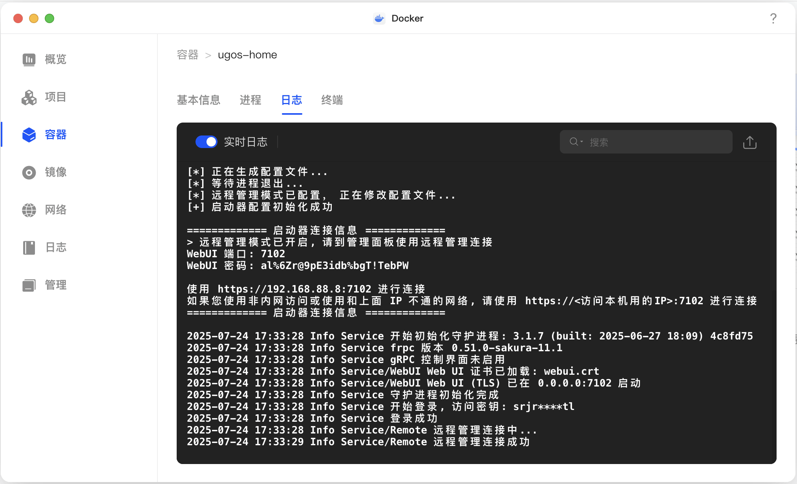
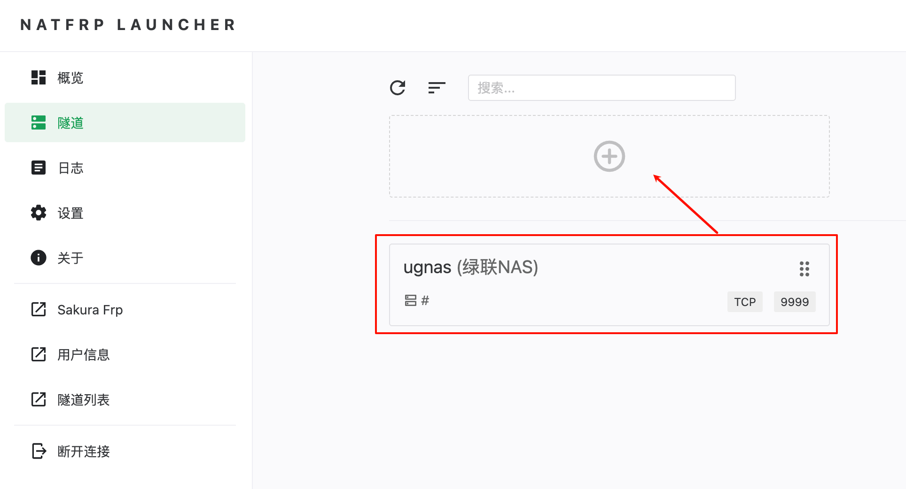
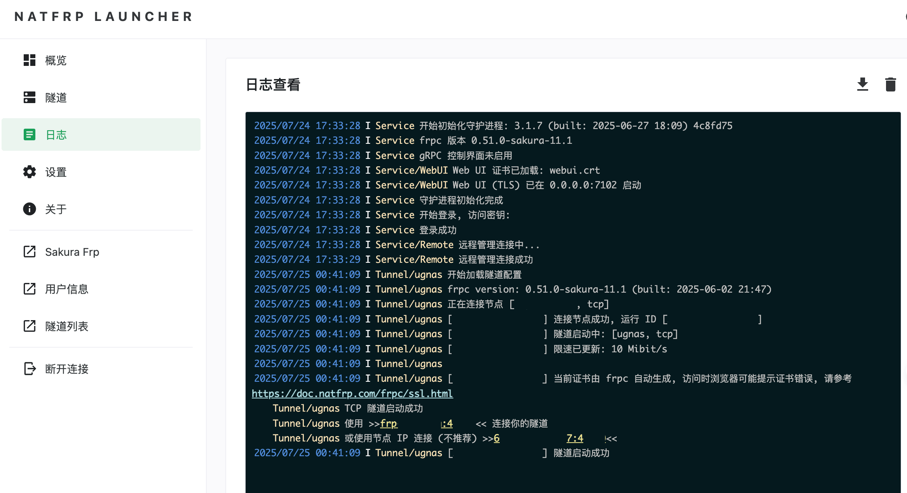
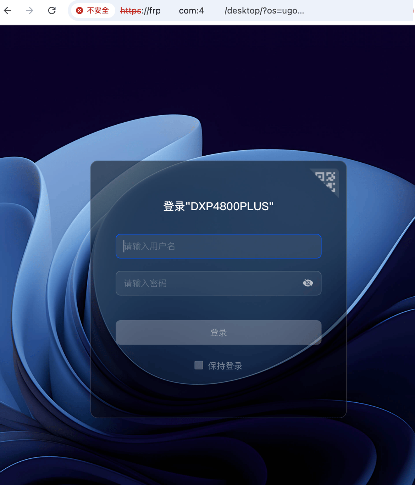

# 绿联 (UGREEEN) NAS UGOS Pro 系统穿透指南

本教程适用于使用 SakuraFrp 穿透绿联私有云端口，本教程以 RAGFlow 为例。

本文档使用 绿联 UGOS Pro 1.6.0.2905 系统进行演示。

## 配置 Docker 环境 {#install-container-station}

第一次使用绿联 UGOS Pro 系统时需要在应用中心搜索安装 Docker，安装完成后在桌面点击 **Docker** 图标即可，首次使用时需要配置存储空间用于存放数据。

## 创建启动器容器 {#create-launcher-container}

启动器容器只需配置一次即可，一个容器可以开启多条隧道，无需重复配置。

1. 在 Docker 应用中转到 `镜像` 页面，点击 `本地镜像 > 添加镜像 > 从镜像源下载`：

   

1. `获取方式` 选择 `按镜像名`，在 `镜像名` 处输入 `natfrp.com/launcher`，然后点击 `确定`：

   

   拉取成功后会在 `本地镜像` 页面看到 `natfrp.com/launcher` 镜像：

   

   

1. 点击镜像右侧的 `创建(+)` 按钮，输入容器名称并勾选自动重启复选框：

   

1. 在 `环境变量` 配置处如图所示填写访问密钥（在 SakuraFrp 管理面板获取）并设置远程管理密码（8 字符以上）：

   

1. 为了避免配置文件丢失，在 `存储空间` 配置处点击 `容器目录/文件` 输入 `/run` 并确认访问权限为 `读写`

   

1. 在 `网络` 配置处如图所示选中 `host` 网络，然后点击 `确定` 创建容器：

   ::: tip
   Web UI 默认运行在 7102 端口，如果发生冲突，请在创建完成后参考 [用户手册](/launcher/manual.md#config-webui) 修改端口或关闭 Web UI
   :::

   

1. 容器创建成功后，进入容器详情页面并选择 `日志`，检查日志，确认看到登录成功和远程管理连接成功的提示，然后就可以通过远程管理连接到启动器了：

   

   如果需要使用 Web UI 在本地连接，日志上方会输出对应的连接信息和密码。

## 创建隧道 {#create-tunnel}

::: tip 版本说明
ugos-pro v0.8.22 后修改了默认端口，下面步骤中的端口号已经做出响应调整。  
您可以前往 `系统设置` → `安全性` 处查看具体的端口。
:::

前往 SakuraFrp 管理面板，创建一条本地 IP 为 `localhost` 的 **TCP 隧道**：

- 如果您希望使用 UGOS Pro 系统内置的证书，将本地端口设置为 `9443`
- 如果您希望使用自动 HTTPS 功能，将本地端口设置为 `9999` 并将 `自动 HTTPS` 设置为 `自动`  
  这种配置下您可以同时启用 [子域绑定](/bestpractice/domain-bind.md) 功能来避免证书错误提示，或是在刚才创建的目录中 [配置证书文件](/frpc/ssl.md)

两种方法各有优劣，您可以根据自己的需求进行选择。如果您没有自己的域名也没有证书，推荐使用第二种方法。

## 启动隧道 {#start-tunnel}

1. 打开 [远程管理](https://www.natfrp.com/remote/v2)，连接到刚才创建的容器：

   

1. 点击右边的刷新按钮，然后双击刚才创建的隧道，或将其拖到上方启动：

   

1. 启动成功后右上角会弹出连接方式，您也可以前往 `日志` 页面查看连接方式：

   

1. 使用 `https://` 加上日志中显示的连接方式即可远程访问您的 UGOS Pro 系统：

   
