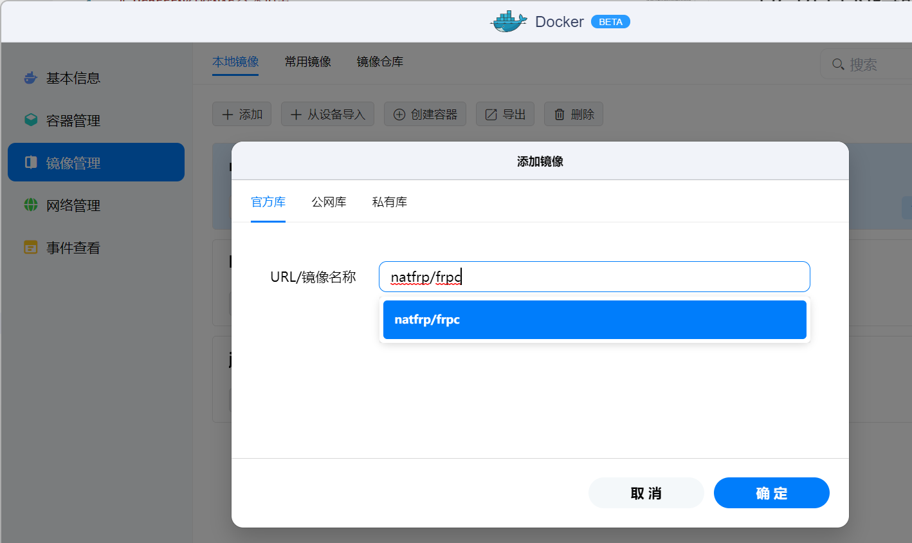
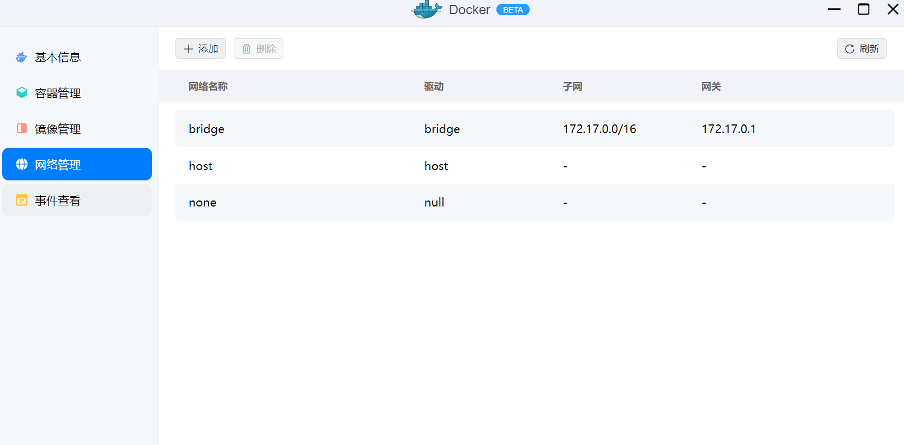
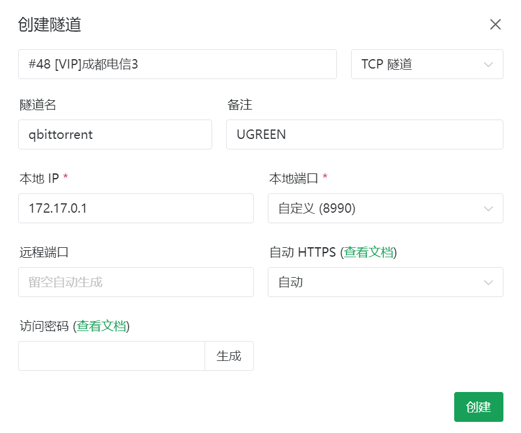
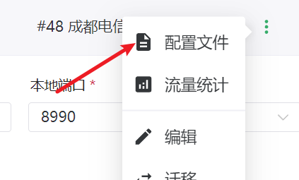
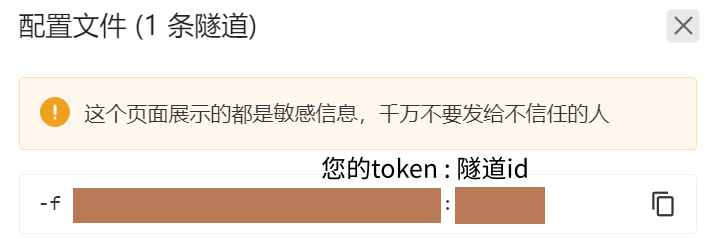
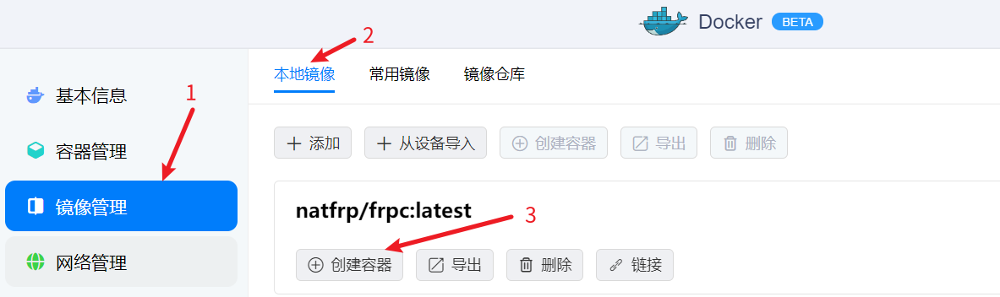
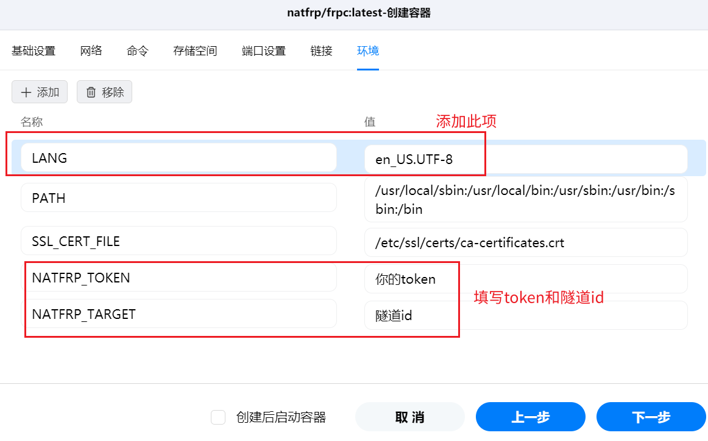
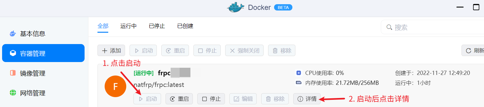
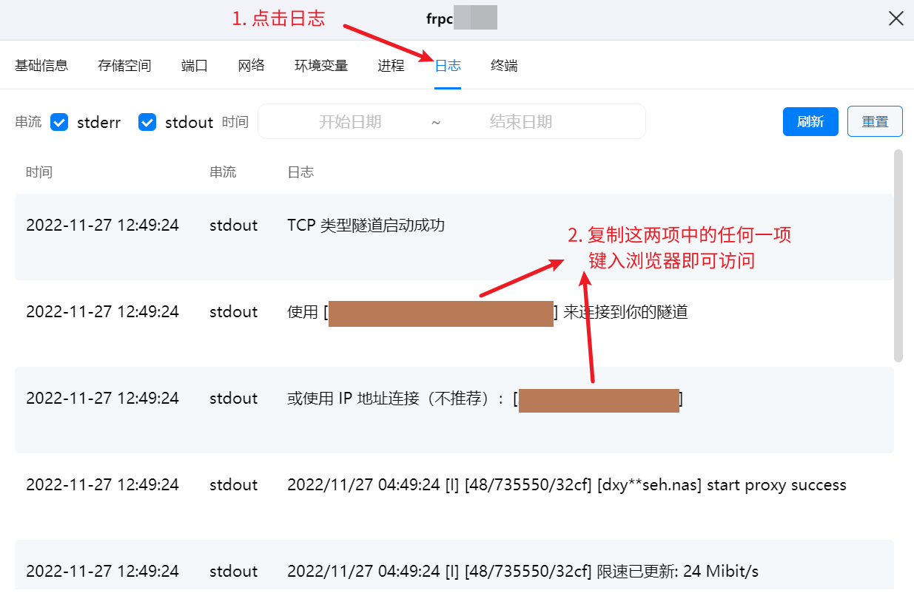
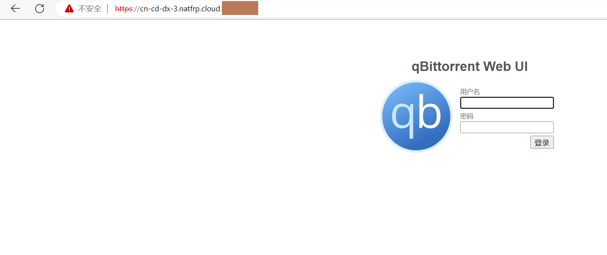

# UGREEEN绿联NAS穿透指南

截至`2022-11-27`，绿联nas客户端暂不支持外网访问。

本教程只适用于使用SakuraFrp穿透docker容器端口，如qbitorrent和jellyfin：

## Docker安装

在`docker-镜像管理`中搜索`natfrp/frpc`，安装最新版本latest：

### 创建隧道

打开`docker-网络管理`，记录下bridge的网关ip，即`172.17.0.1`：

进入`SakuraFrp-服务-隧道列表`，创建一个tcp隧道。其中本地ip填`172.17.0.1`，本地端口填您需要穿透的docker容器端口，需开启`自动https`：

>示例所用qbitorrent的`web ui`本地端口为8990，SakuraFrp设置中的本地端口即填写8990

配置完后，点击创建。创建成功后，点击右侧三个点，选择配置文件：

记录下这里的**token**和**隧道id**。

token是您在SakuraFrp的身份令牌，请不要交给任何您不信任的人：

### 配置容器

点击镜像管理-本地镜像，选择刚刚下载的`natfrp/frpc`容器，创建容器：

前面的设置都无需改动，点击下一步，选择`环境`进行环境变量的设置：

- 在环境变量中添加`LANG`，值为`en_US.UTF-8`
- 修改`NATFPR_TOKEN`为刚刚记录下来的用户token
- 修改`NATFRP_TRRGET`为刚刚记录下来的隧道id

修改完毕后，点击`下一步-确认`创建容器：

回到docker主页面，启动容器后，点击`详细-日志`。

如果一切顺利，在日志里，您可以看到两个链接选项。在链接前面加上`https://`，即可访问穿透端口了：

>如使用`https://idea-leaper-1.natfrp.cloud:23333`或者`https://114.51.4.191:23333`来访问穿透的端口。这里的链接仅为示例，应改成日志中显示的内容

如图，qbittorrent穿透完成，成功使用SakuraFrp的链接打开qbittorrent的`web ui`：

