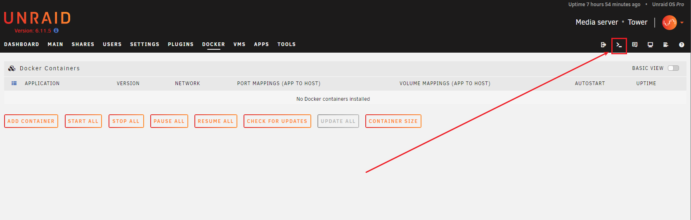
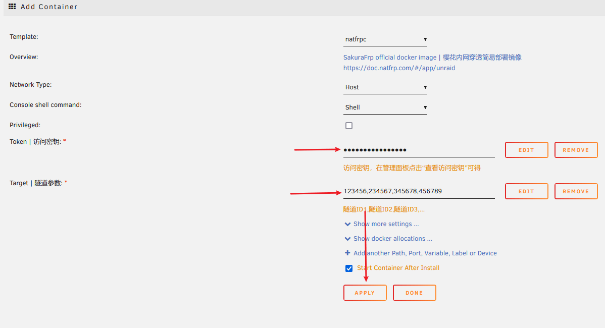
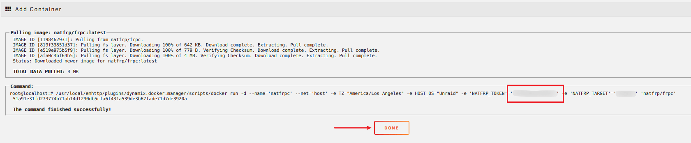
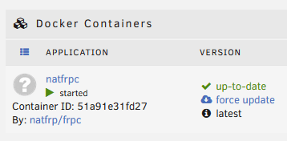
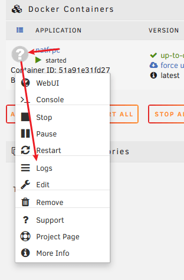

# 以 unRAID 为中心的家庭服务穿透指南

unRAID 在很多社区的热度较高，而其配置较为简单，只需使用 **CA (Community Applications)** 搜索 **Dockerhub** 的镜像然后简单地配置即可。

本文旨在提供易于理解的教程，考虑到 unRAID 服务器通常本身并不提供主要服务，而是为其他内网服务做支撑，本文中的 Docker 网络模型选择了 `host` 而非 `bridge`。

## 安全警告 {#warning}

根据 [unRAID 官方配置指南](https://wiki.unraid.net/index.php/Configuration_Tutorial#Security)，unRAID 在任何情况下都不应直接暴露在互联网中：

> unRAID is by no means a secure operating system and should NOT be connected directly to the Internet under any circumstances

为了表达我们最大程度的不建议，我们将映射 unRAID 自身的教程单独放在了这篇文章的最后，并进行了折叠。

此外，您应该在穿透任何服务前阅读我们的 [安全指南](/bestpractice/security.md)。

## 添加 Templates {#install-templates}

unRAID 在 **6.10.0-rc1** 之后的版本中弃用了自定义 **Templates Repository** 的功能，我们需要将仓库文件下载到 unRAID U盘的特定路径。

对于旧版系统，我们提供了一个官方的 [模板仓库](https://github.com/natfrp/unraid-docker-templates) 来简化部署，但是您应该更新系统而不是坚持使用旧版。

:::: tabs

@tab 在线部署 (推荐)

点击 unRAID WebUI 右上角的 Terminal 按钮，在打开的页面中复制粘贴下面的命令执行：

```bash
curl -sSLo /boot/config/plugins/dockerMan/templates-user/natfrpc.xml \
   https://nyat-static.globalslb.net/natfrp/misc/natfrpc.xml
```



此时模板文件已经被下载到指定位置，可以使用了。

如果在后面发现不可用，请检查 `/boot/config/plugins/dockerMan/templates-user/natfrpc.xml` 文件的内容。

@tab 离线部署

::: tip
通常情况下离线部署并无必要，如果您发现自己对 Linux 命令行操作过敏，请考虑离线部署
:::

要离线部署，请先将 unRAID 服务器关机，将启动盘拔出插到 PC 上。

手动下载 [模板文件](https://nyat-static.globalslb.net/natfrp/misc/natfrpc.xml)，将此文件放置到 `X:\config\plugins\dockerMan\templates-user` （X 为 unRAID 启动盘盘符）。


::::

## 穿透内网服务 {#expose-lan-services}

### 创建隧道 {#lan-create-tunnel}

前往 Sakura Frp 管理面板，使用内网访问时的端口和 IP 在 [隧道列表](https://www.natfrp.com/tunnel/) 创建隧道即可。

因为我们使用 `host` 网络，此处限制较少，但对于 HTTP 服务，请在创建隧道时注意相关访问限制。

### 创建容器 {#lan-start-container}

1. 在 Docker 页中点击 `Add Container` ，并选择 `natfrpc` 模板配置即可，**隧道 ID** 可以在 [隧道列表](https://www.natfrp.com/tunnel/) 页面获得。

   共有高达两个需配置的输入框，请在确保均已被配置后点击 Apply 按钮创建容器实例并启动。

   

1. 添加完成的界面如下图所示，如果您的英语水平无法阅读，请注意关键词 `finished successfully`，即为成功。

   ::: warning
   此界面存在明文显示的访问密钥，即红框处的内容，截图分享时请注意打码
   :::

   

1. 点击 Done 后页面将跳转回 Docker 页的首页，此时即可看到新创建的实例：

   

### 查看日志 {#lan-view-log}

此时点击已经完成创建的容器图标（图中为问号）即可进行管理，点击此菜单中的 Logs 项即可在弹出的新窗口中查看运行日志。在向他人提问时请务必截图并提供此窗口内容。

<div class="natfrp-side-by-side"><div>



</div><div>


</div></div>

## 穿透 unRAID 控制台 {#expose-unraid-console}

::: danger 安全警告
根据 [unRAID 官方配置指南](https://wiki.unraid.net/index.php/Configuration_Tutorial#Security)，unRAID 在任何情况下都 **不应** 直接暴露在互联网中  
请在阅读下方内容前完全理解自己正在做的行为，并了解其中的安全风险再进行下面的操作
:::

:::: details 在点击展开前，请确认您完全理解自己正在做的行为，并了解其中的安全风险

### 创建隧道 {#console-create-tunnel}

前往 Sakura Frp 管理面板，创建一条隧道：

- 将 **本地 IP** 设置为 `127.0.0.1`，**本地端口** 设置为 `80`
- unRAID 不提供 HTTPS 控制台，请将 **自动 HTTPS** 配置项设为 `自动` 或您使用的域名
- 为了给 unRAID 提供保护，**必须** 在 **访问密码** 处填写一个足够强的密码

### 创建容器 {#console-start-container}

参考上面的 [创建容器](#lan-start-container) 即可，操作方法是一样的。

### 访问隧道 {#console-access}

在运行隧道后，我们就可以在日志中得到访问地址了，此处以 `114.5.1.4:1919` 为例。

1. 首先，您需要打开 `https://114.5.1.4:1919` 并在此页面完成访问认证
1. 完成访问认证后，使用 `https://114.5.1.4:1919/Main` 即可访问您的控制台

   ::: tip
   因为 unRAID 控制台的自动跳转功能缺陷，使用 `https://114.5.1.4:1919/` 会被跳转到 `http://114.5.1.4:1919/Main` (没有 s) 从而无法访问，所以请务必访问 `https://114.5.1.4:1919/Main`
   :::

::::
