# 以 unRAID 为中心的家庭服务穿透指南

unRAID 在很多社区的热度较高，且配置较为简单，只需使用 **Community Applications** 插件搜索 **Dockerhub** 的镜像然后简单地配置即可。

本文旨在提供易于理解的教程，考虑到 unRAID 服务器通常本身并不提供主要服务，而是为其他内网服务做支撑，您应该参考本文档为其他服务创建隧道，而不是直接穿透 unRAID 控制面板。

本文档使用 unRAID 6.12.11 系统进行演示，部分按钮位置在其他版本中可能有所不同，请在相关界面附近查找。

## 添加 Templates {#install-templates}

:::: tabs

@tab 在线部署 (推荐)

点击 unRAID 管理面板右上角的 Terminal 按钮，在打开的页面中复制粘贴下面的命令执行：

```bash
curl -sSLo /boot/config/plugins/dockerMan/templates-user/natfrp.xml https://nya.globalslb.net/natfrp/misc/launcher-unraid.xml
ls -ls /boot/config/plugins/dockerMan/templates-user/natfrp.xml
```

检查输出信息，确保没有任何报错，并且可以看到 `ls` 列出了相关文件：

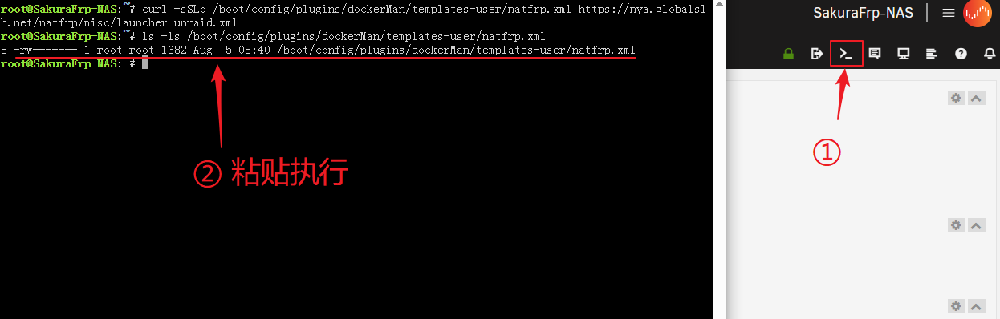

此时模板已经被下载到指定位置，可以使用了。

@tab 离线部署

::: tip 注意
除非您的 unRAID 服务器无法连接互联网，否则不建议使用此方法，请尽量使用在线部署
:::

要离线部署，请先将 unRAID 服务器关机，然后将启动 U 盘拔出插到 PC 上。

手动下载 [模板文件](https://nya.globalslb.net/natfrp/misc/launcher-unraid.xml)，将此文件改名为 `natfrp.xml` 并放到 `X:\config\plugins\dockerMan\templates-user` 文件夹中（X 为 unRAID 启动盘盘符）：

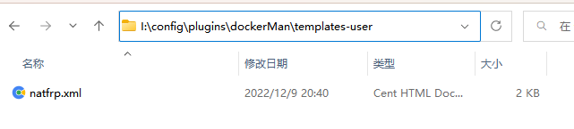

::::

## 创建启动器容器 {#create-launcher-container}

启动器容器只需配置一次即可，一个容器可以开启多条隧道，无需重复配置。

1. 点击 `DOCKER` 打开容器管理页面，点击 `ADD CONTAINER` 按钮：

   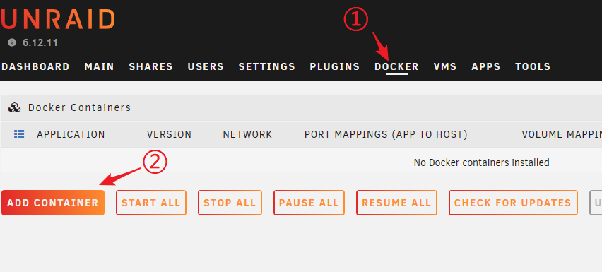

1. 在 `Template` 处选中 `[ User templates ] > natfrp`，按图示配置并点击 `APPLY` 按钮：

   ::: tip
   Web UI 默认运行在 7102 端口，如果发生冲突，请在创建完成后参考 [用户手册](/launcher/manual.md#config-webui) 修改端口或关闭 Web UI  
   容器的工作目录即为此处的 “配置文件目录”
   :::

   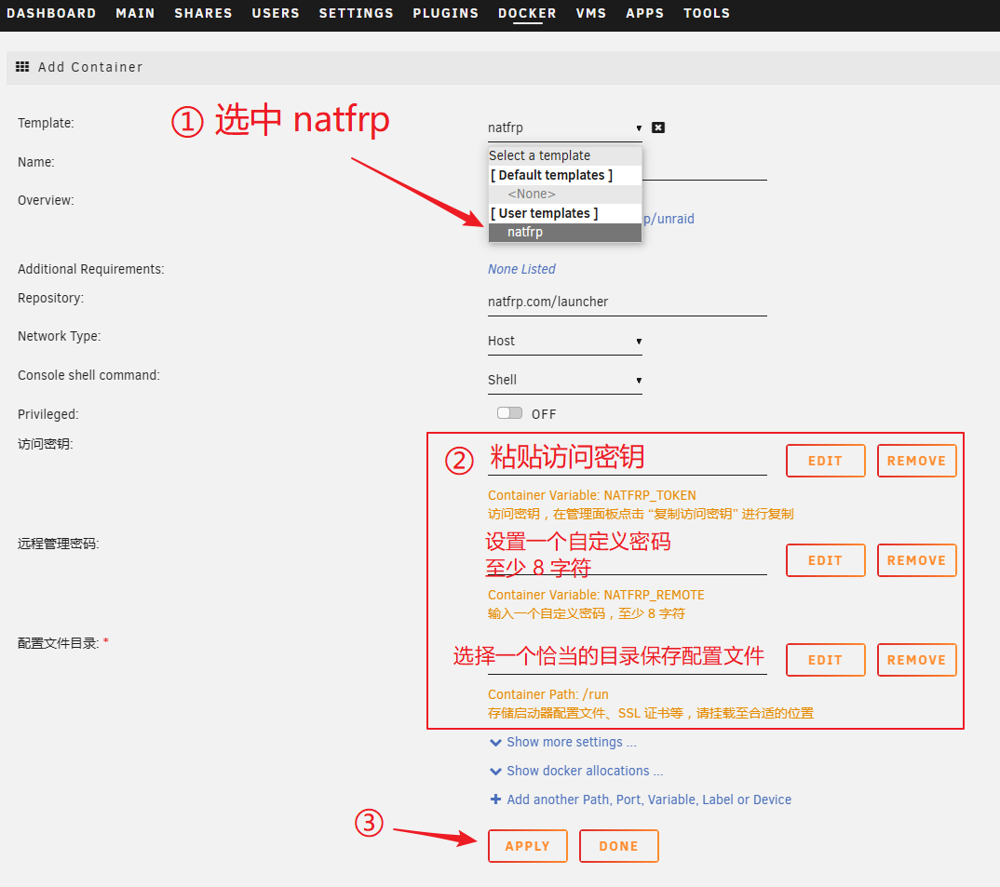

1. 检查容器创建过程中输出的日志，确认有 `The command finished successfully!` 的提示：

   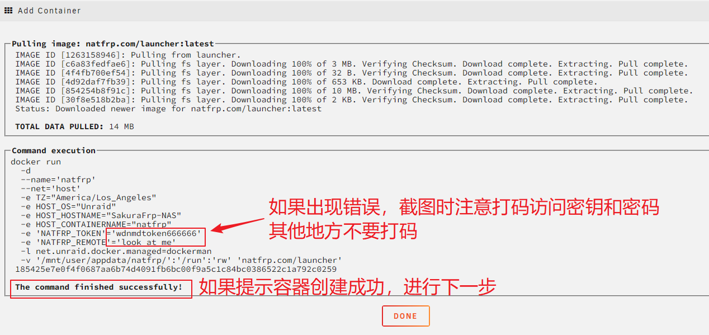

1. 如图所示打开右边的 `AUTOSTART` 开关，然后点击左侧图标，点击 `Logs` 查看日志：

   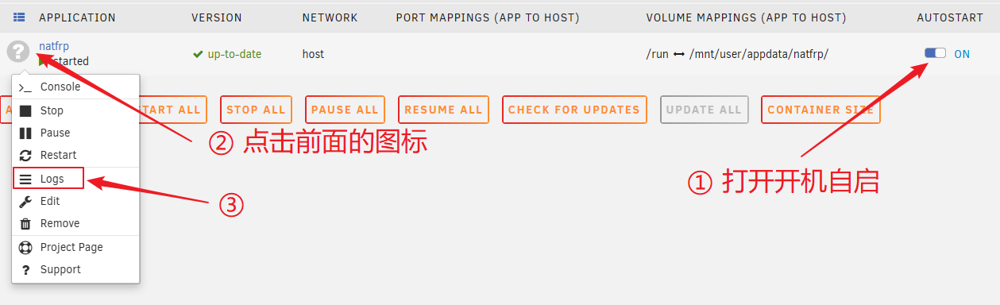

1. 确认日志中有登录成功和远程管理连接成功的提示，如需使用 Web UI 可在上面找到连接信息：

   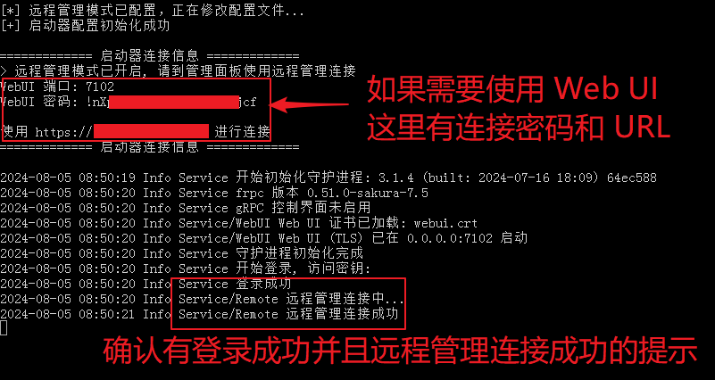

## 穿透 unRAID 控制台 {#expose-unraid-console}

::: danger 安全警告
通过 frp 穿透 unRAID 时将直接绕过登录验证，您 **必须在隧道配置中设置访问密码**，以免暴露在公网后一瞬被黑  
我们 **极不推荐** 将 unRAID 控制台直接暴露在公网中，本节 **仅供学习隧道创建、启动方式之用**  
除此之外，您应该在穿透任何内网服务前阅读我们的 [安全指南](/bestpractice/security.md)
:::

### 创建隧道 {#console-create-tunnel}

前往 [隧道列表](https://www.natfrp.com/tunnel/)，创建一条 `TCP` 隧道：

- 将 **本地 IP** 设置为 `localhost`，**本地端口** 设置为 `80`
- 将 **自动 HTTPS** 配置项设为 `自动`
- 由于通过 frp 穿透时会绕过登录验证，您 **必须** 在 **访问密码** 处填写一个足够强的密码

::: danger 安全警告
您 **必须** 在隧道配置中设置一个足够强的访问密码，以免暴露在公网后一瞬被黑  
:::

### 启动隧道 {#start-tunnel}

1. 打开 [远程管理](https://www.natfrp.com/remote/v2)，连接到刚才创建的容器：

   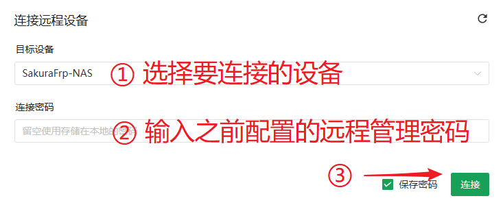

1. 点击右边的刷新按钮，然后双击刚才创建的隧道，或将其拖到上方启动：

   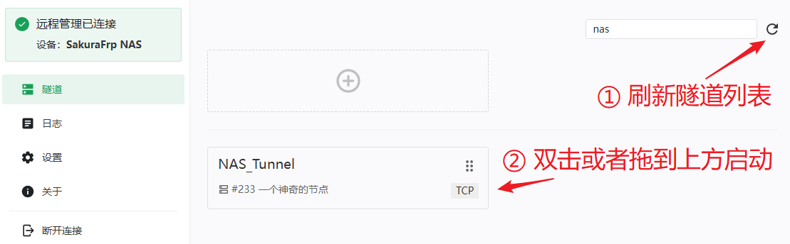

1. 启动成功后右上角会弹出连接方式，您也可以前往 `日志` 页面查看连接方式：

   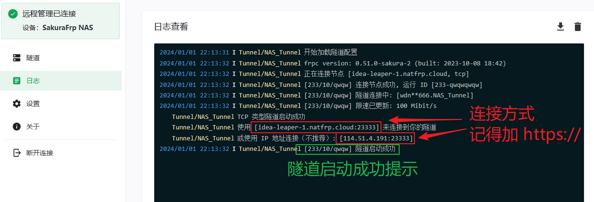

1. 使用 `https://` 加上日志中显示的连接方式即可远程访问您的 unRAID 控制面板。  
   正常情况下，您应该会先看到访问认证界面，输入访问密码后再刷新一次即可进入控制台。

   ::: danger 安全警告
   如果没有看到访问认证界面，**请立即关闭隧道** 并检查您的访问密码是否设置正确
   :::

   ::: tip
   在旧版 unRAID 中，控制台可能会将您跳转到 `http://<连接方式>/Main` (没有 s) 从而导致无法访问  
   如果您碰到这种情况，请更新系统或在认证完成后手动修改 URL 为 `https://<连接方式>/Main` 进行访问
   :::

1. 如果您需要进一步增强安全性，请考虑在不使用隧道时通过远程管理关闭 frpc

## 更新启动器 {#update-launcher-container}

虽然更新时发生意外的可能性很小，但我们仍然 **强烈建议** 您在有备用连接手段的情况下再进行更新，以免 NAS 失联。

更新启动器时，请先打开 `ADVANCED VIEW` 开关，然后点击 `force update` 链接，在弹出的对话框中确认操作即可：

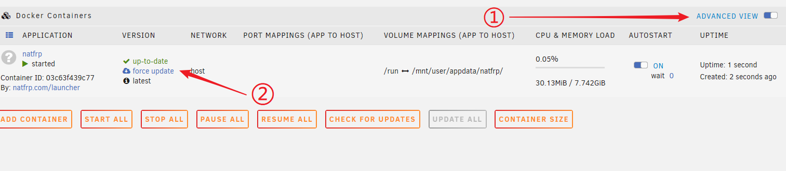
