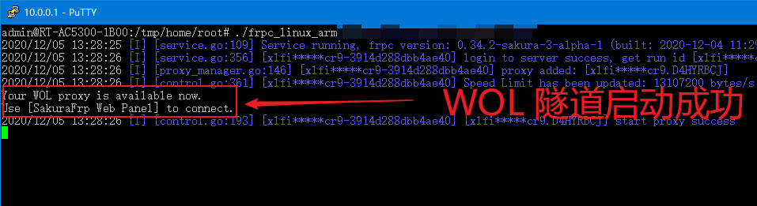
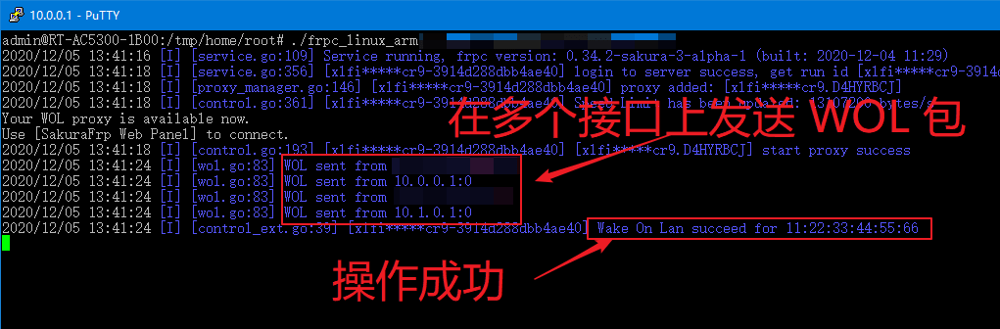

# 远程开机(WOL 网络唤醒) 穿透指南

!> WOL 处于测试阶段，仅最新测试版 frpc 支持此功能，详情请查看网站上说明  
WOL 处于测试阶段，仅最新测试版 frpc 支持此功能，详情请查看网站上说明  
WOL 处于测试阶段，仅最新测试版 frpc 支持此功能，详情请查看网站上说明

## 0x01 配置 WOL 功能

首先到 BIOS 中打开 WOL 相关开关，这一步请自行查看主板 Manual

!> 不会查 Manual? 那就百度搜索 "主板产商 网络唤醒" 或者 "笔记本型号 网络唤醒"  
例: **华硕主板 网络唤醒**，**技嘉主板 网络唤醒**

通常 WOL 相关设置会有下面的名称:

 - Wake up on LAN
 - Wake-on-LAN from S4/S5
 - Power on by PCIe devices

---

随后进入系统，按 Win+R 打开运行，输入 `devmgmt.msc` 打开设备管理器

找到要用作 WOL 的网卡，双击打开网卡配置界面

!> 不同网卡配置方式可能不一样，如果遇到配置困难请自行百度解决

点击 **高级**，找到 **唤醒模式匹配** 和 **唤醒魔包**，设置为 `启用`

点击 **电源管理**，找到 **允许此设备唤醒计算机**，勾上前面的复选框

如果计算机开启了快速启动，建议参考 [这些资料](https://www.baidu.com/s?ie=UTF-8&wd=%E5%85%B3%E9%97%AD%E5%BF%AB%E9%80%9F%E5%90%AF%E5%8A%A8) 关闭快速启动，否则可能造成无法正常唤醒

## 0x02 创建隧道

!> 测试阶段仅 **[BETA]** 节点支持 WOL  
测试阶段仅 **[BETA]** 节点支持 WOL  
测试阶段仅 **[BETA]** 节点支持 WOL

创建一条 WOL 隧道，什么都不用填，选择隧道类型就行了

## 0x03 添加计算机

转到 **远程开机** 页面，点击 **添加计算机**

?> frpc 将遍历所有网卡并发送 WOL 包，因此此处无需配置网卡名称或 IP

输入计算机的 MAC 地址和任意名称，点击确定

## 0x04 启动隧道

!> 想一想，关机后隧道还会在线吗? 计算机还能收到服务器下发的开机指令吗?

在同一内网下的 **其他设备** (如路由器) 上启动刚才创建的 WOL 隧道

## 0x05 测试唤醒

**关闭计算机**，点击对应计算机的 **开机** 链接，计算机应该会正常启动

## 0x06 故障排除

#### 0. 常识问题

 - 无线网卡不能远程唤醒，想一想，关机后 WIFI 还连着吗?
 - 在 0x01 中配置的网卡就是通过 **网线** 直接连接到路由器上那块
 - 在 0x03 中输入的 MAC 地址要对应 0x01 中配置的那块网卡

#### 1. 检查网卡电源状态

**关闭计算机**，查看网线插口上面的 **绿色** 指示灯是否会缓慢闪烁

正常情况下，指示灯应该是这样的:

如果一个指示灯都不亮，网卡电源很可能被切断了

 - 如果您在使用 Intel PROSet 网卡，请参考 [这篇博客](https://blog.berd.moe/archives/intel-nuc-i210-wol-troubleshooting/) 尝试通过配置工具解决
 - 如果您在使用 PCIe 网卡，请检查 BIOS 中相关的 PCI 电源设置
 - 一些很老的主板 + PCIe 网卡可能需要使用三针 WOL 线连接主板，碰到这种情况建议购买新的计算机
 - 其他情况请自行百度搜索

#### 2. 检查 frpc 是否正常收到指令并发出唤醒包

点击 **开机** 后，frpc 应该会输出如下日志

如果没有看到相关日志，请检查是否绑定错了 WOL 隧道

#### 3. 检查路由器是否开启了 AP 隔离

部分情况下路由器的 AP 隔离 (或防火墙) 功能会造成唤醒包无法正常被内网其他设备收到，请尝试关闭 AP 隔离或防火墙

