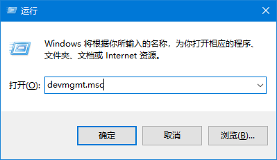
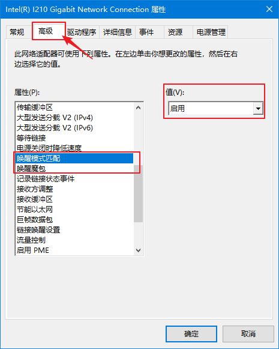
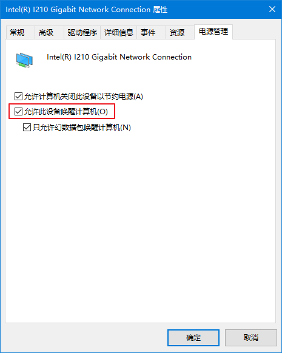
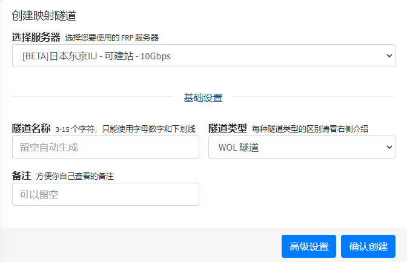
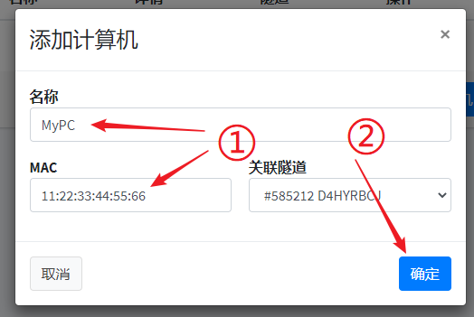
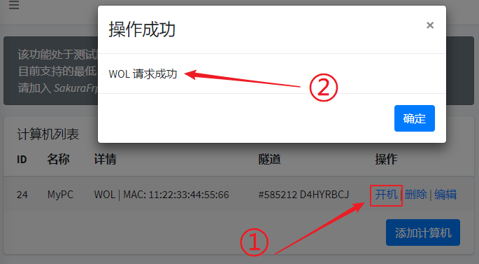
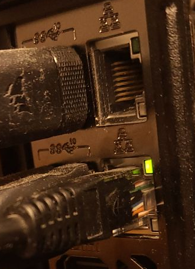

# 远程开机 (WOL 网络唤醒) 配置指南

::: tip 版本需求
开启 WoL 隧道需使用 **v0.34.2-sakura-3** 以上版本的 frpc
:::

## 配置 WOL 功能

1. 首先到 BIOS 中打开 WOL 相关开关，这一步请自行查看主板的 **用户手册**。

   ::: tip
   不知道怎么查手册、找不到手册? 也可以百度搜索 **"主板产商 网络唤醒"** 或者 **"笔记本产商 网络唤醒"**  
   例: **华硕主板 网络唤醒**、**华硕笔记本 网络唤醒**
   :::

   通常 WOL 相关设置会有下面的名称（仅供参考，以主板用户手册为准）：

   - Wake up on LAN
   - Wake-on-LAN from S4/S5
   - Power on by PCIe devices
   - Resume On LAN

2. 进入系统，按 Win+R 打开运行，输入 `devmgmt.msc` 打开设备管理器：

   

3. 找到要用作 WOL 的网卡，双击打开网卡配置界面：

   

   ::: info
   不同网卡配置方式可能不一样，如果遇到配置困难请借助百度解决
   :::

4. 点击 **高级**，找到 **唤醒模式匹配** 和 **唤醒魔包**，设置为 `启用`：

   

5. 点击 **电源管理**，找到 **允许此设备唤醒计算机**，勾上前面的复选框：

   ::: tip
   下面的 **只允许幻数据包唤醒计算机** 建议也勾上，可以避免部分情况下计算机无故开机
   :::

   

6. 如果计算机开启了快速启动，建议参考 [这些资料](https://www.baidu.com/s?ie=UTF-8&wd=%E5%85%B3%E9%97%AD%E5%BF%AB%E9%80%9F%E5%90%AF%E5%8A%A8) 关闭快速启动，否则可能造成无法正常唤醒。

## 创建隧道

:::tip
这里填写的密码和电脑的登录密码 **没有关系**，一般情况下 **不用填写**  
设置密码后，创建计算机时请选择 `frpc 隧道 (密码保护)` 类型，否则无法开机
:::

创建一条 WOL 隧道，一般情况下选择隧道类型就行了，不需要填其他选项。如果有必要，可以设置一个密码来保护 WOL 隧道。



## 添加计算机

1. 转到 **远程开机** 页面，点击 **添加计算机**：

   

   ::: tip
   frpc 将遍历所有网卡并发送 WOL 包，因此此处无需配置网卡名称或 IP
   :::

2. 选择恰当的隧道类型（没有密码就选择 `frpc 隧道`，否则选择 `frpc 隧道 (密码保护)`），输入计算机的 MAC 地址和任意名称，选择恰当的隧道进行绑定，然后点击 **添加**：

   

## 启动隧道

::: warning
显而易见，关机后隧道就不在线了，也没办法收到开机指令实现远程开机  
因此 WOL 隧道必须在内网里其他长期运行的设备（如路由器）上启动
:::

在同一内网下的 **其他设备** (如路由器) 上启动刚才创建的 WOL 隧道，正常情况下日志应该是这样的：

```log
2023/01/13 00:41:06 [I] 检查更新中
2023/01/13 00:41:06 [I] frpc version: 0.45.0-sakura-1 (built: 2022-11-30 17:32)
2023/01/13 00:41:06 [I] 正在连接节点 [idea-leaper-1.natfrp.cloud, tcp]
2023/01/13 00:41:13 [I] [233/10/qwqw] 连接节点成功, 获得 run ID [wdn**666-qwqw]
2023/01/13 00:41:13 [I] [233/10/qwqw] 隧道连接中: [wdn**666.SampleTunnel]
2023/01/13 00:41:13 [I] [233/10/qwqw] 限速已更新: 100 Mibit/s
WOL 类型隧道启动成功
使用 [SakuraFrp Web Panel] 来连接到你的隧道
2023/01/13 00:41:14 [I] [233/10/qwqw] [wdn**666.SampleTunnel] start proxy success
```

看到 **WOL 类型隧道启动成功** 或 **Your WOL proxy is available now.** 的提示就说明 WOL 隧道启动成功了。

## 测试唤醒

::: tip
类型显示为 `WOL (密码保护)` 时，点击开机会提示您输入密码  
密码错误时也会提示 `WOL 请求成功`，但并不会正常开机，这是因为密码判断是由 frpc 在本地进行的
:::

先 **关闭要唤醒的计算机**，点击对应计算机的 **开机** 链接，您会看到 “WOL 请求成功” 的提示，同时计算机应该会正常启动：



## 故障排除

#### 0. 常识问题

- 绝大多数的无线网卡不能远程唤醒，显而易见，一般情况下关机后 WIFI 就断开了
  - 但是有部分神奇的笔记本可以做到 WLAN 下进行网络唤醒，请以厂家给的用户手册为准
- 在 **设备管理器** 中配置的网卡就是通过 **网线** 直接连接到路由器上的那块，不要输入其他网卡
- 在 **远程开机页面** 中输入的 MAC 地址要对应 **设备管理器** 中配置的那块网卡，乱输一个 MAC 自然是不能用的

#### 1. 检查网卡电源状态

**关闭计算机**，查看网线插口上面的 **绿色** 指示灯是否会缓慢闪烁

正常情况下，指示灯应该是这样的:



如果一个指示灯都不亮，网卡电源很可能被切断了

- 如果您在使用 Intel PROSet 网卡，请参考 [这篇博客](https://blog.berd.moe/archives/intel-nuc-i210-wol-troubleshooting/) 尝试通过配置工具解决 ([备用链接](https://web.archive.org/web/20210122092312/https://blog.berd.moe/archives/intel-nuc-i210-wol-troubleshooting/))
- 如果您在使用 PCIe 网卡，请检查 BIOS 中相关的 PCI 电源设置
- 一些很老的主板 + PCIe 网卡可能需要使用三针 WOL 线连接主板，碰到这种情况建议购买新的计算机
  - 如果不想购买新计算机，也可以发挥极客精神 DIY 一根
  - 当然，也可以到神奇的淘宝看看能不能买到
- 其他情况请自行百度搜索

#### 2. 检查 frpc 是否正常收到指令并发出唤醒包

点击 **开机** 后，frpc 应该会输出如下日志：

```log
2023/01/13 00:44:12 [I] WOL sent from [一个 IP 地址]:0
2023/01/13 00:44:12 [I] WOL sent from [另外一个 IP 地址]:0
2023/01/13 00:44:12 [I] [233/10/qwqw] Wake On Lan succeed for <这里是配置的计算机 MAC>
```

有时也会出现这种日志，但是一般情况下都可以忽略，只要有 `Wake On Lan succeed` 的信息输出就好了：

```log
2023/01/13 00:44:12 [W] WOL error: dialUdp: dial udp [一个 IP 地址]:0->255.255.255.255:9: bind: The requested address is not valid in its context.
```

如果没有看到相关日志，请检查：

- 是否绑定错了 WOL 隧道
- 如果配置了密码，是否输入了正确的密码
- 是否正确填写了 WOL 隧道的网卡和 IP 配置（看不懂的情况下请留空这两个配置项，不要乱写）

#### 3. 检查路由器是否开启了 AP 隔离

部分情况下路由器的 AP 隔离 (或防火墙) 功能会造成唤醒包无法正常被内网其他设备收到，请尝试关闭这些功能或配置恰当的白名单规则。

具体的关闭方法可以查询相关设备的用户手册，或者百度搜索 **"路由器型号 关闭防火墙"**、**"路由器型号 内网不通"** 查找。

## 通过 API 唤醒

您可以在不登录 SakuraFrp 面板的情况下通过 API 发起 WOL 唤醒请求，请求端点为 `/computer/poweron`。

请访问 [SakuraFrp API 文档](https://natfrp-api.globalslb.net/docs/#/%E8%AE%A1%E7%AE%97%E6%9C%BA%E7%AE%A1%E7%90%86/post_computer_poweron) 获取此 API 的详细信息。
