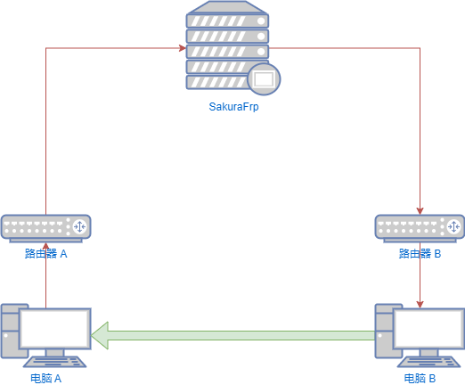
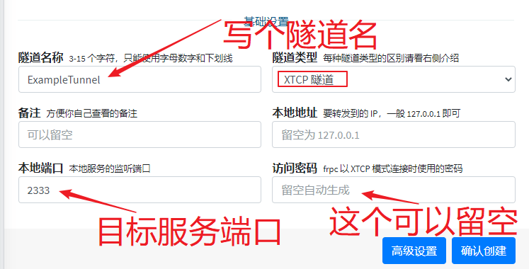
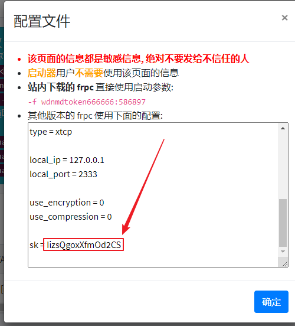
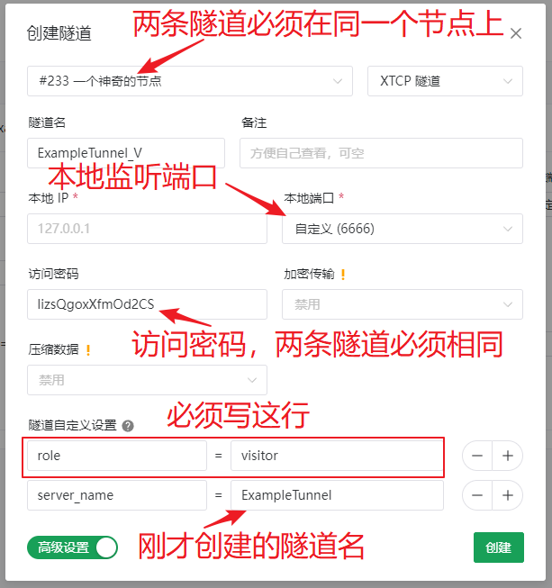
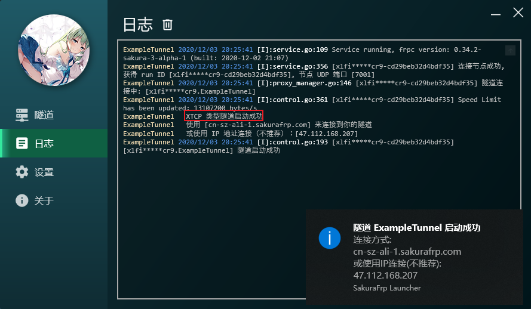
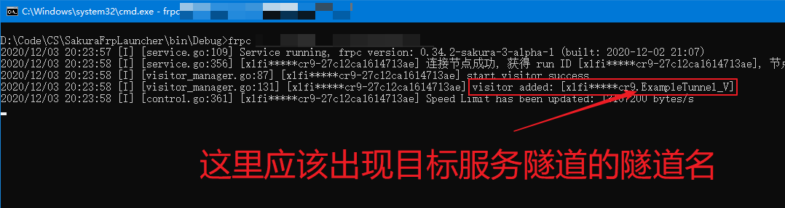
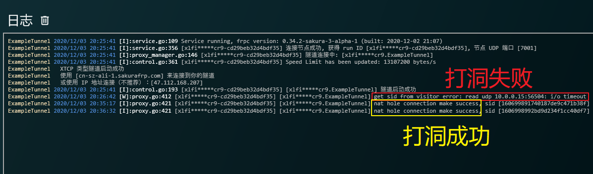

# XTCP 穿透指南

!> 我们不提供任何 XTCP 隧道相关的技术支持，碰到问题请您自行解决

## 前置知识

?> XTCP 隧道仅支持 Full-Cone NAT，其他类型的 NAT 无法打洞成功  
<b style="color: red">别问我 Full-Cone NAT 是什么，自己百度</b>

XTCP 隧道的穿透逻辑如下图

当电脑 A 想访问电脑 B 的某个服务时，电脑 B 上需要启动 **目标服务隧道** 准备接受连接

而电脑 A 需要启动 **访问者隧道**，启动后电脑 A 会通过 SakuraFrp 请求与电脑 B 建立直接连接 (红色箭头)

!> 由于国内网络环境极为复杂，中间可能隔了 N 个路由器，打洞很成功率极低

如果打洞成功，两台电脑间就会建立 P2P 连接，流量直接 P2P 传输，不经过 SakuraFrp 服务器 (绿色箭头)

## 0x01 创建隧道

XTCP 穿透时需要建立两条隧道，并且两条隧道均需位于同一节点上

首先创建目标服务隧道，这条隧道将在上图中的电脑 B 上运行

!> 设置弱访问密码可能导致您的服务被其他用户访问到，产生安全隐患

访问密码可以留空让服务器随机生成一个安全的密码，也可以自己设置

!> 保存好您的访问密码，不要让其他人看到

转到隧道列表，点击 **配置文件**，复制最底部的 `sk = <访问密码>` 中的访问密码

?> 隧道名无关紧要，如果提示 **隧道名不符合规范**，换个名字就行了

!> 两条隧道必需位于同一个节点上

随后创建访问者隧道，即您准备访问服务时开启的隧道，这里注意一定要点开 **高级设置** 写上下面的设置

 - `role = visitor`
 - `server_name = <刚才创建的隧道名>`

此处填写的 `本地端口` 会在访问服务时用到，在这个例子中，使用电脑 A 访问 `访问者隧道的本地地址:6666` 就等于访问电脑 B 上的 `目标服务隧道的本地地址:2333` 端口

## 0x02 启动隧道

现在，前往电脑 B 启动 **目标服务隧道**，即刚才创建的第一条隧道

?> 启动器目前暂时不支持启动 **访问者隧道**，请通过命令行开启

然后在需要访问服务时前往电脑 A 启动 **访问者隧道**

此时，在电脑 A 上访问 `127.0.0.1:6666` 就能访问到电脑 B 上的服务了

## 0x03 日志说明

!> 再强调一次，我们不提供任何 XTCP 隧道相关的技术支持，碰到问题请您自行解决

出现 `nat hole connection make success` 则说明打洞成功，可以正常连接

出现 `get sid from ... error: read udp ...: i/o timeout` 说明打洞失败，请检查两边的 NAT 属性

