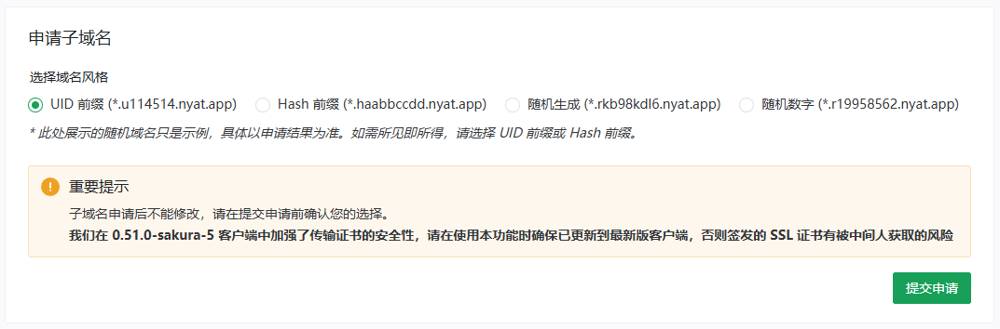
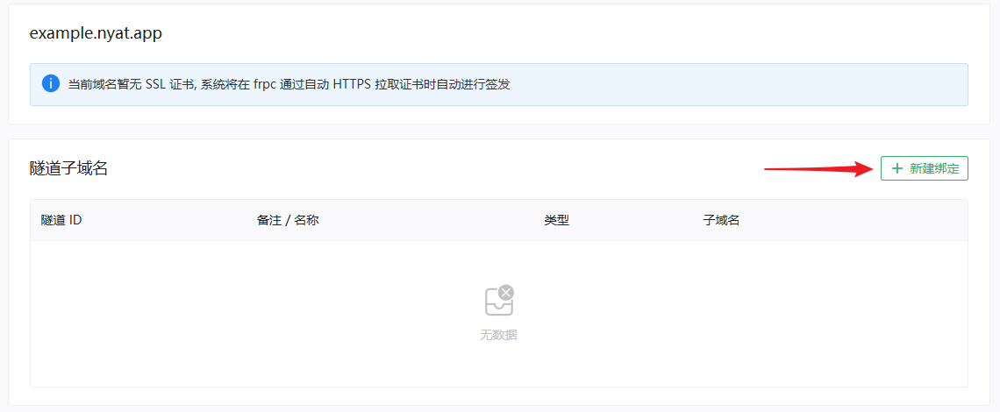
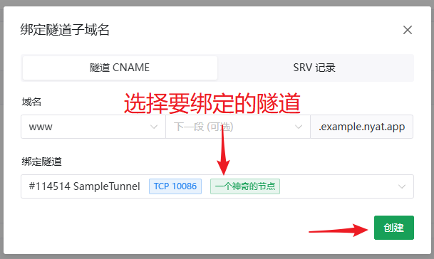
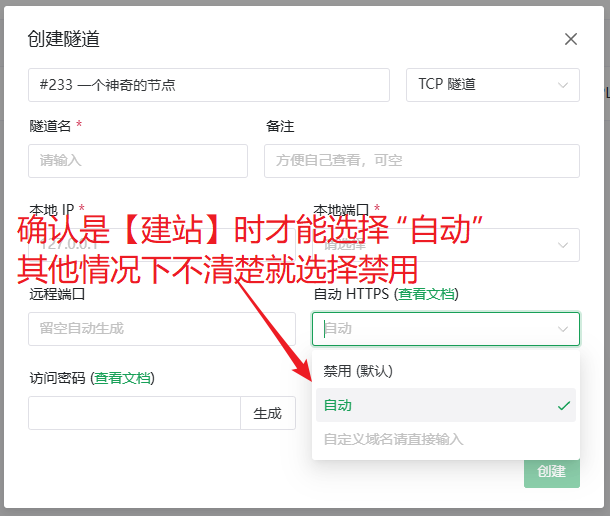
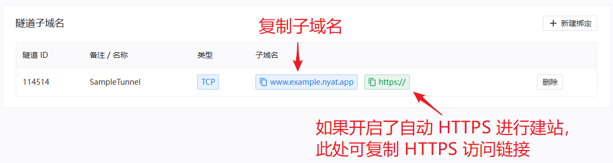
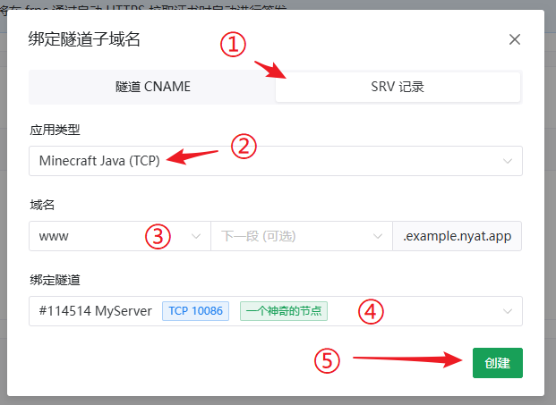
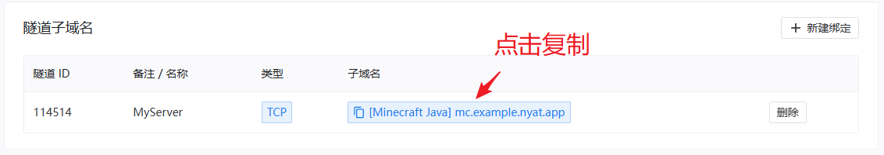

# 配置子域绑定功能

SakuraFrp 为所有用户提供免费的 `nyat.app` 子域名和 SSL 证书，您可以通过配置子域绑定功能使用相关域名和证书。

## 申请子域名 {#acquire}

登录账户，前往 [管理面板 > 子域绑定](https://www.natfrp.com/tunnel/domain) 页面即可自助申请一个子域名。



为预防滥用行为，子域名的二级部分不能自定义，不过您可以从若干生成风格中挑选一个。如果您对生成风格有新的想法，可以 [联系我们](/about.md#contact-us) 进行反馈。

## 将子域名绑定到隧道

申请到的子域名通常有以下用途：

- \[[点击查看](#cname-for-connect)\] 创建 CNAME 记录作为隧道的连接地址，这样在迁移隧道时无需修改连接客户端的配置
- \[[点击查看](#cname-for-site)\] 创建 CNAME 记录进行建站，并通过自动 HTTPS 功能获取免费的 SSL 证书来消除证书错误
- \[[点击查看](#srv-for-apps)\] 创建 SRV 记录以供部分支持 SRV 记录的服务使用，如 Minecraft Java、Factorio、MongoDB、XMPP 等

### 创建 CNAME 记录作为隧道连接地址 {#cname-for-connect}

如果您穿透了远程桌面、SSH、游戏服务器等服务，您可以将子域名绑定到隧道作为连接地址。

1. 点击 **新建绑定**：

   

1. 在 **域名** 处选择 1～3 个单词作为前缀，最少可以只选择一个，后面的选择框都是可选的：

   

   选择框中可以直接输入进行搜索，如果您想使用的某个单词不在其中，可以 [联系我们](/about.md#contact-us) 申请添加。

1. 在 **绑定隧道** 处选择要绑定的隧道，然后点击 **创建** 即可创建相关绑定：

   

1. 绑定成功后重启隧道，frpc 显示的连接信息会变成您绑定的子域名 `xxx.xxx.nyat.app:端口`。  
   迁移隧道时子域名的解析会被自动更新，因此无需修改各种客户端的连接信息。

   下面是一个绑定成功后的日志输出例子：

   ```log
   2024/02/31 11:11:11 [I] 正在连接节点 [www.example.nyat.app, tcp]
   2024/02/31 11:11:12 [I] [233/10/qwqw] 连接节点成功, 运行 ID [114514-19198100]
   2024/02/31 11:11:12 [I] [233/10/qwqw] 隧道启动中: [SampleTunnel, tcp -> 127.0.0.1:2333]
   2024/02/31 11:11:12 [I] [233/10/qwqw] 限速已更新: 10 Mibit/s
   TCP 隧道启动成功
   使用 >>www.example.nyat.app:10086<< 连接你的隧道
   或使用 IP 地址连接: >>114.51.4.191:10086<<
   2024/02/31 11:11:12 [I] [233/10/qwqw] [wdn**666.SampleTunnel] 隧道启动成功
   ```

### 创建 CNAME 记录并获取 SSL 证书进行建站 {#cname-for-site}

将子域名绑定到启用了自动 HTTPS 功能的隧道后，frpc 会从服务端自动加载对应的 SSL 证书。

1. 在绑定域名前，请先把隧道的 `自动 HTTPS` 功能设置为 `自动`：

   

1. 然后参考上面的教程将子域名绑定到开启了自动 HTTPS 的隧道，绑定成功后启动隧道即可看到下方的日志输出：

   ```log
   2024/02/31 11:11:12 [I] [233/10/qwqw] 已从服务器为 www.example.nyat.app 加载证书 [CN = *.test.example.app, 2024-02-31 - 2025-02-31]
   TCP 隧道启动成功
   使用 >>www.example.nyat.app:10086<< 连接你的隧道
   或使用 IP 地址连接: >>114.51.4.191:10086<<
   ```

1. 第一次使用此功能时可能会看到下面的错误提示，请保持隧道开启，通常几分钟就可以启动成功。

   ```log
   Nyat APP SSL 证书签发中, 请稍后重试, 若该错误持续出现十分钟以上请到管理面板检查子域名状态
   ```

1. 隧道启动成功后，您可以使用类似 `https://www.example.nyat.app:10086` 的地址访问您的网站了。  
   _* 这里只是举例，请以日志中输出的地址为准_

   此外，您也可以在域名列表中复制相关连接地址：

   

### 创建 SRV 记录供部分服务使用 {#srv-for-apps}

如果您穿透的服务支持 SRV 记录，可以通过子域绑定功能创建 SRV 记录，省去连接时输入端口号的麻烦。

1. 首先创建好隧道，测试并确认隧道可以被正常连接。

1. 点击 **新建绑定**，然后选择对应的应用、前缀和隧道，点击创建即可：

   

   常见的支持 SRV 记录的应用已在管理面板中列出，如果某个应用不在其中，可能是因为该应用不支持 SRV 记录。  
   如果您确认相关应用支持 SRV 记录，可以 [联系我们](/about.md#contact-us) 申请进行添加。

1. SRV 记录绑定成功后，隧道启动时会输出类似的日志：

   ```log
   隧道已绑定 SRV 域名, 可通过 [mc.example.nyat.app] 进行连接
   ```

   此时在相关应用中就可以用输出的域名进行连接了，无需再输入端口号。您也可以在面板直接复制相关域名：

   
