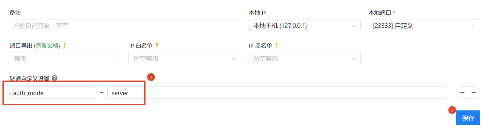
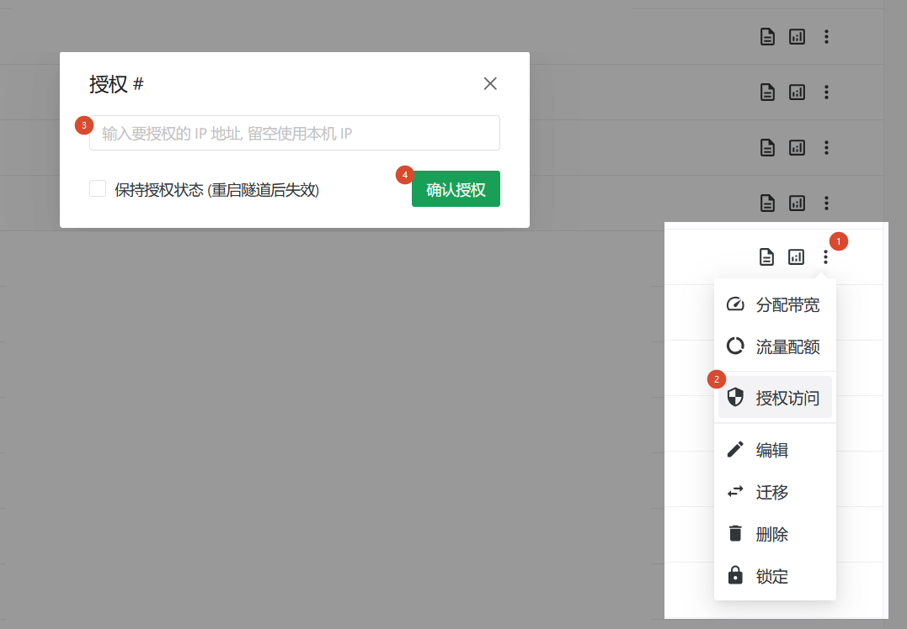

# 配置访问认证功能 (UDP 隧道)

::: tip 功能差异
受限于 UDP 协议的特性和通常用途，UDP 隧道的访问认证功能与 TCP 隧道的访问认证功能存在一些差异。

您目前无法在 UDP 隧道中使用访问密码认证和 TOTP 认证方式，只能通过后台进行操作。
:::

::: warning
此配置目前仅向专业用户开放，您可能需要在用户信息页面（网页端）或设置（客户端）中打开 “专业用户模式” 后才可设置。

打开专业用户模式后请避免随意修改配置，错误的配置可能会导致隧道无法使用。
:::

与 TCP 隧道的访问认证功能类似，启用访问认证后，未经授权的 IP 将无法访问您的隧道，这可以帮助您的 UDP 隧道回避 0day 攻击等安全风险。

## 注意事项 {#note}

1. 若当前 IP 因为未认证而被拦截，直接访问隧道可能会出现各种奇怪的错误
   - 具体现象取决于您穿透的应用，最常见的是无法访问 (与于隧道不在线类似，但不完全相同)
1. 重启隧道后授权缓存会被清空，因此所有 IP 都需要重新授权

## 配置访问认证 {#setup}

在 UDP 隧道的自定义设置中如图加入配置并重启隧道即可启用访问认证功能。

在启动访问认证后，**所有的** 进入数据都会被拦截，只有在后台完成授权的 IP 才能访问隧道：

您的朋友可以通过访问获取自身 IP 的站点（如 [https://ip4.13a.com/](https://ip4.13a.com/)）获取自身 IP，然后将其提供给您，由您进行授权。
