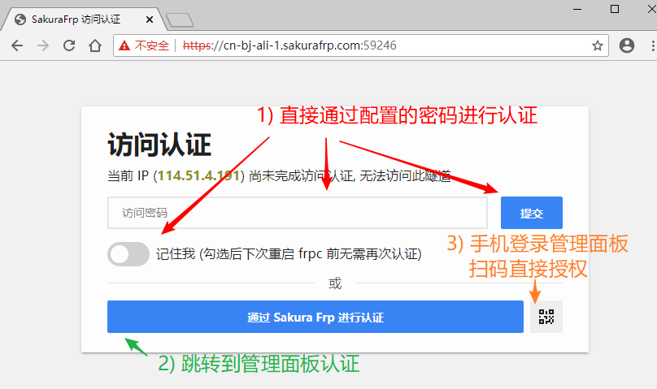

# 配置访问认证功能

::: tip 版本需求
基本的密码认证功能需使用 **v0.35.1-sakura-1** 及以上版本的 frpc  
启用 TOTP 支持需使用 **v0.42.0-sakura-3** 及以上版本的 frpc
:::

启用访问认证后，未经授权的 IP 将无法访问您的隧道，这可以有效回避密码被爆破、遭到 0day 攻击等安全风险。

对于 SSH、RDP 等易被尝试爆破攻击的服务来说，启用访问认证将能够有效减少被爆破造成的经济损失。

## 视频教程 {#video-guide}

*注: 视频教程有一些过期了，建议先看文字教程，看不懂再看这个*

::: details 点击展开


:::

## 注意事项 {#note}

1. 若当前 IP 因为未认证而被 frpc 拦截，直接访问隧道可能会出现各种奇怪的错误
   - 具体现象取决于您穿透的应用，最常见的是连接卡住 (与于隧道不在线类似，但不完全相同)
   - 启用访问认证后碰到这类奇妙问题请先检查是否已完成认证，用浏览器访问一下试试
1. 重启 frpc 后授权缓存会被清空，因此所有 IP 都需要重新授权
1. 启用访问认证后，Web 认证由 frpc 本地处理，会产生极少量的流量消耗用于认证

## 配置访问认证 {#setup}

::: tip
TOTP 和 访问密码可以同时配置以实现 2FA，也可以单独配置一项来启用单个认证方式
:::

在 TCP 隧道的 **访问密码** 一栏设置一个密码并重启隧道即可启用访问认证功能。

高级用户也可以在 **访问认证 TOTP** 一栏配置 TOTP 功能 [(auth_totp 选项)](/frpc/manual.md#tcp_proxy)，推荐点击生成按钮打开扫码配置界面。


## 访问隧道 {#connect}

::: tip
每个 IP 都必须完成授权才能连接隧道，这就意味着若您想让他人连接隧道，对方也 **必须完成** 访问认证  
为了简化这一流程，您可以生成 [认证代理](/offtopic/auth-guest.md) 程序分发给访客，运行生成的程序就能自动完成认证
:::

假设您配置了一个 **远程桌面** 隧道，启用认证前的连接方式是 `114.5.1.4:59246`，则一个完整的连接流程如下:

<!-- markdownlint-disable MD034 -->
1. 在连接远程桌面前，通过浏览器访问 `https://114.5.1.4:59246`，此时应该会看到访问认证界面：

   ::: warning
   请输入完整的 **https://** 前缀，否则 **可能打不开** 认证界面
   提示证书错误是正常的，如有需要可以 [配置 SSL 证书](/frpc/ssl.md#authpanel) 避免证书错误的提示
   :::

   

2. 目前我们提供 4 种认证方式可供选择:

   - 直接输入之前配置的访问密码 (和/或 TOTP 代码)，按需勾选 "记住我" 并点击 **提交** 按钮：

     

   - 点击 **通过 Sakura Frp 进行认证** 按钮，跳转到 Sakura Frp 面板，登录账户后点击 **授权访问** 进行授权：

     

   - 点击右下角二维码图标，使用已经登录管理面板的手机扫描弹出二维码后点击 **授权访问** 进行授权：

     采用手机扫码可以方便的给没有登录账户的电脑授权，同时避免账号密码泄露的风险。

     

   - 在已经登录管理面板的设备上找到隧道，点击授权访问按钮手动输入 IP 进行授权：

     

3. 认证完成后，再次通过浏览器访问认证界面时您可能会看到 **无法访问此网站** 的错误。

   这是正常现象，如果隧道没有掉线则该错误说明当前 IP 已完成认证并可以正常访问服务了。

   

4. 现在，使用 `远程桌面连接` 程序像以前一样正常连接远程桌面即可

   

## 自动化认证 {#automation}

如果您需要一个自动化的认证方案，可以参考下方实现：

```bash
curl -k -X POST \
   -d "persist_auth=<on/off>" \
   -d "pw=<认证密码>" \
   -d "totp=<TOTP 代码，如果需要>" \
   "https://<隧道地址>"
```

我们 **更推荐** 您使用 [SakuraFrp 认证代理](/offtopic/auth-guest.md) 自动完成认证流程，配置后只需打开认证代理即可自动完成访问认证。

如果您需要在安卓手机使用，您可以参考上面的请求使用 Tasker 或 [SakuraFrp 认证代理微件](/offtopic/auth-widget.md) 自动完成认证。
