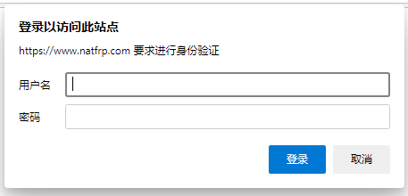
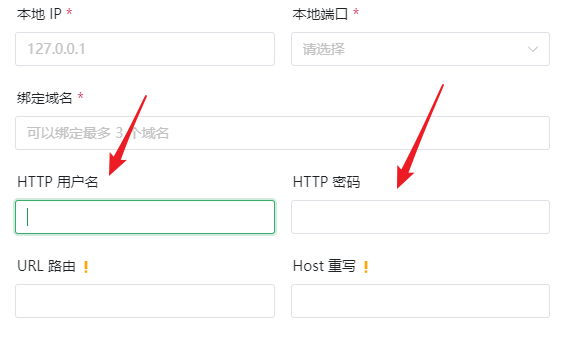

# 安全指南

为了防止出现 [这种情况](https://www.v2ex.com/t/692012)，我们为您准备了一些安全设定的指南。

## 全球通用的安全准则 {#security-principal}

1. 对于暴露在网络上的任何东西，密码一定要足够强
   - 例如，`114514`、`Passw0rd` 就是典型的 **弱密码**，基本上 **没什么安全性可言**
   - 而 <code><random-string /></code> 就是一个合格的 **强密码**
   - 此外，不要在所有地方都使用同一个密码。请使用一个靠谱的密码管理器，如 [Bitwarden](https://bitwarden.com/)、[1Password](https://1password.com/)
1. 保持谦逊是美德，也是保护您不被人攻击的隐身咒
1. 如果您知道一个东西以漏洞闻名，那就为它多加防护
1. 如果没有特殊需求，使用最新版程序通常都是一个好选择  
   尤其是当您使用诸如 WordPress 这类历史悠久的项目时，您遇到陈年老代码带来漏洞的可能性将急速升高  
   请务必打开各个程序自带的更新检测，并总在第一时间进行更新

## 通过访问认证功能保护 TCP 隧道 {#auth}

由 SakuraFrp 分发的 frpc 具有 **访问认证** 功能，该功能可以有效保护 **TCP 隧道** 免遭攻击。

访问认证功能可以保护的应用包括 **但不限于**：

- 远程桌面 (RDP)
- SSH 服务器、FTP 服务器 (通常情况下保护好控制连接就可以满足安全需求)
- 各类网站，如 NAS 管理页面、路由器管理页面等

我们 **强烈推荐** 所有用户启用此功能，请参阅 [配置访问认证功能](/bestpractice/frpc-auth.md) 来了解启用和加固访问认证功能的方式。

## HTTP(S) 安全提示 {#http}

首先，HTTP 是一个明文传输的协议，对于保证 HTTP 传输安全且不被篡改的最优先事项应当是升级为 HTTPS 并且采用可信的证书。

### 添加 HTTP 鉴权 {#http-auth}

::: tip
对 HTTP 服务添加鉴权所起到的保护作用微乎其微，但仍然可以像英国政府一样「让人相信您受到了保护」  
同时，对 HTTPS 服务添加鉴权并配置强密码通常可以有效的保护您的服务
:::

为了保护您的页面不被直接窥视，通过 Basic Auth 添加一个鉴权会是一个低成本的解决方案：

Basic Auth 的配置方式大同小异，下面是常见 Web 服务器的相关文档链接：

- [Nginx](https://docs.nginx.com/nginx/admin-guide/security-controls/configuring-http-basic-authentication/)
- [Apache](https://www.digitalocean.com/community/tutorials/how-to-set-up-password-authentication-with-apache-on-ubuntu-16-04)
- [Caddy](https://caddyserver.com/docs/caddyfile/directives/basicauth)

您也可以直接在创建 HTTP 隧道时启用 frpc 自带的 Basic Auth 支持：

但是请注意，我们 **不推荐** 使用这个功能，请尽可能使用 HTTPS 隧道 + Web 服务器鉴权。

## 远程桌面 (RDP) 安全提示 {#rdp}

映射远程桌面通常会带来出人意料的风险，因为巨硬的漏洞总是很多。

如果您需要映射远程桌面，务必要启用 [frpc 访问认证](/bestpractice/frpc-auth.md) 来避免批量 0day 利用使得您的电脑遭到攻击，出现 WannaCry 的悲剧。

**系统更新是您的朋友，不是敌人。** 如果说有一个东西总是能在暴露的风险中拯救您，那一定是阻断药……啊不，系统更新。

系统更新可能会迟到，但是只要到达，它总是能为守护您的电脑奉上您需要的力量。

如果您因为一些理由关闭了系统更新，请不要以任何形式把自己暴露在网络中。
