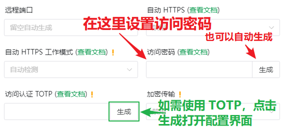

# 安全指南

为了防止出现 [这种情况](https://www.v2ex.com/t/692012 ':target=_blank')，我们为您准备了一些安全设定的指南。

### 全球通用的安全准则

1. 对于暴露在网络上的任何东西，密码一定要足够强
1. 保持谦逊是美德，也是保护您不被人攻击的隐身咒
1. 如果您知道一个东西以漏洞闻名，那就为它多加防护
1. 如果没有特殊需求，使用最新版程序通常都是一个好选择  
   尤其是当您使用诸如 WordPress 这类历史悠久的项目时，您遇到陈年老代码带来漏洞的可能性将急速升高  
   请务必打开各个程序自带的更新检测，并总在第一时间进行更新

---

### frpc 访问认证

!> 该功能处于测试阶段, 请使用 frpc v0.34.2-sakura-3.2-alpha-2 及以上版本  

启用访问认证后，未经授权的 IP 将无法访问您的隧道，这可以有效回避密码被爆破、遭到 0day 攻击等安全风险

#### 注意事项

1. 若当前 IP 因为未认证而被 frpc 拦截，直接访问隧道可能会出现各种奇怪的错误  
   具体现象取决于您穿透的应用，最常见的是连接卡住 (与于隧道不在线类似，但不完全相同)  
   启用此功能后碰到问题请自行排查，我们不提供技术支持
1. 重启 frpc 后授权缓存会被清空，因此所有 IP 都需要重新授权
1. 该功能仍处于测试阶段，因此部分行为和功能可能在正式版中有所改变，请关注文档更新

#### 配置访问认证

在隧道的 **自定义设置** 中填写 `auth_pass = 访问认证密码` 并重启隧道即可启用访问认证功能

如有需要，请参阅 [frpc 用户手册](/frpc/manual#tcp_proxy) 获取更多配置信息

#### 连接隧道

启用访问认证功能后，每个 IP 在连接隧道前必须先完成认证

假设您配置了一个 **远程桌面(RDP)** 隧道，原来的连接方式是 `cn-bj-ali-1.sakurafrp.com:59246`，则一个完整的连接流程如下:

1. 在连接远程桌面前，通过浏览器访问 `https://cn-bj-ali-1.sakurafrp.com:59246`，此时应该会看到访问认证界面

   !> 注意输入完整的 **https://** 前缀，否则您可能无法访问认证界面  
   浏览器提示证书错误是正常现象，您可以通过配置 frpc 路径下的 `authpanel.<crt|key>` 并使用恰当的域名进行访问来解决这一问题

   
1. 您可以选择以下认证方式:
   - 直接输入之前配置的访问密码，按需勾选 "记住我" 并点击 **提交** 按钮  
     认证成功后您应该会看到下图中的提示

     
   - 或点击 `通过 Sakura Frp 进行认证`，跳转到 Sakura Frp 面板  
     登录隧道对应的账户后，点击 **授权访问** 来授权当前 IP 访问隧道

     

     ?> 注: 您也可以在 **隧道列表** 中打开此授权界面手动输入 IP 进行授权
        
1. 认证完成后，再次通过浏览器访问认证界面时您可能会看到 **无法访问此网站** 的错误  
   这是正常现象，如果隧道没有掉线则该错误说明当前 IP 已完成认证并可以正常访问服务了
   
1. 此时，使用 `远程桌面连接` 程序像以前一样正常连接远程桌面即可  
   

---

### HTTP(S) 安全提示

首先，HTTP 是一个明文传输的协议，对于保证 HTTP 传输安全且不被篡改的最优先事项应当是升级为 HTTPS 并且采用可信的证书

#### 添加鉴权

?> 对 HTTP 协议添加鉴权所起到的保护作用微乎其微  
但仍然可以像英国政府一样「让人相信您受到了保护」

为了保护您的页面不被直接窥视，通过 Basic Auth 添加一个鉴权会是一个低成本的解决方案

Basic Auth 的配置方式大同小异，下面是常见web server的相关文档链接：
 - [Nginx](https://docs.nginx.com/nginx/admin-guide/security-controls/configuring-http-basic-authentication/)
 - [Apache](https://www.digitalocean.com/community/tutorials/how-to-set-up-password-authentication-with-apache-on-ubuntu-16-04)
 - [Caddy](https://caddyserver.com/docs/caddyfile/directives/basicauth)

---

### 远程桌面(RDP) 安全提示

映射远程桌面通常会带来出人意料的风险，因为巨硬的漏洞总是很多

如果您需要映射远程桌面，我们强烈建议您启用 [frpc 访问认证](#frpc-访问认证) 来避免批量 0day 利用使得您的电脑遭到攻击，出现 WannaCry 的悲剧

**系统更新是您的朋友，不是敌人。** 如果说有一个东西总是能在暴露的风险中拯救您，那一定是阻断药……啊不，系统更新。

系统更新可能会迟到，但是只要到达，它总是能为守护您的电脑奉上您需要的力量。

如果您因为一些理由关闭了系统更新，请不要以任何形式把自己暴露在网络中。
