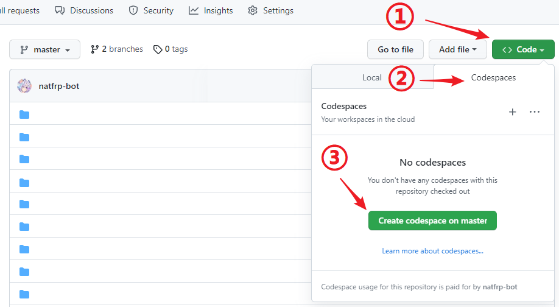
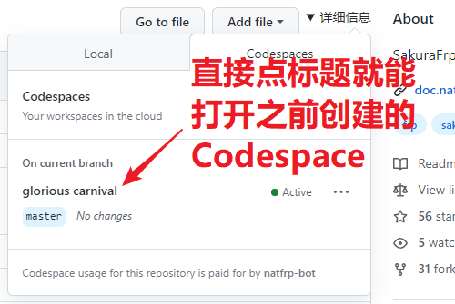
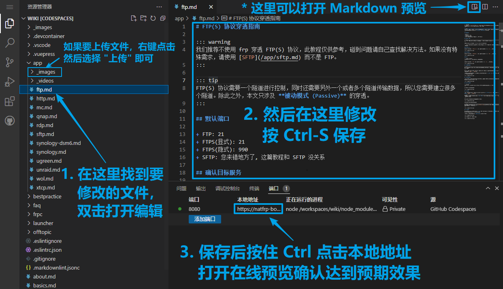
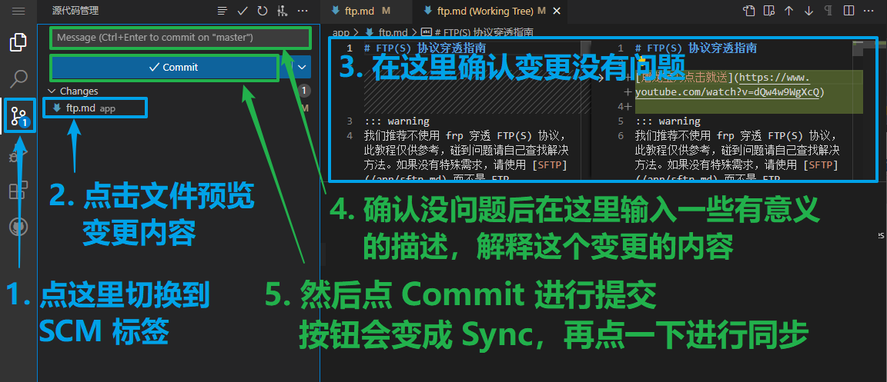
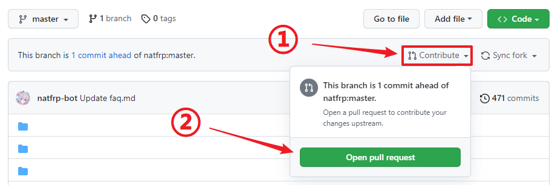
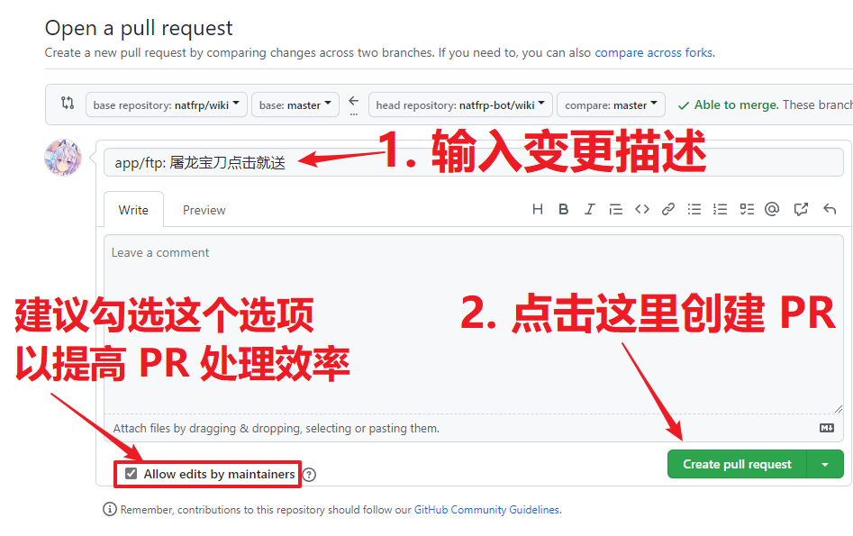

# 在线编辑此文档

我们为文档仓库配置了 Dev Container 设置，以便您借助 [GitHub Codespaces](https://github.com/codespaces) 轻松在线编辑文档。

在使用 Codespaces 之前，请先 [Fork](https://github.com/natfrp/wiki/fork) 一份本项目到自己的账户中，以免 Push 时提示没有权限。

## 创建 Codespace

第一次使用前，打开您 Fork 的仓库并按下面的步骤一键创建 Codespace：

一般只需要创建一次即可，后面可以直接打开现有的 Codespace：

## 修改文档内容

::: tip
在进行任何修修改前，请先花几分钟阅读 [文档格式约定](./style.md)
:::

Codespace 启动后是一个 Visual Studio Code 在线实例，参考下图进行编辑和预览：

编辑、预览完成后，参考下图切换到 SCM 标签确认更改并提交到您的 Git 仓库中：

## 开启 Pull Request

刷新一下您的 GitHub 仓库，现在应该会在仓库顶部提示 `This branch is X commit ahead of natfrp:master`。

点击旁边的 Contribute 按钮开启一个 Pull Request：

在 **Open a pull request** 页面按下图所示填写信息，然后点击 **Create pull request** 即可：

