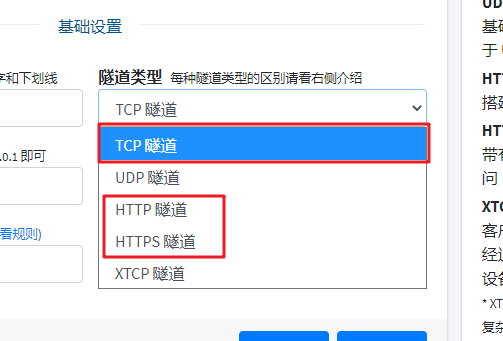
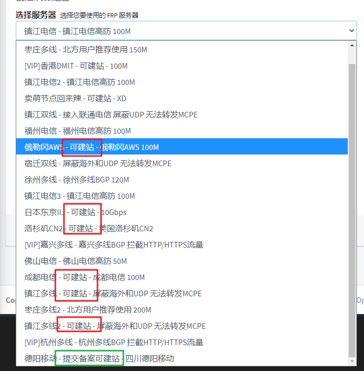

## 常见问题

### 错误: 登录节点失败, 请检查网络连接

1. 请运行 PING 测试节点连通性
2. 请查看管理面板的的 **统计信息** (节点受到攻击或故障时 **在线** 一栏会显示 `-`)

| 原因 | PING 测试结果 | 解决方案 |
| --- | --- | --- |
| 本地网络连接性问题 | × | 换网络 / 换节点 |
| 节点受到攻击 | × | 等 / 换节点 |
| 节点故障 | √ | 联系管理员 |

### 错误: port already used

| 原因 | 解决方案 |
| --- | --- |
| 隧道刚刚被关闭 | 启动器: **关闭隧道**   frpc: **退出 frpc**   等待 **一分钟** 后重新开启 |
| 存在 frpc 进程残留 | 启动器: 右键点击托盘图标, **彻底退出** 后重新打开启动器   frpc: 打开 **任务管理器** 查找并 **关闭** 残留的 frpc 进程 |
| 重复开启隧道 | 一条隧道同一时间只能有一个实例, 请 **创建不同端口的隧道** 或者 **关闭重复开启的隧道** |

### 错误: Request failed: ...

| 原因 | 解决方案 |
| --- | --- |
| 无法连接 API | 请检查本地网络能否正常访问 `https://api.natfrp.com` |
| API 故障 | 联系管理员 |

### 错误: SakuraFrp API failure, please contact administrator

| 原因 | 解决方案 |
| --- | --- |
| 节点或 API 出现故障 | 及时联系管理员 |

### 实名认证到底可以做什么

因为 **滥用** 和监管的缘故，我们不得不为映射 Web 应用设置额外的限制，并且这些限制在肉眼可见的未来不太可能减少。

|   | 直接映射 HTTP(S) 隧道 | 通过 TCP 隧道映射 HTTP 流量 | 通过 TCP 隧道映射 HTTPS 流量 |
| --- | --- | --- | --- |
| 海外节点 | 需要实名认证 | √ | √ |
| 国内节点 | 需要实名认证和 [ICP备案](https://baike.baidu.com/item/ICP%E5%A4%87%E6%A1%88) | 不可 | 需要实名认证 |
| 国内节点（有 `[高级]` 标志的） | 需要实名认证和 [ICP备案](https://baike.baidu.com/item/ICP%E5%A4%87%E6%A1%88)，而且使用阿里云节点必须在阿里云备案，腾讯云同理 | 需要实名认证 | 需要实名认证 |

您需要正确区分 **HTTP(S) 隧道** 和 **TCP 隧道映射 HTTP(S) 流量** 的区别。

转到创建隧道页面，您可以看到这里有两类隧道可供选择：

- TCP 隧道指的是单纯的建立 TCP 连接，您能选择的远程端口**一般**在 `10240` 至 `65535` 这个范围之间，这类隧道访问的时候需要使用 `http://www.example.com:12345/` 的形式来访问，即通常所说的“带端口号访问”。
- HTTP(S) 隧道指的是直接利用节点的 80/443 端口来映射，这类隧道访问的时候无需添加端口号，访问形式为 `http://www.example.com/`，即通常所说的“不带端口号访问”。

如果您想让其他人直接使用 `http://您的域名` 访问您的网站，就必须进行实名认证，若您想使用国内节点还需要确定您的域名已经有ICP备案，于[此处](http://beian.miit.gov.cn/)查询。

!> 过去并没有这种限制，但由于部分恶意用户的滥用，因此我们不得不加强管理来确保其他用户的正常使用。

### 海外节点建站需要备案/实名吗

必须进行实名认证，不需要备案。并且您搭建的网站内容不得违反您所在地区、中国大陆、节点所在地区的相关法律。

### 我想搭建网站，选择实名还是备案

这个问题其实取决于您的使用需求，我们没办法直接告诉您 "XXX 是最好的"

- 假如您只想把自己的路由器管理页面映射到国内节点，只有自己会去访问，这种情况下实名操作是比备案简单很多的，没有备案的情况下实名并建立 TCP 隧道映射是比较理想的选择。
- 假如您想建一个看起来比较专业的网站，最好先去备案然后采用 HTTP 隧道进行映射，这样其他人访问的时候就不用带看起来很奇怪的端口号了。

### 我的域名有备案，如何使用国内节点建站

首先转到创建隧道页面，查看节点列表

请留意图中红色框标出的位置，在该位置写有 **`- 可建站 -`** 的节点只要您的域名有备案就可以直接创建 HTTP(S) 隧道，机房会自动处理白名单，无需在 SakuraFrp 管理面板上进行额外操作

假如您想使用图中绿色框标出的 **`- 提交备案可建站 -`** 节点，您需要先到 SakuraFrp 管理面板的 "备案提交" 页面提交备案信息，然后才能在这些节点上创建 HTTP(S) 隧道。

### 为什么有的国内节点不开放建站

因为这些节点没有自动白名单功能，添加白名单需要联系机房客服手动添加，这是一个极其麻烦的流程，管理员没有时间进行此类操作。

### 可以帮我备案吗

不能，你想多了。

### UDP游戏服务端说明

某些使用 UDP 协议传输数据的游戏服务端需要远程端口与本地端口一致，如果出现映射正常无法连接的情况，请尝试做出此修改再试。

### 为什么你们客服态度这么差

本站暂时没有额外的资金来雇用客服，这也就意味着本站是 **没有客服** 的。

在 "使用咨询" 中解答问题的人一般为 **站点管理员** 或 **热心网友**，而二者都没有义务解答您的**任何**问题。

- 管理员只负责维持网站的正常运行以及处理服务扩容、滥用举报等。
- 热心网友相当于志愿者，他们并不能通过回答问题获取任何利益，因此热心网友是否帮助您是由他自己决定的。

假如您的问题解决方案已经被写在 FAQ 里了，您再到使用咨询询问可能只会收到一条链接或者被其他人忽略。

请不要在使用咨询中 [SPAM](https://zh.wikipedia.org/wiki/%E6%BF%AB%E7%99%BC%E9%9B%BB%E5%AD%90%E8%A8%8A%E6%81%AF ":target=_blank")，这可能导致您的账户被禁言或停用。如果您**真的**碰到了站点 Bug 或故障请直接私聊管理员，管理员看到后一定会帮您处理的。

### 503 错误

当您在访问网站时出现 `503 错误` 提示时，请检查是否存在以下情况：

- 绑定的域名和您访问的域名是否**完全**相同，是否有打错字的情况。

  - `natfrp.com` 和 `www.natfrp.com` 是两个完全不同的子域名，请勿混淆。

- 域名解析指向的节点是否和您隧道创建到的节点相同。

  - 一般免费的 DNS 解析服务，解析结果缓存时长从 10 分钟到一星期不等，请等待解析生效后再试。
    - 查看解析指向（针对高级用户，需下载工具）：`dig 记录类型 域名`

- 检查本地的 web 服务是否成功启动。

  - 是否能在**本地**访问您的网站。

- 隧道映射的本地 IP 和端口号是否正确。

  - 您是否能够通过隧道设置的那个**本地**地址和**本地**端口访问您的 web 服务。

- 客户端是否成功启动并出现 `start proxy success` 字样。

  - 不要先急着设置开机自启，先手动启动程序确认是否可以成功启动

- [针对 HTTP(S) 隧道] 隧道是否成对创建（一个 HTTP、一个 HTTPS）。

  - 只创建 HTTP 隧道会导致无法使用 HTTPS 协议访问。
  - 只创建 HTTPS 隧道会导致无法使用 HTTP 协议访问。

- 如果以上方法**都**不行，那么请尝试**更换节点**，如果还是不行可以考虑更换服务商。

?> _TODO_ 503 错误原因很多，目前正在总结中...

### 连接超时

请检查是否出现以下问题

- 域名未备案，部分机房的拦截方式是直接阻断，而不是提示未备案信息。
- 节点异常（如受到攻击、流量过大、IP 被阻断等）
- 检查本地的 web 服务是否成功启动。_提示：是否能在**本地**访问您的网站。_

### 如何搭建网站

- 或许 [百度](https://baidu.com) 和 [谷歌](https://google.com) 可以帮到您。

### 如何设置解析

- 请自行查看您域名解析提供商的帮助文档，并设置 `CNAME` 记录到节点域名。

  节点域名查看方式：

  

  红色方框框住的部分即是节点域名。

### IPv6

- 节点没有 IPv6 。

### 游戏连不上的解决办法

- 部分游戏（如 MCPE）需要本地端口与远程端口相同才可以连接。
- 检查隧道启动状态。
- 检查游戏服务端是否开启。
- 请检查端口是否配置正确。
- 请检查游戏服务端配置是否正确。

### 什么是备案

#### 法律法规

> 在中华人民共和国境内提供非经营性互联网信息服务，应当依法履行备案手续。
>
> 未经备案，不得在中华人民共和国境内从事经营性互联网信息服务。
> 拟从事新闻、出版、教育、医疗保健、药品和医疗器械、文化、广播电影电视节目等互联网信息服务，根据法律、行政法规以及国家有关规定应经有关主管部门审核同意的，在履行备案手续时，还应向其住所所在地省通信管理局提交相关主管部门审核同意的文件。
>
> 拟从事电子公告服务的，在履行备案手续时，还应当向其住所所在地省通信管理局提交电子公告服务专项备案材料。

#### 注意事项

- **域名实名认证**不等同于**ICP 备案**。
  - 买域名的时候要求提供身份信息只是实名认证。
- **ICP 备案**不等同于**公安备案**。
  - 公安备案和 ICP 备案不是一个系统。
- 本站不提供**任何形式**的代备案服务。
  - 要备案推荐找[阿里云](https://www.aliyun.com/?source=5176.11533457&userCode=wbduu7yg&type=copy)、[腾讯云](https://url.cn/MY10U76e)这种大厂，稳定。 <!-- 左侧 AFF 怪上线, 管理不爽可删除, 见谅. -->

### 哪个节点好用

节点速度受以下因素影响：

- 该节点的使用人数
- 节点到客户端的物理距离
- 节点到客户端的网络状况
- 客户端、节点的网络环境差异
- 国家政策
- 部分不可抗力因素
- 某些“带佬”恶意攻击

> 送某些人一句话：如果有 10% 的利润，它就保证到处被使用；有 20% 的利润，它就活跃起来；有 50%的利润,它就铤而走险；为了 100% 的利润，它就敢践踏一切人间法律；有 300% 的利润，它就敢犯任何罪行，甚至绞首的危险。

综上所述，我们无法告知您哪个节点最好用，另外也请您不要相信网络上所谓 `XX节点最好用` 的言论，建议您自己进行测试。

请您牢记：在没有亲身验证之前，任何关于 `XX节点最好用` 的言论都是不可靠的 ~~，因为有的人只是想让他自己用的节点人少一些罢了~~ 。

### 隧道启动成功后么查看数字 IP

!> 该部分内容已经过期，新版本已经恢复 IP 地址显示。

ping 一下就有了，例如您获取到的域名是 `cn-zz-bgp.sakurafrp.com`

请直接执行命令 `ping cn-zz-bgp.sakurafrp.com`

### 其他

?> _TODO_ 其他内容请移步 <https://baoshuo.blog/post/8tYaUDF47/> 。  xxs/超级小白专用版文档 <https://www.ravi.cool/posts/sakura-frp.html>。
