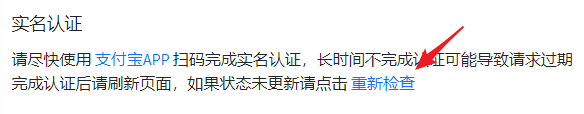
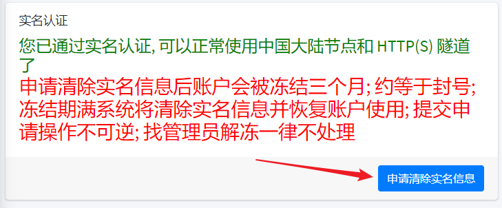
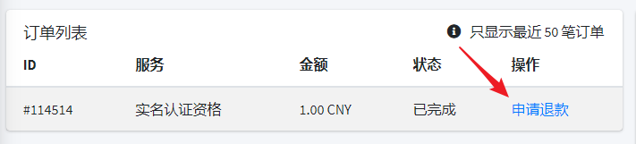
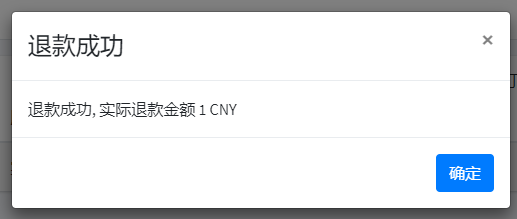
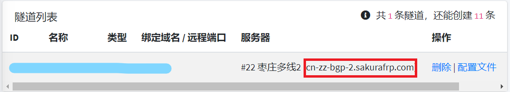

# 常见问题

## 客户端错误 :id=client-error

### 登录节点失败, 请检查网络连接

1. 请运行 PING 测试节点连通性
2. 请查看管理面板的的 **统计信息** (节点受到攻击或故障时 **在线** 一栏会显示 `-`)

| 可能原因 | PING 测试结果 | 解决方案 |
| --- | --- | --- |
| 网络故障 | × | 换节点 / 换网络 |
| 节点受到攻击 | × | 换节点 / 等一天再试 |
| 节点被墙了 | × | 换节点 |
| 节点故障 | √ | 联系管理员 |
| 上游防火墙拦截 frp 协议 | √ | 换网络 / 找别家 |
| 上游防火墙拦截 7000 / 7001 端口 | √ | 换网络 / 找别家 |
| 公司 / 学校网管不允许使用 frp | √ | 那就别用 |

### port already used

| 原因 | 解决方案 |
| --- | --- |
| 隧道刚刚被关闭 | 启动器: **关闭隧道**   frpc: **退出 frpc**   等待 **一分钟** 后重新开启 |
| 存在 frpc 进程残留 | 启动器: 右键点击托盘图标, **彻底退出** 后重新打开启动器   frpc: 打开 **任务管理器** 查找并 **关闭** 残留的 frpc 进程 |
| 重复开启隧道 | 一条隧道同一时间只能有一个实例, 请 **创建不同端口的隧道** 或者 **关闭重复开启的隧道** |

### Request failed

| 原因 | 解决方案 |
| --- | --- |
| 无法连接 API | 请检查本地网络能否正常访问 `https://api.natfrp.com` |
| API 故障 | 联系管理员 |

### SakuraFrp API failure

| 原因 | 解决方案 |
| --- | --- |
| 节点或 API 出现故障 | 及时联系管理员 |

---

## 实名认证 :id=realname

### 怎么进行实名认证

1. 到 [增值服务](https://www.natfrp.com/purchase/buy ':target=_blank') 页面购买一次实名认证资格
1. 到 [实名认证](https://www.natfrp.com/user/realname ':target=_blank') 页面输入姓名和证件号，点击 `确认提交` 按钮
1. 使用 [支付宝 APP](https://mobile.alipay.com/ ':target=_blank') 扫描弹出的二维码，根据提示完成操作  
   _* 此步骤需要刷脸，但是无需支付额外费用_

### 没有支付宝怎么认证 / 支付宝提示 "对比源不清晰" 等错误

我们推荐您注册一个支付宝账号，然后使用支付宝 APP 完成实名认证。

如果因为特殊原因无法通过支付宝进行认证，请使用手机访问 [备用接口](https://www.natfrp.com/user/realname_megvii ':target=_blank') 进行操作。

!> 如果您已提交实名信息，请点一下二维码页面上的 "重新检查" 链接使当前认证失败，否则无法进入备用接口  

### 没有手机怎么进行实名认证

暂不支持此操作，如果您购买了实名认证资格请转到 [订单列表](https://www.natfrp.com/purchase/list ':target=_blank') 页面申请退款。

### 我的实名信息安全吗

我们会严格遵守隐私保护的相关法律法规，并根据本站 [隐私策略](https://www.natfrp.com/policy/privacy ':target=_blank') 进行信息的储存、披露、删除等操作。

同时，实名认证中涉及的刷脸、拍摄身份证等操作均由您在 [支付宝](https://www.alipay.com/ ':target=_blank') 或 [旷视](https://megvii.com/ ':target=_blank') 平台上进行操作，我们无法触及您的照片等信息。

### 怎么删除我的实名信息

转到 [实名认证](https://www.natfrp.com/user/realname ':target=_blank') 页面，点击 `申请清除实名信息` 按钮并根据提示进行操作。

### 使用海外节点建站是否需要备案 / 实名

必须进行实名认证，不需要备案。网站内容不得违反您所在地区、中国内地、节点所在地区的相关法律法规。

### 使用海外节点穿透其他内容 (如游戏联机) 是否需要备案 / 实名

不需要进行实名认证，不需要备案。穿透的内容不得违反您所在地区、中国内地、节点所在地区的相关法律法规。

### 搭建网站要实名还是备案

必须实名，不一定要备案。请参阅 [建站条件](#site-requirement) 了解更多建站条件。

---

## 网站备案 :id=beian

### 为什么要备案

您可以在 [工业和信息化部政务服务平台](https://beian.miit.gov.cn/#/Integrated/lawStatute ':target=_blank') 查询相关政策文件。

《互联网信息服务管理办法》 部分内容摘录：

- 第七条: 从事经营性互联网信息服务，应当向省、自治区、直辖市电信管理机构或者国务院信息产业主管部门申请办理互联网信息服务增值电信业务经营许可证
- 第八条: 从事非经营性互联网信息服务，应当向省、自治区、直辖市电信管理机构或者国务院信息产业主管部门办理备案手续。

《非经营性互联网信息服务备案管理办法》 部分内容摘录：

- 第十八条: 互联网接入服务提供者不得为未经备案的组织或者个人从事非经营性互联网信息服务提供互联网接入服务。

### 常见概念错误

- **实名认证** 不等于 **ICP 备案**  
  - 部分厂商在您购买域名时要求您提交的 "域名实名认证" 身份信息与备案无关
  - 在 SakuraFrp 进行的实名认证也与备案无关
- **ICP 备案** 不等于 **公安网备案**  
  - `ICP 备案` 就是我们通常所说的 "备案"，指的是在 [工业和信息化部政务服务平台](https://beian.miit.gov.cn/#/ ':target=_blank') 进行的备案操作，必须完成此备案才可以建站
  - `公安网备案` 指的是在 [全国互联网安全管理服务平台](http://www.beian.gov.cn/portal/index ':target=_blank') 进行的备案操作，通常无需进行此备案

### 怎么进行备案

我们不提供任何形式的备案服务，请参阅下方链接：

- [阿里云备案](https://beian.aliyun.com/)
- [腾讯云备案服务](https://cloud.tencent.com/product/ba)

### 备案域名建站需要过白么

标有 `有备案才能建站` 的节点机房具有自动备案防火墙，无需过白。

其他节点不提供人工过白服务，因此您无法在这些节点上创建 HTTP(S) 隧道。

---

## 付款、订单问题 :id=payment

### 怎么进行退款

!> 滥用系统机制大量退款将被封禁账户，此时需联系管理员说明情况并人工解封

首先请确保您满足 [退款策略](https://www.natfrp.com/policy/refund ':target=_blank') 中的退款条件，不满足退款条件的原则上不予退款。

转到 [订单列表](https://www.natfrp.com/purchase/list ':target=_blank') 页面找到您想退款的订单，点击右侧的 **申请退款**：

按提示进行操作，系统将会自动进行审批和退款。如果一切正常，您应该会看到下面的提示：

一分钟内对应的款项会被原路退回，如果您没有收到退款或看到错误提示，请 **截图错误提示** 并立即联系管理员处理。

### 我创建了两个不想要的商品订单，无法创建新订单怎么办

由于系统限制，出现这种情况管理员也无法为您处理，请尝试下列操作：

- 等待 24 小时后重新下单，之前的订单会被自动关闭 (推荐)
- 如果有特殊情况不能等这么久，可以尝试支付一个订单然后申请退款 (不推荐，没有特殊情况请不要使用此方法)

### 付款后服务没有到帐怎么办

首先请耐心等待 1~2 分钟，然后转到 [订单列表](https://www.natfrp.com/purchase/list ':target=_blank') 页面查看订单 **状态** 一栏是否显示 *已完成*。

如果订单状态仍然为 *待付款*，请回忆您是否切换过付款方式 (比如使用微信支付后又切换成了支付宝)，如果切换过付款方式就会导致订单无法正常被处理。

此时请不要着急，按下面的步骤获取必要信息，然后将这些信息发给管理员处理：

<b style="font-size: 16px">支付宝用户操作方法 (点击展开)</b>

打开支付宝，点击右下角 **我的**，然后点击 **账单**：

找到您的未到帐账单，点击进入详情页面：

点击 **更多** 展开订单号：

对整个页面进行截图，然后复制 **商家订单号** 一起发给管理员等待处理。

!> 请不要复制 **订单号**，我们需要的是 **商家订单号**  
请不要遮盖截图中的任何信息，此处因演示需要进行了打码

 

<b style="font-size: 16px">微信用户操作方法 (点击展开)</b>

打开微信，点击右下角 **我**，然后点击 **支付**：

点击 **钱包**：

点击右上角 **账单**：

找到您的未到帐账单，点击进入详情页面：

对整个页面进行截图，然后复制 **商户单号** 一起发给管理员等待处理。

!> 请不要复制 **交易单号**，我们需要的是 **商户单号**  
请不要遮盖截图中的任何信息，此处因演示需要进行了打码

### 有没有年费 VIP

目前没有，并且在可预见的未来也不会推出此类套餐。

### 为什么 VIP 购买上限是 6 个月

由于我们的服务质量会受国内政治环境、网络环境以及各种不可知因素的影响，我们推荐您按需购买 VIP，并且在购买前确认当前的服务质量可以满足您的使用需求。

当然，我们也理解频繁续费会给您带来不必要的麻烦，因此半年进行一次续费是一个相对合理的折中方案。

### SakuraFrp 支持哪些付款方式

本平台支持下列付款方式：

- [支付宝](https://www.alipay.com/ ':target=_blank')
- [微信支付](https://pay.weixin.qq.com/ ':target=_blank')

!> 目前没有添加其他付款方式 (如 QQ 钱包) 的计划

---

## 无法访问映射的网站 :id=site-inaccessible

首先，您需要正确区分 **HTTP(S) 隧道** 和 **TCP 隧道映射 HTTP(S) 流量**：

| 网站访问方式 | 穿透类型 |
| --- | --- |
| `http://www.example.com` 或 `https://www.example.com` | HTTP(S) 隧道 |
| `http://www.example.com:12345` (注意此处带了端口 `12345`) | TCP 隧道映射 HTTP 流量 |
| `https://www.example.com:54321` (注意此处带了端口 `54321`) | TCP 隧道映射 HTTPS 流量 |

### 建站条件 :id=site-requirement

不满足下表中的任一条件均会造成网站无法访问，此时请更换映射方式或节点：

|   | HTTP(S) 隧道 | TCP 隧道映射 HTTP 流量 | TCP 隧道映射 HTTPS 流量 |
| --- | --- | --- | --- |
| 海外节点 | 需要实名认证 | √ | √ |
| 国内节点 | 需要实名认证和 [ICP备案](https://baike.baidu.com/item/ICP%E5%A4%87%E6%A1%88) | × | 需要实名认证 |
| `[高级]` 国内节点 | 需要实名认证和 [ICP备案](https://baike.baidu.com/item/ICP%E5%A4%87%E6%A1%88)，而且使用阿里云节点必须在阿里云备案，腾讯云同理 | 需要实名认证 | 需要实名认证 |

### HTTP(S) 隧道 503 错误

当您在访问网站时出现 `503 错误` 提示时，请检查是否存在以下情况：

+ 绑定的域名和您访问的域名是否 **完全** 相同，是否有打错字的情况。
  - `natfrp.com` 和 `www.natfrp.com` 是两个完全不同的子域名，请勿混淆。
+ 域名解析指向的节点是否和您隧道创建到的节点相同。
  - 一般免费的 DNS 解析服务，解析结果缓存时长从 10 分钟到一星期不等，请等待解析生效后再试。*提示：您可以使用 `dig type domain @dns_server` 查询 DNS 解析结果*
+ 检查本地的 web 服务是否成功启动。
  - 是否能在**本地**访问您的网站。
+ 隧道映射的本地 IP 和端口号是否正确。
  - 您是否能够通过该隧道设置的**本地**地址和**本地**端口访问您的 web 服务。
+ 客户端是否成功启动并出现 `start proxy success` 字样。
  - 不要先急着设置开机自启，先手动启动程序确认是否可以成功启动
+ [针对 HTTP(S) 隧道] 隧道是否成对创建（一个 HTTP、一个 HTTPS）。
  - 只创建 HTTP 隧道会导致无法使用 HTTPS 协议访问。
  - 只创建 HTTPS 隧道会导致无法使用 HTTP 协议访问。

如果以上方法都不行，那么请尝试**更换节点**，如果还是不行可以考虑更换服务商。 *提示：我们在官网上维护了一份 [友商列表](https://www.natfrp.com/peer_vendors.php) 供您参考。*

?> _TODO_ 能导致出现 503 错误的原因有很多，该列表将会持续更新。

---

## 其他问题 :id=other

### 怎么更换头像

SakuraFrp 通过 Gravatar 获取头像，您可以 [前往 Gravatar](https://www.gravatar.com/ ':target=_blank') 更换头像。

### 怎么修改用户名

用户名暂不支持修改，您可以考虑申请注销账户然后重新注册。

### 点击签到时卡住怎么办

通常此问题是由网络不好造成的，您可以尝试下列操作：

- 尝试等签到页面的猫图加载完成再进行签到
- 多刷新几次页面，每次刷新后点一下 **点击签到**，稍后几秒钟再刷新
- 更换网络环境或更换设备重试
- 更换浏览器重试，我们推荐使用 Google Chrome、Microsoft Edge 或 Firefox 浏览器

### 创建隧道时提示 您选择的端口不可用 (被其他人占用)

端口被别人占用了，您没有抢过来使用的特权。请换一个端口或者换一个节点试试。我们建议留空远程端口让系统自动生成。

### 创建隧道时提示 您选择的端口不可用 (超出允许端口范围)

请点击远程端口旁边的 **查看规则** 查看节点允许使用的端口。

### 我可以使用超出可用端口范围 (如 10240 以下) 的端口吗

不能，开放这些端口可能造成安全隐患或加重服务滥用。

### 但是我就是想用 / 我的 XXX 服务一定要用 XXXX 端口，能不能开放一下

您没有使用这些端口的特权，建议您尝试穿透 VPN 或者找其他服务商。

### 有没有全端口映射

没有。

### 我的号被盗了怎么办

您有保护好自己账户的义务，请通过邮箱或绑定的手机号进行密码重置，我们无法为您恢复盗号者消耗的流量等权益。

由于改绑邮箱时无需验证旧邮箱，我们推荐您绑定手机号来确保账户可以被找回。

### 怎么换绑手机号

原则上我们不允许换绑手机号，如果确有需要请联系管理员，您需要验证旧手机号和新手机号才能完成换绑。

### 为什么隧道在启动器 / frpc 里消失了，但在网站上能看到

禁用隧道后，启动器里就不会显示这条隧道了。请转到 [隧道列表](https://www.natfrp.com/tunnel/ ':target=_blank')，滚动列表最右边打开 **启用** 一栏的开关。

### HTTP(S) 隧道支持泛域名匹配吗

由于滥用严重，目前我们不支持泛域名匹配，并且每条隧道最大只允许绑定 3 个域名。

### 为什么管理面板有一些又土又丑的 RGB 特效

这是为了防止部分用户看不到关键信息，如果您视力正常，您可以拉到页面底部点击 "关闭眼瞎特效" 来禁用它们。

### GitHub 上的 SakuraFrp 源码和你们是什么关系

原站长已于 **2020.01.20** 将 SakuraFrp 转交给 **iDea Leaper** 进行运营，我们重写了整个站点的代码。

除了名字和使用的前端框架 (AdminLTE 3) 与之前保持一致，相同的代码不会超过 0.5%。

### 我想通过 GitHub 上的 SakuraFrp 源码搭建穿透面板，能帮帮我吗

我们不提供此类支持，请联系原站长 [@kasuganosoras](https://github.com/kasuganosoras ':target=_blank')

### 你们的 frpc 可以开源吗

可以，但没必要。因为要把 frps 和 frpc 的源码分开太麻烦了。

如果您不信任我们分发的二进制文件，请使用 [上游的开源 frpc](https://github.com/fatedier/frp ':target=_blank')，我们会尽量保持对 `0.18.0` 到最新版上游 frpc 的兼容性。

### SakuraFrp 管理面板打不开怎么办

通常这是由各种神秘的网络问题造成的，也可能是我们的服务器遭到了较为严重的攻击。请尝试以下方法:

- 更换设备访问 (如手机更换为电脑)
- 更换网络环境访问 (如 WIFI 更换为 5G 网络)
- 更换浏览器访问 (推荐使用 Google Chrome / Microsoft Edge / Firefox)
- 查看 [SakuraFrp 状态通知频道](https://t.me/natfrp_status ':target=_blank') 是否有故障通知  
  _* 您可能无法在中国内地境内直接访问此频道，请自行寻找解决方案_
- 如果您在 VIP 反馈群中，可以查看群内是否有相关通知或直接向管理员发送无法访问面板的错误截图进行咨询

### 隧道或软件可以重复开启吗

一条隧道只能对应一个运行中的 frpc 进程。“重复开启” 的定义较为模糊，请参考下表中的说明：

| 具体情况 | 可行性 | 说明 |
| --- | --- | --- |
| 一台电脑开启多个 frpc，连接 **ID 相同的** 隧道 | 不可以 | 如果这么做，节点就不知道应该把请求转发给哪个 frpc 了 因此隧道无法正常启动，会提示 `port already used` 等错误信息 |
| 在电脑 A 上开启一条和电脑 B 上 **ID 相同的** 隧道 | 不可以 | 参考上面 ↑ |
| 在一台电脑上开启多条 **ID 不同的** 隧道 | 可以 | 这是很常见的场景 |
| 在多台电脑的 **启动器** 上 **登录同一个账号** | 可以 | 我们不限制启动器的登录设备数量 |

### 一个 frpc 可以连接多条隧道吗

?> 请注意区别 **进程** 和 **文件**。如果您无法理解这两个概念，可以参考 [百度百科: 进程](https://baike.baidu.com/item/%E8%BF%9B%E7%A8%8B/382503 ':target=_blank')、[百度百科: 计算机文件](https://baike.baidu.com/item/%E8%AE%A1%E7%AE%97%E6%9C%BA%E6%96%87%E4%BB%B6 ':target=_blank')

一个 frpc 进程只能连接一个 **节点**，这就是说：

- 如果这几条隧道不在同一个节点，不能，必须开启多个 frpc 进程
- 如果这几条隧道都在同一个节点上，可以在一个 frpc 进程中连接多条隧道。请参阅 [frpc用户手册-从命令行启动](http://localhost:3000/#/frpc/manual?id=%e4%bb%8e%e5%91%bd%e4%bb%a4%e8%a1%8c%e5%90%af%e5%8a%a8)
- 启动器会自动管理 frpc 进程并且总是确保一个 frpc 连接一条隧道，因此启动器开启的 frpc 无法连接多条隧道

### 连接超时

请检查是否出现以下问题

- 域名未备案，部分机房的拦截方式是直接阻断，而不是提示未备案信息。
- 节点异常（如受到攻击、流量过大、IP 被阻断等）
- 检查本地的 web 服务是否成功启动。*提示：是否能在 **本地** 访问您的网站。*

### UDP游戏服务端说明

某些使用 UDP 协议传输数据的游戏服务端需要远程端口与本地端口一致，如果出现映射正常无法连接的情况，请尝试做出此修改再试。

### 如何搭建网站

+ 或许 [百度](https://baidu.com) 和 [谷歌](https://google.com) 可以帮到您。

### 如何设置解析

- 请自行查看您域名解析提供商的帮助文档，并设置 `CNAME` 记录到节点域名。

  节点域名查看方式：

  

  红色方框框住的部分即是节点域名。

### IPv6

- 节点没有 IPv6 。

### 游戏连不上的解决办法

- 部分游戏（如 MCPE）需要本地端口与远程端口相同才可以连接。
- 检查隧道启动状态。
- 检查游戏服务端是否开启。
- 请检查端口是否配置正确。
- 请检查游戏服务端配置是否正确。

### 哪个节点好用

节点速度受以下因素影响：

- 该节点的使用人数
- 节点到客户端的物理距离
- 节点到客户端的网络状况
- 客户端、节点的网络环境差异
- 国家政策
- 部分不可抗力因素
- 某些“带佬”恶意攻击

> 送某些人一句话：如果有 10% 的利润，它就保证到处被使用；有 20% 的利润，它就活跃起来；有 50%的利润,它就铤而走险；为了 100% 的利润，它就敢践踏一切人间法律；有 300% 的利润，它就敢犯任何罪行，甚至绞首的危险。

综上所述，我们无法告知您哪个节点最好用，另外也请您不要相信网络上所谓 `XX节点最好用` 的言论，建议您自己进行测试。

**请您牢记：在没有亲身验证之前，任何关于 `XX节点最好用` 的言论都是不可靠的。**
