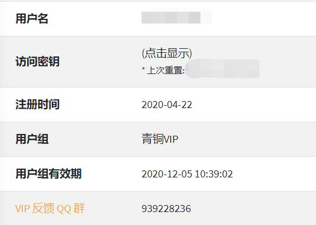

## 其他问题

### 为什么你们客服态度这么差

本站暂时没有额外的资金来雇用客服，这也就意味着本站是 **没有客服** 的。

在 "使用咨询" 中解答问题的人一般为 **站点管理员** 或 **热心网友**，而二者都没有义务解答您的**任何**问题。

- 管理员只负责维持网站的正常运行以及处理服务扩容、滥用举报等。
- 热心网友相当于志愿者，他们并不能通过回答问题获取任何利益，因此热心网友是否帮助您是由他自己决定的。

假如您的问题解决方案已经被写在 FAQ 里了，您再到使用咨询询问可能只会收到一条链接或者被其他人忽略。

请不要在使用咨询中 [SPAM](https://zh.wikipedia.org/wiki/%E6%BF%AB%E7%99%BC%E9%9B%BB%E5%AD%90%E8%A8%8A%E6%81%AF ":target=_blank")，这可能导致您的账户被禁言或停用。如果您**真的**碰到了站点 Bug 或故障请直接私聊管理员，管理员看到后一定会帮您处理的。

### 503 错误

当您在访问网站时出现 `503 错误` 提示时，请检查是否存在以下情况：

- 绑定的域名和你访问的域名是否**完全**相同，是否有打错字的情况。

  - `natfrp.com` 和 `www.natfrp.com` 是两个完全不同的子域名，请勿混淆。

- 域名解析指向的节点是否和你隧道创建到的节点相同。

  - 一般免费的 DNS 解析服务，解析结果缓存时长从 10 分钟到一星期不等，请等待解析生效后再试。
    - 查看解析指向（针对高级用户，需下载工具）：`dig 记录类型 域名`

- 检查本地的 web 服务是否成功启动。

  - 是否能在**本地**访问你的网站。

- 隧道映射的本地 IP 和端口号是否正确。

  - 你是否能够通过隧道设置的那个**本地**地址和**本地**端口访问你的 web 服务。

- 客户端是否成功启动并出现 `start proxy success` 字样。

  - 不要先急着设置开机自启，先手动启动程序确认是否可以成功启动

- [针对 HTTP(S) 隧道] 隧道是否成对创建（一个 HTTP、一个 HTTPS）。

  - 只创建 HTTP 隧道会导致无法使用 HTTPS 协议访问。
  - 只创建 HTTPS 隧道会导致无法使用 HTTP 协议访问。

- 如果以上方法**都**不行，那么请尝试**更换节点**，如果还是不行可以考虑更换服务商。

?> _TODO_ 503 错误原因很多，目前正在总结中...

### 连接超时

请检查是否出现以下问题

- 域名未备案，部分机房的拦截方式是直接阻断，而不是提示未备案信息。
- 节点异常（如受到攻击、流量过大、IP 被阻断等）
- 检查本地的 web 服务是否成功启动。_提示：是否能在**本地**访问你的网站。_

### 如何搭建网站

- 或许 [百度](https://baidu.com) 和 [谷歌](https://google.com) 可以帮到你。

### 如何设置解析

- 请自行查看你域名解析提供商的帮助文档，并设置 `CNAME` 记录到节点域名。

  节点域名查看方式：

  

  红色方框框住的部分即是节点域名。

### IPv6

- 节点没有 IPv6 。

### 游戏连不上的解决办法

- 部分游戏（如 MCPE）需要本地端口与远程端口相同才可以连接。
- 检查隧道启动状态。
- 检查游戏服务端是否开启。
- 请检查端口是否配置正确。
- 请检查游戏服务端配置是否正确。

### FTP 映射

FTP 为多端口协议，不建议映射。 

**如果你是大佬请忽略上面那行的内容*

具体原因请 [点此查看](https://zh.wikipedia.org/wiki/%E6%96%87%E4%BB%B6%E4%BC%A0%E8%BE%93%E5%8D%8F%E8%AE%AE#%E4%B8%BB%E5%8A%A8%E5%92%8C%E8%A2%AB%E5%8A%A8%E6%A8%A1%E5%BC%8F) 。

如果需要传输文件，建议使用 HTTP(S)/SFTP 协议进行传输，具体方法不再赘述，请自行使用 [百度](https://baidu.com) 或者 [谷歌](https://google.com) 等搜索引擎进行查询。

### 什么是备案

#### 法律法规

> 在中华人民共和国境内提供非经营性互联网信息服务，应当依法履行备案手续。
>
> 未经备案，不得在中华人民共和国境内从事经营性互联网信息服务。
> 拟从事新闻、出版、教育、医疗保健、药品和医疗器械、文化、广播电影电视节目等互联网信息服务，根据法律、行政法规以及国家有关规定应经有关主管部门审核同意的，在履行备案手续时，还应向其住所所在地省通信管理局提交相关主管部门审核同意的文件。
>
> 拟从事电子公告服务的，在履行备案手续时，还应当向其住所所在地省通信管理局提交电子公告服务专项备案材料。

#### 注意事项

- **域名实名认证**不等同于**ICP 备案**。
  - 买域名的时候要求提供身份信息只是实名认证。
- **ICP 备案**不等同于**公安备案**。
  - 公安备案和 ICP 备案不是一个系统。
- 本站不提供**任何形式**的代备案服务。
  - 要备案推荐找[阿里云](https://www.aliyun.com/?source=5176.11533457&userCode=wbduu7yg&type=copy)、[腾讯云](https://url.cn/MY10U76e)这种大厂，稳定。 <!-- 左侧 AFF 怪上线, 管理不爽可删除, 见谅. -->

### 哪个节点好用

节点速度受以下因素影响：

- 该节点的使用人数
- 节点到客户端的物理距离
- 节点到客户端的网络状况
- 客户端、节点的网络环境差异
- 国家政策
- 部分不可抗力因素
- 某些“带佬”恶意攻击

> 送某些人一句话：如果有 10% 的利润，它就保证到处被使用；有 20% 的利润，它就活跃起来；有 50%的利润,它就铤而走险；为了 100% 的利润，它就敢践踏一切人间法律；有 300% 的利润，它就敢犯任何罪行，甚至绞首的危险。

综上所述，我们无法告知您哪个节点最好用，另外也请您不要相信网络上所谓 `XX节点最好用` 的言论，建议您自己进行测试。

请您牢记：在没有亲身验证之前，任何关于 `XX节点最好用` 的言论都是不可靠的 ~~，因为有的人只是想让他自己用的节点人少一些罢了~~ 。

### 套餐选购指南

#### 什么是 青铜 VIP

青铜 VIP可以让您能够在 VIP 有效期内使用 **VIP 专属节点**,
同时，您的隧道总数将额外增加5 条 (**用户组过期后隧道数将恢复**),限速将提高至**36Mbps**(**默认为10 Mbps**)，流量将增加**10GiB**

例：
小明原用户组为**普通用户**，流量为**100GiB**，限速为**10 Mbps**
小明**购买青铜 VIP**后，用户组将改为**青铜VIP**，流量为**110GiB**,限速为**36Mbps**
#### 普通流量、高级流量的区别

普通流量允许您使用**普通节点**(无[VIP],[高级]等前缀),如蓝色框所示
- 如果您为**VIP用户组**,则普通流量还允许您使用**VIP 专属节点**([VIP]前缀)，如黄色框所示

高级流量允许您使用**高级节点**([VIP][高级]前缀)，如红色框所示（注：**目前高级节点只对 VIP 开放, 普通用户请勿购买**）

### 其他

?> _TODO_ 其他内容请移步 <https://baoshuo.blog/post/8tYaUDF47/> 。  xxs/超级小白专用版文档 <https://www.ravi.cool/posts/sakura-frp.html>。
