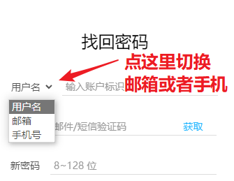

# 常见问题: 账户相关问题

## 怎么更换头像 {#change-avatar}

SakuraFrp 通过 Gravatar 获取头像，您可以 [前往 Gravatar](https://www.gravatar.com/) 更换头像。

## 怎么修改用户名 {#change-username}

用户名不支持修改，我们也没有添加这个功能的计划。

## 忘记用户名怎么办 {#forgot-username}

您可以使用账户的绑定邮箱作为用户名直接登录，如果您的账户绑定了手机也可以用手机号直接登录。

如果邮箱也忘了、没有绑定手机号但是账户完成了实名认证，可以到 [实名信息查询](https://openid.13a.com/realname_query) 页面通过实名信息找回用户名。

## 忘记密码怎么办 {#forgot-password}

您可以到 [重置密码](https://openid.13a.com/reset_password) 页面使用用户名、邮箱或者手机号找回密码。

## 我的号被盗了怎么办 {#account-hacked}

您有保护好自己账户的义务，请通过邮箱或绑定的手机号进行密码重置，我们无法为您恢复盗号者消耗的流量等权益。

由于改绑邮箱时无需验证旧邮箱，我们推荐您绑定手机号来确保账户可以被找回。

## 怎么换绑手机号 {#change-mobile}

原则上我们不允许换绑手机号，如果确有需要请 [联系我们](/about.md#contact-us)，您需要验证旧手机号和新手机号才能完成换绑。

## 怎么申请账户注销 {#delete-account}

::: warning
申请账户注销有 6 个月的冻结期，请谨慎操作

- 冻结约等于封号，期间无法使用任何平台功能
- 冻结期内，同一账户的实名信息无法在其他账户上进行认证
- 提交账户注销申请的操作是不可逆的
:::

1. 转到 [OpenID 用户中心](https://openid.13a.com/user#tab-4)，切换到 **账户注销** 标签
1. 输入密码并点击 **提交注销请求**，按提示操作即可
1. 如果一切顺利，冻结期满后您的账户信息会被自动删除
1. 账户注销完成后，系统将向您发送一封通知邮件，如果您没有收到通知邮件或想确认账户注销状态，请 [联系我们](/about.md#contact-us)

## 怎么绑定自己的域名邮箱 {#bind-custom-email}

由于严重的滥用问题，OpenID 默认只允许绑定以下域名的邮箱：

`gmail.com`, `163.com`, `126.com`, `qq.com`, `icloud.com`

`hotmail.com`, `yahoo.com`, `live.com`, `outlook.com`, `yahoo.co.jp`

考虑到部分用户的特殊需求，如果您想绑定自己的域名邮箱，请在绑定手机号、完成实名认证后使用账户的绑定邮箱 [联系我们](/about.md#contact-us) 进行换绑。
